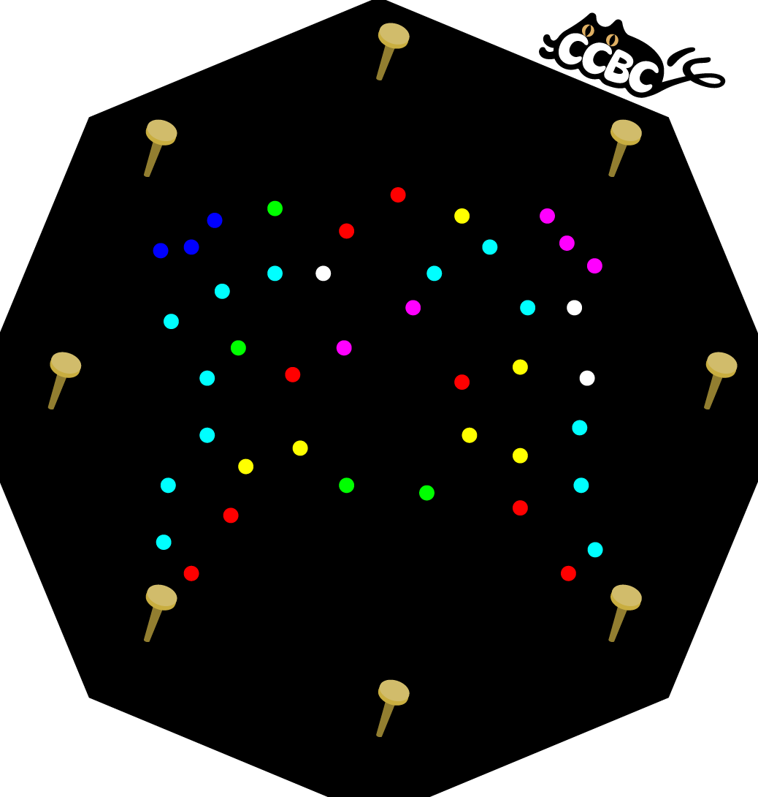

# 一盘散沙

## 题面

色彩缤纷的沙砾散落在这里。

## 答案

`RAM`

## 解析

## 提示

### 1. 我毫无头绪

把所有钉子用线连起来！现在所有的沙砾都会位于一个单独的形状内了。然后RGB分解，给每个形状涂上颜色。

## 本地附件

- [2b52b8affe774614aa0b40fca0091832.webp](../../../assets/archive.cipherpuzzles.com/ccbc15/images/6/2b52b8affe774614aa0b40fca0091832.webp)
- [73b3dcdaf5764e8185ff4388db88c1ef.webp](../../../assets/archive.cipherpuzzles.com/ccbc15/images/6/73b3dcdaf5764e8185ff4388db88c1ef.webp)
- [8a7fb18bf36b4c2c9a031e4b476d37c8.webp](../../../assets/archive.cipherpuzzles.com/ccbc15/images/6/8a7fb18bf36b4c2c9a031e4b476d37c8.webp)

来源：[https://archive.cipherpuzzles.com/ccbc15/problems/6/50.yaml](https://archive.cipherpuzzles.com/ccbc15/problems/6/50.yaml)
