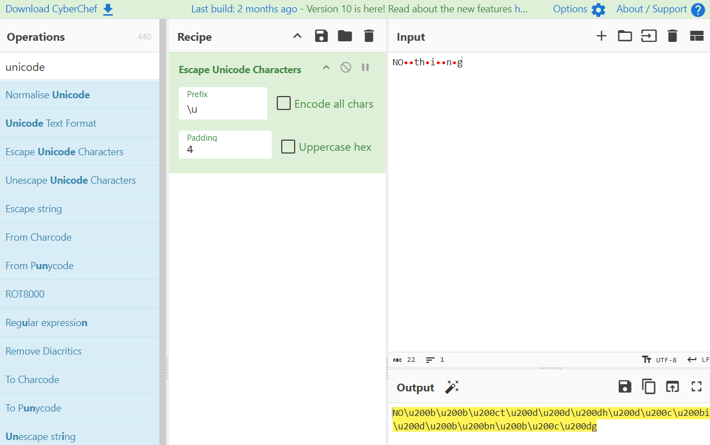

# NO​​‌t‍‍‍h‍‌​i‍​​n​‌‍g is Everything

## 题面

_官方存档未提供可提取的文字题面；请查看下方附件或交互源码。_

## 答案

`AZURE`

## 解析

注意到本题没有题面没有其他附加的奇怪的机制，所有信息就只剩下标题，并且标题说明了NOthing就是全部了，那肯定要来研究这个NOthing。

按下F12，我们能发现猫腻：

这是零宽字符。本题使用了零宽字符隐写，将答案隐写在NOthing里面。

使用CyberChef可以让这些字符显示。

获得了：

\u200b\u200b\u200c

\u200d\u200d\u200d

\u200d\u200c\u200b

\u200d\u200b\u200b

\u200b\u200c\u200d

按照 \u200b=0，\u200c=1，\u200d=2 将每一行转成三进制然后转成十进制，再通过a1z26，可得到最后的答案**AZURE**

PS：拥有惊人注意力的人其实还可以发现NO大写的原因是因为要凑个NOisE=noise，暗示噪音（也就是零宽字符）的存在，noise也是本题唯一的里程碑。

## 提示

### 1. 题面在哪里

本题没有题面，解题所需的全部有效信息都在标题里。

### 2. 我不知道该看哪里

请非常仔细地研究 NOthing。

### 3. 知道该看哪里了，但什么都没发现

字符与字符之间藏着一些「噪音」，试试看获取 NOthing 的长度？

### 4. 该如何解读

将字符与字符之间的零宽字符按编码顺序编为 012，以三进制的形式转成数字，然后按 A1Z26 转成字母。

## 中间答案

| 提交 | 回复 | 附加信息 |
| --- | --- | --- |
| NOISE | 什么噪音？不应该啊，你应该看不到的啊，这里明明只有 NOthing…… |  |

## 本地附件

- [99e5f80ee8ea4db5afb7d3f884519d4d.webp](../../../assets/archive.cipherpuzzles.com/ccbc15/images/6/99e5f80ee8ea4db5afb7d3f884519d4d.webp)
- [a0b82a40e7984c78a79bc7b4791d9dee.webp](../../../assets/archive.cipherpuzzles.com/ccbc15/images/6/a0b82a40e7984c78a79bc7b4791d9dee.webp)

来源：[https://archive.cipherpuzzles.com/ccbc15/problems/6/51.yaml](https://archive.cipherpuzzles.com/ccbc15/problems/6/51.yaml)
