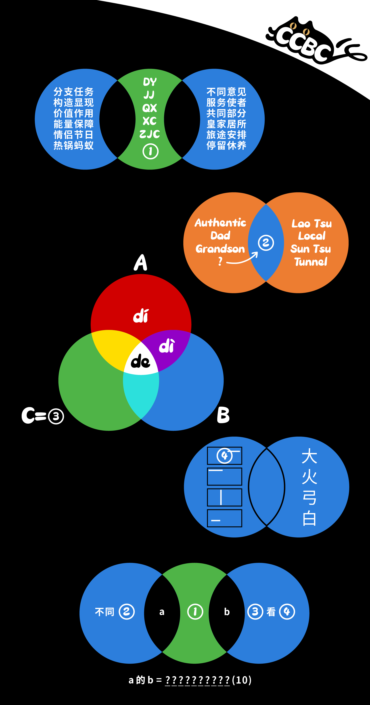

# 薛定谔的猫

## 题面

观测这些叠加态，找到最终的真相吧！

## 答案

`DEPRESSION`

## 解析

|      |     |     |     |      |
|:----:|:---:|:---:|:---:|:----:|
| 能量保障 | 电源  | DY  | 店员  | 服务使者 |
| 热锅蚂蚁 | 焦急  | JJ  | 交集  | 共同部分 |
| 情侣节日 | 七夕  | QX  | 栖息  | 停留休养 |
| 构造显现 | 形成  | XC  | 行程  | 旅途安排 |
| 分支任务 | 子进程 | ZJC | 紫禁城 | 皇家居所 |
| 价值作用 | 意义  | ①   | 异议  | 不同意见 |

提取同音字拼音首字母，得到①=【YY】

|           |    |         |
|:---------:|:---:|:-------:|
| Authentic | 地道 | Tunnel  |
| Dad       | 老子 | Lao Tsu |
| Grandson  | 孙子 | Sun Tsu |
| Place     | ②  | Local   |

左右两侧英文单词可成对翻译成一个汉字组成相同的词语，区别是左侧含义用了轻声，得到②=【地方】

|   |   |           |
|:---:|:---:|:---------:|
| A | 的 | dí dì de  |
| B | 地 | dì de     |
| C | 得 | dé děi de |

的、地、得多音字发音交集，确定③=【得】

|   |    |
|:---:|:---:|
| 大 | ④  |
| 火 | 灭火 |
| 弓 | 引弓 |
| 白 | 自白 |

加一笔成字且能和原本字组词，得到④=【大夫】

最后部分带入已知信息复用第一部分机制，得到线索【异域的抑郁】，英文翻译抑郁得到答案**DEPRESSION**

## 提示

### 1. 第一部分的机制是什么

左右两侧的四字词语描述了两个发音一致的二字或三字词语，中间是词语的首字母缩写。

### 2. 第二部分的机制是什么

左右两侧的英文翻译对应了两个完全一致的汉字，只是左侧用到了轻声。

### 3. 第三部分的机制是什么

图中交集部分拼音是ABC各自的不同读音。

### 4. 第四部分的机制是什么

单字均可加横或竖成为一个新字并一起组词，黑框中是隐去了词语中相同的部分后的样子。

### 5. 该如何提取

外观和第一部分高度一致，将①~④代入得到两个四字描述和字母缩写，套用第一部分机制即可。

## 中间答案

| 提交 | 回复 | 附加信息 |
| --- | --- | --- |
| YY | ①验证正确 |  |
| 地方 | ②验证正确 |  |
| 得 | ③验证正确 |  |
| 大夫 | ④验证正确 |  |
| 异域的抑郁 | AB验证正确，请用异域的语言翻译抑郁。 |  |

## 本地附件

- [74d6fd7b060d4405b1f8ea8012dce20a.webp](../../../assets/archive.cipherpuzzles.com/ccbc15/images/6/74d6fd7b060d4405b1f8ea8012dce20a.webp)

来源：[https://archive.cipherpuzzles.com/ccbc15/problems/6/52.yaml](https://archive.cipherpuzzles.com/ccbc15/problems/6/52.yaml)
