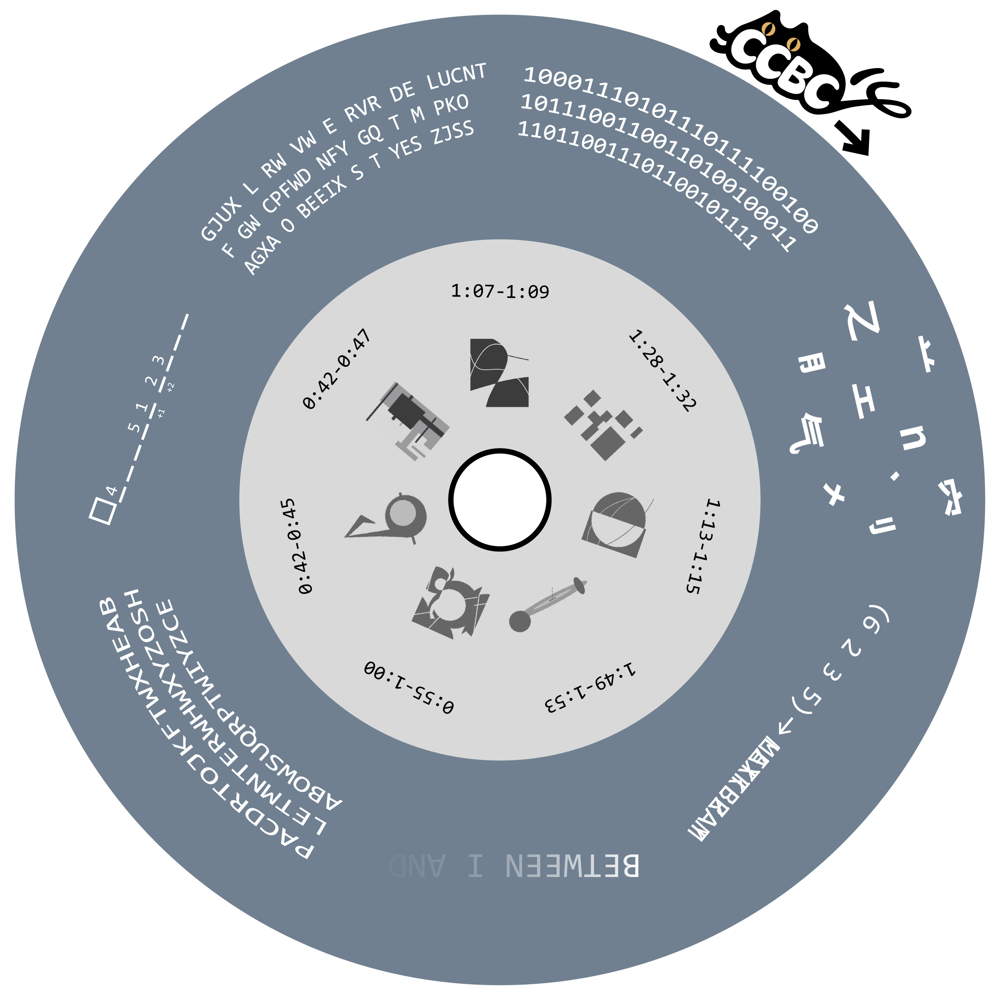

# 单色唱片

## 题面

一张单色唱片，外圈可以转动。 
但是，长久播放来自异次元的虚拟歌声让唱片上的文字变得无法辨认...

## 答案

`LOLLIPOP`

## 解析

_官方存档未填写解析。_

## 提示

### 1. 我毫无头绪

题目标题、风味文本和图片内圈共同提示了一个包含7首歌的VOCALOID专辑。

### 2. 怎样才能知道文字的解读方式

取内圈时长对应的歌词。可以旋转外圈使得歌词内容和外圈密文两两正确配对。

### 3. 如何解读“_ _ _ _ _ ...”

在下划线上填入方块内的颜色名称（使用取色器之类的工具）。

### 4. 如何解读“1011..."

从二进制转三进制，三位一断，按A=1, B=2, ...转字母。

### 5. 如何解读“GJUX..."

只看单独的字母。

### 6. 如何解读“[打乱的构件]..."

明文与“空気”的构件混合起来了。

### 7. 如何解读“[重叠的字母]..."

明文长度为(6 2 3 5)，它的后一半经凯撒移位后和左边重叠了。

### 8. 如何解读“B..."

用Photoshop等软件的图像编辑功能，进行调色或色彩范围选择。

### 9. 如何解读“PACD...”

去掉所有字母序相邻的字母。

### 10. 该如何提取

从PV的文字中提取字母。

## 中间答案

| 提交 | 回复 | 附加信息 |
| --- | --- | --- |
| LOLIPOP | 很接近了！LOLIPOP 并不是最常用的拼写方式。实际上，在【裏表ラバーズ】中，你应该把那两个字母都提取出来。 |  |

## 本地附件

- [eabe48b352cf4eab958d33e496980427.webp](../../../assets/archive.cipherpuzzles.com/ccbc15/images/6/eabe48b352cf4eab958d33e496980427.webp)

来源：[https://archive.cipherpuzzles.com/ccbc15/problems/6/54.yaml](https://archive.cipherpuzzles.com/ccbc15/problems/6/54.yaml)
