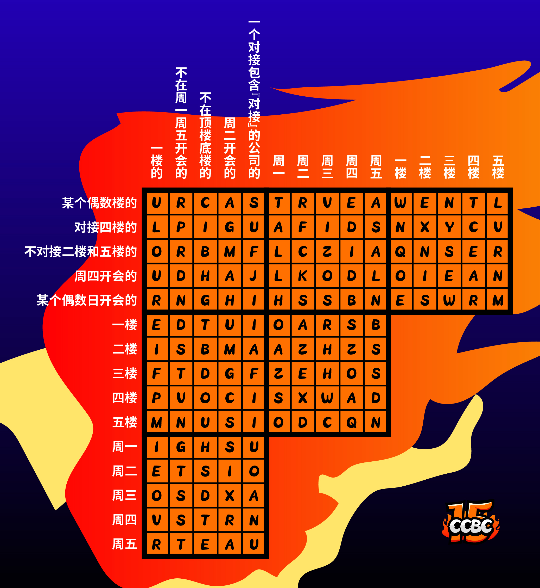
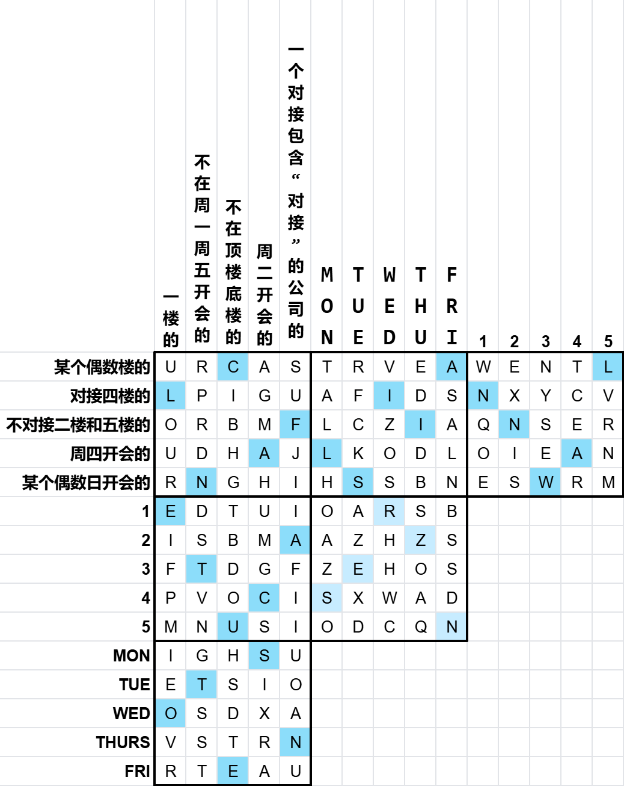

# 谁在一楼?

## 题面

你在一家外贸公司。你们的1楼到5楼分属一个部门，其中数字越大的工序越靠前。 
每层楼都会对接1个专门的外包服务供应商。很巧的是，**外包服务商工作的楼层和他们对接的楼层一样**。 
每层楼在每个不同的工作日会开会，**他们的供应商的开会日期也很巧的一样**。 
每个部门的名字是：**一楼的**，**不在周一周五开会的**，**不在顶楼底楼的**，**周二开会的**，**一个对接包含“对接”的公司的** 
外包公司的名字是：**某个偶数楼的**，**对接四楼的**，**不对接二楼和五楼的**，**周四开会的**，**某个偶数日开会的** 

 

**线索：**

不在周一周五开会的是不在周一周五开会的，一楼的是一楼的。 
在三楼的部门名字里有“会”，在五楼的公司名里有“楼” 
一楼的比某个偶数日开会的早开会1天，且一楼的不在周五开会。 
对接四楼的对接的是周一开会的。 
周二开会的楼下的是周二开会的。 
周四开会的这个外包公司名字里有“楼” 
周四开会的，周二开会的，一楼的，三者不是一个部门 
只有三个部门名字是真实的自我描述，其中有且仅有一组公司和部门都是真实的自我描述。 
所有带“楼”的部门只和带“楼”的公司对接，带“会”的也只和带“会”的公司对接。 
只有一个部门的日期等于其楼层，它是不在顶楼底楼的。 
一个对接包含“对接”的公司的在二楼上班。 
周四开会的是不对接二楼和五楼的。 
周四开会的是不对接二楼和五楼的。 
某个部门的楼层是其开会日期的一半。 
某个偶数楼的在周五开会。 
四楼公司和部门的名字都不是真实的自我描述。 
周一开会的部门名字里有数字。 

<a href="https://docs.qq.com/sheet/DR0REd05scXZQUkZi?tab=BB08J2">腾讯文档</a>

## 答案

`AZTEC SUN STONE`

## 解析

## 提示

### 1. 能给这题加上引号吗？

“不在周一周五开会的”是不在周一周五开会的，“一楼的”是一楼的。 
在三楼的部门名字里有“会”，在五楼的公司名里有“楼” 
“一楼的”比某个偶数日开会的早开会1天，且“一楼的”不在周五开会。 
对接四楼的对接的是周一开会的。 
“周二开会的”楼下的是周二开会的。 
周四开会的这个外包公司名字里有“楼” 
周四开会的，周二开会的，一楼的，三者不是一个部门 
只有三个部门名字是真实的自我描述，其中有且仅有一组公司和部门都是真实的自我描述。 
所有带“楼”的部门只和带“楼”的公司对接，带“会”的也只会个带“会”的公司对接。 
只有一个部门的日期等于其楼层，它是“不在顶楼底楼的”。 
“一个对接包含‘对接’的公司的”在二楼上班。 
“周四开会的”是不对接二楼和五楼的。 
周四开会的是“不对接二楼和五楼的”。 
某个部门的楼层是其开会日期的一半。 
“某个偶数楼的”在周五开会。 
四楼公司和部门的名字都不是真实的自我描述。 
周一开会的部门名字里有数字。

### 2. 该如何提取？

横着读出所有“正确结果”位置的字母。

## 本地附件

- [141c6cef85394a1693bf06d4a1ee626f.webp](../../../assets/archive.cipherpuzzles.com/ccbc15/images/meta/141c6cef85394a1693bf06d4a1ee626f.webp)
- [bd00a53771ff4ed9877fc73129f9b2aa.webp](../../../assets/archive.cipherpuzzles.com/ccbc15/images/meta/bd00a53771ff4ed9877fc73129f9b2aa.webp)

来源：[https://archive.cipherpuzzles.com/ccbc15/problems/7/59.yaml](https://archive.cipherpuzzles.com/ccbc15/problems/7/59.yaml)
