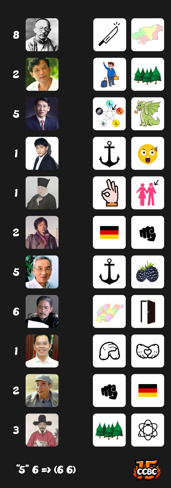

# 双名法

## 题面

“林教授的双名法真是好用，我只用关注这些人的名字就好了！” 
“林……林教授？”

## 答案

`BILLIE EILISH`

## 解析

双名法，林奈发明的一种命名植物的方式。如果你注意到了这点，你会意识到风味文本中称呼他为‘’林教授"是有问题的，因为他姓林奈，而不姓林！

右边的图谜中指向了一位姓看起来像是中文名的外国名人。左侧的中国人和外国人看起来拥有同样的姓，也拥有类似的职业。

| **左侧人名** | **数字** | **提取结果** | **右侧人名** | **右侧姓**     | **看起来像中文的姓** |
|:--------:|:------:|:--------:|:--------:|:-----------:|:------------:|
| 马君武      | 8      | L        | EMMANUEL | MACRON      | 马克龙          |
| 莫言       | 2      | U        | GUY DE   | MAUPASSANT  | 莫泊桑          |
| 薛其坤      | 5      | N        | ERWIN    | SCHRODINGER | 薛定谔          |
| 卓凡       | 1      | C        | CHARLIE  | CHAPLIN     | 卓别林          |
| 杜衍       | 1      | H        | HARRY    | TRUMAN      | 杜鲁门          |
| 王小波      | 2      | S        | OSCAR    | WILDE       | 王尔德          |
| 李季伦      | 5      | I        | TROFIM   | LYSENKO     | 李森科          |
| 白景琦      | 6      | N        | NORMAN   | BETHUNE     | 白求恩          |
| 孟安明      | 1      | G        | GREGOR   | MENDEL      | 孟德尔          |
| 朱德       | 2      | E        | GEORGY   | ZHUKOV      | 朱可夫          |
| 叶向高      | 3      | R        | BORIS    | YELTSIN     | 叶利钦          |

将对应“姓名”连上后，我们利用数字，提取对应人物实际名字中的字母。得到最终提示 “Lunch” Singer。 Lunch这首歌的歌手是**Billie Eilish**

## 提示

### 1. 我毫无头绪

双名法的发现者在风味文本里被称作“林教授”，本题中其他的人也能有类似的称呼。

### 2. 我应该做什么

找到左边这些人的名字，解开右边的图谜，右边每行都能得到两个字，然后将左右联系，具体而言，相联系的两个人具有相近的职业，和共同的“姓”。

### 3. 该如何提取

用人像边上的数字，提取与之联系的人名字的对应字母。

## 中间答案

| 提交 | 回复 | 附加信息 |
| --- | --- | --- |
| lunch singer | 那这是谁呢？ |  |

## 本地附件

- [c49024c8c81047b5821cc8b4868cfc46.webp](../../../assets/archive.cipherpuzzles.com/ccbc15/images/meta/c49024c8c81047b5821cc8b4868cfc46.webp)

来源：[https://archive.cipherpuzzles.com/ccbc15/problems/7/66.yaml](https://archive.cipherpuzzles.com/ccbc15/problems/7/66.yaml)
