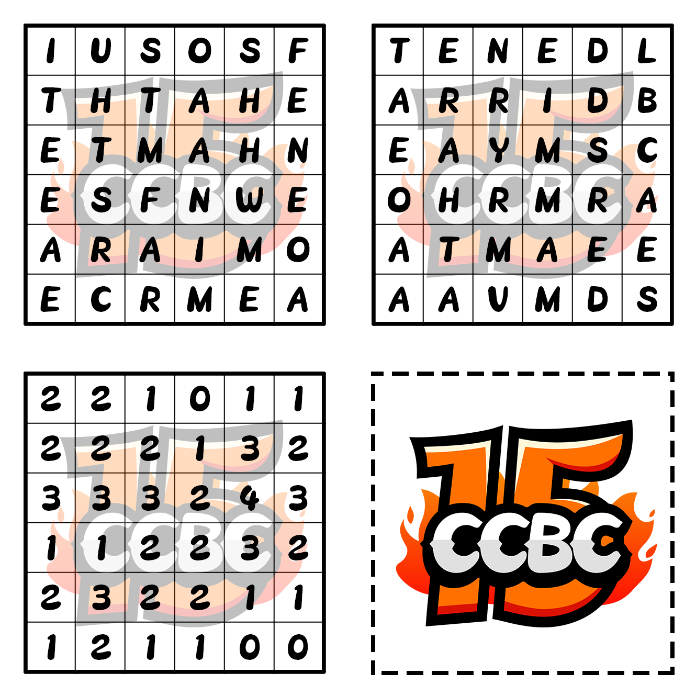
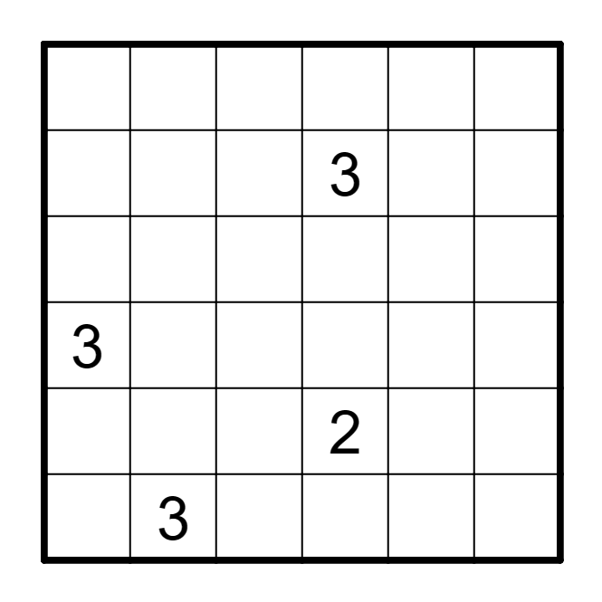
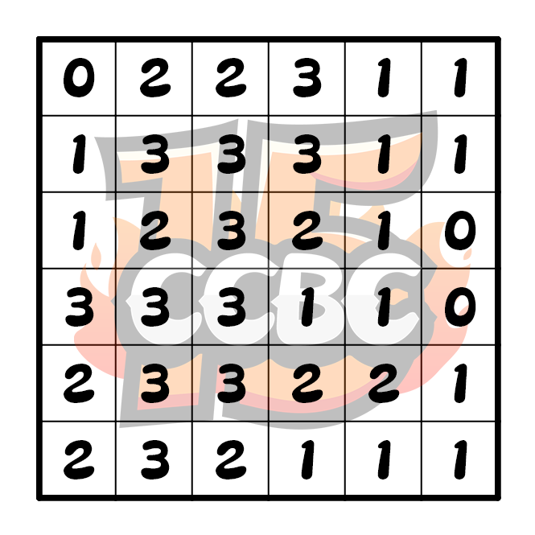

# 遗失的解密卡

## 题面

咦？我的自制小虎队解密卡被我放在哪里了？

哦找到了，在提示里……怎么还要花钱买的啊？

## 答案

`REASONABLE DOUBT`

## 解析

[解析链接](https://docs.qq.com/doc/DUXF5dGlPaHpuTmtj)

## 提示

### 1. 我毫无头绪

你需要解答解密卡上的题目，并将答案对应到相应的谜题上进行提取。

### 2. 我不知道解密卡上的数字有什么用，你能告诉我吗

你需要将某些格子涂黑。数字代表了周围九格中黑格子的数量。

### 3. 我得到了一句有意义的话，但我不知道这是什么意思

这是一句话的前半部分，你需要推测丢失的解密卡到底能得到什么结果，并将两张卡的句子拼在一起。作为提示，第二张卡解出来的句子第一个字母是“N”。

### 4. 我无法推测出遗失的解密卡上能得到什么结果，你能告诉我几个位置的数字吗？

### 5. 我无法推测出遗失的解密卡上能得到什么结果，你能帮我找一找这张卡吗

## 中间答案

| 提交 | 回复 | 附加信息 |
| --- | --- | --- |
| THE ANSWER | 你解开了自制的解密卡，不过似乎完全没有得到答案啊。要不要多转几下试试？ |  |
| THE ANSWER IS THE NAME OF THE FAMOUS AMERICA | 你解开了一个谜题，得到了一句有意义的话……但是似乎缺了点什么？ |  |
| THE NAME OF THE FAMOUS AMERICA | 你解开了一个谜题，得到了一句有意义的话……但是似乎缺了点什么？ |  |
| N DRAMA TV SERIES CREATED BY RAAMLA MOHAMED | 你破解了遗失的解密卡，得到了一句有意义的话……的后半部分？ |  |
| NDRAMATVS | 你破解了遗失的解密卡，不过似乎没有得到什么答案啊。要不要多转几下试试？ |  |
| THE NAME OF THE FAMOUS AMERICAN DRAMA TV SERIES CREATED BY RAAMLA MOHAMED | 你得到了一句有意义的话，但是这是什么意思？ |  |
| THE ANSWER IS THE NAME OF THE FAMOUS AMERICAN DRAMA TV SERIES CREATED BY RAAMLA MOHAMED | 你得到了一句有意义的话，但是这是什么意思？答案又是什么？ |  |

## 本地附件

- [3a6200c3a3ae4786acd2db7baf5b82c0.webp](../../../assets/archive.cipherpuzzles.com/ccbc15/images/meta/3a6200c3a3ae4786acd2db7baf5b82c0.webp)
- [42da0346d18d4bd6b12238b203b0847d.webp](../../../assets/archive.cipherpuzzles.com/ccbc15/images/meta/42da0346d18d4bd6b12238b203b0847d.webp)
- [cdc109027552483b9e9f3fbd9e8a0e4a.webp](../../../assets/archive.cipherpuzzles.com/ccbc15/images/meta/cdc109027552483b9e9f3fbd9e8a0e4a.webp)

来源：[https://archive.cipherpuzzles.com/ccbc15/problems/7/68.yaml](https://archive.cipherpuzzles.com/ccbc15/problems/7/68.yaml)
