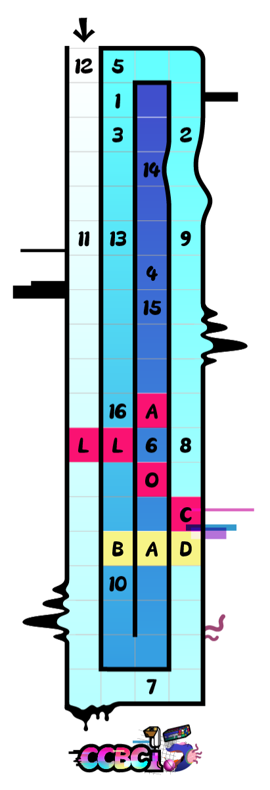

# 生死疲劳

## 题面

缓缓讲完后，七大说：“现在，只有用六个世界的能量激活水晶球，才能找到从六道中解脱的路。”

## 解题后内容

墙？什么墙？
（新剧情已解锁）

## 答案

`BUILD THE GRID WALL`

## 解析

暂无

## 提示

### 1. 我毫无头绪

利用已经给出的字母，将六个meta的答案填入这个漩涡中！

## 本地附件

- [07affba3e4de47d8bdd422008bcaadc5.webp](../../../assets/archive.cipherpuzzles.com/ccbc15/images/meta/07affba3e4de47d8bdd422008bcaadc5.webp)

来源：[https://archive.cipherpuzzles.com/ccbc15/problems/meta/71.yaml](https://archive.cipherpuzzles.com/ccbc15/problems/meta/71.yaml)
