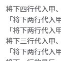

# 碎片 1-1

## 题面

修改于 2025/08/09 20:24
补上了第二部分中句尾缺少的一个分号

修改于 2025/08/09 22:45
修改每段演算中的倒数第二句

修改于 2025/08/11 01:50
第二段中语句顺序有问题，已修改！！！

将下四行代入甲、乙、丙、丁：「甲；丙；「乙；丙；丁」」； 
「将下两行代入甲、乙：「甲；「甲；「甲；「甲；「甲；「甲；乙」」」」」」；将下两行代入甲、乙：「甲；「甲；乙」」」； 
「将下两行代入甲、乙：「甲；「甲；乙」」；将下两行代入甲、乙：「甲；「甲；「甲；乙」」」」； 
将下三行代入甲、乙、丙：「乙；「甲；乙；丙」」； 
「将下两行代入甲、乙：「甲；「甲；「甲；乙」」」；将下两行代入甲、乙：「甲；「甲；「甲；「甲；「甲；乙」」」」」」； 
将本段演算中用于提取的数字加一； 
根据字母表顺序每两位提取：5 

「将下两行代入甲、乙：「甲；「甲；「甲；「甲；「甲；「甲；乙」」」」」」；将下两行代入甲、乙：「甲；「甲；「甲；乙」」」」； 
将下三行代入甲、乙、丙：「甲；将下两行代入丁、戊：「戊；「丁；乙」」；将下一行代入丁：「丙」；将下一行代入丁：「丁」」； 
「将下两行代入甲、乙：「甲；「甲；「甲；「甲；「甲；「甲；「甲；「甲；「甲；「甲；「甲；乙」」」」」」」」」」」；将下两行代入甲、乙：「甲；「甲；乙」」」； 
将本段演算中用于提取的数字加一； 
根据字母表顺序每两位提取：2 

## 答案

_官方存档未提供答案。_

## 解析

_官方存档未填写解析。_

## 本地附件

- [1424e3712cfc420a84f96e82a0faa70d.webp](../../../assets/static.cipherpuzzles.com/static/images/1424e3712cfc420a84f96e82a0faa70d.webp)

来源：[https://ccbc16.cipherpuzzles.com/data/articles/fragments.json#pos=0,0](https://ccbc16.cipherpuzzles.com/data/articles/fragments.json#pos=0,0)
