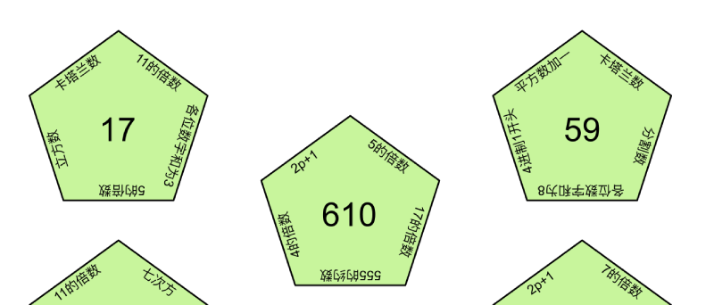
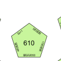

# 碎片 1-2

## 题面

## 答案

_官方存档未提供答案。_

## 解析

_官方存档未填写解析。_

## 本地附件

- [c7de5d26b231470bb7a5d1bf67be47d1.webp](../../../assets/static.cipherpuzzles.com/static/images/c7de5d26b231470bb7a5d1bf67be47d1.webp)
- [e406a4b82d3e4dcfbadccfa26d9d4d5b.webp](../../../assets/static.cipherpuzzles.com/static/images/e406a4b82d3e4dcfbadccfa26d9d4d5b.webp)

来源：[https://ccbc16.cipherpuzzles.com/data/articles/fragments.json#pos=0,1](https://ccbc16.cipherpuzzles.com/data/articles/fragments.json#pos=0,1)
