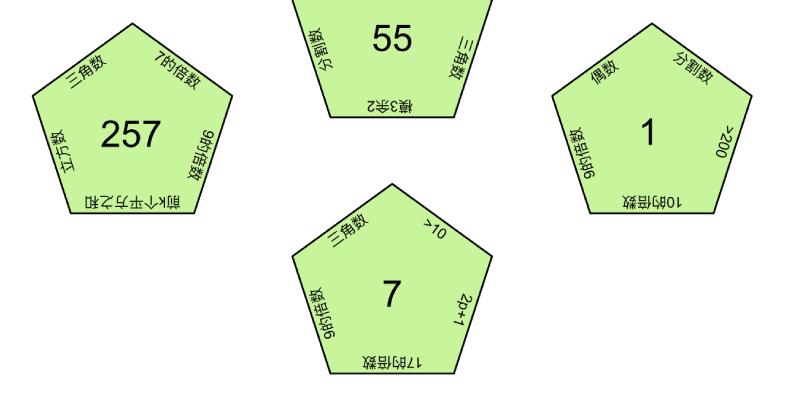
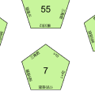

# 碎片 1-3

## 题面

## 答案

_官方存档未提供答案。_

## 解析

_官方存档未填写解析。_

## 本地附件

- [1c24c81b21224784b42808d87822c340.webp](../../../assets/static.cipherpuzzles.com/static/images/1c24c81b21224784b42808d87822c340.webp)
- [e10c80e264ec434abbc368563d974232.webp](../../../assets/static.cipherpuzzles.com/static/images/e10c80e264ec434abbc368563d974232.webp)

来源：[https://ccbc16.cipherpuzzles.com/data/articles/fragments.json#pos=0,2](https://ccbc16.cipherpuzzles.com/data/articles/fragments.json#pos=0,2)
