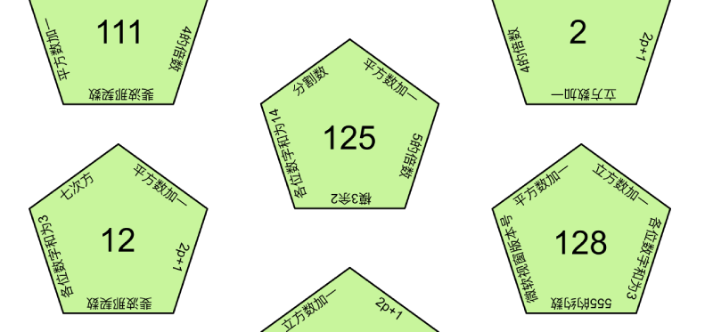
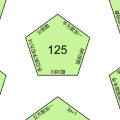

# 碎片 2-1

## 题面

## 答案

_官方存档未提供答案。_

## 解析

_官方存档未填写解析。_

## 本地附件

- [93ea16de1497448f8a09346906737221.webp](../../../assets/static.cipherpuzzles.com/static/images/93ea16de1497448f8a09346906737221.webp)
- [d9a17db7a3724fc58f08dce861509491.webp](../../../assets/static.cipherpuzzles.com/static/images/d9a17db7a3724fc58f08dce861509491.webp)

来源：[https://ccbc16.cipherpuzzles.com/data/articles/fragments.json#pos=1,0](https://ccbc16.cipherpuzzles.com/data/articles/fragments.json#pos=1,0)
