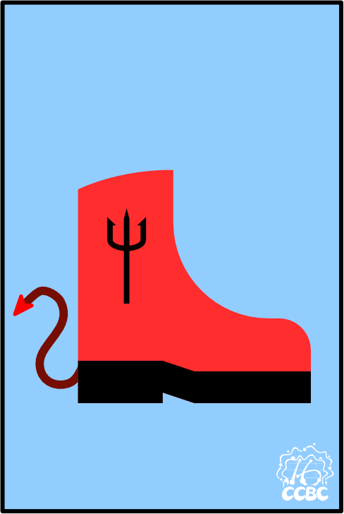
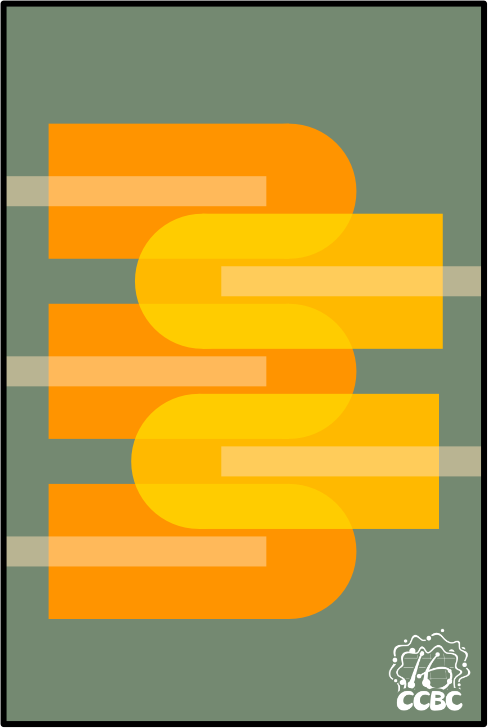
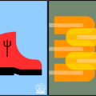

# 碎片 3-1

## 题面

## 答案

_官方存档未提供答案。_

## 解析

_官方存档未填写解析。_

## 本地附件

- [b49025b32d70483f891f78b5dff32d05.webp](../../../assets/static.cipherpuzzles.com/static/images/b49025b32d70483f891f78b5dff32d05.webp)
- [d810ea7f656248ff8e50ba9c6facfcfd.webp](../../../assets/static.cipherpuzzles.com/static/images/d810ea7f656248ff8e50ba9c6facfcfd.webp)
- [eb220c4948a841d2915d288fff4c4cf7.webp](../../../assets/static.cipherpuzzles.com/static/images/eb220c4948a841d2915d288fff4c4cf7.webp)

来源：[https://ccbc16.cipherpuzzles.com/data/articles/fragments.json#pos=2,0](https://ccbc16.cipherpuzzles.com/data/articles/fragments.json#pos=2,0)
