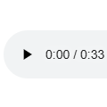

# 碎片 4-2

## 题面

<audio controls="true" src="../../../assets/static.cipherpuzzles.com/static/images/96eab2c7ffaa4d0ca8626e470a0fc6b4.m4a" />

## 答案

_官方存档未提供答案。_

## 解析

_官方存档未填写解析。_

## 本地附件

- [4d681eb50b9e4302b922ac0a2858ca50.webp](../../../assets/static.cipherpuzzles.com/static/images/4d681eb50b9e4302b922ac0a2858ca50.webp)
- [96eab2c7ffaa4d0ca8626e470a0fc6b4.m4a](../../../assets/static.cipherpuzzles.com/static/images/96eab2c7ffaa4d0ca8626e470a0fc6b4.m4a)

来源：[https://ccbc16.cipherpuzzles.com/data/articles/fragments.json#pos=3,1](https://ccbc16.cipherpuzzles.com/data/articles/fragments.json#pos=3,1)
