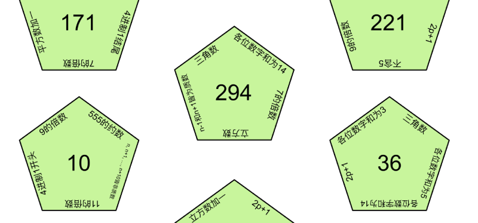
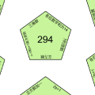

# 碎片 4-3

## 题面

## 答案

_官方存档未提供答案。_

## 解析

_官方存档未填写解析。_

## 本地附件

- [a6599abb63d0425b95a9e77ba6f4f9c4.webp](../../../assets/static.cipherpuzzles.com/static/images/a6599abb63d0425b95a9e77ba6f4f9c4.webp)
- [b668aafefdf9435cb4d68bc8128cb6ce.webp](../../../assets/static.cipherpuzzles.com/static/images/b668aafefdf9435cb4d68bc8128cb6ce.webp)

来源：[https://ccbc16.cipherpuzzles.com/data/articles/fragments.json#pos=3,2](https://ccbc16.cipherpuzzles.com/data/articles/fragments.json#pos=3,2)
