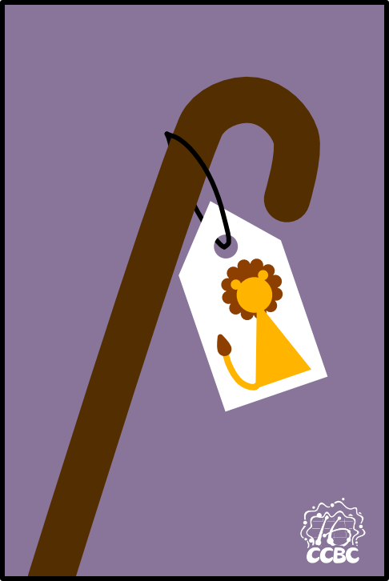
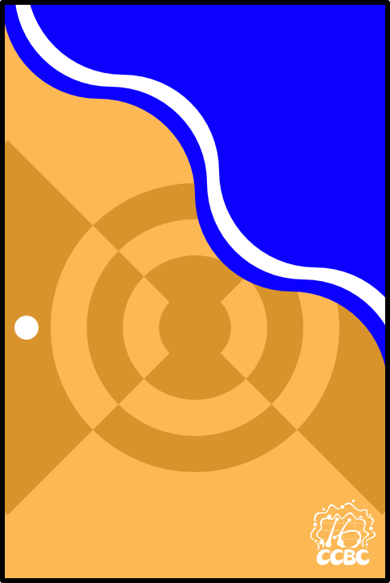
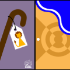

# 碎片 5-1

## 题面

## 答案

_官方存档未提供答案。_

## 解析

_官方存档未填写解析。_

## 本地附件

- [027d0cad05b04e6aade9f57ad94f037c.webp](../../../assets/static.cipherpuzzles.com/static/images/027d0cad05b04e6aade9f57ad94f037c.webp)
- [1e1bd968a003458a8c85c293cdad46b8.webp](../../../assets/static.cipherpuzzles.com/static/images/1e1bd968a003458a8c85c293cdad46b8.webp)
- [c1192c01ad0c421388300a8d691430ae.webp](../../../assets/static.cipherpuzzles.com/static/images/c1192c01ad0c421388300a8d691430ae.webp)

来源：[https://ccbc16.cipherpuzzles.com/data/articles/fragments.json#pos=4,0](https://ccbc16.cipherpuzzles.com/data/articles/fragments.json#pos=4,0)
