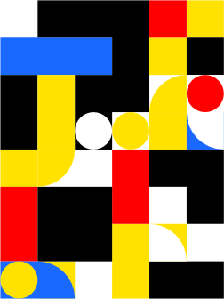

# 碎片 5-2

## 题面

## 答案

_官方存档未提供答案。_

## 解析

_官方存档未填写解析。_

## 本地附件

- [04caa57b60284718b98741fa322f279f.webp](../../../assets/static.cipherpuzzles.com/static/images/04caa57b60284718b98741fa322f279f.webp)
- [76d08fa26edf4bedaab03e335aa89445.webp](../../../assets/static.cipherpuzzles.com/static/images/76d08fa26edf4bedaab03e335aa89445.webp)

来源：[https://ccbc16.cipherpuzzles.com/data/articles/fragments.json#pos=4,1](https://ccbc16.cipherpuzzles.com/data/articles/fragments.json#pos=4,1)
