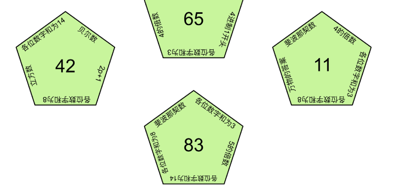
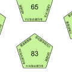

# 碎片 6-1

## 题面

## 答案

_官方存档未提供答案。_

## 解析

_官方存档未填写解析。_

## 本地附件

- [02c845bcdc9e4e14bb5f3a6b3e6169d4.webp](../../../assets/static.cipherpuzzles.com/static/images/02c845bcdc9e4e14bb5f3a6b3e6169d4.webp)
- [92d60a9e6e3f4c6ca1b378d490c10770.webp](../../../assets/static.cipherpuzzles.com/static/images/92d60a9e6e3f4c6ca1b378d490c10770.webp)

来源：[https://ccbc16.cipherpuzzles.com/data/articles/fragments.json#pos=5,0](https://ccbc16.cipherpuzzles.com/data/articles/fragments.json#pos=5,0)
