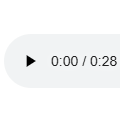

# 碎片 6-2

## 题面

<audio controls="true" src="../../../assets/static.cipherpuzzles.com/static/images/89dc0276826a40fcb1e7714b59e1834f.m4a" />

## 答案

_官方存档未提供答案。_

## 解析

_官方存档未填写解析。_

## 本地附件

- [89dc0276826a40fcb1e7714b59e1834f.m4a](../../../assets/static.cipherpuzzles.com/static/images/89dc0276826a40fcb1e7714b59e1834f.m4a)
- [de1ae2fed1854839acc3bffaca4f0de3.webp](../../../assets/static.cipherpuzzles.com/static/images/de1ae2fed1854839acc3bffaca4f0de3.webp)

来源：[https://ccbc16.cipherpuzzles.com/data/articles/fragments.json#pos=5,1](https://ccbc16.cipherpuzzles.com/data/articles/fragments.json#pos=5,1)
