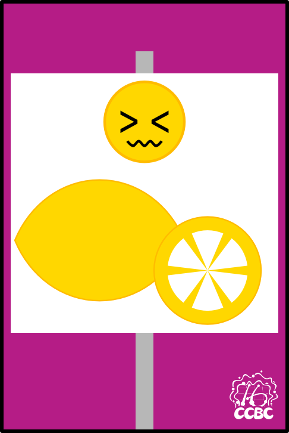
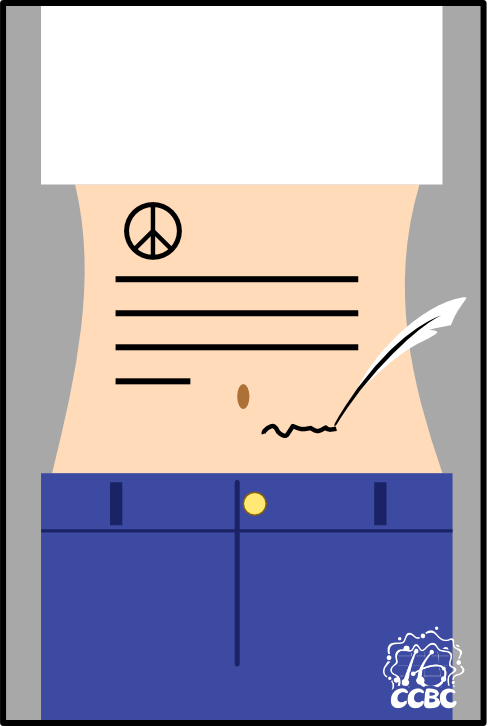
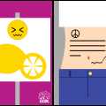

# 碎片 6-4

## 题面

## 答案

_官方存档未提供答案。_

## 解析

_官方存档未填写解析。_

## 本地附件

- [58ec28fd9a364a878999ccdcdb8f88e2.webp](../../../assets/static.cipherpuzzles.com/static/images/58ec28fd9a364a878999ccdcdb8f88e2.webp)
- [72300d3434f543599255775b9d792551.webp](../../../assets/static.cipherpuzzles.com/static/images/72300d3434f543599255775b9d792551.webp)
- [da97268fb1ad4cac843246089b598691.webp](../../../assets/static.cipherpuzzles.com/static/images/da97268fb1ad4cac843246089b598691.webp)

来源：[https://ccbc16.cipherpuzzles.com/data/articles/fragments.json#pos=5,3](https://ccbc16.cipherpuzzles.com/data/articles/fragments.json#pos=5,3)
