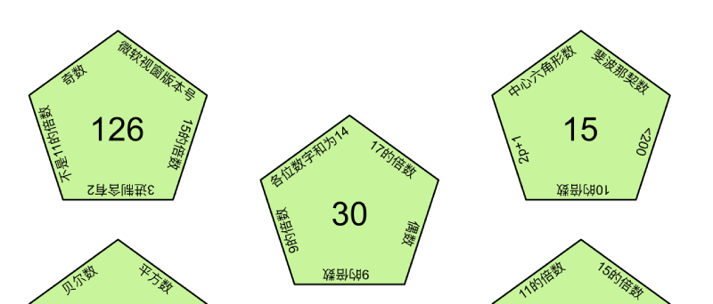
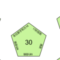

# 碎片 7-1

## 题面

## 答案

_官方存档未提供答案。_

## 解析

_官方存档未填写解析。_

## 本地附件

- [34159a94d08f4df2834362395396db2f.webp](../../../assets/static.cipherpuzzles.com/static/images/34159a94d08f4df2834362395396db2f.webp)
- [cdd6d85fc71b40ae8bdff5ce2dd5c52c.webp](../../../assets/static.cipherpuzzles.com/static/images/cdd6d85fc71b40ae8bdff5ce2dd5c52c.webp)

来源：[https://ccbc16.cipherpuzzles.com/data/articles/fragments.json#pos=6,0](https://ccbc16.cipherpuzzles.com/data/articles/fragments.json#pos=6,0)
