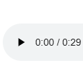

# 碎片 7-3

## 题面

<audio controls="true" src="../../../assets/static.cipherpuzzles.com/static/images/4e2ac86e0e35498f8051089dbad0ba06.m4a" />

## 答案

_官方存档未提供答案。_

## 解析

_官方存档未填写解析。_

## 本地附件

- [3a7f0158b909494b8e4072ef2454fce9.webp](../../../assets/static.cipherpuzzles.com/static/images/3a7f0158b909494b8e4072ef2454fce9.webp)
- [4e2ac86e0e35498f8051089dbad0ba06.m4a](../../../assets/static.cipherpuzzles.com/static/images/4e2ac86e0e35498f8051089dbad0ba06.m4a)

来源：[https://ccbc16.cipherpuzzles.com/data/articles/fragments.json#pos=6,2](https://ccbc16.cipherpuzzles.com/data/articles/fragments.json#pos=6,2)
