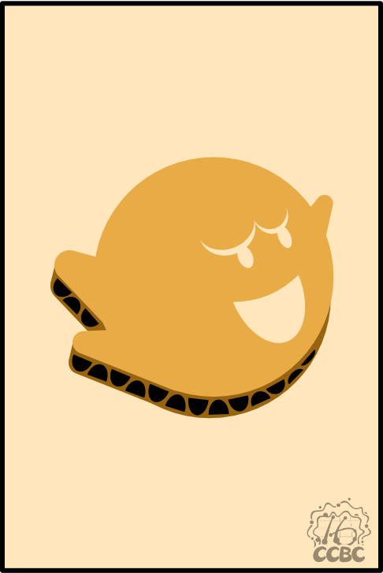
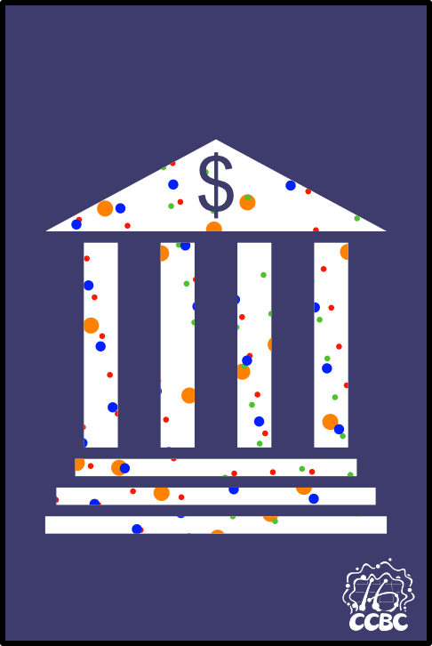
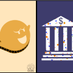

# 碎片 7-4

## 题面

## 答案

_官方存档未提供答案。_

## 解析

_官方存档未填写解析。_

## 本地附件

- [76c62ab95d0740d69bcf18439e441ba5.webp](../../../assets/static.cipherpuzzles.com/static/images/76c62ab95d0740d69bcf18439e441ba5.webp)
- [be31f929bd2e4cf6a962ee6f7764da15.webp](../../../assets/static.cipherpuzzles.com/static/images/be31f929bd2e4cf6a962ee6f7764da15.webp)
- [d3675d3de6cf4f4e9645d0efda27d330.webp](../../../assets/static.cipherpuzzles.com/static/images/d3675d3de6cf4f4e9645d0efda27d330.webp)

来源：[https://ccbc16.cipherpuzzles.com/data/articles/fragments.json#pos=6,3](https://ccbc16.cipherpuzzles.com/data/articles/fragments.json#pos=6,3)
