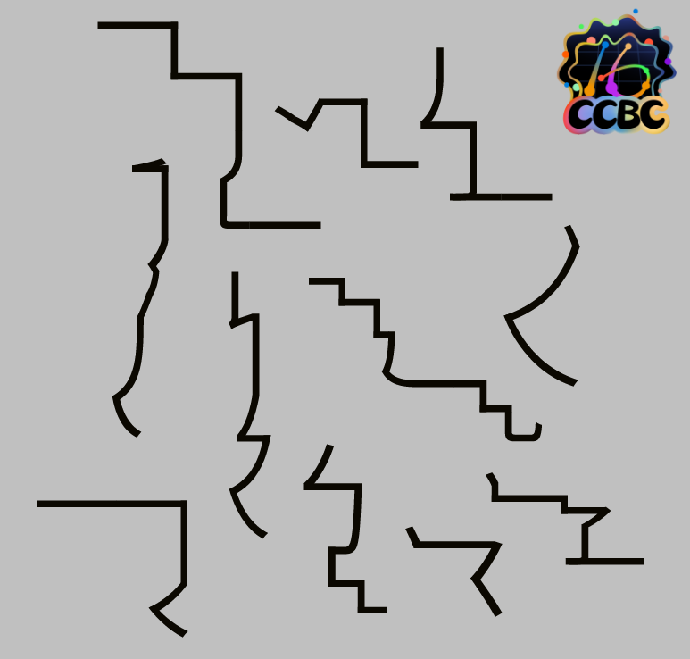
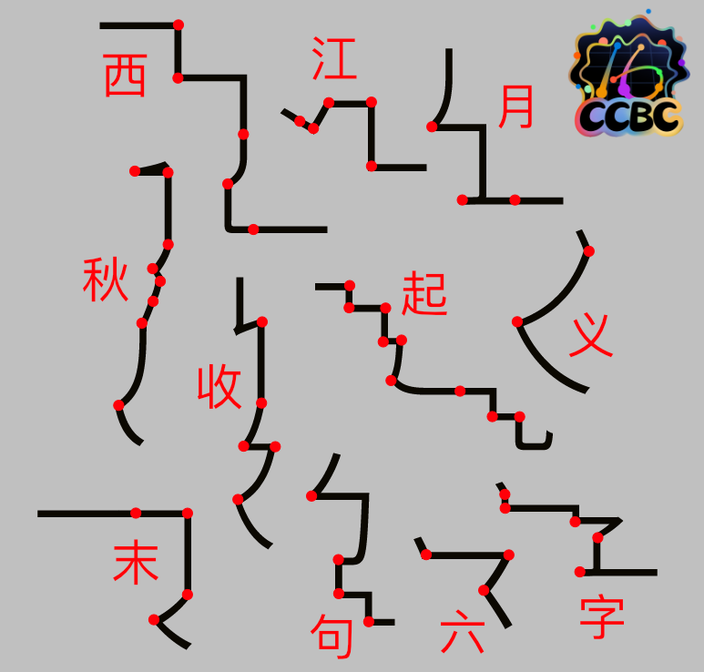

# 一笔画

## 题面

你知道吗？所有的汉字都可以一笔画。

## 答案

`霹雳一声暴动`

## 解析

这题是将每个汉字里的笔画按照笔顺首尾相连得到的“一笔画”，经过观察可以得出这些字是“西江月秋收起义末句六字”，从而得到本题答案`霹雳一声暴动`。

作为参考以下是分开笔画的断点位置：

## 提示

### 1. 我毫无头绪

每条线都是一个汉字的笔画按照笔顺首尾相连得到的“一笔画”。

## 本地附件

- [6aeb93a0e1bf4efabea06a041d2a59c8.webp](../../../assets/static.cipherpuzzles.com/static/images/6aeb93a0e1bf4efabea06a041d2a59c8.webp)
- [a6692a3f15a542a2bffb02b0f702963d.webp](../../../assets/static.cipherpuzzles.com/static/images/a6692a3f15a542a2bffb02b0f702963d.webp)
- [f1c0057ec14a4ceb96a06c4b672e4ff2.webp](../../../assets/static.cipherpuzzles.com/static/images/f1c0057ec14a4ceb96a06c4b672e4ff2.webp)

来源：[https://ccbc16.cipherpuzzles.com/data/puzzles/1.json](https://ccbc16.cipherpuzzles.com/data/puzzles/1.json)
