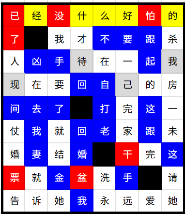
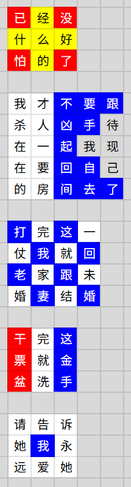

# 当立

## 题面

“现在的人啊，可不能又当又立！”

“诶，你怎么骂人呢？”

“我说的是，当心立——啊！！！”

## 交互源码

### html

```html
<style>
.dl td {
    width: 30px;
    height: 30px;
    border: 1px solid #ccc;
    text-align: center;
}
.dl_white {
    background-color: white;
}
.dl_red {
    background-color: red;
    color: white;
}
.dl_blue {
    background-color: blue;
    color: white;
}
.dl_black {
    background-color: black;
}
.dl_yellow {
    background-color: yellow;
}
.dl {
    border-collapse: collapse;
}
#dl_fill {
    border: 2px solid black;
}
#dl_container {
    background-color: #ddd;
    border-radius: 10px;
    padding: 30px;
}
</style>
<div id="dl_container">
    <table class="dl">
    <tr><td class="dl_white">告</td><td></td><td class="dl_white">结</td><td></td><td></td><td class="dl_red">干</td><td></td><td class="dl_yellow">的</td></tr>
    <tr><td class="dl_white">婚</td><td class="dl_yellow">经</td><td class="dl_blue">金</td><td class="dl_white">才</td><td class="dl_blue">不</td><td class="dl_yellow">好</td><td class="dl_white">爱</td><td class="dl_white">房</td></tr>
    <tr><td class="dl_blue">间</td><td class="dl_white">就</td><td class="dl_white">就</td><td>待</td><td class="dl_blue">打</td><td>己</td><td class="dl_white">的</td><td class="dl_white">请</td></tr>
    <tr><td class="dl_red">了</td><td class="dl_blue">妻</td><td class="dl_blue">了</td><td class="dl_blue">回</td><td class="dl_blue">老</td><td class="dl_white">家</td><td class="dl_blue">跟</td><td class="dl_white">杀</td></tr>
    <tr><td class="dl_red">票</td><td class="dl_blue">去</td><td class="dl_red">没</td><td class="dl_blue">回</td><td class="dl_yellow">么</td><td class="dl_blue">手</td><td class="dl_blue">跟</td><td class="dl_white">她</td></tr>
    <tr><td class="dl_white">人</td><td class="dl_white">诉</td><td class="dl_blue">手</td><td class="dl_blue">婚</td><td class="dl_white">洗</td><td class="dl_white">完</td><td class="dl_red">怕</td><td class="dl_white">未</td></tr>
    <tr><td>现</td><td class="dl_blue">我</td><td class="dl_white">她</td><td class="dl_red">盆</td><td class="dl_white">永</td><td class="dl_blue">要</td><td class="dl_blue">起</td><td>我</td></tr>
    <tr><td class="dl_red">已</td><td class="dl_blue">凶</td><td class="dl_white">我</td><td class="dl_yellow">什</td><td class="dl_white">在</td><td class="dl_white">一</td><td class="dl_white">完</td><td class="dl_white">一</td></tr>
    <tr><td class="dl_white">仗</td><td class="dl_white">在</td><td class="dl_white">要</td><td class="dl_blue">我</td><td class="dl_blue">自</td><td class="dl_white">远</td><td class="dl_blue">这</td><td class="dl_blue">这</td></tr>
    </table>
    <table id="dl_fill" class="dl">
    <tr><td></td><td></td><td></td><td></td><td></td><td></td><td></td><td></td></tr>
    <tr><td></td><td class="dl_black"></td><td></td><td></td><td></td><td></td><td></td><td></td></tr>
    <tr><td></td><td></td><td></td><td></td><td></td><td></td><td></td><td></td></tr>
    <tr><td></td><td></td><td></td><td></td><td></td><td></td><td></td><td></td></tr>
    <tr><td></td><td></td><td></td><td class="dl_black"></td><td></td><td></td><td></td><td></td></tr>
    <tr><td></td><td></td><td></td><td></td><td></td><td></td><td></td><td></td></tr>
    <tr><td></td><td></td><td></td><td></td><td class="dl_black"></td><td></td><td></td><td></td></tr>
    <tr><td></td><td></td><td></td><td></td><td></td><td></td><td class="dl_black"></td><td></td></tr>
    <tr><td></td><td></td><td></td><td></td><td></td><td></td><td></td><td></td></tr>
    </table>
    <div class="info-block custom-block">
    <span class="custom-block-title">注:</span>
    <span>文字颜色黑白仅为阅读方便，不是谜题的一部分。</span>
    </div>
</div>
```


## 答案

`RANTS`

## 解析

首先这是一个 drop quotes 谜题，需要用上方的字（带颜色）填入下方的空格里，黑格是分隔。从一些关键词以及文本“当心立——”的提示不难看出这是五句“死亡flag”，填完的格子如下：



注意到每句话的长度都是完整平方数（9，16，或25），重新将每句话排成正方形可得：



也就是国际信号旗里的 `RANTS`。

## 提示

### 1. 我毫无头绪

这是一个 dropquote，也就是每列上方的字需要填入下方的空格（顺序未知，但是一列的字不能填入别的列），使得下方形成五句完整的句子（黑色方块是分割）。

### 2. 该如何提取

每句话可以排成一个正方形，颜色对应国际信号旗。


## 本地附件

- [5791e55f15db4acaacec900a372bb29e.webp](../../../assets/static.cipherpuzzles.com/static/images/5791e55f15db4acaacec900a372bb29e.webp)
- [7916e92582644457bd956eafec57d226.webp](../../../assets/static.cipherpuzzles.com/static/images/7916e92582644457bd956eafec57d226.webp)
- [c583cf6ac9b448d9ae5468739289e1a5.webp](../../../assets/static.cipherpuzzles.com/static/images/c583cf6ac9b448d9ae5468739289e1a5.webp)

来源：[https://ccbc16.cipherpuzzles.com/data/puzzles/10.json](https://ccbc16.cipherpuzzles.com/data/puzzles/10.json)
