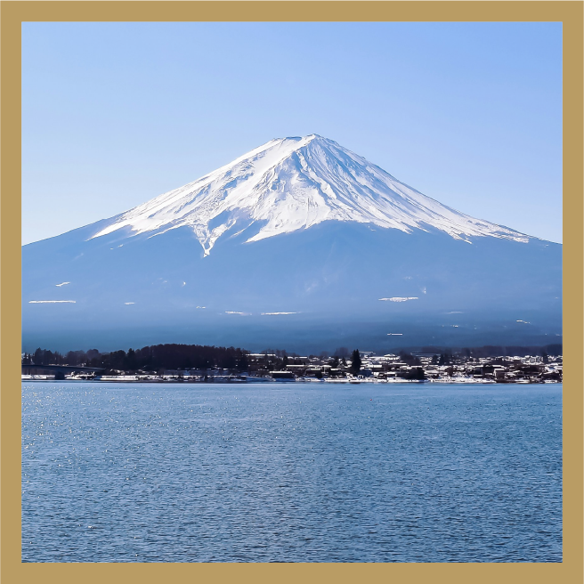
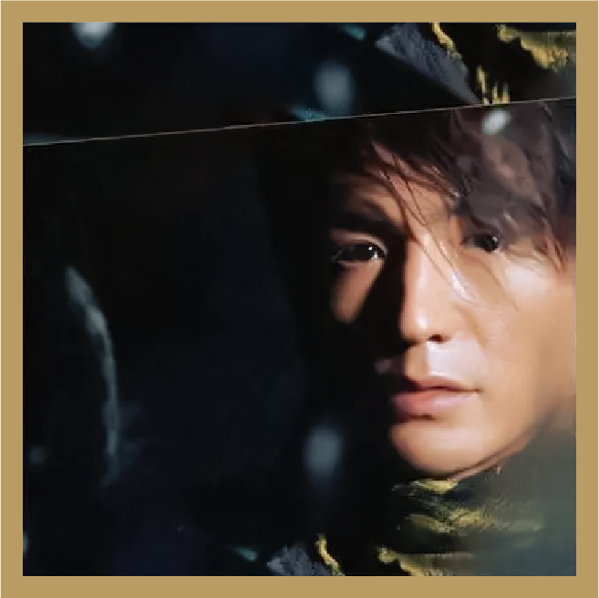
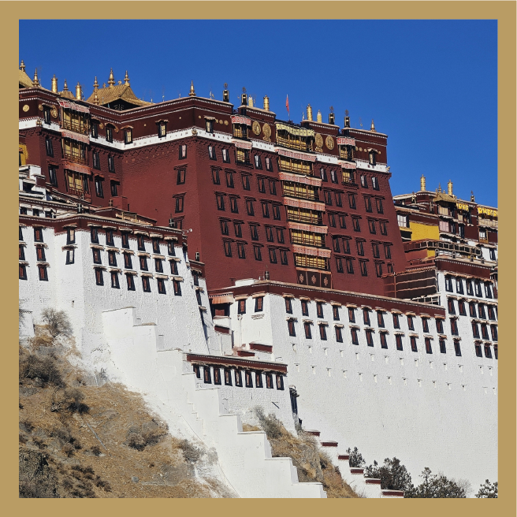
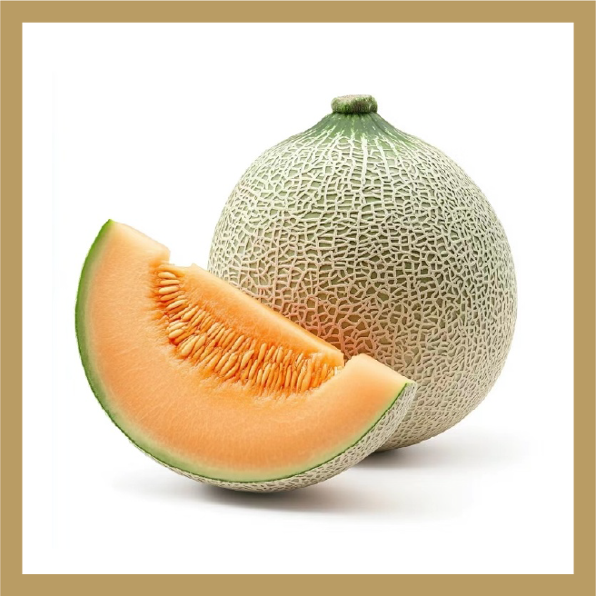
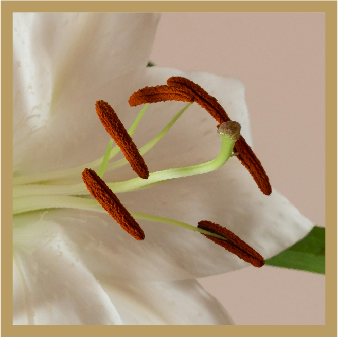
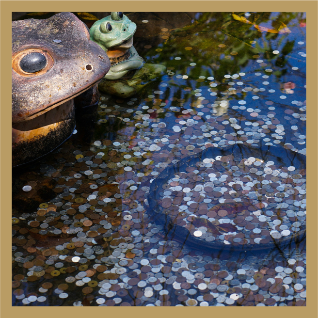

# 霓虹七色

## 题面

霓虹题所以第一张图就是霓虹国吗……说起霓虹国，你知道日语里“日本”除了 nihon 还有别的念法吗？

## 交互源码

### html

```html
<style>
    .psection img {
        height: 300px;
    }
    .enum span {
        width: 50px;
        text-align: center;
        padding: 10px 0;
        display: inline-block;
        border-radius: 0 10px;
    }
    .psection {
        margin: 20px 0;
    }
</style>
<div class="psection">
    
    <div class="enum">
        <span style="background-color: #9d5143">十二</span>
        <span style="background-color: #64adf0">三</span>
    </div>
</div>
<div class="psection">
    
    <div class="enum">
        <span style="background-color: #935e56">五</span>
        <span style="background-color: #e5afbf">六</span>
        <span style="background-color: #f9dd89">十</span>
        <span style="background-color: #3b8b91">七</span>
    </div>
</div>
<div class="psection">
    
    <div class="enum">
        <span style="background-color: #4c6480">五</span>
        <span style="background-color: #b56163">六</span>
        <span style="background-color: #f7f963">八</span>
        <span style="background-color: #ecd7c4">九</span>
    </div>
</div>
<div class="psection">
    
    <div class="enum">
        <span style="background-color: #5e3d4e">六</span>
        <span style="background-color: #c1bec4">十</span>
        <span style="background-color: #6d9971">五</span>
    </div>
</div>
<div class="psection">
    
    <div class="enum">
        <span style="background-color: #b7c39d">九</span>
        <span style="background-color: #fca62e">十一</span>
        <span style="background-color: #626900">五</span>
    </div>
</div>
<div class="psection">
    
    <div class="enum">
        <span style="background-color: #d56287">七</span>
        <span style="background-color: #e9c271">十五</span>
    </div>
</div>
<div class="psection">
    
    <div class="enum">
        <span style="background-color: #80aaba">六</span>
        <span style="background-color: #d0b0b1">十四</span>
        <span style="background-color: #749e87">六</span>
    </div>
</div>
<div>(8 8)</div>
```


## 答案

`FURUDATE HARUICHI`

## 解析

<style>
.aenum {
margin: 5px;
}
    .aenum span {
        width: 40px;
        text-align: center;
        padding: 10px 0;
        display: inline-block;
        border-radius: 0 10px;
color: black;
    }
</style>

首先需要识别每张图里的内容，题目里给出的中文数字是每个字的笔画数帮助确认答案。我们可以得到：

<div class="aenum">
        <span style="background-color: #9d5143">富</span>
        <span style="background-color: #64adf0">士</span>
</div>

<div class="aenum">
        <span style="background-color: #935e56">生</span>
        <span style="background-color: #e5afbf">如</span>
        <span style="background-color: #f9dd89">夏</span>
        <span style="background-color: #3b8b91">花</span>
</div>

<div class="aenum">
        <span style="background-color: #4c6480">布</span>
        <span style="background-color: #b56163">达</span>
        <span style="background-color: #f7f963">拉</span>
        <span style="background-color: #ecd7c4">宫</span>
</div>

<div class="aenum">
        <span style="background-color: #5e3d4e">伏</span>
        <span style="background-color: #c1bec4">特</span>
        <span style="background-color: #6d9971">加</span>
</div>

<div class="aenum">
        <span style="background-color: #b7c39d">哈</span>
        <span style="background-color: #fca62e">蜜</span>
        <span style="background-color: #626900">瓜</span>
</div>

<div class="aenum">
        <span style="background-color: #d56287">花</span>
        <span style="background-color: #e9c271">蕊</span>
</div>

<div class="aenum">
        <span style="background-color: #80aaba">许</span>
        <span style="background-color: #d0b0b1">愿</span>
        <span style="background-color: #749e87">池</span>
</div>

其次是找到这些答案的共同之处。一个办法是把所有的词丢进搜索引擎，取决于搜索引擎，也许可以直接找到需要的网站。另一个办法则是看风味文本里提到的日语里“日本”在nihon之外的另一种发音，也就是nippon。将颜色跟nippon联系起来，可以联想到或者搜到立邦涂料（Nippon Paint）。其实每个词正是立邦油漆颜色的一种，标题里的“七色”不但说的是这里有七种颜色，其实也是谐音“漆色”。所以我们提取符合油漆颜色的字，得到

<div class="aenum">
        <span style="background-color: #9d5143">富</span>
        <span style="background-color: #e5afbf">如</span>
        <span style="background-color: #b56163">达</span>
        <span style="background-color: #c1bec4">特</span>
        <span style="background-color: #b7c39d">哈</span>
        <span style="background-color: #e9c271">蕊</span>
        <span style="background-color: #749e87">池</span>
</div>

考虑到最后的提取 (8 8)，把汉字转化成拼音可得一位霓虹国漫画家的名字`FURUDATE HARUICHI`。

## 提示

### 1. 我找到了这些中文词，但是不知道下一步

这些词都是同一个集合中的一些元素，你可以试着同时搜索这些词。

### 2. 该如何提取

将正确颜色的字转换成拼音。

### 3. ft说啥呢？

霓虹就是日本，日本就是nippon，nippon就是立邦


## 本地附件

- [0f10073f01774b28abccca0c14119207.webp](../../../assets/static.cipherpuzzles.com/static/images/0f10073f01774b28abccca0c14119207.webp)
- [2ec578e0540d4e9f92bb07ff01613a82.webp](../../../assets/static.cipherpuzzles.com/static/images/2ec578e0540d4e9f92bb07ff01613a82.webp)
- [52af02e2a99c4de9a8beabe5517aaabb.webp](../../../assets/static.cipherpuzzles.com/static/images/52af02e2a99c4de9a8beabe5517aaabb.webp)
- [65c79fe6ec3b4fcbbfb3e2c96049f6c1.webp](../../../assets/static.cipherpuzzles.com/static/images/65c79fe6ec3b4fcbbfb3e2c96049f6c1.webp)
- [8a08308bde334b2ea15f98bc23c960c7.webp](../../../assets/static.cipherpuzzles.com/static/images/8a08308bde334b2ea15f98bc23c960c7.webp)
- [8a99b57054a74d5eb4eac9f68df9628b.webp](../../../assets/static.cipherpuzzles.com/static/images/8a99b57054a74d5eb4eac9f68df9628b.webp)
- [93214d39abc7404c80f4d939785906bf.webp](../../../assets/static.cipherpuzzles.com/static/images/93214d39abc7404c80f4d939785906bf.webp)
- [d4acaf3a60d746db994b63e43578b189.webp](../../../assets/static.cipherpuzzles.com/static/images/d4acaf3a60d746db994b63e43578b189.webp)

来源：[https://ccbc16.cipherpuzzles.com/data/puzzles/11.json](https://ccbc16.cipherpuzzles.com/data/puzzles/11.json)
