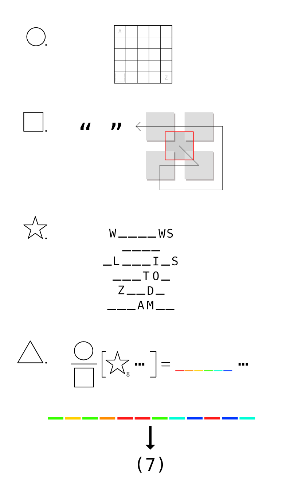
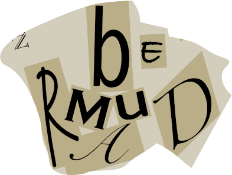
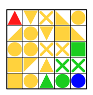
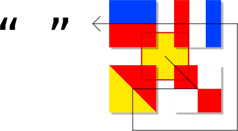

# ●■★▲

## 题面

<div  class="error-block custom-block">
<span class="custom-block-title">修改于 2025/08/14 17:06</span>
<span>增加了针对最后提取的验证和说明</span>
</div>

## 交互源码

### html

```html
<style>
    .xz-y {
        color: gold;
    }
    .xz-g {
        color: green;
    }
    .xz-b {
        color: blue;
    }
    .xz-r {
        color: red;
    }
    #xz-feeders li span {
        font-size: 50px;
        line-height: 30px;
    }
    #xz-feeders {
        display: grid;
        grid-template-columns: auto auto auto;
    } 
    .pimg {
        width: 774px;
    }
    @media (max-width: 1140px) {
        #xz-feeders {
            display: grid;
            grid-template-columns: auto auto;
        }
    }

    @media (max-width: 814px) {
        .pimg {
            width: 100%;
        }
        #xz-feeders {
            display: block;
        }
    }
</style>
<div>
<ul id="xz-feeders">
    <li><span class="xz-y">■</span><span class="xz-g">■</span><span class="xz-y">■■</span></li>
    <li><span class="xz-y">■</span></li>
    <li><span class="xz-y">◣■⨯</span><span class="xz-g">⨯●</span></li>
    <li><span class="xz-y">▼●●◤●</span></li>
    <li><span class="xz-y">■●</span><span class="xz-g">▲●</span><span class="xz-b">●</span></li>
    <li><span class="xz-r">■</span><span class="xz-b">■</span></li>
    <li><span class="xz-y">●◣</span><span class="xz-g">■⨯</span><span class="xz-b">●</span></li>
    <li><span class="xz-y">◢●▼■◣</span></li>
    <li><span class="xz-y">●●</span><span class="xz-g">●</span><span class="xz-y">●●</span></li>
    <li><span class="xz-y">⨯▼⨯▲</span><span class="xz-g">▲</span></li>
    <li><span class="xz-r">■■</span><span>□□</span></li>
    <li><span class="xz-g">▲</span><span class="xz-y">▲▲</span></li>
    <li><span class="xz-y">■▲</span><span class="xz-g">▲</span><span class="xz-y">▲▲</span></li>
    <li><span class="xz-g">▲</span><span class="xz-y">●⨯■</span></li>
    <li><span class="xz-y">●●⨯⨯</span><span class="xz-g">■</span></li>
    <li><span class="xz-r">▲</span><span class="xz-y">▼⨯◣●</span></li>
    <li><span class="xz-r">▲</span><span class="xz-y">◢●■■</span></li>
    <li><span class="xz-y">●</span><span class="xz-g">●</span><span class="xz-y">●●</span></li>
    <li><span class="xz-y">■◤▲</span><span class="xz-g">⨯⨯</span></li>
    <li><span class="xz-y">◢</span><span class="xz-r">◢</span></li>
    <li><span class="xz-r">■</span><span class="xz-b">■</span><span>□</span></li>
</ul>

</div>
<div class="info-block custom-block">
  <span class="custom-block-title">注:</span>
  <span>若你已确认图中 ☆₈ 对应的东西，可提交进行验证</span>
</div>
```


## 解题后内容

成功解开谜题后，量子星云影响的设备恢复正常，同时从中浮现出一张碎纸片。



## 答案

`BERMUDA`

## 解析

这是一道尝试以形状和颜色为 feeder 的 meta matching 题目，分为○、□、☆三个小题，以及一个 meta-meta 的 △。因为☆给出了一些字母，所以预期解题路径是从这里入手，其次是□和○。

○）这是一个“crossword”，可以观察到feeders很多是5个形状的，可以交叉填入这个 5x5 的格子并且令左下角一格为正方形：



根据题目里左上角为A右下角为Z的提示，这是一个字母棋盘。图里比较显眼的是五处⨯，对应的字母是 CNOTU，经过重新排列可得 `COUNT`。提交 `COUNT` 的话可以得到这是里程碑但是不是小题答案的提示，那么这是要数什么呢？注意到这些25个符号是按照不同颜色分开，从左上到右下分别是1个红色、18个黄色、5个绿色、1个蓝色，A1Z26 可得小题答案 `AREA`。

□）观察形状 feeders 可以发现有些形状可以对应国际信号旗的图案（■表示矩形，包括长方形和正方形）：
- <span class="xz-y">■</span>：Q
- <span class="xz-r">■■</span><span>□□</span>：U
- <span class="xz-y">◢</span><span class="xz-r">◢</span>：O
- <span class="xz-r">■</span><span class="xz-b">■</span><span>□</span>：T
- <span class="xz-r">■</span><span class="xz-b">■</span>：E

这些字母组合成 QUOTE，也正是图中“ ”代表的意思。于是按照箭头顺序把这五个字母的信号旗填入五个方块里：



红色提取框内是一个红底黄十字架，对应国际信号旗里的字母`R`，这就是本小题答案。

☆）以Z__D_为例，很容易查得这个词最有可能是 ZELDA，而塞尔达系列以三角力量为标志符号，而feeders之一就是三个三角形”<span class="xz-g">▲</span><span class="xz-y">▲▲</span>“。另外ZELDA也正缺了三个字母，可以想到这三个三角形依次对应少了的字母E、L、A，提取绿色的三角形代表的字母E。

<table>
<tr><td style="width:150px"><b>题目单词</b></td><td style="width:150px"><b>feeder</b></td><td><b>解释</b></td></tr>
<tr><td>W<span class="xz-y">I</span><span class="xz-g">N</span><span class="xz-y">DO</span>WS</td><td><span class="xz-y">■</span><span class="xz-g">■</span><span class="xz-y">■■</span></td><td>微软视窗的logo是四个方块</td></tr>
<tr><td><span class="xz-y">A</span><span class="xz-g">U</span><span class="xz-y">DI</span></td><td><span class="xz-y">●</span><span class="xz-g">●</span><span class="xz-y">●●</span></td><td>奥迪的商标是四个圆</td></tr>
<tr><td><span class="xz-y">O</span>L<span class="xz-y">Y</span><span class="xz-g">M</span><span class="xz-y">P</span>I<span class="xz-y">C</span>S</td><td><span class="xz-y">●●</span><span class="xz-g">●</span><span class="xz-y">●●</span></td><td>奥林匹克五环</td></tr>
<tr><td><span class="xz-g">B</span><span class="xz-y">UT</span>TO<span class="xz-y">N</span></td><td><span class="xz-g">▲</span><span class="xz-y">●⨯■</span></td><td>▲●⨯■是游戏机按键</td></tr>
<tr><td>Z<span class="xz-g">E</span><span class="xz-y">L</span>D<span class="xz-y">A</span></td><td><span class="xz-g">▲</span><span class="xz-y">▲▲</span></td><td>塞尔达三角力量</td></tr>
<tr><td><span class="xz-y">PY</span><span class="xz-g">R</span>AM<span class="xz-y">ID</span></td><td><span class="xz-y">■▲</span><span class="xz-g">▲</span><span class="xz-y">▲▲</span></td><td>金字塔由四个三角形和底面正方形组成</td></tr>
</table>

提取的字母连起来就是这个小题的答案`NUMBER`。

△）这道题需要用到前面三个小题的答案，我们先看一开始的○/□，如果单单带入答案 AREA / R，似乎并不是很好理解。但是由面积和R容易联想到圆的面积公式就是 π*r的平方……等一下，这里同时出现了“圆”和“方”的字样，不就是小题的标号吗？想到这里的话这个题目就好理解了，每个答案需要跟标号的形状连在一起理解，也就是说 ○/□ 正确解读方式是 circle area 除以 r square（square of r），也就是 π。

那么同样地，☆ 的答案 `NUMBER` 也要和“星”一起理解，搜索 star number 的话可以搜到“<a href="https://oeis.org/A003154" target="_blank">星数</a>”，下标8表示取第8个星数，也就是337。

也就是说这个算式代表从337位开始提取圆周率（小数点后开始算起），也就是 254091……这六个数字对应了红橙黄绿青蓝六个横杠，再根据最下面的颜色，可以拼出`040522091219`，两位一组按A1Z26转换可得 DEVILS。

但是这还不是最后答案，因为我们还没有用到△题号（况且最后明示了答案是7个字母）。将DEVILS跟三角形一起理解，Devil's Triangle（魔鬼三角）是百慕大三角（Bermuda Triangle）的别称，所以这题的最终答案是`BERMUDA`。

## 提示

### 1. 如何入手 ● 小题

找出10个长度为5的选项，并且将它们纵横各5个填入5x5方框里。

### 2. 如何提取 ● 小题

5x5 格子里的 A 和 Z 提示这是一个棋盘密码，寻找棋盘里 X 所在的位置，重组成一个单词后，对棋盘里的形状分颜色做此操作。

### 3. 如何入手 ■ 小题

找出5组能够形成国际信号旗的形状。

### 4. 如何提取 ■ 小题

五个旗语可以拼成一个对应左边的 “ ”的单词，将旗语按顺序填入后，提取红色框出的部位。

### 5. 如何入手 ★ 小题

每个单词都可以用一组形状表示，其缺少的字母数量等于形状的数量。

### 6. 如何提取 ★ 小题

将形状填入横线上，提取绿色形状对应的字母。

### 7. 我得到了前面三个小题的答案，但是不知道如何理解 ▲

每个小题的答案需要搭配其标题的形状（circle, square, star）理解。注意 star 的理解建议使用 google, bing, wikipedia 等搜索。

### 8. ▲里的方括号是什么意思？

[x……] 的意思是从小数点后第x位开始提取。

### 9. 我解出来了▲的答案，但是我不知道如何把它变成一个7字母的答案

跟前面的小题一样，▲的答案需要结合形状一起考虑，合起来搜索可以得到一个7字母的答案。


## 中间答案

| 提交 | 回复 | 附加信息 |
| --- | --- | --- |
| count | 这是一个里程碑，但是不是小题的答案。 |  |
| area | 这是小题答案之一。 |  |
| number | 这是小题答案之一。 |  |
| r | 这是小题答案之一。 |  |
| DEVILS | 这是一个里程碑。 |  |
| 337 | 这是正确的 ☆₈ 对应数字 |  |
| 133 | 本题使用的是此序列：[星数](https://oeis.org/A003154)，第八个为337 |  |

## 本地附件

- [00a1663aa6bb4b34bc7dc0d1d5da424a.svg](../../../assets/static.cipherpuzzles.com/static/images/00a1663aa6bb4b34bc7dc0d1d5da424a.svg)
- [199572c6a6db40f8b09f692730f359e8.webp](../../../assets/static.cipherpuzzles.com/static/images/199572c6a6db40f8b09f692730f359e8.webp)
- [a642f8947d574d06b3a84e202f857fcd.webp](../../../assets/static.cipherpuzzles.com/static/images/a642f8947d574d06b3a84e202f857fcd.webp)
- [c2a86788bde24afba1c76ecd0c9ce620.webp](../../../assets/static.cipherpuzzles.com/static/images/c2a86788bde24afba1c76ecd0c9ce620.webp)
- [c2db5b20b44c44c79421f54f37e1f73e.webp](../../../assets/static.cipherpuzzles.com/static/images/c2db5b20b44c44c79421f54f37e1f73e.webp)

来源：[https://ccbc16.cipherpuzzles.com/data/puzzles/14.json](https://ccbc16.cipherpuzzles.com/data/puzzles/14.json)
