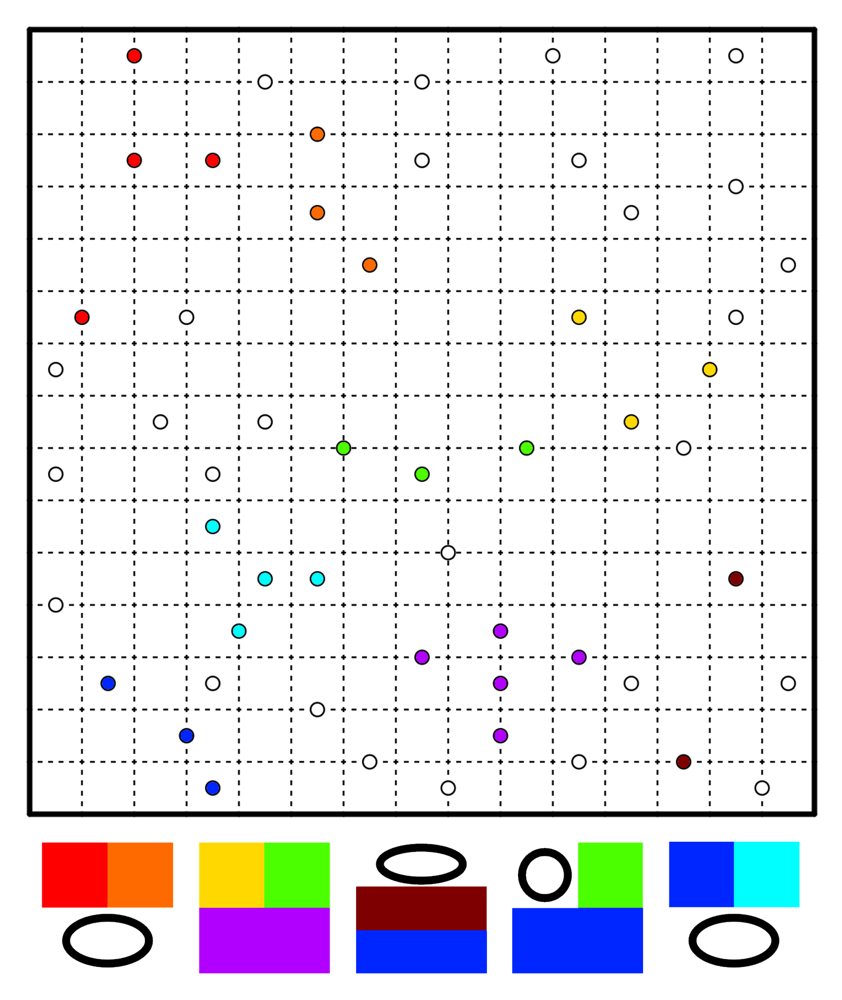
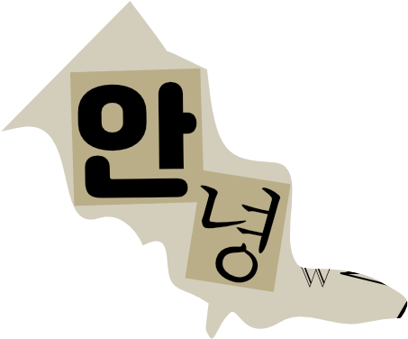
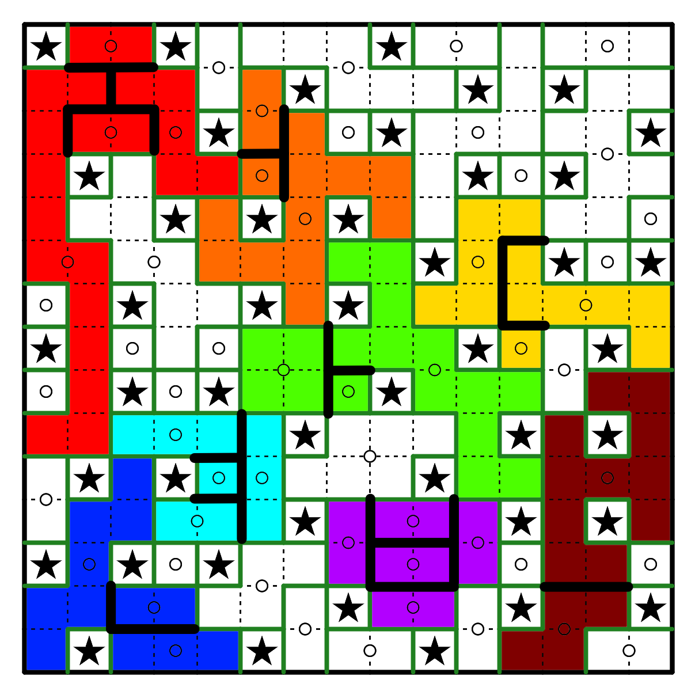
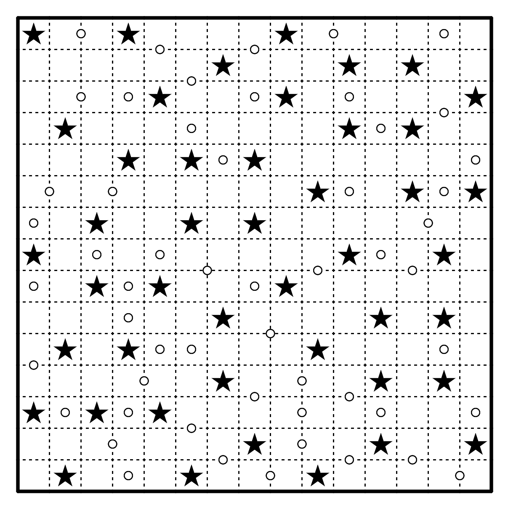

# 三星Galaxy

## 题面

_官方存档未提供可提取的文字题面；请查看下方附件或交互源码。_

## 交互源码

### html

```html
<ul>
    <li>放置一些星星，使得每行每列均有三颗星星。星星不能相邻或对角相邻。</li>
    <li>将所有没有星星的格子划分为一些区域。每个区域均为中心对称，且包含其对称中心。所有对称中心已标出。</li>
</ul>
<a href="https://puzz.cipherpuzzles.com/penpa-edit/?m=solve&p=7VZdb+o4EH3nV6z8WkubccintA+U0m7vtlxaQN0SIRRogPQmpJsP2g3q/e21HVgIjCv1YaV9WIWMxmfMeGacM3b2V+GnAQVD/HSNOhoF/jRtXb5g8zF/d88gzKPA/YW2inyZpFyh9HuXzv0oC+i3x+VNO2m9XrT+XNv5aARXWnGtPTxfPp/dx39ch3oKl127d9u7Ddmi9Xv7/M7snJm9IhvmwfouhvPn4Wgw7z0sHPZ3pztqlqPvmvFtNP913Rr+1vC2IYwbHmGEyhfI+GfZ/+kRQs1xY1Peu5ty4nrjd1oO96q9V/vuhsuulCDlo7shzSZxPaBkFqazKJj0+4SyMSUGw2EHhU3ciYnPBk1T4Lgb0BR+wMZxBjhuGThuK+Y7JoozwONkinWZbuF4E68DMxR+DIUfA68DMxV+TB3HFfVhDl5/HfCPRFfUx2AK3MTrYFl4/S0br4Ot43WwTRWO52VbeDy2g+OOop6OIn7HxuvgqPw7eJ1BUxQaQMFqAEUpACzFPxgoyMoUuw+MKWjGDLwewEx8Q4HZKoY7ijV0TbGGDvgmgY5+3bw7XsoeyaQc8BZKS13KCyk1KQ0pb+ScjpQPUralbEppyjmWaMKNhteszhjVw4+i/63/bSs/hPl5S7IkmmRFOvdnwSR482c5caurwKGlhq2KeBqkNShKkpcoXGEedqYaGC5WSRqgJgEGTwuVK2FCXE2T9EnElKfFFn/1o6ieirwl1aCKKjUoT8Pa2E/T5LWGxH6+rAFTP+cXqmwZvtQ9BaujWuZ+LUL/h3+0WLwvxnuDvBH5ejplYrc2peOWLVpeubXLEy3v+N3o1i274mokrlEWbwdxEeXhLIkSvqLAQNLbIzqhtsb1DtdBdg7OdDFBaO3KM5hc74oJGh+I2Y98UO83Zc/1ygElYv1z6UCoJE7WPAHpWo5nSTzlKXrkoEZU54aseEp+FNupINpUq8qiv8uCB6HMwpBOdkkItUpCaCdJVPEepHBTOfpiBuLDy4opEr4zfq92S/vS9XV7TsoCaOIUJML8z432X+rcb1vKJ+knrN8bj2GE+xz9hP4HVgxXMP3Aeoyf8FoEe0ptjiLs5ugxwTl0ynEOntCcYwqmC6/HZBdRSb4fLXXCebHUIe15U5baBw==" target="_blank">在线做题链接（无答案检查）</a><br>

<style>
    .pimg {
        width: 600px;
    }
    @media (max-width: 740px) {
        .pimg {
            width: 100%;
        }
    }
</style>
```


## 解题后内容

成功解开谜题后，量子星云影响的设备恢复正常，同时从中浮现出一张碎纸片。



## 答案

`안녕`

## 解析

<style>
#answerkey {
    border-collapse: collapse;
    border-spacing: 0
}
#answerkey th {
    border: 1px solid black;
    border-width: thin;
    text-align: center;
    font-weight: bold;
    vertical-align: middle;
    padding: 3px 10px;
}
#answerkey td {
    border: 1px solid black;
    border-width: thin;
    text-align: center;
    vertical-align: middle;
    padding: 3px 9px;
}
</style>

首先按照规则解出纸笔谜题。

<a href="../../../assets/static.cipherpuzzles.com/static/images/d69791e7390d4e198caa5a8c879e5cef.PNG" target="_blank"></a>

将颜色对应到相应区域的分割线形状，填入提取图片，得到`정답은안녕`，即韩语的「答案是안녕」。所以最终答案为`안녕`。

<table id="answerkey">
<tr><th>颜色</th><td>红</td><td>橙</td><td>黄</td><td>绿</td><td>青</td><td>蓝</td><td>紫</td><td>褐</td></tr>
<tr><th>区域分割线形状</th><td>ᄌ</td><td>ᅥ</td><td>ᄃ</td><td>ᅡ</td><td>ᅧ</td><td>ᄂ</td><td>ᄇ</td><td>ᅳ</td></tr>
</table>

## 提示

### 1. 该如何提取

将颜色对应到相应区域，描出同色区域的内部边界线的形状。仅保留内部边界线，就是对应颜色的提取。

### 2. 纸笔太难了，能简化一下吗？

好的，星星已全部标出：


### 3. 我不理解我提取出的东西

韩语


## 中间答案

| 提交 | 回复 | 附加信息 |
| --- | --- | --- |
| 정답은안녕 | 这是一个里程碑，“정답은안녕”的意思是“答案是안녕”。 |  |

## 本地附件

- [47e9268416804784ba588311e65f8b67.svg](../../../assets/static.cipherpuzzles.com/static/images/47e9268416804784ba588311e65f8b67.svg)
- [5fa4c6588c35484d9115c8b6bb4b88f0.webp](../../../assets/static.cipherpuzzles.com/static/images/5fa4c6588c35484d9115c8b6bb4b88f0.webp)
- [d69791e7390d4e198caa5a8c879e5cef.PNG](../../../assets/static.cipherpuzzles.com/static/images/d69791e7390d4e198caa5a8c879e5cef.PNG)
- [ea2dcb4efa374362ad972a45f4603abe.webp](../../../assets/static.cipherpuzzles.com/static/images/ea2dcb4efa374362ad972a45f4603abe.webp)
- [f70995ad44b643f78be3175845c273ed.webp](../../../assets/static.cipherpuzzles.com/static/images/f70995ad44b643f78be3175845c273ed.webp)

来源：[https://ccbc16.cipherpuzzles.com/data/puzzles/15.json](https://ccbc16.cipherpuzzles.com/data/puzzles/15.json)
