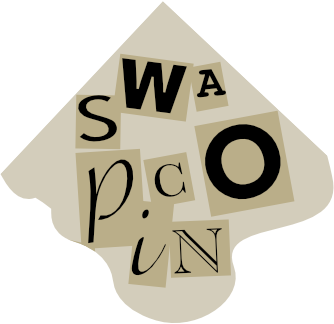
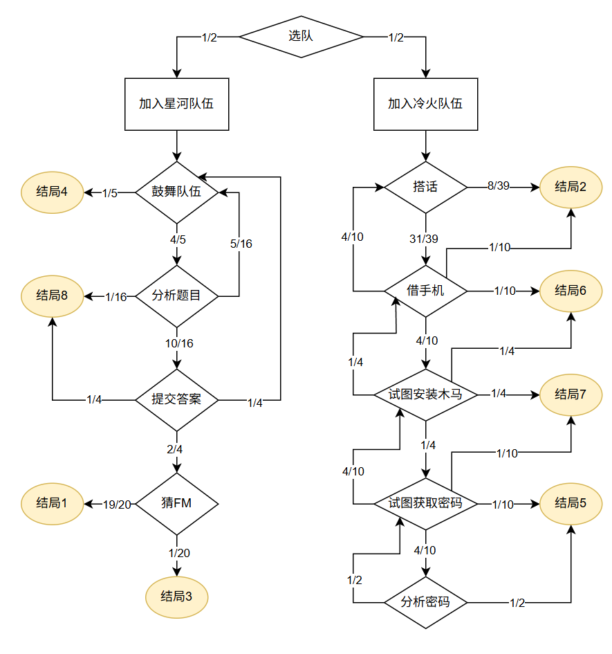

# 你想Roll出怎样的比赛

## 题面

_官方存档未提供可提取的文字题面；请查看下方附件或交互源码。_

## 交互源码

### html

```html
<template>
    <div id="novel">
      <div class="chapter" v-for="chapter in backRes.chapters">
        <div class="text" v-html="chapter.text"></div>
        <div v-if="chapter.final" class="ending">
          {{ chapter.ending }}
          <div class="restart">
            <button class="el-button el-button--primary" @click="restart()">重新开始</button>
          </div>
        </div>
        <div v-else>
          <div v-if="chapter.hasOwnProperty('choices')">
            <div class="prompt">
              <p>拿出你的 D{{ chapter.roll }}，{{ chapter.chooseText }}：</p>
              <button class="el-button el-button--primary" v-if="!chapter.rolled" @click="roll()">掷骰子</button>
              <div v-else v-html="chapter.outcome"></div>
            </div>
          </div>
        </div>
      </div>
    </div>
    <div id="bookmark">
        <div id="bookmarkTitle">书签</div>
      
        <div class="el-input" style="width: 150px; margin-right: 5px;">
            <div class="el-input__wrapper">
                <input class="el-input__inner" id="bookmarkInput" type="text" v-model="backRes.bookmark">
            </div>
        </div>

      <button class="el-button el-button--primary" @click="jumpToBookmark()">跳转</button>
    </div>
</template>

<style>
    .prompt p {
      margin: 0
    }
    .prompt, .outcome {
      background-color: cornsilk;
      padding: 20px;
      border: 2px dashed burlywood;
    }
    .ending {
      background-color: lightblue;
      padding: 20px;
      border: 2px dashed navy;
    }
    .restart {
      margin-top:30px
    }
    .chapter {
      margin: 20px 0;
    }
    .text {
      margin: 10px 0;
    }
    .thoughts {
      font-style: italic;
      color: #666;
    }
    #novel {
      max-width: 800px;
      margin-bottom: 80px;      
    }
    #bookmark {
      position: fixed;
      bottom: 90px;
      right: 6.5vw;
      box-shadow: 0 0 10px 0 rgba(0, 0, 0, 0.1);
      padding: 10px;
      border-radius: 5px;
      background-color: rgba(255, 255, 255, 0.75)
    }
    #bookmarkTitle {
        font-weight: bold;
        margin-bottom: 10px;
    }
</style>
```

### javascript

```javascript
const { ref, reactive, inject, onMounted, nextTick } = Vue; //Vue已被导入到作用域全局对象。使用 const { xxx } = Vue 代替 import { xxx } from 'vue'


//必须存在一个全局导出对象 export default {} ，此对象作为当前页面Vue的实例对象。因此，这里只能使用options语法。
export default {
    //建议参考Vue 3.0 官方文档中setup函数写法，将所有逻辑都写在setup函数内。这样你就可以在setup函数内使用好用的vue3.0语法。
    setup() {
        const backRes = reactive({
            chapters: [],
            bookmark: "",
            bookmarkError: false,
        });

        const backend = inject("backend");
        const message = inject("message")
        // message.notify({
        //     title: "提示",
        //     message: "好像哪里的门被打开了。",
        //     type: "info",
        // })

        const jumpToBookmark = () => {
            let bookmark = document.getElementById("bookmarkInput").value;
            processBackend(3, bookmark);
        }

        const roll = () => {
            processBackend(1);
        }
        const restart = () => {
            processBackend(2);
        }
        const processBackend = async (type, bookmark = "") => {
            let data = await backend("c16-novel", {
                type: type,
                bookmark: bookmark,
            });
            backRes.chapters = data.chapters;
            backRes.bookmark = data.bookmark;
            backRes.bookmarkError = data.bookmarkError;
            nextTick(() => {
                let chapters = document.getElementsByClassName("chapter")
                chapters[chapters.length - 1].scrollIntoView({ behavior: "smooth" });
            });
        }

        //onMounted是VUE提供的生命周期钩子，它会在整个VUE组件渲染好以后自动调用。更多生命周期钩子请参考VUE官方文档
        //我们这里使用onMounted，一般是为了初始化。当然初始化也可以放在其他的生命周期里。
        onMounted(() => {
            processBackend(0);
        });

        //所有在页面上使用的对象，都需要这里return出去
        return {
            backRes,
            roll,
            restart,
            jumpToBookmark,
        }
    }
}
```

### backend_c16-novel

```text
// 小说题脚本

// @ts-check


//在后端脚本中，可以使用全局变量 ctx

//全局变量 ctx 的内容如下：

// request: string; // 从前端调用时，前端传来的请求对象，内容为JSON字符串。请调用JSON.parse转换后使用。

// uid: number; // 当前调用此后端脚本的用户 uid

// gid: number; // 当前调用此后端脚本的组队 gid

// getStatus(key: string) : string // 读取：当前用户的状态存储（注意状态信息是加密存储在每个浏览器上的，不同用户的不同进程都有不同的状态）

// setStatus(key: string, value: string) // 写入：当前用户的状态存储

// getProgress(pid: number, key: string) : string // 读取：当前组队的题目进度（组队题目进度是存在后端数据库中的，组队内部共享，每个题目有不同的状态）

// setProgress(pid: number, key: string, value: string) // 写入：当前组队的题目进度

// getPuzzleData(pid: number) : string // 获取题目的data片段（题目详情中<data></data>中的内容）

// response(body: string) // 返回给前端的数据对象。内容为JSON字符串。必须调用JSON.stringify后传入。**必须**在此脚本中至少调用这个函数一次，即使你没什么需要返回的，也请调用一次 ctx.response("{}");


var templates = new Map([

    [0, {"text": "<p>上一届，你本是 CCBC 的夺冠热门，却被诡计多端的队友所害，甚至取消了参赛资格。这一届，你决心要重头再来，夺回本该属于你的一切！</p>"

        + "<p>第一步，选择队伍！</p>"

        + "<p>机缘巧合之下，你认识了星河队的队长流星。几次小型解谜活动下来你们颇有些惺惺相惜，终于，流星邀请你跟他们队伍一起参加今年的 CCBC。</p>"

        + "<p>你正准备答应时，一条消息弹了出来：“大佬 CCBC 有队伍了吗？”</p>"

        + "<p>消息发送人：冷火。</p>"

        + "<p>看到这个名字的时候不由皱了皱眉头。虽然你没跟他打过什么交道，但是对他还是有所耳闻：一个实力强大却又有些不择手段的解谜高手。</p>"

        + "<p>可能是察觉到了你的犹豫，冷火又发过来一句：“你不是要找黑鸦报仇吗？我听说他加入了暗夜行者队伍。想要击败他，就加入我的队伍吧，我们对冠军可是势在必得！”</p>"

        + "<p>黑鸦去年跟你一个队伍，就是他，把答案透露给别的队伍导致两个队伍一起被取消了比赛资格，你们也因此绝交。没想到他竟然进了名次一向不错的暗夜行者队伍，如果这届他的名次高于你……你不由握紧了拳头：“你怎么这么有信心？”</p>"

        + "<p>“呵呵，暗夜行者队名次那么好不过是他们会作弊罢了。”</p>"

        + "<p>“而在这方面，我们可是专家。”</p>",

        "choices": [

            {"node": 18, "prob": 1, "desc": "<p>D2 落在了正面，你仿佛松了一口气，心里的纠结一扫而光。</p>"

                + "<p>“抱歉，我决定加入星河队了。”你告诉冷火。</p>"

                + "<p>“好吧，不过最后输给我们不要后悔哦。”</p>"

            },

            {"node": 19, "prob": 1, "desc":

                "<p>D2 落在了反面。</p>"

            + "<p class='thoughts'>或许，这就是命运的安排吧。对付小人光用正义的手段是不行的。</p>"

        + "<p>你这么安慰着自己，同意了冷火的邀请。</p>"},

        ],

        "chooseText": "掷出正面加入星河队伍，掷出反面加入冷火队伍"}],

    [18, {"text": 

        "<p>比赛终于开始了。</p>"

        + "<p>你跟星河队的几个队友各有所长，配合默契，一道又一道题目倒在你们面前。</p>"

        + "<p>这仿佛是你做过最顺利的一届 CCBC，排行榜上你们的名次也证实了这一点，虽有浮动，却始终保持在前五。</p>"

        + "<p class='thoughts'>或许，今年真的能夺冠……</p>" 

        + "<p>※　※　※</p>"

        + "<p>“又解锁了一道新题！”</p>"

        + "<p>“啊？怎么还有啊……”聊天频道里响起一片哀号。</p>"

        + "<p>这都多久了？连续几夜都没好好睡一觉的你揉了揉眼睛，却仍然看不清电脑屏幕一角显示的时间。</p>"

        + "<p>与比赛开始时踌躇满志相比，现在笼罩在大家心头的，是一片名叫“真的能完赛吗”的阴云。</p>"

        + "<p>“今年出题组是怎么搞的？”</p>"

        + "<p>队里的上班族也愁眉苦脸：“唉唉，我可只请了一天的假，哪想到会拖这么久。”</p>", "autoTransition": 1}],

    [1, {"text": "<p class='thoughts'>不行，我得做点什么……</p>"

            + "<p>“大家打起精神来，根据我对这次比赛的结构分析，我认为我们离终点不远了!”</p>",

        "choices": [{"node": 3, "prob": 1,

            "desc": "你掷出了 $VALUE$，并不足以起到鼓舞作用。"

        }, {"node": 2, "prob": 4,

            "desc": "你掷出了 $VALUE$，成功地鼓舞了队伍。"

        }],

    "chooseText": "掷出 ≥ 2 鼓舞队伍前进" }],

    [2, {"text": "<p>虽然疲劳，大家仍然认真地开始分析起面前的这道题目。</p>", "choices": [

        {"node": 5, "prob": 1, "desc": "你掷出了 $VALUE$，比赛结束了。"},

        {"node": 1, "prob": 5,

        "desc": "<p>你掷出了 $VALUE$，分析失败了。</p>"

        + "<p>虽然你们提出的思路看似有些道理，但是仔细分析后却并不符合题目里所有的信息。打击之下队伍再次陷入了低迷。</p>"},

        {"node": 4, "prob": 10, "desc": "<p>你掷出了 $VALUE$，分析成功了。</p>"

            + "<p>经过一番周折，你们似乎提取出了一串像是单词的东西。</p>"

        }],

        "chooseText": "掷出 1 结束比赛，2-6 分析失败，7-16 分析成功" }],

    [3, {"text": "<p>你突然惊醒过来，面对着已然进入休眠模式的黑屏。</p>"

            + "<p class='thoughts'>我睡着了么？</p>"

            + "<p>唤醒电脑，输入框里还显示着你没打完的“别放弃，我们还”，对话框里却多了几行新的消息：</p>"

            + "<p>“实在撑不下去了，明天还要上班呢。”</p>"

            + "<p>“我也”</p>"

            + "<p>“GG （大哭）”</p>"

            + "<p>你叹了口气。尽管你还想做下去，却也知道此时已是独木难支。再说，你也的确到了自己的极限……你摇摇晃晃地走到床边，一头栽了下去。</p>", "ending": "结局4：人为什么一定要睡觉啊" }],

    [4, {"text": "是否该提交呢？虽然这串字母不怎么像人话，但是考虑到以往解谜比赛里的一些奇葩答案，你又觉得这也不是不可能。",

        "choices": [

        {"node": 5, "prob": 1, "desc": "你掷出了 $VALUE$，比赛结束了。"},

        {"node": 1, "prob": 1, "desc":

            "<p>你掷出了 $VALUE$，【回答错误】四个大字无情地出现在屏幕上。</p>"

        + "<p>打击之下队伍再次陷入了低迷。</p>"},

        {"node": 6, "prob": 2, "desc": "你掷出了 $VALUE$，【回答正确！】。"},],

    "chooseText": "掷出 1 结束比赛，掷出 2 回答错误，掷出 3 或者 4 回答正确" }],

    [5, {"text":

        "<p>【比赛结束了！】</p>"

        + "<p>屏幕上跳出来这句话时，你们才发现居然已经到了原定的比赛落幕时间。</p>"

        + "<p>CCBC群里顿时炸开了锅。</p>"

        + "<p>七大忙不迭地道歉：“实在对不起，我们这次比赛未能正确把握好长度和难度，出题组为此负全责！”</p>"

        + "<p>“这些题目是人做的吗？内测组干什么去了？”</p>"

        + "<p>内测组的亮子和PJ两脸无辜：“我们解得真的很顺利啊……”</p>"

        + "<p>“选他们做试解就是最大的失败！</p>"

        + "<p>一个弱弱的声音插了进来：“那个……既然没有冠军队，那明年 CCBC 谁来出呢？”</p>"

        + "<p>“是啊……”</p>"

        + "<p>聊天群陷入了片刻的沉默，继而再次投入到了对当届出题组的讨伐之中……</p>", "ending": "结局8：未来不明的CCBC" }],

    [6, {"text": "<p>“啊？这还真是答案？”</p>"

        + "<p>虽然就是你提交的答案，但是看到答案正确还是吓了一跳。</p>"

        + "<p>“不管了不管了，接着看下一题。”</p>"

        + "<p>“是 Final Meta！这就是最后一题了！”</p>"

        + "<p>仿佛黑夜里一下子看到了曙光，队友们都激动起来，你也精神一振。</p>"

        + "<p>这最后的 Final Meta 倒是令人意外的简单，你们很快就找到了正确的思路，但是由于前面的题目并没有做全，你们的信息只能拼凑出最终答案的一小部分。</p>"

        + "<p>经过一番分析猜测，你们将最终答案缩小在了二十个单词的范围内。</p>"

        + "<p>“要不我们猜一个吧？”你提议道。</p>"

        + "<p>队友们纷纷表示赞同。但是该猜哪一个呢？</p>"

        ,

        "choices": [

        {"node": 7, "prob": 19, "desc": "你掷出了 $VALUE$，【回答错误】四个大字无情地出现在屏幕上。"},

        {"node": 8, "prob": 1, "desc": "你掷出了 $VALUE$，【回答正确！】。"}],

        "chooseText": "掷出 20 回答正确，否则失败" }],

    [7, {"text": "<p>你正准备再换个单词猜的时候，屏幕上突然跳出了这么一行消息：</p>"

        + "<p>【恭喜冷火队获得本届 CCBC 的冠军！】</p>"

        + "<p>你的队伍最后还是完成了比赛，名次也不错。但，毕竟不是冠军。</p>"

        + "<p>后来你的工作越来越忙，参加 CCBC 也不能像以前那样全力以赴了，这一次比赛竟成了你离冠军最近的一次。有的时候想起来你也不免有些可惜，如果当时掷出的 D2 让你去了冷火队……但人生毕竟不能重来。</p>"

        + "<p>吗？</p>", "ending": "结局1：失之交臂" }],

    [8, {"text": "<p>【恭喜星河队获得本届 CCBC 的冠军！】</p>"

        + "<p>“我们赢了！”</p>"

        + "<p>“好累，但是真的好爽啊！”</p>"

        + "<p>“欸，冠军是不是还得出明年的题目？”有人这么煞风景地问道。</p>"

        + "<p>“我现在只想睡上三天三夜，出题的事情，等我睡醒来再说吧！”</p>"

        + "<p>你带着笑意钻进被窝。</p>"

        + "<p class='thoughts'>我做到了！我终于夺回了属于我的荣耀！</p>", "ending": "结局3：我们是冠军" }],

    [19, {"text": 

            "<p>你一上来就开门见山地问道：“说说吧，你们打算怎么赢。”</p>"

            + "<p>“美男计”</p>"

            + "<p>“打扰了，告辞。”</p>"

            + "<p>“别别别，这事还真非你不行。”</p>"

            + "<p>原来，经过长期对 CCBC 出题组的调查，冷火等人成功打探出了出题组小七的身份，她竟然跟你是同校的同学。不仅如此，他们通过挖掘社交网站，还了解到了小七的日常行踪轨迹。</p>"

            + "<p>“只要你把这个木马成功下载到她的手机上，我就能偷到她的密码，直接拿到所有 CCBC 题目的答案！这个木马会自动删除，他们一定发现不了的！”</p>"

            + "<p>“再说我们的实力本就可以夺冠，这只是预防万一的后手而已。说不定我们根本不会用到呢。”</p>"

            + "<p>看着你有些动摇的样子，冷火又补了一句：“再说，小七可是美少女哦！去跟她聊聊天你也不亏对吧！”</p>"

            + "<p>“好吧……”最终复仇的欲望还是战胜了一切。</p>"

            + "<p>※　※　※</p>"

            + "<p class='thoughts'>但是我怎么忘了我在女生面前是个社恐啊！！！</p>"

            + "<p>你按照冷火提供的信息来到了小七常去的校园咖啡厅，果然看到了那位名叫小七的美少女。</p>"

            , "autoTransition": 9}],

    [9, {"text": "<p class='thoughts'>要怎么才能跟她搭话呢？</p><p>你紧张地打开手机开始搜索“如何跟女生说话”的信息。</p>", "choices": [

        {"node": 10, "prob": 8, "desc": "<p>你掷出了 $VALUE$，最终未能开口。</p>"

            + "<p>等你确保自己已经熟记搭讪套路，再三鼓起勇气后抬起头来——</p>"

        },

        {"node": 11, "prob": 31, "desc":

            "<p>你掷出了 $VALUE$，成功开口。</p>"}],

        "chooseText": "掷出 ≥ 9 成功跟小七说话" }],

    [10, {"text": "<p class='thoughts'>咦？人呢？</p>"

        + "<p>不知何时，小七已经离开了咖啡厅，不知去处。</p>"

        + "<p>之后你连着几天来咖啡厅期待再次偶遇，然而都以失败告终。从 CCBC 群里的消息看来，原来这几天为了准备 CCBC，小七一直窝在宿舍加班加点地完成题目最后的美工。你竟然错过了盗取密码的唯一机会。</p>"

        + "<p>“啧啧……果然还是认真的女人最可怕啊！”你不由感叹道。</p>"

        + "<p>失去了作弊保障的冷火队虽然的确有一些实力，但是仍然没有获胜。冠军队伍恰恰就是之前向你抛出橄榄枝的星河队，如果当时掷出的 D2 让你去了星河队就好了，但是人生不能重来。</p>"

        + "<p>吗？</p>", "ending": "结局2：认真的女人无懈可击" }],

    [11, {"text": "<p>“这位同学，我能（再）借一下你的手机吗？我的手机没电了。”</p>"

        + "<p>虽然俗套了点，但是这已经是你能想出来的最好的借口了。</p>",

        "choices": [

            {"node": 10, "prob": 1, "desc": "<p>你掷出了 $VALUE$。</p><p>等你低着头问完问题，抬起头来——</p>"},

            {"node": 9, "prob": 4, "desc": "<p>你掷出了 $VALUE$。</p><p>可能因为紧张，你的声音细得跟蚊子叫一般，小七根本没听见。</p>"},

            {"node": 12, "prob": 1, "desc": "<p>你掷出了 $VALUE$。</p><p>“这种搭讪也太老套了，”小七冷笑一下。“你不知道咖啡厅可以借充电器吗？”</p><p>“啊这……”本来就已经很紧张的你更囧了，夺门而逃。</p><p class='thoughts'>去死吧这什么破计划！</p>"},

            {"node": 13, "prob": 4, "desc": "<p>你掷出了 $VALUE$，成功借到手机。</p>"}

    ],

    "chooseText": "掷出 1 错失良机，2-5 被小七无视，6 被小七当成骚扰，7-10 成功借到手机"}],

    [12, {"text": "<p>晚上你在学校论坛树洞里看到了这么一条吐槽：</p>"

        + "<p>“今天在学校咖啡厅又被陌生男同学搭讪了，除了觉得我好看对我一无所知，这样也太肤浅了吧！真的有女生喜欢这样的男生吗？”</p>"

        + "<p>底下还有不少女生赞同的回复，夹杂着几个酸溜溜的“凡尔赛”的评价。</p>"

        + "<p>你气得想辩驳你是为了比赛而不是美色，然而写了几行字又灰溜溜删除，最后郁郁而终。</p>", "ending": "结局6：尴尬致死" }],

    [13, {"text": "你装作打电话的样子，却紧张地试图在她手机上下载安装冷火给你的木马链接。", "choices": [

        {"node": 12, "prob": 1, "desc": "<p>你掷出了 $VALUE$。</p>"

            + "<p>不想一个不巧，小七眼尖地发现你不在打电话而是在捣鼓些别的东西。“你在我手机上干什么？我要报警了！”</p>"

        + "<p>“别别……”你情急之下只好当场编了个借口：“其实我暗恋你很久了，我是想偷偷加你微信好友……”</p>"

        + "<p>她半信半疑地拿回手机。计划一败涂地，但是看起来至少她是不会报警了。</p>"},

        {"node": 11, "prob": 1, "desc": "<p>你掷出了 $VALUE$。</p>"

            + "<p>不知为何，此刻咖啡厅的网速极其缓慢，你捣鼓了半天也没搞成功。眼看小七已经往这里投来几次怀疑的眼神，你只好把手机放到耳边假装讲了几句后还给了她。</p>"

            + "<p class='thoughts'>看来还是得找个理由再借一次……</p>"

        },

        {"node": 14, "prob": 1, "desc": "<p>你掷出了 $VALUE$。</p>"

            + "<p>你成功打开了木马链接，然而不知为何，手机上跳出了一个发现异常软件的警报。你慌忙关闭了窗口后把手机还给小七后匆匆离开了咖啡厅。</p>"},

        {"node": 15, "prob": 1, "desc": "<p>你掷出了 $VALUE$，成功下载木马。</p>"}

    ],

    "chooseText": "掷出 1 被小七当成骚扰，2 未来得及下载，3 下载造成手机异常，4 成功下载木马"}],

    [14, {"text": "<p>CCBC 开赛前两天，所有参赛者收到了一封通知：</p>"

        + "<p>“很抱歉通知大家，出题组受到了黑客入侵，CCBC 比赛内容很可能泄露，公平比赛已是不可能。但是因为我们很努力地为大家准备了许多精彩的题目，我们不会就此取消，而是改为取消比赛制度，不设排名，希望大家能够快乐做题！”</p>"

        + "<p>CCBC 最终还是成功地举行了，废除排名的制度也又一度成为争议话题，不少人赞同但也有不少人反对。</p>"

        + "<p>因为没有了排名自然也没有了复仇，但你忽然觉得这样也不错。</p>", "ending": "结局7：大家一起反卷吧" }],

    [15, {"text": "你假装边打电话边查资料，打开电脑偷偷查看小七手机上的内容。", "choices": [

        {"node": 14, "prob": 1, "desc": "<p>你掷出了 $VALUE$。</p><p>你正通过木马连入小七的手机，突然手机屏幕上跳出了一个发现异常软件的警报。你慌忙关闭了窗口后把手机还给小七后匆匆离开了咖啡厅。</p>"},

        {"node": 13, "prob": 4, "desc": "<p>你掷出了 $VALUE$。</p>"

            + "<p>你正通过木马连入小七的手机，突然连接中断了。</p>"

        + "<p>你想起了冷火对你说过的木马自动清理功能，这一定是超时了。没办法，只好再下载一遍了。</p>"},

        {"node": 17, "prob": 4, "desc": "<p>你掷出了 $VALUE$，下载了小七手机上的一部分文件。</p>"},

        {"node": 16, "prob": 1, "desc": "<p>你掷出了 $VALUE$，成功获得了 CCBC 的密码。</p>"},

    ],

    "chooseText": "掷出 1 造成手机异常，2-5 操作超时，6-9 下载部分文件，10 成功获得 CCBC 密码"}],

    [16, {"text": "<p>冷火队用你偷到的密码成功地拿到了所有 CCBC 答案的备份。</p>"

        + "<p>虽然冷火之前说了这只是以防万一的后手，然而你发现你们都低估了自己的惰性。一旦有了所有的答案，碰到难题的时候就似乎钻研题目的决心就没那么坚定了。</p>"

        + "<p>“好复杂啊看不懂啊”</p>"

        + "<p>“还是直接提交答案跳过去吧！”</p>"

        + "<p>“同意！”</p>"

        + "<p>……</p>"

        + "<p>就这样，冷火队以绝对的优势拿下了 CCBC 的冠军。这是你 CCBC 通关最顺畅的一次，然而少了那许多冥思苦想的 Aha moment 后，这也是最乏味的一次。</p>"

        + "<p class='thoughts'>这样的我真的赢了吗？</p>"

        + "<p>当你成为了下一届的出题者，被邪恶小七奴役得苦不堪言时，你才后知后觉地反应过来：因为作弊夺冠，做题没爽到还得当苦力，这可是亏大发了啊！T_T</p>", "ending": "结局5：虚假的冠军" }],

    [17, {"text": "你将这些文件丢进分析软件，试图找出 CCBC 的密码。",

        "choices": [{"node": 15, "prob": 1, "desc": "<p>你掷出了 $VALUE$，什么结果也没有得到。看来这批文件里是没有 CCBC 密码的。</p>"},

        {"node": 16, "prob": 1, "desc": "<p>你掷出了 $VALUE$，成功地分析出了 CCBC 的密码。</p>"}

    ],

    "chooseText": "掷出 1 失败，掷出 2 成功"}],


])


for(let t of Array.from( templates.values()) ) {

    t.final = !t.hasOwnProperty("choices") && !t.hasOwnProperty("autoTransition");

    if (!t.final) {

        if (t.hasOwnProperty("choices")) {

            let totalProb = 0;

            for (let c of t.choices) {

                totalProb += c.prob;

            }

            t.roll = totalProb;

            t.rolled = 0

        }

    }

}


//const PID = 56;


function next(selectedRoll, chapters) {

    var rand = selectedRoll;

    let lastChapter = chapters[chapters.length-1];

    for (var i = 0; i < lastChapter.choices.length; i++) {

        let choice =  lastChapter.choices[i];

        if (rand <= choice.prob) {

            lastChapter.outcome = choice.desc.replace("$VALUE$", selectedRoll);

            newChapter(choice.node, chapters);

            break;

        } else {

            rand -= choice.prob;

        }

    }

}


function newChapter(newChapterId, chapters) {

    var newChapter = Object.assign({}, templates.get(newChapterId));

    chapters.push(newChapter);

    if (newChapter.hasOwnProperty("autoTransition")) {

        newChapterId = newChapter.autoTransition;

        newChapter = Object.assign({}, templates.get(newChapterId));

        chapters.push(newChapter);

    }

}


function populateChaptersFromBookmark(bookmark) {

    let rolls = bookmark.split(",");

    let chapters = [];

    let error = false;

    chapters.push(Object.assign({}, templates.get(0)));

    for (let i = 0; i < rolls.length; i++) {

        let lastChapter = chapters[chapters.length - 1];

        let rolled = parseInt(rolls[i]);

        if (rolled <= chapters[chapters.length - 1].roll) {

            lastChapter.rolled = rolled;

            next(chapters[chapters.length - 1].rolled, chapters);

        } else {

            error = true;

            break;

        }

    }

    return [chapters, error];

}


//在这个函数中实现你的功能，ctx定义如顶部注释，request为已解析好的传入对象。

/**

 * @param {Ctx} ctx 全局上下文对象

 * @param {object} request 用户请求

 * @returns {object} response 返回给用户的数据

 */

function main(ctx, request) {

    //你可以直接使用传入对象

    /*if (!request.a) {

        request.a = 0;

    }*/


    /*

    let extraData = "";

    let isEnd = ctx.getProgress(PID, "is_end");

    if (isEnd != "1") {

        if (request.a == 600) {

            isEnd = "1";

            ctx.setProgress(PID, "is_end", "1");

        }

    }


    if (isEnd == "1") {

        //使用getPuzzleData方法获取你在题目编辑器中留下的后端专属内容。

        extraData = ctx.getPuzzleData(PID);

    }*/


    //getStatus通常用来保存用户不能修改的状态。如果你正在创建一个游戏，比如当前关卡数什么的就可以存在这里。但是注意这个状态每个浏览器都会有一份全新的。

    let storedBookmark = ctx.getStatus("bookmark");

    let chapters = [];

    

    // type 2 is restart

    if (storedBookmark && request.type != 2) {

        let bkmkResult = populateChaptersFromBookmark(storedBookmark);

        chapters = bkmkResult[0];

    }

    if (chapters.length == 0) {

       newChapter(0, chapters); 

    }


    //let result = "";

    // initialize

    let bookmarkError = false;

    if (request.type === 0) {

        // just read from stored bookmark or initialize to 0

    } else if (request.type === 1) {

        // new roll

        let lastChapter = chapters[chapters.length-1];

        lastChapter.rolled = Math.floor(Math.random() * lastChapter.roll) + 1;

        next(lastChapter.rolled, chapters);

    } else if (request.type === 3) {

        // load user-defined bookmark

        let bkmkResult = populateChaptersFromBookmark(request.bookmark);

        chapters = bkmkResult[0];

        bookmarkError = bkmkResult[1];

    }

    

    /* else {

        let answer = LEVEL_ANSWER[level];

        if (request.a == answer) {

            level++;

            if (level > 3) {

                result = "恭喜通关：答案是 LEVEL 1 + LEVEL 2 + LEVEL 3";

                level = 3;

            } else {

                result = `恭喜进入 第${level}关`;

                ctx.setStatus("level", level.toString());

            }

        } else if (request.a > answer) {

            result = "+++";

        } else {

            result = "---"

        }

    }*/


    let bookmark = "";

    for (let chapter of chapters) {

        if (chapter.hasOwnProperty("rolled") && chapter.rolled > 0) {

            if (bookmark != "") {

               bookmark += ",";

            }

            bookmark += chapter.rolled;

        }

    }

    ctx.setStatus("bookmark", bookmark);


    //将你需要返回给前端的对象return出去

    return {

        chapters: chapters,

        bookmark: bookmark,

        bookmarkError: bookmarkError,

        //user: `${ctx.gid}/${ctx.uid}`,

        //extra: extraData,

    }

}


//=======以下是JSON解析与调用脚本，一般不需要修改========

/**

 * @param {Ctx} ctx 全局上下文对象

 */

function _jsonProcessHelper(ctx) {

    let request = JSON.parse(ctx.request);

    let resBody = main(ctx, request);

    let resString = JSON.stringify(resBody);

    ctx.response(resString);

}


_jsonProcessHelper(ctx);
```


## 解题后内容

成功解开谜题后，量子星云影响的设备恢复正常，同时从中浮现出一张碎纸片。



## 答案

`SWAP COIN`

## 解析

故事分支流程如下：



抵达结局1-8分别对应 19%, 23%, 1%, 16%, 3%, 15%, 9%, 14%，A1Z26 可得答案 `SWAP COIN`。

计算概率的办法：
- 用程序模拟多次随机结果
- 将不同节点之间的跳跃用马尔可夫的转移矩阵 T 描述，计算当 n→∞ 时 x·(T^n) 的极限（其中x=(1,0,...,0)代表起始节点）。标准的线性代数方法是计算T的特征子空间分解，然后算出x在“对应于特征值1的特征子空间”中的那一部分。
- 利用马尔可夫转移矩阵的特性，有一个更简单的办法：T可以写成分块矩阵(A B; 0 I), 其中A代表中间剧情节点之间的转移矩阵，而B代表从剧情节点到结局节点的转移矩阵。这时不难证明 lim_{n→∞}T^n = (0 (I-A)^{-1}B; 0 I), 所以最后要求的结局概率分布其实就是(I-A)^{-1}B的第一行。
- 当然，更节省脑细胞的方法是将 n 设为稍大一点的数字，算出 T^n 后看数值接近的整数百分比。
- 为了减小计算规模，可以分别处理故事的两个大分支。

## 提示

### 1. 我不知道到底要做什么

根据剧情分支用的概率，求出到达每个结局的概率。

### 2. 我知道要干什么，但我不知道怎么算

使用马尔可夫的转移矩阵可以计算，或者可以尝试AI工具辅助，用程序模拟这个过程数千次，看概率的百分比。


## 本地附件

- [2112964097ed4b05b833eebdf6cb099c.webp](../../../assets/static.cipherpuzzles.com/static/images/2112964097ed4b05b833eebdf6cb099c.webp)
- [35abaa0fa0f447179ad1db05483b2339.svg](../../../assets/static.cipherpuzzles.com/static/images/35abaa0fa0f447179ad1db05483b2339.svg)
- [88bfb2c6ae8e415f9927b98e53330aae.webp](../../../assets/static.cipherpuzzles.com/static/images/88bfb2c6ae8e415f9927b98e53330aae.webp)

来源：[https://ccbc16.cipherpuzzles.com/data/puzzles/16.json](https://ccbc16.cipherpuzzles.com/data/puzzles/16.json)
