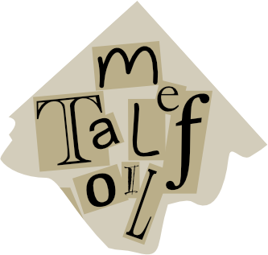
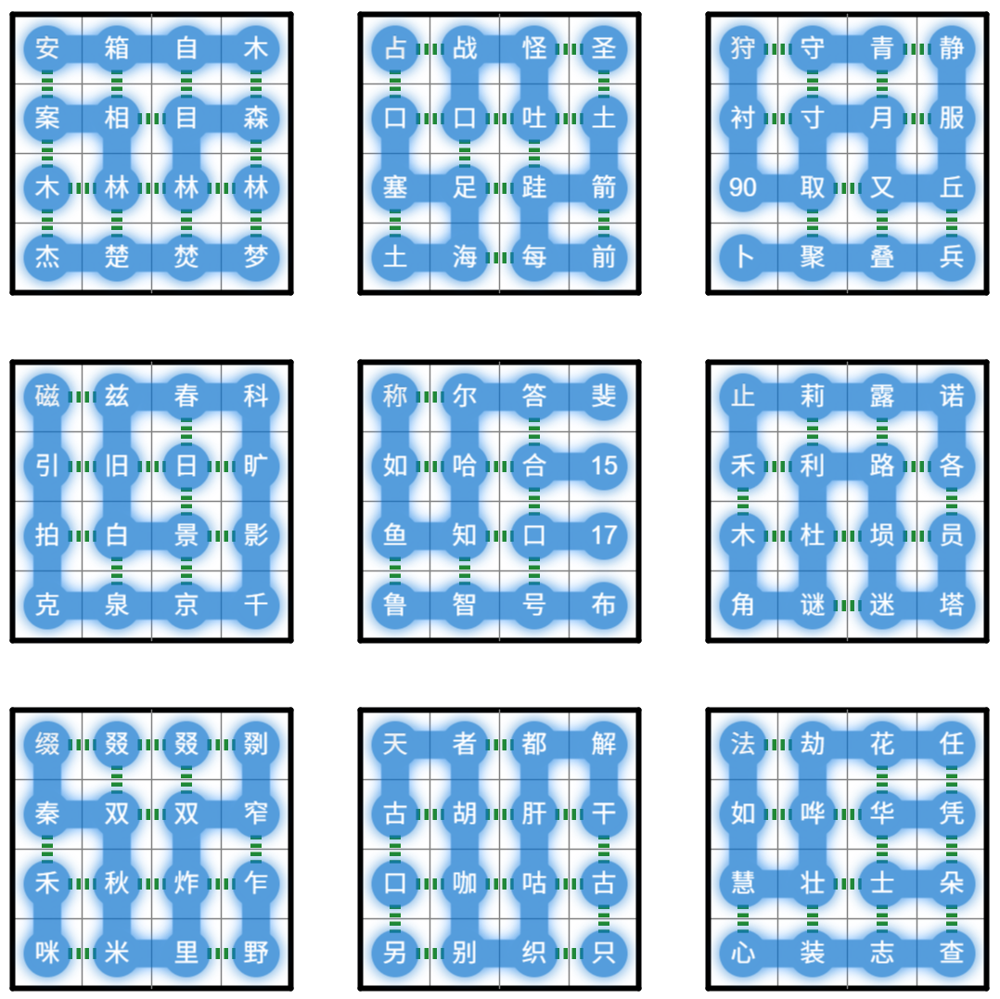
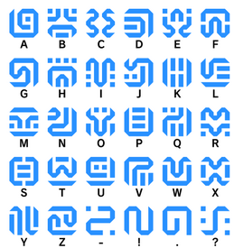

# Link It All

## 题面

    📱提示
    本题无移动端适配，推荐在桌面浏览器中查看。

## 交互源码

- javascript: [../../../assets/static.cipherpuzzles.com/static/images/a5d52450990140508ed320f04db4d5a1.vue](../../../assets/static.cipherpuzzles.com/static/images/a5d52450990140508ed320f04db4d5a1.vue)

## 解题后内容

成功解开谜题后，量子星云影响的设备恢复正常，同时从中浮现出一张碎纸片。

## 答案

`METAL FOIL`

## 解析

首先题目标题提示了 Link，以及所有问题都围绕某游戏，不难想到这是一道关于塞尔达游戏的题目。根据问题的细节我们可以进一步确定这是关于《塞尔达传说 旷野之息》。通过搜索或联想，可以得到以下的答案：
<table id="linkanswers" cellspacing="0">
<tr><td>游戏公司是？</td><td>任天堂</td></tr>
<tr><td>游戏的副标题是？</td><td>旷野之息</td></tr>
<tr><td>该游戏两年后同一系列发布的重制版的副标题是？</td><td>织梦岛</td></tr>
<tr><td>该游戏系列里最早使用3D图像的游戏名字里有一种乐器，跟这种乐器相近的中国古代乐器是？</td><td>埙</td></tr>
<tr><td>该游戏系列预计今年冬天会发布的衍生砍杀游戏是？</td><td>塞尔达无双封印战记</td></tr>
<tr><td>故事发生的大陆是？</td><td>海拉鲁</td></tr>
<tr><td>该大陆地图设计是参考了现实中的哪个城市？</td><td>京都</td></tr>
<tr><td>你操控的人物是？</td><td>林克</td></tr>
<tr><td>游戏里对你有好感的公主是？</td><td>米法</td></tr>
<tr><td>她的领地里的机械大象的名字是？</td><td>瓦·露塔</td></tr>
<tr><td>游戏里可以提供金钱、装备、材料等东西的容器是？</td><td>宝箱</td></tr>
<tr><td>游戏最早找到的上衣是？</td><td>老旧的衬衫</td></tr>
<tr><td>最早拾获的武器大概是？</td><td>木枝</td></tr>
<tr><td>用黄色标记的特殊技能是？</td><td>静止器</td></tr>
<tr><td>用红色标记的特殊技能是？</td><td>磁力抓取器</td></tr>
<tr><td>用青绿色标记的特殊技能是？</td><td>照相机</td></tr>
<tr><td>在此技能下按X会切换到什么模式？</td><td>自拍</td></tr>
<tr><td>一端是红色圆形的、用弓发射出去的是？</td><td>炸弹箭</td></tr>
<tr><td>游戏里史莱姆一样的生物是？</td><td>丘丘</td></tr>
<tr><td>游戏里有一种像猪一样的敌人是？</td><td>波克布林</td></tr>
<tr><td>它们中的岗哨发现你的话会用什么对同伴发出警报？</td><td>号角</td></tr>
<tr><td>游戏里射中就会掉钱的生物是？</td><td>卢咪</td></tr>
<tr><td>游戏里会用激光攻击你的机器人是？</td><td>守护者</td></tr>
<tr><td>这种机器人被击杀后会掉落两种不同大小的什么材料？</td><td>古代核心</td></tr>
<tr><td>只在晚上营业的商店是？</td><td>怪物商店</td></tr>
<tr><td>游戏里主剧情带你去的第一个村庄是？</td><td>卡卡利科村</td></tr>
<tr><td>这个村庄里有一位崇尚攻击、能教你武艺的NPC，他种植的食物是？</td><td>速速胡萝卜</td></tr>
<tr><td>这个村庄会有一个重要剧情指引NPC，她给你的蓝色衣服是？</td><td>英杰服</td></tr>
<tr><td>游戏里有一套金属制成的衣服，其中包括了带红缨的头盔，该三件套是？</td><td>海利亚士兵套装</td></tr>
<tr><td>你在这个游戏里可以搭建自己的房子，你房子的所在村庄是？</td><td>哈特诺村</td></tr>
<tr><td>该游戏有一个火山区域，用来自这个区域的调味粉和米能够做出什么料理？</td><td>咖喱饭</td></tr>
<tr><td>该游戏东南部有一个由上游若干瀑布流入形成的大湖，并且有同名大桥，是什么湖？</td><td>花柔莉亚湖</td></tr>
<tr><td>该游戏东边的雪山山顶上的水体是？</td><td>智慧之泉</td></tr>
<tr><td>该游戏东边螺旋状的沙滩是？</td><td>马秋兹半岛</td></tr>
<tr><td>游戏里有一片鬼打墙一般的区域，它是？</td><td>迷失的森林</td></tr>
<tr><td>游戏沙漠的入口处有一个驿站，驿站的主人是？</td><td>皮阿斐</td></tr>
<tr><td>为了玩游戏拼命熬夜，用来形容这一行为的内脏是？</td><td>肝</td></tr>
<tr><td>为了玩游戏无暇出题导致CCBC跳票，用来形容这一行为的鸟类象声词是？</td><td>咕</td></tr>
<tr><td>黏附在词根前的词素，例如本作里在材料名称前表示该材料能提升速度的“速速”</td><td>前缀</td></tr>
<tr><td>喀纳斯风景如同游戏里一般优美，其中最大的村庄是？</td><td>禾木</td></tr>
<tr><td>阳明心学的中心思想之一，例如“学了游戏技巧就要多多练习应用，才能做到____。”</td><td>知行合一</td></tr>
<tr><td>光是嘴说而没有真实的证据，例如“你说我打游戏作弊有什么证据？____的话可不能乱说。”</td><td>空口无凭</td></tr>
<tr><td>在两大势力之间反复横跳，比喻人反复无常，例如“你早上觉得这家游戏工作室天下无敌，晚上觉得那家史上第一，真是____的小人。”</td><td>朝秦暮楚</td></tr>
<tr><td>许多人同时夸奖某事，例如“游戏出来后各大媒体都____。”</td><td>交口称赞</td></tr>
<tr><td>用浮夸的语言来获取大家的关注或者欢心，例如“给这个游戏打低分的媒体不过是在____。”</td><td>哗众取宠</td></tr>
<tr><td>内心焦虑像火烧一样，例如“这个游戏系列怎么还不出新作，真让我等得____。”</td><td>心急如焚</td></tr>
<tr><td>各种颜色，比喻事情的来龙去脉，例如“这些怪物真是蛮不讲理，我仅仅是路过，它们就不分____地上来围攻我。”</td><td>青红皂白</td></tr>
<tr><td>形容房地产极其昂贵，等价于贵重金属，例如“盖个房子都要3000卢比，真是____。”</td><td>寸土寸金</td></tr>
<tr><td>大规模地盖房子，例如“在主角的带领下大家____，终于把一座荒岛改造成了村庄。”</td><td>大兴土木</td></tr>
<tr><td>形容一个人孤零零的成语，出自《祭十二郎文》，例如“主角醒来后发现以前的同伴都不在了，只剩自己____。”</td><td>形单影只</td></tr>
<tr><td>到一家家房子里抢夺财物，例如”主角每到一处都要四处翻找宝物，不愧是____的大流氓。”</td><td>打家劫舍</td></tr>
<tr><td>偏偏在小道上与仇人相遇，无法躲避，例如“路上走着走着就能碰到忍者刺客，真是____。”</td><td>冤家路窄</td></tr>
<tr><td>形容事物很有特色，使得他人仔细观看，例如“夜间为了避免____，主角换上了忍者风格的潜行服。”</td><td>引人注目</td></tr>
<tr><td>本义形容春天的阳光刚开始普照大地，现指隐私的泄露，“主角换了女装后____，十分妩媚。”</td><td>春光乍泄</td></tr>
<tr><td>比喻两个天体飞快地交替，用来形容时光流逝，例如“游戏里每24分钟就过完一天一夜，真是____。”</td><td>日月如梭</td></tr>
<tr><td>汤姆·克鲁斯的电影名，形容远大理想超越天空，例如“找到这片大陆上每一个隐藏种子是所有____的玩家都应该有的追求。”</td><td>壮志凌云</td></tr>
<tr><td>指原来的看法不能成立，需要新的评价，例如“完成主线剧情是游戏的首要目的，但是如果是某游戏的话，那就____了。”</td><td>另当别论</td></tr>
<tr><td>形容说话太多，非常干渴，例如“我都安利了这么多说得____了，你们怎么还不去玩游戏？”</td><td>口干舌燥</td></tr>
<tr><td>中文网友喜欢说的一个以十个相同部件组成的词，例如“我____被怪物杀死了。”</td><td>又双叒叕</td></tr>
<tr><td>走错一步就会造成永久的遗憾，例如“不小心用了收藏版武器导致它失去了新武器的闪光，真是_______啊！”</td><td>一失足成千古恨</td></tr>
<tr><td>不积累一点点的行程就没有办法到达很远的地方，例如“_________，只有从最小的怪打起积累经验，才能最终打倒BOSS。”</td><td>不积跬步无以至千里</td></tr>
<tr><td>你正在进行的活动是？</td><td>解谜</td></tr>
<tr><td>你填完这些最终想得到的是什么？</td><td>答案</td></tr>
<tr><td>为此需要的提取方式是？</td><td>？？？（见下）</td></tr>
</table>

填入答案后，部分字也会被自动填入下面蓝色线段。根据尝试我们发现下面的线段有如下操作：拖拽可以移动位置，点击一个圆可以在该处90°弯折这个线段，以及当相邻的两个字共享某个汉字部件的时候，它们其间会有绿色虚线代表的“链接”出现。注意这里方向很重要，例如“法”如果在“劫”左边，它们可以相连（可以想象为“法”右边的“去”连到了“劫”左边的“去”），但是如果“法”在“劫”的上面、右面、或者下面，则链接不成立。

考虑到标题是 Link It All，我们需要尽可能地将有共同部件的汉字相连。以及，蓝色线段一共有144个节点，正好等于下面9个4x4格子的数量。所以我们还需要将这些线段折叠组合成九个4x4的方块，放入下面的格子。每个4x4格子给出了左上角的字以便确认放入的顺序。

全部折叠组合好可以得到下图（可以看出我们是应连尽连）：

这里最后一问“提取方式”的（17，90，15）虽然不能直接填上，但是根据其周围的字和相连的规则，可以推出 17 = 希，15 = 文，90 则是一个下方有“卜”的字（可能选项为“不/卡/示”），根据这是《旷野之息》主题的题目，可以想到 90 应该是“卡”，（17，90，15）连起来是“希卡文”三个字，也就是《旷野之息》里希卡族使用的文字：

根据这个翻译得到最后的答案 `METAL FOIL`。

## 提示

### 1. 这是什么游戏？

《塞尔达传说 旷野之息》

### 2. 我做完所有小题了，然后怎么办

填入答案后，部分字也会被自动填入下面蓝色线段。根据尝试我们发现下面的线段有如下操作：拖拽可以移动位置，点击一个圆可以在该处90°弯折这个线段，以及当相邻的两个字共享某个汉字部件的时候，它们其间会有绿色虚线代表的“链接”出现。注意这里方向很重要，例如“法”如果在“劫”左边，它们可以相连（可以想象为“法”右边的“去”连到了“劫”左边的“去”），但是如果“法”在“劫”的上面、右面、或者下面，则链接不成立。考虑到标题是 Link It All，你应当尽可能地将有共同部件的汉字相连。

### 3. 为此需要的提取方式到底是什么？

希卡文

## 本地附件

- [547a5e10ebf24404b7e97e5b2d055d3c.svg](../../../assets/static.cipherpuzzles.com/static/images/547a5e10ebf24404b7e97e5b2d055d3c.svg)
- [68dc7b1848b445eb82e0d089b7ed34e3.webp](../../../assets/static.cipherpuzzles.com/static/images/68dc7b1848b445eb82e0d089b7ed34e3.webp)
- [a5d52450990140508ed320f04db4d5a1.vue](../../../assets/static.cipherpuzzles.com/static/images/a5d52450990140508ed320f04db4d5a1.vue)
- [b708df77a045466d97822c8bf59dde49.webp](../../../assets/static.cipherpuzzles.com/static/images/b708df77a045466d97822c8bf59dde49.webp)
- [c18816f8f7d040e7b0582aca5bb374aa.webp](../../../assets/static.cipherpuzzles.com/static/images/c18816f8f7d040e7b0582aca5bb374aa.webp)

来源：[https://ccbc16.cipherpuzzles.com/data/puzzles/17.json](https://ccbc16.cipherpuzzles.com/data/puzzles/17.json)
