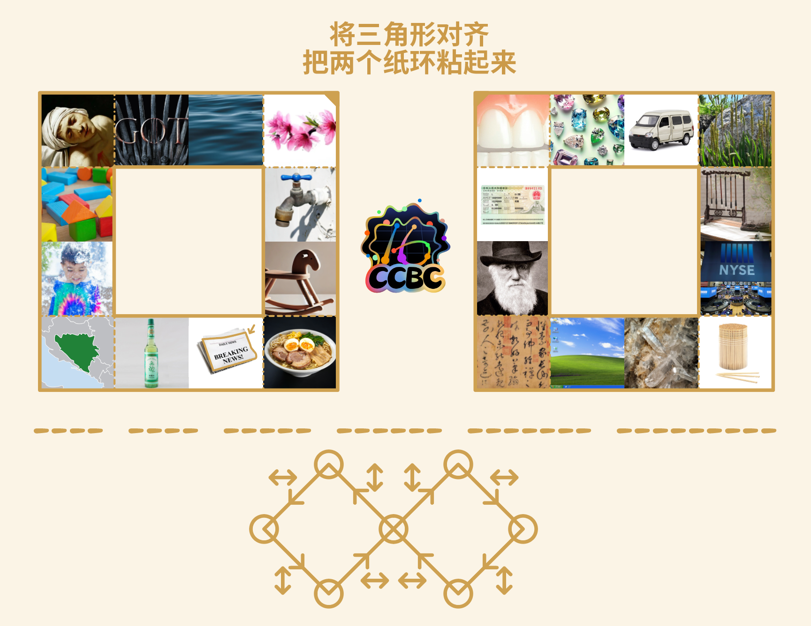
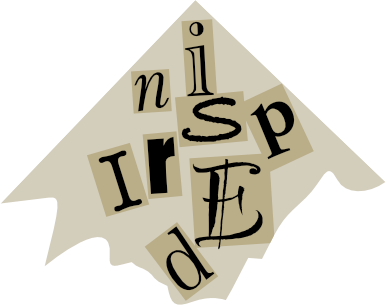
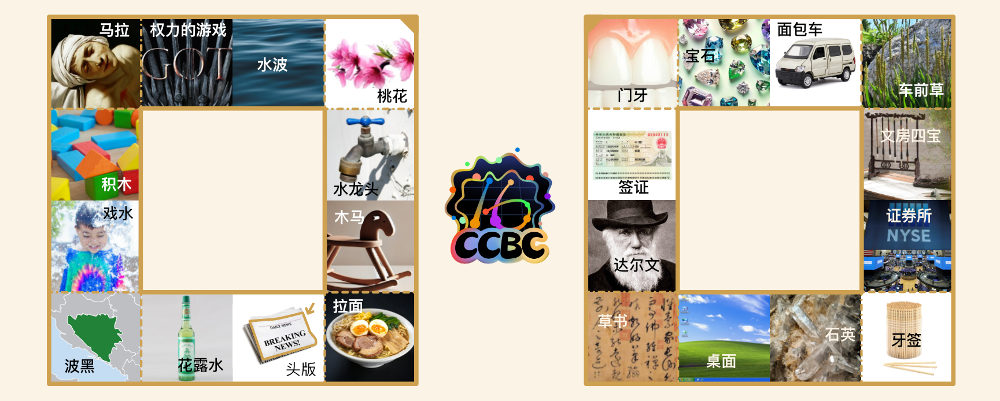
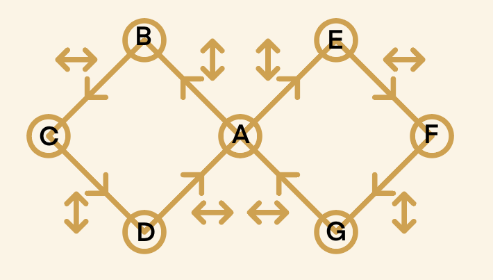

# 周而复始

## 题面

## 解题后内容

成功解开谜题后，量子星云影响的设备恢复正常，同时从中浮现出一张碎纸片。

## 答案

`INSPIRED`

## 解析

首先按照指示将两个方形纸环背对背地粘起来，再按照四角的山折谷折的标记折纸，能形成一个简单的正方形无限翻（记为“初始状态”）。

<video width="640" height="480" controls>
  <source src="../../../assets/static.cipherpuzzles.com/static/images/0c47f4197369453f8071e2964741601d.mp4" type="video/mp4">
</video>

（感谢玩家 BugWritter 提供视频）

通过尝试我们可以发现来回翻折一共能折出 6 种四格方形的组合，并且每种组合里的四张图所代表的词语能组成一个接龙（有些图片可能一开始难以确定是什么，例如“水波”也有可能是“水纹”“水面”等等，但是可以通过同组含有“波黑”而确定是“水波”）。每组也同样可以补充一个词使其首尾相连。

1. 权力的游戏、戏水、水龙头、头版 => 版权（COPYRIGHT）
2. 达尔文、文房四宝、宝石、石英 => 英伟达（NVIDIA）
3. 桃花、花露水、水波、波黑 => 黑桃（SPADE）
4. 门牙、牙签、签证、证券所 => 所罗门（SOLOMON）
5. 桌面、面包车、车前草、草书 => 书桌（DESK）
6. 积木、木马、马拉、拉面 => 面积（AREA）

每个被补充的的词都有一个比较明确的英文翻译。为了帮助玩家确认这些词，也同时确认思路，题目中给出的六组横线的个数对应这六个单词的长度。

现在我们需要理解题目最下面的 ∞ 形状的图：
- 虽然我们只有六组图，但是它们之间有七种不同的正反组合，对应图上的七个圆圈。例如初始状态里，一面是第1组（权力的游戏、戏水、水龙头、头版），另一面是第2组（达尔文、文房四宝、宝石、石英），在此记为 (1, 2)。
- 这个“无限翻”在某一面可能可以竖着上下翻开，横着左右翻开，或者横竖皆可。图里的横或竖的双箭头代表从一个状态到另一个状态需要横着翻开还是竖着翻开。
- 初始状态时，正反两面都可以上下翻开，也都可以左右翻开，也就是说从这个状态能变到四个不同的其它状态，这代表初始状态位于图中最中间的那个圆圈。

按图中给每个状态标上字母，我们可以整理出如下的关系：

A. (1, 2)
 B. (2, 4)
 C. (3, 4)
 D. (1, 3)
 E. (1, 6)
 F. (5, 6)
 G. (2, 5)

注：由于这个图是左右对称的，你也可以将以上的关系左右对调，但是下面我们会发现不影响解法。

我们将之前找到的那六个单词替代进1-6：

A. (COPYRIGHT, NVIDIA) => I
 B. (NVIDIA, SOLOMON) => N
 C. (SPADE, SOLOMON) => S
 D. (COPYRIGHT, SPADE) => P
 E. (COPYRIGHT, AREA) => R
 F. (DESK, AREA) => E
 G. (NVIDIA, DESK) => D

我们可以发现每个状态里，正反两面解出的单词有且仅有一个共享字母。

最后我们沿着 ∞ 本身的箭头提取这些字母，经过 ABCDAEFGABCDAEFG... 可以提取出 INSPIREDINSPIRED.... 答案也就是一直重复的 `INSPIRED`。

## 提示

### 1. 请告诉我下面图中双箭头的意义

从一个状态到另一个状态有横着打开和竖着打开两种办法，双箭头表示这是其中的哪一种。

### 2. 请告诉我下面图中圆圈标出的节点代表什么？六个面为什么有七个圆圈？

每个圆代表折纸翻翻乐的状态之一。注意正反两面合起来记作一个状态，也就是说一面A另一面B，和一面B另一面C，算作两个不同的状态。

### 3. 该如何提取

每个节点有正反两个单词，提取这两个单词相交的字母。

### 4. 该如何得到中间六个单词？

折完翻翻乐后，每一面有四个图，每个图的中文形成一个接龙，可以补全一个词（注意不一定是两个字）使得这个接龙成为一个循环。

## 中间答案

| 提交 | 回复 | 附加信息 |
| --- | --- | --- |
| desk | 这是一个里程碑 |  |
| copyright | 这是一个里程碑 |  |
| area | 这是一个里程碑 |  |
| solomon | 这是一个里程碑 |  |
| spade | 这是一个里程碑 |  |
| nvidia | 这是一个里程碑 |  |

## 本地附件

- [0c47f4197369453f8071e2964741601d.mp4](../../../assets/static.cipherpuzzles.com/static/images/0c47f4197369453f8071e2964741601d.mp4)
- [6d01aec6b29e4db999b5083f89628a3c.webp](../../../assets/static.cipherpuzzles.com/static/images/6d01aec6b29e4db999b5083f89628a3c.webp)
- [77c92f0477ec4f0ba15cc2b369819bc5.webp](../../../assets/static.cipherpuzzles.com/static/images/77c92f0477ec4f0ba15cc2b369819bc5.webp)
- [a2103ebda1e0452ba5a0c19e9c073da5.webp](../../../assets/static.cipherpuzzles.com/static/images/a2103ebda1e0452ba5a0c19e9c073da5.webp)
- [b0de0a1ecde34231b6d13bf224262a87.webp](../../../assets/static.cipherpuzzles.com/static/images/b0de0a1ecde34231b6d13bf224262a87.webp)
- [f5e9c72f59e84045ba35bdc874a26811.svg](../../../assets/static.cipherpuzzles.com/static/images/f5e9c72f59e84045ba35bdc874a26811.svg)

来源：[https://ccbc16.cipherpuzzles.com/data/puzzles/19.json](https://ccbc16.cipherpuzzles.com/data/puzzles/19.json)
