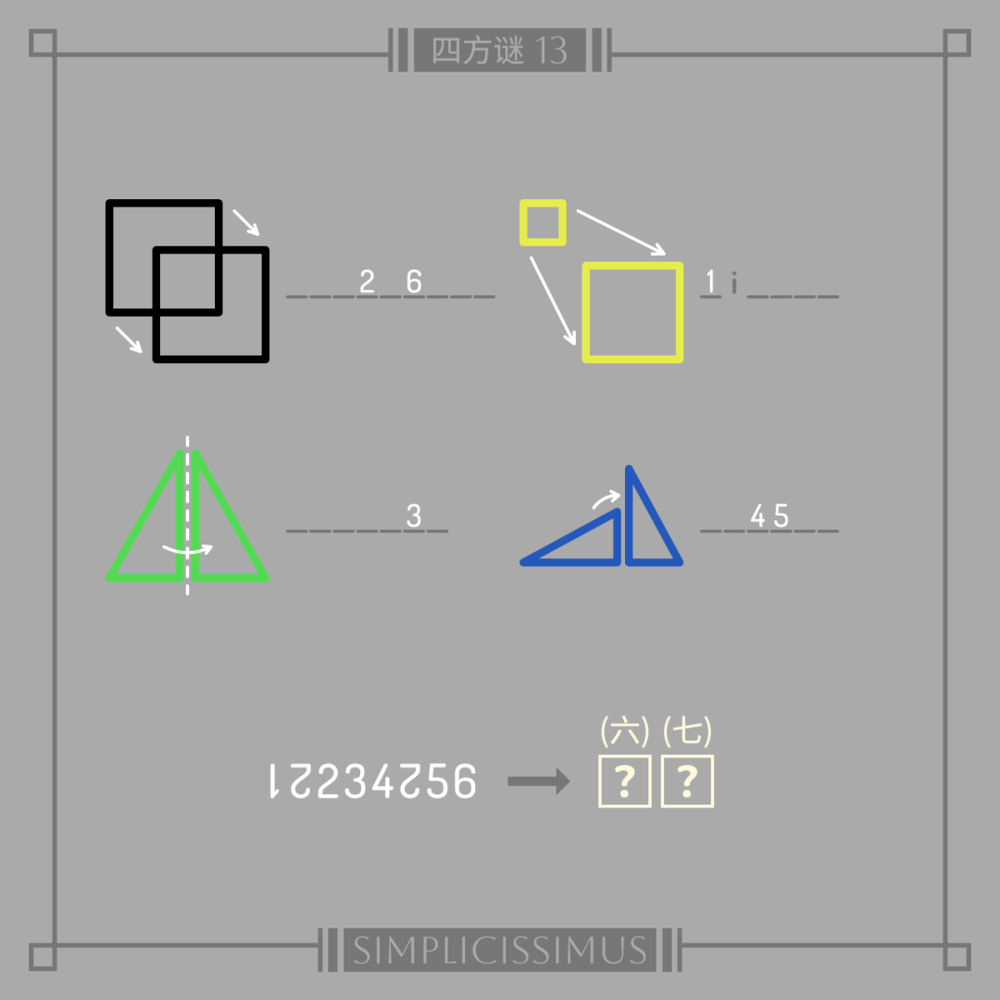
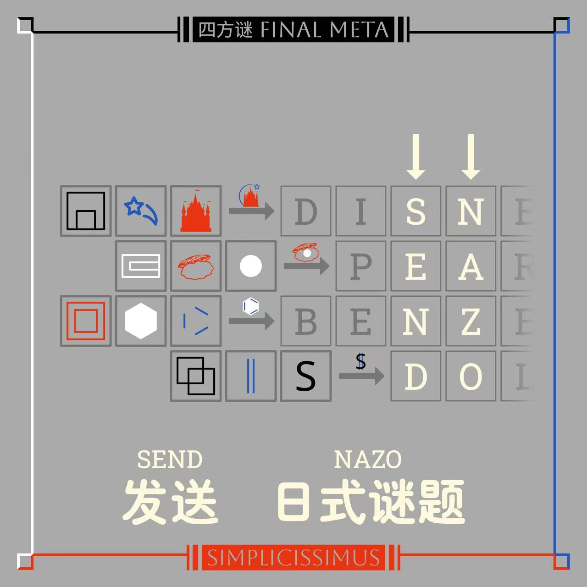

# 四方谜

## 题面

这不是去年的题吗？怎么又拿出来了。不对啊，那 FINAL META 不就变了吗……

## 交互源码

- javascript: [../../../assets/static.cipherpuzzles.com/static/images/752fe1029484441ab3ef13d7568d949a.vue](../../../assets/static.cipherpuzzles.com/static/images/752fe1029484441ab3ef13d7568d949a.vue)

## 答案

`我欲因之梦吴越`

## 解析

本题是对一年前发表在密码菌公众号上的日谜系列《四方谜》的复用，需要了解原《四方谜》FINAL META解析的请看<a href="https://mp.weixin.qq.com/s/rRX01j874WQavBmf2njGgw" target="_blank">这里</a>。

根据文本“FINAL META 不就变了吗”的提示，我们可以注意观察原四方谜的 <a href="https://mp.weixin.qq.com/s/kyhx-GGqJtEc7GAxjdXDow" target="_blank">FINAL META</a> 如果放在今年（2025年）会有什么变化。

通过观察<a href="https://mp.weixin.qq.com/s/rRX01j874WQavBmf2njGgw" target="_blank">原来的四方谜 FINAL META 解析</a>，我们可以发现随着年份变化，7月份星期几分别对应的日期也变了。用原解析里的例子来说明：
> 十二生肖之首的鼠，是北宫×日曜交叉处的“虚日鼠”。日曜日是星期天，本月星期天对应的日期为 7日、14日、21日、28日，而其中参与到北方 META 的则是 21 日的题目

然而到了2025年，7月份星期天对应的日期变成了 6日、13日、20日、27日，其中参与到北方 META 的是 13 日的题目：

FINAL META 解法没有变，仍然提取这题的黑色元素填入1格，也就是那两个重叠的正方形。

重复该步骤，我们将所有十二生肖对应的图片元素填入格子后，可以得到下图：

最左侧四个方框状的符号 ⿵、⿷、⿴、⿻ 都是表意文字描述字符，用来描述如何组合后面两个部件。

第一行：⿵ 流星 城堡，流星飞过城堡上空，是迪士尼的标识图案，填 `DISNEY`
 第二行：⿷ 贝壳 白圆，贝壳夹住珍珠，填 `PEARL`
 第三行：⿴ 六边形 三条短线，苯的结构式，填 `BENZENE`
 第四行：⿻ S 两条竖线，重叠后组成 $ （注：取决于字体，$ 可以有一道或者两道竖线），填 `DOLLAR`

填完之后读箭头所指的两竖列，得到需要提交的内容 `SEND NAZO`。

之后进入第二阶段的互动题，提交了符合要求的日谜并通过审核后就可以得到最终答案 `我欲因之梦吴越`。

## 提示

### 1. 我毫无头绪

查看密码菌去年的《四方谜》系列 Final Meta 的解法，用今年的七月日历重新解一遍。

### 2. 我得到了一些方块状的东西，但我不懂是什么意思

他们都是表意文字描述字符，用来描述如何组合后面两个部件。

### 3. 我已经进行到了最后一步，但是看不出第一行拼出的东西是什么

⿵ 流星 城堡，流星飞过城堡上空，是【迪士尼】的标识图案

### 4. 我已经进行到了最后一步，但是看不出第二行拼出的东西是什么

⿷ 贝壳 白圆，贝壳夹住【珍珠】

### 5. 我已经进行到了最后一步，但是看不出第三行拼出的东西是什么

⿴ 六边形 三条短线，【苯】的结构式

### 6. 我已经进行到了最后一步，但是看不出第四行拼出的东西是什么

⿻ S 两条竖线，重叠后组成 $ （注：取决于字体，$ 可以有一道或者两道竖线），也就是【美元】符号

## 中间答案

| 提交 | 回复 | 附加信息 |
| --- | --- | --- |
| SEND NAZO | 所以请给我们发送一张谜题吧！ | set 1stStage 1 |
| 重置 | 已重置 | clear |
| NAZO | 请提交"SEND NAZO" |  |
| DISNEY | 这是第一行的正确答案 |  |
| PEARL | 这是第二行的正确答案 |  |
| BENZENE | 这是第三行的正确答案 |  |
| DOLLAR | 这是第四行的正确答案 |  |

## 本地附件

- [752fe1029484441ab3ef13d7568d949a.vue](../../../assets/static.cipherpuzzles.com/static/images/752fe1029484441ab3ef13d7568d949a.vue)
- [7abc9986f791495d8c6e914e3a19b627.webp](../../../assets/static.cipherpuzzles.com/static/images/7abc9986f791495d8c6e914e3a19b627.webp)
- [834faabe749b43c090daad6df78dbdc9.webp](../../../assets/static.cipherpuzzles.com/static/images/834faabe749b43c090daad6df78dbdc9.webp)
- [978805b155cd42eda64faf4f8c9fdc79.webp](../../../assets/static.cipherpuzzles.com/static/images/978805b155cd42eda64faf4f8c9fdc79.webp)
- [9ffc0b873fc54633a813717e0b1dc6e2.webp](../../../assets/static.cipherpuzzles.com/static/images/9ffc0b873fc54633a813717e0b1dc6e2.webp)
- [d1c1db9aea3246f588ff6a6daf02bcce.png](../../../assets/static.cipherpuzzles.com/static/images/d1c1db9aea3246f588ff6a6daf02bcce.png)

来源：[https://ccbc16.cipherpuzzles.com/data/puzzles/2.json](https://ccbc16.cipherpuzzles.com/data/puzzles/2.json)
