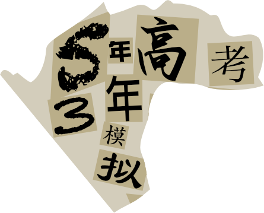
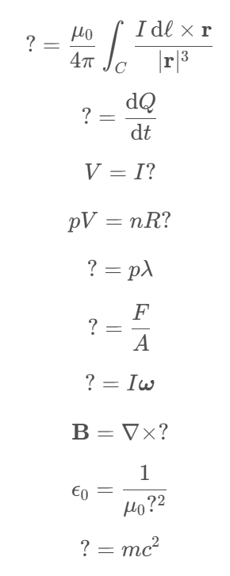
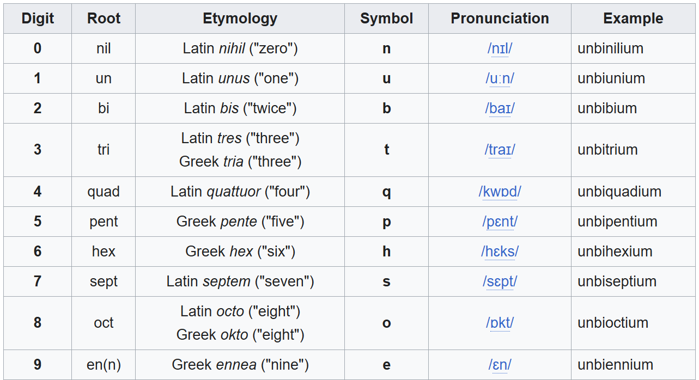

# 复习资料

## 题面

_官方存档未提供可提取的文字题面；请查看下方附件或交互源码。_

## 交互源码

- javascript: [../../../assets/static.cipherpuzzles.com/static/images/ba59dfeea907439597a8d5cc83060c87.vue](../../../assets/static.cipherpuzzles.com/static/images/ba59dfeea907439597a8d5cc83060c87.vue)

### backend_c16-review

```text
// 复习资料脚本

// @ts-check

//在后端脚本中，可以使用全局变量 ctx
//全局变量 ctx 的内容如下：
// request: string; // 从前端调用时，前端传来的请求对象，内容为JSON字符串。请调用JSON.parse转换后使用。
// uid: number; // 当前调用此后端脚本的用户 uid
// gid: number; // 当前调用此后端脚本的组队 gid
// getStatus(key: string) : string // 读取：当前用户的状态存储（注意状态信息是加密存储在每个浏览器上的，不同用户的不同进程都有不同的状态）
// setStatus(key: string, value: string) // 写入：当前用户的状态存储
// getProgress(pid: number, key: string) : string // 读取：当前组队的题目进度（组队题目进度是存在后端数据库中的，组队内部共享，每个题目有不同的状态）
// setProgress(pid: number, key: string, value: string) // 写入：当前组队的题目进度
// getPuzzleData(pid: number) : string // 获取题目的data片段（题目详情中<data></data>中的内容）
// response(body: string) // 返回给前端的数据对象。内容为JSON字符串。必须调用JSON.stringify后传入。**必须**在此脚本中至少调用这个函数一次，即使你没什么需要返回的，也请调用一次 ctx.response("{}");

const PID = 20

const exercises = [{'problem': '23457572673496516815881325215193369263109653809459061',
  'answer': 'HISTORICAL',
  'subject': 0,
  'correctMsg': 'Splendid!'},
 {'problem': '诚婴砯䞆锑鋿毰鞖流蔏',
  'answer': 'HYPOTHESIS',
  'subject': 1,
  'correctMsg': 'Unstoppable!'},
 {'problem': 'gCa Auc auG uuU cCu gcG Acu cuU cGg aGc',
  'answer': 'LITERATURE',
  'subject': 2,
  'correctMsg': 'Bravo!'},
 {'problem': 'ACKUP<br/>NCHOR<br/>IGNATURE<br/>NIFE<br/>NABLED<br/>EMPORARY<br/>EHIND<br/>RTISTIC<br/>ANGUAGE<br/>APTOPS',
  'answer': 'BASKETBALL',
  'subject': 3,
  'correctMsg': 'Marvelous!'},
 {'problem': '?=\\frac{\\mu_0}{4\\pi}\\int_{C}\\frac{I \\,\\mathrm{d}\\ell\\times \\mathbf{r}}{|\\mathbf{r}|^3}<br>?=\\frac{\\mathrm{d}Q}{\\mathrm{d}t}<br>V=I?<br>pV=nR?<br>?=p\\lambda<br>?=\\frac{F}{A}<br>?=I\\boldsymbol{\\omega}<br>\\mathbf{B} = \\nabla \\times ?<br>\\epsilon_0=\\frac 1{\\mu_0 ?^2}<br>?=mc^2',
  'answer': 'BIRTHPLACE',
  'subject': 4,
  'correctMsg': 'Incredible!'},
 {'problem': '12451142201316234659412544901330089072057',
  'answer': 'CONSISTING',
  'subject': 0,
  'correctMsg': 'Terrific!'},
 {'problem': '笽廠䞮劉峁㯐椳㺫鶇䬷',
  'answer': 'NATIONWIDE',
  'subject': 1,
  'correctMsg': 'Awesome!'},
 {'problem': 'ccA ucC cAc cgG Auu caG Gcc guC guC uAu',
  'answer': 'ORIGINALLY',
  'subject': 2,
  'correctMsg': 'Neat!'},
 {'problem': 'ASHION<br/>BTAINING<br/>PDATING<br/>OTHING<br/>EADLY<br/>UTHORITIES<br/>RADITION<br/>NDIE<br/>PTIMIZE<br/>EWLY',
  'answer': 'FOUNDATION',
  'subject': 3,
  'correctMsg': 'Splendid!'},
 {'problem': '?=\\frac{c}{v}<br>\\alpha=\\frac{?^2}{4\\pi\\epsilon_0\\hbar c}<br>?=I/V<br>\\mathbf{B} = \\nabla \\times ?<br>pV=nR?<br>V=?R<br>?=IR<br>\\alpha=\\frac{?^2}{4\\pi\\epsilon_0\\hbar c}<br>?=A\\sigma T^4<br>?=Z^{-1}',
  'answer': 'NEGATIVELY',
  'subject': 4,
  'correctMsg': 'Wow!'},
 {'problem': '5318711710212922714337640588888327016399631818909',
  'answer': 'NOMINATION',
  'subject': 0,
  'correctMsg': 'Excellent!'},
 {'problem': '颟盫㩲纐賌泎妈㾪晎瑫',
  'answer': 'MANAGEMENT',
  'subject': 1,
  'correctMsg': 'Right!'},
 {'problem': 'Gcg Uuc ugG gcU ucC auA aaC Uau Uug uGc',
  'answer': 'APPARENTLY',
  'subject': 2,
  'correctMsg': 'Terrific!'},
 {'problem': 'UBMIT<br/>OORDINATED<br/>NFRARED<br/>MERALD<br/>IGHTMARE<br/>ALENTED<br/>NVALID<br/>ORMULA<br/>MMIGRATION<br/>LASSROOM',
  'answer': 'SCIENTIFIC',
  'subject': 3,
  'correctMsg': 'Outstanding!'},
 {'problem': '?=m\\mathbf{v}<br>pV=n?T<br>\\alpha=\\frac{?^2}{4\\pi\\epsilon_0\\hbar c}<br>?=-k_B \\sum \\rho\\ln\\rho<br>?=\\frac{\\mathrm{d}Q}{\\mathrm{d}t}<br>?=\\epsilon_0\\mathbf{E}+\\mathbf{P}<br>?=mc^2<br>?=\\frac{\\sin\\theta_1}{\\sin\\theta_2}<br>E=m?^2<br>?=G+\\sqrt{-1}B',
  'answer': 'PRESIDENCY',
  'subject': 4,
  'correctMsg': 'Outstanding!'},
 {'problem': '731617086413560550363255465004877349901881',
  'answer': 'SUCCESSFUL',
  'subject': 0,
  'correctMsg': 'Neat!'},
 {'problem': '怱酵謢撈蟁浾鼟㮮洠鶭',
  'answer': 'COLLECTION',
  'subject': 1,
  'correctMsg': 'Excellent!'},
 {'problem': 'gcC Ccc gaC uUa Cga acA Cgc caG Ugc cUg',
  'answer': 'APPEARANCE',
  'subject': 2,
  'correctMsg': 'How nice!'},
 {'problem': 'ARAOKE<br/>SSUED<br/>EGACY<br/>RDERED<br/>ARIJUANA<br/>NHANCING<br/>OTALLY<br/>NTIRELY<br/>EVIEW<br/>ENTENCE',
  'answer': 'KILOMETERS',
  'subject': 3,
  'correctMsg': 'Unstoppable!'},
 {'problem': 'E=m?^2<br>?=mc^2<br>?=\\frac{\\sin\\theta_1}{\\sin\\theta_2}<br>pV=nR?<br>?=mc^2<br>?=\\frac{c}{v}<br>?=\\frac{\\sin\\theta_1}{\\sin\\theta_2}<br>?=\\frac{\\mathrm{d}Q}{\\mathrm{d}t}<br>\\mathbf{F}=m?<br>?=\\frac{\\Phi}{I}',
  'answer': 'CENTENNIAL',
  'subject': 4,
  'correctMsg': 'Neat!'},
 {'problem': '12673246978291920498716659393405017817139',
  'answer': 'STATISTICS',
  'subject': 0,
  'correctMsg': 'Delightful!'},
 {'problem': '聼澂劙侕绦閣綘㴨㹗箚',
  'answer': 'THIRTEENTH',
  'subject': 1,
  'correctMsg': 'Remarkable!'},
 {'problem': 'Gua Auc Ugc Uau ccG ucC cAu ccG uuG Agu',
  'answer': 'VICTORIOUS',
  'subject': 2,
  'correctMsg': 'Excellent!'},
 {'problem': 'HARITY<br/>PTIONAL<br/>ESIDENCE<br/>ENEWABLE<br/>TILITY<br/>RECEDING<br/>URBO<br/>NDEED<br/>PERATOR<br/>ECESSARILY',
  'answer': 'CORRUPTION',
  'subject': 3,
  'correctMsg': 'Delightful!'},
 {'problem': '?=\\rho V<br>\\mathbf{F}=m?<br>?=\\frac{c}{v}<br>\\Delta ?=Q-W<br>G=H-T?<br>\\epsilon_0=\\frac 1{\\mu_0 ?^2}<br>pV=n?T<br>\\mathbf{L}=?\\boldsymbol{\\omega}<br>?=\\frac{\\mathrm{d} E}{\\mathrm{d} t}<br>pV=nR?',
  'answer': 'MANUSCRIPT',
  'subject': 4,
  'correctMsg': 'Fabulous!'},
 {'problem': '77436633357492954816353030677835955138029',
  'answer': 'FRIENDSHIP',
  'subject': 0,
  'correctMsg': 'Outstanding!'},
 {'problem': '堾煛翋翋蓶伡烃䖎谟兖',
  'answer': 'COLLECTION',
  'subject': 1,
  'correctMsg': 'Unstoppable!'},
 {'problem': 'caG ccC Aug Aua caG gcA Acg Auu ccA aaU',
  'answer': 'NOMINATION',
  'subject': 2,
  'correctMsg': 'Right!'},
 {'problem': 'ONFLICT<br/>RGANIZATION<br/>NLIKELY<br/>EMOVAL<br/>REASURE<br/>YDROCODONE<br/>UTCOME<br/>LTIMATELY<br/>IGMA<br/>LECTORAL',
  'answer': 'COURTHOUSE',
  'subject': 3,
  'correctMsg': 'Terrific!'},
 {'problem': '?=R+\\sqrt{-1}X<br>V=?R<br>?=\\rho V<br>\\nabla\\times\\mathbf{E} = -\\frac{\\partial ?}{\\partial t}<br>?=\\frac{\\mathrm{d} \\mathbf{v}}{\\mathrm{d} t}<br>\\nabla\\times\\mathbf{E} = -\\frac{\\partial ?}{\\partial t}<br>?=\\int P \\,\\mathrm{d} V<br>?=mc^2<br>\\mathbf{F}=m?<br>?=\\frac{c}{v}',
  'answer': 'ZIMBABWEAN',
  'subject': 4,
  'correctMsg': 'How nice!'},
 {'problem': '5323767884745323784278306837952799835822275380581',
  'answer': 'GYMNASTICS',
  'subject': 0,
  'correctMsg': 'Outstanding!'},
 {'problem': '湗鍏窉㝍鮞疡㓥牃簙饍',
  'answer': 'GENERATION',
  'subject': 1,
  'correctMsg': 'Unstoppable!'},
 {'problem': 'Cgg cuA aAu Acu uaC Cgc Uug cAu gUa aaU',
  'answer': 'AUSTRALIAN',
  'subject': 2,
  'correctMsg': 'Splendid!'},
 {'problem': 'PEECH<br/>NJOYING<br/>REVIEW<br/>FFORDABLE<br/>EBOUND<br/>LLOWED<br/>HEATRE<br/>MMIGRATION<br/>RGANIZER<br/>EWBIE',
  'answer': 'SEPARATION',
  'subject': 3,
  'correctMsg': 'Awesome!'},
 {'problem': '\\mathbf{H}=\\frac{?}{\\mu_0}-\\mathbf{M}<br>\\mathbf{B} = \\nabla \\times ?<br>?=\\frac{c}{v}<br>p=\\hbar?<br>pV=n?T<br>H=?+pV<br>?=\\frac{F}{A}<br>pV=nR?<br>\\epsilon_0=\\frac 1{\\mu_0 ?^2}<br>?=Z^{-1}',
  'answer': 'BANKRUPTCY',
  'subject': 4,
  'correctMsg': 'Neat!'},
 {'problem': '720637172733794980484736724200208333393769',
  'answer': 'KINGFISHER',
  'subject': 0,
  'correctMsg': 'Delightful!'},
 {'problem': '輀䙸舥霕爂㡴麑䫿㷋潅',
  'answer': 'REPUBLICAN',
  'subject': 1,
  'correctMsg': 'Neat!'},
 {'problem': 'caC Ugu aGa aUg aGu aaU Uuu gGg Cgu aAa',
  'answer': 'SCREENPLAY',
  'subject': 2,
  'correctMsg': 'Incredible!'},
 {'problem': 'OURSELF<br/>NKNOWN<br/>HOST<br/>PERATORS<br/>PECIFICATION<br/>EGISLATIVE<br/>NTIBODY<br/>OICE<br/>MMEDIATE<br/>BILITY',
  'answer': 'YUGOSLAVIA',
  'subject': 3,
  'correctMsg': 'Neat!'},
 {'problem': '?=R+\\sqrt{-1}X<br>?=mc^2<br>\\mathbf{B} = \\nabla \\times ?<br>?=I\\boldsymbol{\\omega}<br>\\mathbf{F}=m?<br>?=\\frac{\\sin\\theta_1}{\\sin\\theta_2}<br>?=\\epsilon_0\\mathbf{E}+\\mathbf{P}<br>\\alpha=\\frac{?^2}{4\\pi\\epsilon_0\\hbar c}<br>V=I?<br>?=-k_B \\sum \\rho\\ln\\rho',
  'answer': 'ZEALANDERS',
  'subject': 4,
  'correctMsg': 'Excellent!'},
 {'problem': '396154239344963877525900817233865673009767912447',
  'answer': 'NEGLIGIBLE',
  'subject': 0,
  'correctMsg': 'Terrific!'},
 {'problem': '喵鉷滔㮢荋膥樮鴟啷㯖',
  'answer': 'MOTORCYCLE',
  'subject': 1,
  'correctMsg': 'Yes!'},
 {'problem': 'Acg auA Ugu aCu aaU ccG Aaa ccU cgC uGu',
  'answer': 'TECHNOLOGY',
  'subject': 2,
  'correctMsg': 'Splendid!'},
 {'problem': 'EMOVAL<br/>NEMY<br/>URROUNDING<br/>ZONE<br/>UXURY<br/>NLESS<br/>RANSFORMATION<br/>NTERNATIONALLY<br/>PERATOR<br/>AVIGATE',
  'answer': 'RESOLUTION',
  'subject': 3,
  'correctMsg': 'Excellent!'},
 {'problem': 'V=I?<br>\\alpha=\\frac{?^2}{4\\pi\\epsilon_0\\hbar c}<br>?=-k_B \\sum \\rho\\ln\\rho<br>\\alpha=\\frac{?^2}{4\\pi\\epsilon_0\\hbar c}<br>\\mathbf{F}=m?<br>pV=n?T<br>?=\\frac{1}{n}\\frac{\\mathrm{d} Q}{\\mathrm{d} T}<br>?=U+pV<br>\\alpha=\\frac{?^2}{4\\pi\\epsilon_0\\hbar c}<br>V=I?',
  'answer': 'RESEARCHER',
  'subject': 4,
  'correctMsg': 'Very good!'},
 {'problem': '20585334935972672291849559875030876176169779',
  'answer': 'PRODUCTION',
  'subject': 0,
  'correctMsg': 'Excellent!'},
 {'problem': '坛芕厁胅㬌囕牤赔賱朜',
  'answer': 'ASSIGNMENT',
  'subject': 1,
  'correctMsg': 'Neat!'},
 {'problem': 'Ugu ccG aaC D Auc Aca Auc ccA aaU gAu',
  'answer': 'CONDITIONS',
  'subject': 2,
  'correctMsg': 'Correct!'},
 {'problem': 'NFORMATIVE<br/>UMERIC<br/>ESCRIBES<br/>NTERACTIONS<br/>ISUAL<br/>NVESTING<br/>AISY<br/>NEMPLOYMENT<br/>SSOCIATIONS<br/>ATELY',
  'answer': 'INDIVIDUAL',
  'subject': 3,
  'correctMsg': 'Correct!'},
 {'problem': '?=-k_B \\sum \\rho\\ln\\rho<br>\\alpha=\\frac{?^2}{4\\pi\\epsilon_0\\hbar c}<br>pV=nR?<br>pV=nR?<br>?=I\\boldsymbol{\\omega}<br>\\alpha=\\frac{?^2}{4\\pi\\epsilon_0\\hbar c}<br>?=\\rho V<br>\\alpha=\\frac{?^2}{4\\pi\\epsilon_0\\hbar c}<br>?=\\frac{\\sin\\theta_1}{\\sin\\theta_2}<br>pV=nR?',
  'answer': 'SETTLEMENT',
  'subject': 4,
  'correctMsg': 'Correct!'},
 {'problem': '7681079409966272419153800178336977293625817',
  'answer': 'SUBSEQUENT',
  'subject': 0,
  'correctMsg': 'Correct!'},
 {'problem': '廰䏜橫䋩䊈賟妦滔仁鴯',
  'answer': 'THEREAFTER',
  'subject': 1,
  'correctMsg': 'Correct!'},
 {'problem': 'cAc Aug ugG ccA uaU auG gUu aaU Ugc uuC',
  'answer': 'IMPORTANCE',
  'subject': 2,
  'correctMsg': 'Correct!'},
 {'problem': 'EROX<br/>MPEROR<br/>ARRATIVE<br/>BTAIN<br/>HYSICALLY<br/>OPEFULLY<br/>CCUPATIONAL<br/>ECOMES<br/>NSURANCE<br/>DVISE',
  'answer': 'XENOPHOBIA',
  'subject': 3,
  'correctMsg': 'Correct!'},
 {'problem': 'E=m?^2<br>\\mathbf{F}=m?<br>?=\\frac{\\mathrm{d} E}{\\mathrm{d} t}<br>V=?R<br>pV=nR?<br>\\mathbf{B} = \\nabla \\times ?<br>?=I\\boldsymbol{\\omega}<br>V=?R<br>?=-k_B \\sum \\rho\\ln\\rho<br>?=\\rho V',
  'answer': 'CAPITALISM',
  'subject': 4,
  'correctMsg': 'Correct!'},
 {'problem': '1192349053669435172797551235839141043163',
  'answer': 'BATTLESHIP',
  'subject': 0,
  'correctMsg': 'Correct!'},
 {'problem': '粩籘猺筜皬児稣䣩铏媥',
  'answer': 'LEADERSHIP',
  'subject': 1,
  'correctMsg': 'Correct!'},
 {'problem': 'Ugc ccA Aug ugG gGu uCc Ugg auC Aag uAu',
  'answer': 'COMPLETELY',
  'subject': 2,
  'correctMsg': 'Correct!'},
 {'problem': 'ERCENT<br/>CTIVITIES<br/>EWARD<br/>ATINO<br/>NITIALLY<br/>DMINISTRATION<br/>ANUFACTURING<br/>NABLING<br/>EWLY<br/>UITION',
  'answer': 'PARLIAMENT',
  'subject': 3,
  'correctMsg': 'Correct!'},
 {'problem': '?=\\frac{c}{v}<br>V=?R<br>?=I/V<br>?=U+pV<br>pV=nR?<br>G=H-T?<br>\\Delta x \\Delta p\\ge \\frac{?}{4\\pi}<br>\\mathbf{B} = \\nabla \\times ?<br>?=\\epsilon_0\\mathbf{E}+\\mathbf{P}<br>?=mc^2',
  'answer': 'NIGHTSHADE',
  'subject': 4,
  'correctMsg': 'Correct!'},
 {'problem': '5358376004402940619134189450704597119',
  'answer': 'PERMISSION',
  'subject': 0,
  'correctMsg': 'Correct!'},
 {'problem': '䴓瀯妈鬍熘揀鍮㸫瘹胀',
  'answer': 'SIMULATION',
  'subject': 1,
  'correctMsg': 'Correct!'},
 {'problem': 'uCa Guc uCa aaC Aca gaA gcA guC Aag aAa',
  'answer': 'EVENTUALLY',
  'subject': 2,
  'correctMsg': 'Correct!'},
 {'problem': 'OOGLE<br/>EGISTRAR<br/>FFILIATES<br/>IRECT<br/>NDERGRADUATE<br/>WESOME<br/>RANSFORMATION<br/>NSTRUMENTAL<br/>WNERSHIP<br/>EWSLETTER',
  'answer': 'GRADUATION',
  'subject': 3,
  'correctMsg': 'Correct!'},
 {'problem': 'pV=nR?<br>H=?+pV<br>V=I?<br>\\nabla\\times\\mathbf{E} = -\\frac{\\partial ?}{\\partial t}<br>\\Delta ?=Q-W<br>?=A\\sigma T^4<br>?=mc^2<br>?=\\frac{c}{v}<br>E=m?^2<br>\\alpha=\\frac{?^2}{4\\pi\\epsilon_0\\hbar c}',
  'answer': 'TURBULENCE',
  'subject': 4,
  'correctMsg': 'Correct!'},
 {'problem': '244237183998915986997802348966292571367121981',
  'answer': 'DICTIONARY',
  'subject': 0,
  'correctMsg': 'Correct!'},
 {'problem': '馠贂柆鵭鸱埵膖㻬爺鸸',
  'answer': 'HELICOPTER',
  'subject': 1,
  'correctMsg': 'Correct!'},
 {'problem': 'cUa guU cUc Aug aGu caA Ugg gcA acG ggA',
  'answer': 'ELEMENTARY',
  'subject': 2,
  'correctMsg': 'Correct!'},
 {'problem': 'HROUGH<br/>CCUPATION<br/>NITED<br/>EMINDER<br/>ORTHWEST<br/>CTORS<br/>ORRIS<br/>XCEED<br/>ICKNAME<br/>RUSTEE',
  'answer': 'TOURNAMENT',
  'subject': 3,
  'correctMsg': 'Correct!'},
 {'problem': '?=Z^{-1}<br>\\mathbf{F}=m?<br>pV=n?T<br>pV=n?T<br>?=\\frac{\\mathrm{d} \\mathbf{v}}{\\mathrm{d} t}<br>\\nabla\\times\\mathbf{E} = -\\frac{\\partial ?}{\\partial t}<br>\\Delta ?=Q-W<br>\\nabla\\times\\mathbf{E} = -\\frac{\\partial ?}{\\partial t}<br>?=\\frac{\\mu_0}{4\\pi}\\int_{C}\\frac{I \\,\\mathrm{d}\\ell\\times \\mathbf{r}}{|\\mathbf{r}|^3}<br>?=\\frac{\\mathrm{d} \\mathbf{v}}{\\mathrm{d} t}',
  'answer': 'YARRABUBBA',
  'subject': 4,
  'correctMsg': 'Correct!'},
 {'problem': '496758279599530552737709075131965612250049943',
  'answer': 'LIGHTHOUSE',
  'subject': 0,
  'correctMsg': 'Correct!'},
 {'problem': '芲駗攏獕蚉紛鎖洏婖輷',
  'answer': 'HENCEFORTH',
  'subject': 1,
  'correctMsg': 'Correct!'},
 {'problem': 'Acg cGg gUg aaC Ucu cAa gcA Uac ccA uGg',
  'answer': 'TRANSLATOR',
  'subject': 2,
  'correctMsg': 'Correct!'},
 {'problem': 'ALNUT<br/>NVOLVE<br/>ETECTOR<br/>LECTRONIC<br/>EMICONDUCTOR<br/>ROMOTIONAL<br/>ECOGNIZE<br/>SPECIALLY<br/>NYTIME<br/>EPENDENT',
  'answer': 'WIDESPREAD',
  'subject': 3,
  'correctMsg': 'Correct!'},
 {'problem': 'V=I?<br>\\alpha=\\frac{?^2}{4\\pi\\epsilon_0\\hbar c}<br>?=-k_B \\sum \\rho\\ln\\rho<br>pV=nR?<br>\\mathbf{B} = \\nabla \\times ?<br>H=?+pV<br>pV=n?T<br>\\mathbf{B} = \\nabla \\times ?<br>?=\\frac{c}{v}<br>pV=nR?',
  'answer': 'RESTAURANT',
  'subject': 4,
  'correctMsg': 'Correct!'},
 {'problem': '156650145327736110406164456676119647133477937959023',
  'answer': 'ORCHESTRAS',
  'subject': 0,
  'correctMsg': 'Correct!'},
 {'problem': '雌㧐蘓託轜䔪喵䴶絼綎',
  'answer': 'INSTRUMENT',
  'subject': 1,
  'correctMsg': 'Correct!'},
 {'problem': 'gaC Cga cGc Ugg cAc Ugc uuG cAa gcG agC',
  'answer': 'PARTICULAR',
  'subject': 2,
  'correctMsg': 'Correct!'},
 {'problem': 'LLEGED<br/>NLIMITED<br/>ECHNOLOGIES<br/>PENING<br/>ACINTOSH<br/>RGANIZATIONAL<br/>ROADWAY<br/>NTEGRATING<br/>ARGELY<br/>NROLLMENT',
  'answer': 'AUTOMOBILE',
  'subject': 3,
  'correctMsg': 'Correct!'},
 {'problem': '?=U+pV<br>?=\\frac{\\mathrm{d}Q}{\\mathrm{d}t}<br>F=\\frac{?m_1m_2}{r^2}<br>\\Delta x \\Delta p\\ge \\frac{?}{4\\pi}<br>?=\\frac{\\Phi}{I}<br>\\mathbf{L}=?\\boldsymbol{\\omega}<br>F=\\frac{?m_1m_2}{r^2}<br>?=p\\lambda<br>pV=nR?<br>G=H-T?',
  'answer': 'HIGHLIGHTS',
  'subject': 4,
  'correctMsg': 'Correct!'},
 {'problem': '75847980998034990787990756580463493542086113',
  'answer': 'THEATRICAL',
  'subject': 0,
  'correctMsg': 'Correct!'},
 {'problem': '㗶䑕贆熘瓶澘㡃羆蔉罓',
  'answer': 'PUBLISHING',
  'subject': 1,
  'correctMsg': 'Correct!'},
 {'problem': 'B Auu ccG Cuu ccU agA Auu Ugu gcA cAa',
  'answer': 'BIOLOGICAL',
  'subject': 2,
  'correctMsg': 'Correct!'},
 {'problem': 'ROSTATE<br/>EACTION<br/>PERATION<br/>ELECOM<br/>VENTUALLY<br/>OMPUTATION<br/>ERRIBLE<br/>NVOLVING<br/>RGANIZER<br/>EITHER',
  'answer': 'PROTECTION',
  'subject': 3,
  'correctMsg': 'Correct!'},
 {'problem': '?=\\frac{\\mathrm{d} \\mathbf{v}}{\\mathrm{d} t}<br>?=q\\mathbf{v} \\times \\mathbf{B}<br>pV=nR?<br>?=mc^2<br>pV=n?T<br>?=\\int P \\,\\mathrm{d} V<br>\\mathbf{F}=m?<br>pV=n?T<br>?=\\epsilon_0\\mathbf{E}+\\mathbf{P}<br>?=-k_B \\sum \\rho\\ln\\rho',
  'answer': 'AFTERWARDS',
  'subject': 4,
  'correctMsg': 'Correct!'},
 {'problem': '50115673788622957375695970644070326606307673',
  'answer': 'RESISTANCE',
  'subject': 0,
  'correctMsg': 'Correct!'},
 {'problem': '钫鮞䯤愸誷鴭餿擢裘馪',
  'answer': 'FRIENDSHIP',
  'subject': 1,
  'correctMsg': 'Correct!'},
 {'problem': 'cGg aGu gaC cuA Aca Gau Aca Auu ccA caA',
  'answer': 'REPUTATION',
  'subject': 2,
  'correctMsg': 'Correct!'},
 {'problem': 'CCOMPANIED<br/>OLLECT<br/>ITLED<br/>NTERMEDIATE<br/>OYEUR<br/>NSERT<br/>OOLKIT<br/>NVESTMENTS<br/>XTENT<br/>HADE',
  'answer': 'ACTIVITIES',
  'subject': 3,
  'correctMsg': 'Correct!'},
 {'problem': 'pV=nR?<br>?=mc^2<br>?=I\\boldsymbol{\\omega}<br>?=mc^2<br>?=I/V<br>pV=n?T<br>\\mathbf{F}=m?<br>?=\\frac{\\mathrm{d} E}{\\mathrm{d} t}<br>?=p\\lambda<br>?=G+\\sqrt{-1}B',
  'answer': 'TELEGRAPHY',
  'subject': 4,
  'correctMsg': 'Correct!'},
 {'problem': '348024622977627920900907999188954714429836007',
  'answer': 'PERCENTAGE',
  'subject': 0,
  'correctMsg': 'Correct!'},
 {'problem': '曫㥹䴸鲇㩜禥枩鍧歵艡',
  'answer': 'UNFINISHED',
  'subject': 1,
  'correctMsg': 'Correct!'},
 {'problem': 'aaU uCg W Agc Uuc Gca Uuc aGu acU ugU',
  'answer': 'NEWSPAPERS',
  'subject': 2,
  'correctMsg': 'Correct!'},
 {'problem': 'ENALTY<br/>EGARDLESS<br/>XPLAIN<br/>ESSELS<br/>NSTRUCTOR<br/>RGASM<br/>SEFUL<br/>IMULTANEOUSLY<br/>OGICAL<br/>ACHT',
  'answer': 'PREVIOUSLY',
  'subject': 3,
  'correctMsg': 'Correct!'},
 {'problem': '?=\\frac{\\mathrm{d} \\mathbf{v}}{\\mathrm{d} t}<br>?=N_A k_B<br>\\mathbf{F}=m?<br>G=H-T?<br>\\Delta x \\Delta p\\ge \\frac{?}{4\\pi}<br>\\mathbf{L}=?\\boldsymbol{\\omega}<br>?=G+\\sqrt{-1}B<br>?=\\frac{\\mathrm{d} \\mathbf{v}}{\\mathrm{d} t}<br>?=\\rho V<br>\\mathbf{B} = \\nabla \\times ?',
  'answer': 'ARASHIYAMA',
  'subject': 4,
  'correctMsg': 'Correct!'},
 {'problem': '12612430343941299392524068786159347659586053',
  'answer': 'COMPARISON',
  'subject': 0,
  'correctMsg': 'Correct!'},
 {'problem': '鯿熘欵苍鏗傷哞始鍮蛰',
  'answer': 'BLACKSMITH',
  'subject': 1,
  'correctMsg': 'Correct!'},
 {'problem': 'Ugc ccC caG F aGu acC cUa caG Ugc aGu',
  'answer': 'CONFERENCE',
  'subject': 2,
  'correctMsg': 'Correct!'},
 {'problem': 'LEMENTS<br/>EROX<br/>ERSONS<br/>ESULTS<br/>NTITY<br/>UPPORTING<br/>PRINGER<br/>MPROVE<br/>PTICAL<br/>EIGHBORHOOD',
  'answer': 'EXPRESSION',
  'subject': 3,
  'correctMsg': 'Correct!'},
 {'problem': '?=\\frac{\\mathrm{d} \\mathbf{p}}{\\mathrm{d} t}<br>?=\\frac{\\mathrm{d}Q}{\\mathrm{d}t}<br>?=\\frac{\\Phi}{I}<br>?=\\rho V<br>?=\\rho V<br>\\mathbf{B} = \\nabla \\times ?<br>p=\\hbar?<br>V=?R<br>?=\\frac{c}{v}<br>F=\\frac{?m_1m_2}{r^2}',
  'answer': 'FILMMAKING',
  'subject': 4,
  'correctMsg': 'Correct!'},
 {'problem': '349460294646854348704517526465715161707199541',
  'answer': 'MEDITATION',
  'subject': 0,
  'correctMsg': 'Correct!'},
 {'problem': '笢辶蓪塳㮬湰隭煓籗纡',
  'answer': 'NOTEWORTHY',
  'subject': 1,
  'correctMsg': 'Correct!'},
 {'problem': 'cAg gUg B ccU uGg Gca auG ccC ucC ggA',
  'answer': 'LABORATORY',
  'subject': 2,
  'correctMsg': 'Correct!'},
 {'problem': 'ESOLVED<br/>NEMIES<br/>ORECAST<br/>ATEST<br/>STABLISH<br/>HANGE<br/>OMORROW<br/>NDIRECT<br/>RDERING<br/>EWSPAPERS',
  'answer': 'REFLECTION',
  'subject': 3,
  'correctMsg': 'Correct!'},
 {'problem': '?=\\epsilon_0\\mathbf{E}+\\mathbf{P}<br>?=\\frac{\\mathrm{d}Q}{\\mathrm{d}t}<br>?=-k_B \\sum \\rho\\ln\\rho<br>?=\\frac{\\mathrm{d} \\mathbf{v}}{\\mathrm{d} t}<br>\\mathbf{H}=\\frac{?}{\\mu_0}-\\mathbf{M}<br>\\mathbf{L}=?\\boldsymbol{\\omega}<br>?=I\\boldsymbol{\\omega}<br>V=?R<br>pV=nR?<br>?=G+\\sqrt{-1}B',
  'answer': 'DISABILITY',
  'subject': 4,
  'correctMsg': 'Correct!'},
 {'problem': '5609423398935740164388764600826704981',
  'answer': 'SUGGESTION',
  'subject': 0,
  'correctMsg': 'Correct!'},
 {'problem': '飊㷄䁏镑鴯弿㲏晣则栭',
  'answer': 'BIOGRAPHER',
  'subject': 1,
  'correctMsg': 'Correct!'},
 {'problem': 'uUu uCa Aug cAc ugU Uuc Cau aGc cGu cUa',
  'answer': 'HEMISPHERE',
  'subject': 2,
  'correctMsg': 'Correct!'},
 {'problem': 'ARKETING<br/>OUNG<br/>HEPHERD<br/>RADITION<br/>XECUTIVE<br/>ADIO<br/>NTERACTIVE<br/>RGANIZER<br/>NDERGRADUATE<br/>ELECTION',
  'answer': 'MYSTERIOUS',
  'subject': 3,
  'correctMsg': 'Correct!'},
 {'problem': '?=\\epsilon_0\\mathbf{E}+\\mathbf{P}<br>\\mathbf{L}=?\\boldsymbol{\\omega}<br>pV=n?T<br>\\alpha=\\frac{?^2}{4\\pi\\epsilon_0\\hbar c}<br>E=m?^2<br>pV=nR?<br>?=\\frac{c}{v}<br>\\alpha=\\frac{?^2}{4\\pi\\epsilon_0\\hbar c}<br>G=H-T?<br>?=-k_B \\sum \\rho\\ln\\rho',
  'answer': 'DIRECTNESS',
  'subject': 4,
  'correctMsg': 'Correct!'},
 {'problem': '289904716131652509236655716514751732747',
  'answer': 'RECOVERING',
  'subject': 0,
  'correctMsg': 'Correct!'},
 {'problem': '㥖輝鰩熘蹽眕㙣㼚矧輀',
  'answer': 'CHALLENGER',
  'subject': 1,
  'correctMsg': 'Correct!'},
 {'problem': 'aaC Auc Caa aCu auG Aug Aau acA aGc aaG',
  'answer': 'NIGHTMARES',
  'subject': 2,
  'correctMsg': 'Correct!'},
 {'problem': 'AVOURITES<br/>ETRIEVAL<br/>DITING<br/>UANTITY<br/>SUAL<br/>THNIC<br/>EIGHBORHOOD<br/>YPICALLY<br/>ANGUAGES<br/>OURSELF',
  'answer': 'FREQUENTLY',
  'subject': 3,
  'correctMsg': 'Correct!'},
 {'problem': '?=\\rho V<br>\\mathbf{F}=m?<br>?=A\\sigma T^4<br>V=?R<br>?=H-TS<br>?=\\frac{\\sin\\theta_1}{\\sin\\theta_2}<br>\\mathbf{B} = \\nabla \\times ?<br>?=\\frac{c}{v}<br>\\epsilon_0=\\frac 1{\\mu_0 ?^2}<br>?=Z^{-1}',
  'answer': 'MALIGNANCY',
  'subject': 4,
  'correctMsg': 'Correct!'},
 {'problem': '12453230854145506408096023771484973552611',
  'answer': 'LOCOMOTIVE',
  'subject': 0,
  'correctMsg': 'Correct!'},
 {'problem': '挩鸸减軦笘崟锑䲑茙椫',
  'answer': 'TRANSITION',
  'subject': 1,
  'correctMsg': 'Correct!'},
 {'problem': 'ccU Guc auU aGa Ugu ccC Aug Auc aaU cgA',
  'answer': 'OVERCOMING',
  'subject': 2,
  'correctMsg': 'Correct!'},
 {'problem': 'NIVERSITY<br/>URVIVAL<br/>XACTLY<br/>LOOR<br/>NEMPLOYMENT<br/>IFETIME<br/>OWHERE<br/>NGINEERING<br/>YNOPSIS<br/>POKESMAN',
  'answer': 'USEFULNESS',
  'subject': 3,
  'correctMsg': 'Correct!'},
 {'problem': '\\Delta ?=Q-W<br>?=\\frac{\\mathrm{d} E}{\\mathrm{d} t}<br>?=\\frac{\\mu_0}{4\\pi}\\int_{C}\\frac{I \\,\\mathrm{d}\\ell\\times \\mathbf{r}}{|\\mathbf{r}|^3}<br>V=I?<br>\\mathbf{L}=?\\boldsymbol{\\omega}<br>?=\\frac{c}{v}<br>?=H-TS<br>?=\\frac{\\mathrm{d}Q}{\\mathrm{d}t}<br>?=\\frac{\\sin\\theta_1}{\\sin\\theta_2}<br>F=\\frac{?m_1m_2}{r^2}',
  'answer': 'UPBRINGING',
  'subject': 4,
  'correctMsg': 'Correct!'},
 {'problem': '7671774830601383766963351244217818288234309',
  'answer': 'UNBUTTONED',
  'subject': 0,
  'correctMsg': 'Correct!'},
 {'problem': '䲂䄠斌赮㨍菈劧蔥剷㕇',
  'answer': 'UNBIBLICAL',
  'subject': 1,
  'correctMsg': 'Correct!'},
 {'problem': 'gaG caG B aGu gcG Aca gUa B aUc aUg',
  'answer': 'UNBEATABLE',
  'subject': 2,
  'correctMsg': 'Correct!'},
 {'problem': 'NEXPECTED<br/>ECAME<br/>NTRODUCE<br/>UARTER<br/>TILIZE<br/>NSERT<br/>ERRITORIES<br/>PTICAL<br/>NDERWEAR<br/>CREENING',
  'answer': 'UBIQUITOUS',
  'subject': 3,
  'correctMsg': 'Correct!'},
 {'problem': 'H=?+pV<br>?=\\frac{\\sin\\theta_1}{\\sin\\theta_2}<br>\\mathbf{H}=\\frac{?}{\\mu_0}-\\mathbf{M}<br>?=\\frac{\\mathrm{d} \\mathbf{v}}{\\mathrm{d} t}<br>?=\\frac{\\mathrm{d} E}{\\mathrm{d} t}<br>pV=nR?<br>V=?R<br>?=R+\\sqrt{-1}X<br>?=mc^2<br>?=\\epsilon_0\\mathbf{E}+\\mathbf{P}',
  'answer': 'UNBAPTIZED',
  'subject': 4,
  'correctMsg': 'Correct!'},
 {'problem': '113323227698709121797719815595734372667943883',
  'answer': 'UNBRANCHED',
  'subject': 0,
  'correctMsg': 'Correct!'},
 {'problem': '䐾鶎鲃䒩寬㓟䪎胎搪姠',
  'answer': 'UZBEKISTAN',
  'subject': 1,
  'correctMsg': 'Correct!'},
 {'problem': 'gaG caA B guU ccA Ugu K Auu caA Caa',
  'answer': 'UNBLOCKING',
  'subject': 2,
  'correctMsg': 'Correct!'},
 {'problem': 'PDATED<br/>ARRATIVE<br/>ESULTED<br/>XPENSES<br/>IBRARY<br/>NFORMATIONAL<br/>UTOMOTIVE<br/>RUSSELS<br/>EGISLATURE<br/>ASILY',
  'answer': 'UNRELIABLE',
  'subject': 3,
  'correctMsg': 'Correct!'},
 {'problem': 'H=?+pV<br>?=\\frac{\\sin\\theta_1}{\\sin\\theta_2}<br>?=\\epsilon_0\\mathbf{E}+\\mathbf{P}<br>\\alpha=\\frac{?^2}{4\\pi\\epsilon_0\\hbar c}<br>?=N_A k_B<br>G=H-T?<br>pV=nR?<br>\\mathbf{B} = \\nabla \\times ?<br>?=\\frac{c}{v}<br>?=\\epsilon_0\\mathbf{E}+\\mathbf{P}',
  'answer': 'UNDERSTAND',
  'subject': 4,
  'correctMsg': 'Correct!'}]
const showMoreWhenSolvedNSubjectsInLastBatch = 5
const numCols = 13

//在这个函数中实现你的功能，ctx定义如顶部注释，request为已解析好的传入对象。
/**
 * @param {Ctx} ctx 全局上下文对象
 * @param {object} request 用户请求
 * @returns {object} response 返回给用户的数据
 */
function main(ctx, request) {

// getProgress(pid: number, key: string) : string // 读取：当前组队的题目进度（组队题目进度是存在后端数据库中的，组队内部共享，每个题目有不同的状态）
// setProgress(pid: number, key: string, value: string) // 写入：当前组队的题目进度
    
    var solvedIDs = ctx.getProgress(PID, "solved");
    if (!solvedIDs) {
        solvedIDs = []
    } else {
        solvedIDs = solvedIDs.split(",").map(Number)
    }
    var solvedBools = Array(exercises.length).fill(false);
    for (let i = 0; i < solvedIDs.length; i++) {
        solvedBools[solvedIDs[i]] = true
    }

    var message = ""
    var hasError = false
    // if this is checking answer, see if we need to add any new solved ones
    if (request.type == 1 && request.answer && request.id) {
        if (request.id == 104097) {
            if (request.answer.toUpperCase() === "UNIQUENESS") {
                ctx.addAnswerLog(ctx.uid, ctx.gid, PID, request.answer, 8, "正确回答第104097小题");
                message = '太了不起了！你居然做到了这里！为了奖励你的努力，送你一本　<b>5年高考3年模拟</b>　！'
            } else {
                message = '答案错误'
                hasError = true
            }
        } else {
            if (request.id <= exercises.length && exercises[request.id - 1].answer.toUpperCase() == request.answer.toUpperCase()) {
                let prevSolved = solvedBools[request.id - 1]
                solvedBools[request.id - 1] = true;
                message = exercises[request.id - 1].correctMsg;
                if (!prevSolved) {
                    // add this to the solved list
                    solvedIDs.push(request.id - 1)
                    // save status
                    ctx.setProgress(PID, "solved", solvedIDs.join(","))
                }
            } else {
                message = '答案错误'
                hasError = true
            }
        }
    }

    var displayUpTo = numCols
    do {
        let solvedSubjects = new Set()
        for (let i = displayUpTo - numCols; i < displayUpTo; i++) {
            if (solvedBools[i]) {
                solvedSubjects.add(exercises[i].subject);
            }
        }
        // if (displayUpTo == numCols)
        //     x = Array.from(solvedBools).join(',');
        if (solvedSubjects.size >= showMoreWhenSolvedNSubjectsInLastBatch) {
            displayUpTo += numCols;
        } else {
            break
        }
    } while (displayUpTo <= exercises.length)

    var retExercises = []
    for (let i = 0; i < exercises.length; i++) {
        if (i >= displayUpTo) {
            break
        } else {
            retExercises.push(Object.assign({}, exercises[i]))
            if (!solvedBools[i]) {
                retExercises[i].answer = ""
            }
        }
    }

    //将你需要返回给前端的对象return出去
    return {
        pastTheEnd: displayUpTo > exercises.length,
        exercises: retExercises,
        message: message,
        hasError: hasError,
    }
}

//=======以下是JSON解析与调用脚本，一般不需要修改========
/**
 * @param {Ctx} ctx 全局上下文对象
 */
function _jsonProcessHelper(ctx) {
    let request = JSON.parse(ctx.request);
    let resBody = main(ctx, request);
    let resString = JSON.stringify(resBody);
    ctx.response(resString);
}

_jsonProcessHelper(ctx);
```


## 解题后内容

成功解开谜题后，量子星云影响的设备恢复正常，同时从中浮现出一张碎纸片。



## 答案

`5年高考3年模拟`

## 解析

<style>
#reviewanswers tr:nth-child(odd) {
background-color: #eee;
}

#reviewanswers tr:hover {
background-color: #cec;
}

#reviewanswers td {
font-family: monospace;
padding: 0 20px 0 0;
}

.reviewHL {
color: red;
}
</style>

首先这是一大堆自动生成的小题，分五个学科，每个学科都是同样的做法。

### 数学
因子分解给出的大数字，然后取倒数第三第二两位数字 A1Z26（思路来自 MIT Mystery Hunt  2005 的 <a href="https://puzzles.mit.edu/2005/setec/ginormous/" target="_blank">Ginormous</a>）。

例如第一题的“23457572673496516815881325215193369263109653809459061”，因子分解后是 168<span class="reviewHL">08</span>3 × 169<span class="reviewHL">09</span>3 × 170<span class="reviewHL">19</span>7 × 171<span class="reviewHL">20</span>3 × 172<span class="reviewHL">15</span>3 × 173<span class="reviewHL">18</span>3 × 174<span class="reviewHL">09</span>1 × 175<span class="reviewHL">03</span>9 × 176<span class="reviewHL">01</span>7 × 177<span class="reviewHL">12</span>7，所以答案是`HISTORICAL`。

### 语文
一些随机汉字，以声调在拼音里提取字母（思路来自 CCBC12 的 <a href="https://archive.cipherpuzzles.com/index.html#/problem?c=ccbc12/problems/b/p1747" target="_blank">十二字真言</a>）。

例如第二题里的“潮崦𨋐篌贪𤁳馩掓𨻥𥟎”，拼音是 c<span class="reviewHL">h</span>áo <span class="reviewHL">y</span>ān <span class="reviewHL">p</span>ā h<span class="reviewHL">ó</span>u <span class="reviewHL">t</span>ān z<span class="reviewHL">h</span>á f<span class="reviewHL">é</span>n <span class="reviewHL">s</span>hū x<span class="reviewHL">í</span> <span class="reviewHL">s</span>hēng，答案是 `HYPOTHESIS`。

### 生物
首先需要把 RNA 密码子翻译成对应的氨基酸，再根据密码子大写的位置从氨基酸的三字母里提取相应的字母。

例如第三题里的“gCa Auc auG uuU cCu gcG Acu cuU cGg aGc”，翻译后是“aLa Ile meT phE pRo alA Thr leU aRg sEr”，所以答案是 `LITERATURE`。

### 英语
每行前面可以补上一个字母使其成为普通单词。补充的字母就是答案。

例如第四题的"ACKUP NCHOR IGNATURE NIFE NABLED EMPORARY EHIND RTISTIC ANGUAGE APTOPS“，补完后是"<span class="reviewHL">B</span>ACKUP <span class="reviewHL">A</span>NCHOR <span class="reviewHL">S</span>IGNATURE <span class="reviewHL">K</span>NIFE <span class="reviewHL">E</span>NABLED <span class="reviewHL">T</span>EMPORARY <span class="reviewHL">B</span>EHIND <span class="reviewHL">A</span>RTISTIC <span class="reviewHL">L</span>ANGUAGE <span class="reviewHL">L</span>APTOPS“，所以答案是 `BASKETBALL`。

### 物理
每行是一个物理公式，取问号处物理量的代表字母。

例如第五题：



从上到下分别是：磁场（B），电流（I），电阻（R），温度（T），普朗克常数（h），压强（P），角动量（L），磁矢势（A），光速（c)，能量（E），所以答案是 `BIRTHPLACE`。

当我们做了若干题后，观察答案（见最下面的附录）可以发现这样的规律：答案永远是一个10字母的单词，并且在前面47题里，每答对一道题都会收到一句不一样的回复，而48及之后的题目则是一成不变的“Correct!”。将前47句回复的首字母连起来可以得到这样一句话：SUBMIT ANSWER TO ONE HUNDRED FOUR THOUSAND NINETY SEVEN。也就是说我们需要知道第104097小题的答案。

但是当我们再往后做，到第130题后就不再有题了，况且我们也不可能要求玩家做十万道小题。所以此处需要第二个观察：第n个答案包含了第n个元素的缩写（不一定连续）且首字母相同。由此可知，第104097题的答案也是一个10字母单词，且包括了第104097号元素的符号。但是第104097号元素的符号是什么呢？我们如果做到118也就是最后一个已知元素之后，可以发现所有的答案都是U开头，可以想到这是一个元素在被正式命名前，根据国际纯化学和应用化学联合会（IUPAC）规范所使用的暂时名，也就是将0-9数字按照下图对应到不同字母：



按此规律第104097号元素的符号应该是Unqnes，而包含这些字母的10字母单词为`UNIQUENESS`。如果输入104097+UNIQUENESS再检查答案的话，可以看到下面这句话：

> 太了不起了！你居然做到了这里！为了奖励你的努力，送你一本　<b>5年高考3年模拟</b>　！

所以本题答案就是`5年高考3年模拟`。

### 附录：所有答案及正确答案的回复
<table id="reviewanswers" cellspacing="0">
<tr><th>题号</th><th>元素符号</th><th>答案</th><th>回答正确的回复</th></tr>
<tr><td>1</td><td>H</td><td>HISTORICAL</td><td>Splendid!</td></tr>
<tr><td>2</td><td>He</td><td>HYPOTHESIS</td><td>Unstoppable!</td></tr>
<tr><td>3</td><td>Li</td><td>LITERATURE</td><td>Bravo!</td></tr>
<tr><td>4</td><td>Be</td><td>BASKETBALL</td><td>Marvelous!</td></tr>
<tr><td>5</td><td>B</td><td>BIRTHPLACE</td><td>Incredible!</td></tr>
<tr><td>6</td><td>C</td><td>CONSISTING</td><td>Terrific!</td></tr>
<tr><td>7</td><td>N</td><td>NATIONWIDE</td><td>Awesome!</td></tr>
<tr><td>8</td><td>O</td><td>ORIGINALLY</td><td>Neat!</td></tr>
<tr><td>9</td><td>F</td><td>FOUNDATION</td><td>Splendid!</td></tr>
<tr><td>10</td><td>Ne</td><td>NEGATIVELY</td><td>Wow!</td></tr>
<tr><td>11</td><td>Na</td><td>NOMINATION</td><td>Excellent!</td></tr>
<tr><td>12</td><td>Mg</td><td>MANAGEMENT</td><td>Right!</td></tr>
<tr><td>13</td><td>Al</td><td>APPARENTLY</td><td>Terrific!</td></tr>
<tr><td>14</td><td>Si</td><td>SCIENTIFIC</td><td>Outstanding!</td></tr>
<tr><td>15</td><td>P</td><td>PRESIDENCY</td><td>Outstanding!</td></tr>
<tr><td>16</td><td>S</td><td>SUCCESSFUL</td><td>Neat!</td></tr>
<tr><td>17</td><td>Cl</td><td>COLLECTION</td><td>Excellent!</td></tr>
<tr><td>18</td><td>Ar</td><td>APPEARANCE</td><td>How nice!</td></tr>
<tr><td>19</td><td>K</td><td>KILOMETERS</td><td>Unstoppable!</td></tr>
<tr><td>20</td><td>Ca</td><td>CENTENNIAL</td><td>Neat!</td></tr>
<tr><td>21</td><td>Sc</td><td>STATISTICS</td><td>Delightful!</td></tr>
<tr><td>22</td><td>Ti</td><td>THIRTEENTH</td><td>Remarkable!</td></tr>
<tr><td>23</td><td>V</td><td>VICTORIOUS</td><td>Excellent!</td></tr>
<tr><td>24</td><td>Cr</td><td>CORRUPTION</td><td>Delightful!</td></tr>
<tr><td>25</td><td>Mn</td><td>MANUSCRIPT</td><td>Fabulous!</td></tr>
<tr><td>26</td><td>Fe</td><td>FRIENDSHIP</td><td>Outstanding!</td></tr>
<tr><td>27</td><td>Co</td><td>CONNECTION</td><td>Unstoppable!</td></tr>
<tr><td>28</td><td>Ni</td><td>NOMINATION</td><td>Right!</td></tr>
<tr><td>29</td><td>Cu</td><td>COURTHOUSE</td><td>Terrific!</td></tr>
<tr><td>30</td><td>Zn</td><td>ZIMBABWEAN</td><td>How nice!</td></tr>
<tr><td>31</td><td>Ga</td><td>GYMNASTICS</td><td>Outstanding!</td></tr>
<tr><td>32</td><td>Ge</td><td>GENERATION</td><td>Unstoppable!</td></tr>
<tr><td>33</td><td>As</td><td>AUSTRALIAN</td><td>Splendid!</td></tr>
<tr><td>34</td><td>Se</td><td>SEPARATION</td><td>Awesome!</td></tr>
<tr><td>35</td><td>Br</td><td>BANKRUPTCY</td><td>Neat!</td></tr>
<tr><td>36</td><td>Kr</td><td>KINGFISHER</td><td>Delightful!</td></tr>
<tr><td>37</td><td>Rb</td><td>REPUBLICAN</td><td>Neat!</td></tr>
<tr><td>38</td><td>Sr</td><td>SCREENPLAY</td><td>Incredible!</td></tr>
<tr><td>39</td><td>Y</td><td>YUGOSLAVIA</td><td>Neat!</td></tr>
<tr><td>40</td><td>Zr</td><td>ZEALANDERS</td><td>Excellent!</td></tr>
<tr><td>41</td><td>Nb</td><td>NEGLIGIBLE</td><td>Terrific!</td></tr>
<tr><td>42</td><td>Mo</td><td>MOTORCYCLE</td><td>Yes!</td></tr>
<tr><td>43</td><td>Tc</td><td>TECHNOLOGY</td><td>Splendid!</td></tr>
<tr><td>44</td><td>Ru</td><td>RESOLUTION</td><td>Excellent!</td></tr>
<tr><td>45</td><td>Rh</td><td>RESEARCHER</td><td>Very good!</td></tr>
<tr><td>46</td><td>Pd</td><td>PRODUCTION</td><td>Excellent!</td></tr>
<tr><td>47</td><td>Ag</td><td>ASSIGNMENT</td><td>Neat!</td></tr>
<tr><td>48</td><td>Cd</td><td>CONDITIONS</td><td>Correct!</td></tr>
<tr><td>49</td><td>In</td><td>INDIVIDUAL</td><td>Correct!</td></tr>
<tr><td>50</td><td>Sn</td><td>SETTLEMENT</td><td>Correct!</td></tr>
<tr><td>51</td><td>Sb</td><td>SUBSEQUENT</td><td>Correct!</td></tr>
<tr><td>52</td><td>Te</td><td>THEREAFTER</td><td>Correct!</td></tr>
<tr><td>53</td><td>I</td><td>IMPORTANCE</td><td>Correct!</td></tr>
<tr><td>54</td><td>Xe</td><td>XENOPHOBIA</td><td>Correct!</td></tr>
<tr><td>55</td><td>Cs</td><td>CAPITALISM</td><td>Correct!</td></tr>
<tr><td>56</td><td>Ba</td><td>BATTLESHIP</td><td>Correct!</td></tr>
<tr><td>57</td><td>La</td><td>LEADERSHIP</td><td>Correct!</td></tr>
<tr><td>58</td><td>Ce</td><td>COMPLETELY</td><td>Correct!</td></tr>
<tr><td>59</td><td>Pr</td><td>PARLIAMENT</td><td>Correct!</td></tr>
<tr><td>60</td><td>Nd</td><td>NIGHTSHADE</td><td>Correct!</td></tr>
<tr><td>61</td><td>Pm</td><td>PERMISSION</td><td>Correct!</td></tr>
<tr><td>62</td><td>Sm</td><td>SIMULATION</td><td>Correct!</td></tr>
<tr><td>63</td><td>Eu</td><td>EVENTUALLY</td><td>Correct!</td></tr>
<tr><td>64</td><td>Gd</td><td>GRADUATION</td><td>Correct!</td></tr>
<tr><td>65</td><td>Tb</td><td>TURBULENCE</td><td>Correct!</td></tr>
<tr><td>66</td><td>Dy</td><td>DICTIONARY</td><td>Correct!</td></tr>
<tr><td>67</td><td>Ho</td><td>HELICOPTER</td><td>Correct!</td></tr>
<tr><td>68</td><td>Er</td><td>ELEMENTARY</td><td>Correct!</td></tr>
<tr><td>69</td><td>Tm</td><td>TOURNAMENT</td><td>Correct!</td></tr>
<tr><td>70</td><td>Yb</td><td>YARRABUBBA</td><td>Correct!</td></tr>
<tr><td>71</td><td>Lu</td><td>LIGHTHOUSE</td><td>Correct!</td></tr>
<tr><td>72</td><td>Hf</td><td>HENCEFORTH</td><td>Correct!</td></tr>
<tr><td>73</td><td>Ta</td><td>TRANSLATOR</td><td>Correct!</td></tr>
<tr><td>74</td><td>W</td><td>WIDESPREAD</td><td>Correct!</td></tr>
<tr><td>75</td><td>Re</td><td>RESTAURANT</td><td>Correct!</td></tr>
<tr><td>76</td><td>Os</td><td>ORCHESTRAS</td><td>Correct!</td></tr>
<tr><td>77</td><td>Ir</td><td>INSTRUMENT</td><td>Correct!</td></tr>
<tr><td>78</td><td>Pt</td><td>PARTICULAR</td><td>Correct!</td></tr>
<tr><td>79</td><td>Au</td><td>AUTOMOBILE</td><td>Correct!</td></tr>
<tr><td>80</td><td>Hg</td><td>HIGHLIGHTS</td><td>Correct!</td></tr>
<tr><td>81</td><td>Tl</td><td>THEATRICAL</td><td>Correct!</td></tr>
<tr><td>82</td><td>Pb</td><td>PUBLISHING</td><td>Correct!</td></tr>
<tr><td>83</td><td>Bi</td><td>BIOLOGICAL</td><td>Correct!</td></tr>
<tr><td>84</td><td>Po</td><td>PROTECTION</td><td>Correct!</td></tr>
<tr><td>85</td><td>At</td><td>AFTERWARDS</td><td>Correct!</td></tr>
<tr><td>86</td><td>Rn</td><td>RESISTANCE</td><td>Correct!</td></tr>
<tr><td>87</td><td>Fr</td><td>FRIENDSHIP</td><td>Correct!</td></tr>
<tr><td>88</td><td>Ra</td><td>REPUTATION</td><td>Correct!</td></tr>
<tr><td>89</td><td>Ac</td><td>ACTIVITIES</td><td>Correct!</td></tr>
<tr><td>90</td><td>Th</td><td>TELEGRAPHY</td><td>Correct!</td></tr>
<tr><td>91</td><td>Pa</td><td>PERCENTAGE</td><td>Correct!</td></tr>
<tr><td>92</td><td>U</td><td>UNFINISHED</td><td>Correct!</td></tr>
<tr><td>93</td><td>Np</td><td>NEWSPAPERS</td><td>Correct!</td></tr>
<tr><td>94</td><td>Pu</td><td>PREVIOUSLY</td><td>Correct!</td></tr>
<tr><td>95</td><td>Am</td><td>ARASHIYAMA</td><td>Correct!</td></tr>
<tr><td>96</td><td>Cm</td><td>COMPARISON</td><td>Correct!</td></tr>
<tr><td>97</td><td>Bk</td><td>BLACKSMITH</td><td>Correct!</td></tr>
<tr><td>98</td><td>Cf</td><td>CONFERENCE</td><td>Correct!</td></tr>
<tr><td>99</td><td>Es</td><td>EXPRESSION</td><td>Correct!</td></tr>
<tr><td>100</td><td>Fm</td><td>FILMMAKING</td><td>Correct!</td></tr>
<tr><td>101</td><td>Md</td><td>MEDITATION</td><td>Correct!</td></tr>
<tr><td>102</td><td>No</td><td>NOTEWORTHY</td><td>Correct!</td></tr>
<tr><td>103</td><td>Lr</td><td>LABORATORY</td><td>Correct!</td></tr>
<tr><td>104</td><td>Rf</td><td>REFLECTION</td><td>Correct!</td></tr>
<tr><td>105</td><td>Db</td><td>DISABILITY</td><td>Correct!</td></tr>
<tr><td>106</td><td>Sg</td><td>SUGGESTION</td><td>Correct!</td></tr>
<tr><td>107</td><td>Bh</td><td>BIOGRAPHER</td><td>Correct!</td></tr>
<tr><td>108</td><td>Hs</td><td>HEMISPHERE</td><td>Correct!</td></tr>
<tr><td>109</td><td>Mt</td><td>MYSTERIOUS</td><td>Correct!</td></tr>
<tr><td>110</td><td>Ds</td><td>DIRECTNESS</td><td>Correct!</td></tr>
<tr><td>111</td><td>Rg</td><td>RECOVERING</td><td>Correct!</td></tr>
<tr><td>112</td><td>Cn</td><td>CHALLENGER</td><td>Correct!</td></tr>
<tr><td>113</td><td>Nh</td><td>NIGHTMARES</td><td>Correct!</td></tr>
<tr><td>114</td><td>Fl</td><td>FREQUENTLY</td><td>Correct!</td></tr>
<tr><td>115</td><td>Mc</td><td>MALIGNANCY</td><td>Correct!</td></tr>
<tr><td>116</td><td>Lv</td><td>LOCOMOTIVE</td><td>Correct!</td></tr>
<tr><td>117</td><td>Ts</td><td>TRANSITION</td><td>Correct!</td></tr>
<tr><td>118</td><td>Og</td><td>OVERCOMING</td><td>Correct!</td></tr>
<tr><td>119</td><td>uue</td><td>USEFULNESS</td><td>Correct!</td></tr>
<tr><td>120</td><td>ubn</td><td>UPBRINGING</td><td>Correct!</td></tr>
<tr><td>121</td><td>ubu</td><td>UNBUTTONED</td><td>Correct!</td></tr>
<tr><td>122</td><td>ubb</td><td>UNBIBLICAL</td><td>Correct!</td></tr>
<tr><td>123</td><td>ubt</td><td>UNBEATABLE</td><td>Correct!</td></tr>
<tr><td>124</td><td>ubq</td><td>UBIQUITOUS</td><td>Correct!</td></tr>
<tr><td>125</td><td>ubp</td><td>UNBAPTIZED</td><td>Correct!</td></tr>
<tr><td>126</td><td>ubh</td><td>UNBRANCHED</td><td>Correct!</td></tr>
<tr><td>127</td><td>ubs</td><td>UZBEKISTAN</td><td>Correct!</td></tr>
<tr><td>128</td><td>ubo</td><td>UNBLOCKING</td><td>Correct!</td></tr>
<tr><td>129</td><td>ube</td><td>UNRELIABLE</td><td>Correct!</td></tr>
<tr><td>130</td><td>utn</td><td>UNDERSTAND</td><td>Correct!</td></tr>
</table>

## 提示

### 1. 数学 - 我毫无头绪

因子分解

### 2. 数学 - 该如何提取

观察倒数第二、三位。

### 3. 语文 - 我毫无头绪

注意每个字的拼音。

### 4. 语文 - 该如何提取

字是第几声就在拼音里提取第几个字母。

### 5. 生物 - 该如何提取

转换成氨基酸的三字母符号后提取大写字母位。

### 6. 我做了一些小题，但是不知道我要找什么

注意每个小题回答正确时返回的消息的首字母。

### 7. 我知道要找什么，但是不知道怎么找

首先每个答案长度都是10字母，其次第n个答案按顺序包括了第n个元素的符号（首字母相同）。所以你需要找到需要的元素的符号，再找到包含按顺序这些字母的10字母单词。

虽然需要找的元素并不存在，但是如果做到118也就是最后一个已知元素之后，可以发现所有的答案都是U开头，可以想到这是一个元素在被正式命名前，根据国际纯化学和应用化学联合会（IUPAC）规范所使用的暂时名（例如 Og 之前是 Uuo）。用同样的规律可以推出这个元素应该叫什么。


## 中间答案

| 提交 | 回复 | 附加信息 |
| --- | --- | --- |
| SUBMIT ANSWER TO ONE HUNDRED FOUR THOUSAND NINETY SEVEN | 恭喜！请正确解答第104097题（注意不要提交到提交栏） |  |
| uniqueness | 你交错地方了 |  |
| ANSWER TO ONE HUNDRED FOUR THOUSAND NINETY SEVEN | 恭喜！请正确解答第104097题（注意不要提交到提交栏） |  |

## 本地附件

- [16eb7f30aa1d4e60b6327b435446ecc1.svg](../../../assets/static.cipherpuzzles.com/static/images/16eb7f30aa1d4e60b6327b435446ecc1.svg)
- [373fccc5077b400b9e6f5a9983529f93.webp](../../../assets/static.cipherpuzzles.com/static/images/373fccc5077b400b9e6f5a9983529f93.webp)
- [57ae08467f2149c7b974f1328b379ddc.webp](../../../assets/static.cipherpuzzles.com/static/images/57ae08467f2149c7b974f1328b379ddc.webp)
- [78bbdd85f9994538b621ba6244370c57.webp](../../../assets/static.cipherpuzzles.com/static/images/78bbdd85f9994538b621ba6244370c57.webp)
- [ba59dfeea907439597a8d5cc83060c87.vue](../../../assets/static.cipherpuzzles.com/static/images/ba59dfeea907439597a8d5cc83060c87.vue)

来源：[https://ccbc16.cipherpuzzles.com/data/puzzles/20.json](https://ccbc16.cipherpuzzles.com/data/puzzles/20.json)
