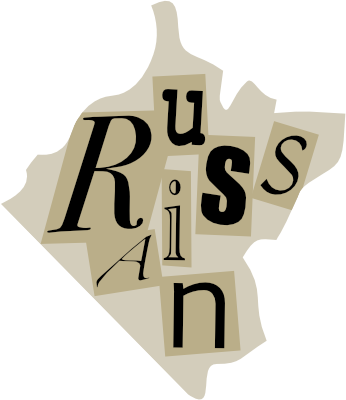

# 笑点解析

## 题面

<div  class="error-block custom-block">
<span class="custom-block-title">修改于 2025/08/09 03:38:55</span>
<span>第九段字面稍有改动</span>
</div>

一天，荠菜忽然捧腹大笑起来。

@{##u##}：你为何而笑？

荠菜：我刚刚听到了一些关于CCBC的笑话...实在是太好笑了哈哈哈哈哈

@{##u##}：能说说吗？

荠菜：你疯了？我刚把那个讲笑话的禁赛了！

……

荠菜：不过，虽然不能复述这些笑话，笑点解析还是可以给你看的。

## 交互源码

### html

```html
<style>
#explain td {
    padding: 5px 0;
}
</style>
<table id="explain">
<tr><td>笑点解析：在两种可能的回答后又出现了第三种令人意外的回答，结合前两种回答的反差，令人忍俊不禁。
<br>问：对话发生在哪里？</td><td>(2/6)</td></tr>
<tr><td>笑点解析：两个人对同一个命令做出了相反的回应，但之后却又说了相同的一句话，令人忍俊不禁。
<br>问：首先发言者是？</td><td>(5/6)</td></tr>
<tr><td>笑点解析：前两人的评论十分正常，而第三人的评论贴合却又充满讽刺，令人忍俊不禁。
<br>问：作品的男主角是？</td><td>(4/4)</td></tr>
<tr><td>笑点解析：三人分别假想获得三件不同物品后情况的变化，第三人想法新奇，令人忍俊不禁。
<br>问：第三人是？</td><td>(6/8)</td></tr>
<tr><td>笑点解析：最模棱两可的回答反而受到了最大的关注，令人忍俊不禁。
<br>问：他应该到哪里去？</td><td>(7/7)</td></tr>
<tr><td>笑点解析：一方向另一方寻求帮助，被建议使用某种物品，于是他们继续索求这种物品，令人忍俊不禁。
<br>问：需要的物品是？</td><td>(1/4)</td></tr>
<tr><td>笑点解析：作品中没有本应出现的主角和地点，但是仍然满足要求，令人忍俊不禁。
<br>问：主角是？</td><td>(3/8)</td></tr>
<tr><td>笑点解析：发表声明时需要进行补充说明以避免更严重的后果，令人忍俊不禁。
<br>问：丢失的东西是？</td><td>(3/6)</td></tr>
<tr><td>笑点解析：由于缺少某种颜色的重要的物品，主人公无法准确向同伴传递信息，令人忍俊不禁。
<br>问：缺少的物品是？</td><td>(2/3)</td></tr>
<tr><td>笑点解析：主人公对词语的理解与众人不同却又让人无法反驳，令人忍俊不禁。
<br>问：这个词是？</td><td>(6/7)</td></tr>
<tr><td>笑点解析：主人公的洞察力仿佛有透视能力一般，折服了众人，令人忍俊不禁。
<br>问：缺少的东西是？</td><td>(6/9)</td></tr>
<tr><td>笑点解析：最后利用拟人手法表达生还的喜悦，令人忍俊不禁。
<br>问：最后发言者是？</td><td>(4/4)</td></tr>
<tr><td>笑点解析：每个谜题和下一个首尾相连，令人忍俊不禁。
<br>问：什么被完成了？</td><td>(3/4)</td></tr>
<tr><td>笑点解析：一人对另一人进行了详细的询问，最后才敢于表明他的意图，令人忍俊不禁。
<br>问：提到的人体器官是？</td><td>(4/4)</td></tr>

</table>

(8 2 4) -> (7)
```


## 解题后内容

成功解开谜题后，量子星云影响的设备恢复正常，同时从中浮现出一张碎纸片。



## 答案

`RUSSIAN`

## 解析

可以注意到这些笑点解析指的都是经典苏联笑话（没听过可以搜索关键词）：

| 笑话 | 问题 | 答案 | 提取字母 |
| - | - | - | - |
| “你为什么坐牢？‘我支持……’ ‘我反对……’ ‘我就是……’ ”| 对话发生在哪里 | `PRISON` | `R` |
| “勃列日涅夫和美国总统卡特比谁的保镖更忠诚……我还有老婆孩子呢” | 首先发言者是 | `CARTER` | `E` |
| “亚当和夏娃的画……他们一定是苏联人，他们没有衣服，吃得很少，却还以为自己在天堂！” | 作品的男主角是 | `ADAM` | `M` |
| “我要是有真理报，世界现在也不会知道滑铁卢！拿破仑说” | 第三人是 | `NAPOLEON` | `E` |
| “下面请认为社会主义好的坐到会场的左边……请到主席台上来” | 他应该到哪里去 | `ROSTRUM` | `M` |
| “苏联电 ：勒紧腰带。河内回电 ：请给腰带 。” | 需要的物品是 | `BELT` | `B` |
| “波兰当局命令一位著名画家创作一幅名为《勃列日涅夫在波兰》的大型油画……” | 主角是 | `BREZHNEV` | `E` |
| “本人遗失鹦鹉一只，另外，本人不同意它的政治观点” | 丢失的东西是 | `PARROT` | `R` |
| “要是在苏联情况不好，我就用绿色的墨水给你写信……一切都好，就是很难弄到绿墨水” | 缺少的物品是 | `INK` | `N` |
| “我选择了自由……我非常感兴趣，你们是怎样理解自由的” | 这个词是 | `FREEDOM` | `O` |
| “我看见他掏出了新手帕，他的布票显然没用来买内裤嘛” | 缺少的东西是 | `UNDERWEAR` | `W` |
| “没油没锅没柴火……那鱼激动地高呼：‘斯大林万岁！’” | 最后发言者是 | `FISH` | `H` |
| “苏联社会七大谜题：总是没人工作，计划却总是完成……” | 什么被完成了 | `PLAN` | `A` |
| “您是克格勃吗？……您踩到我脚了” | 提到的人体器官是 | `FOOT` | `T` |

得到 `REMEMBER NO WHAT`，指使命召唤系列的经典争议关卡 Remember, No Russian, 所以最终答案是 `RUSSIAN`.

## 提示

### 1. 这些都是什么啊！

苏联笑话。


## 中间答案

| 提交 | 回复 | 附加信息 |
| --- | --- | --- |
| remember no what | 这是一个里程碑。 |  |

## 本地附件

- [a30a2145204046488ca14fc941021556.svg](../../../assets/static.cipherpuzzles.com/static/images/a30a2145204046488ca14fc941021556.svg)
- [df97f28040154bfaac73ba2b7fe4494c.webp](../../../assets/static.cipherpuzzles.com/static/images/df97f28040154bfaac73ba2b7fe4494c.webp)

来源：[https://ccbc16.cipherpuzzles.com/data/puzzles/21.json](https://ccbc16.cipherpuzzles.com/data/puzzles/21.json)
