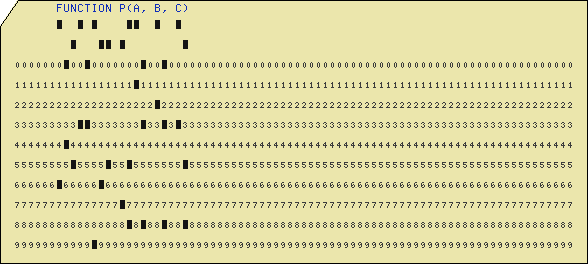
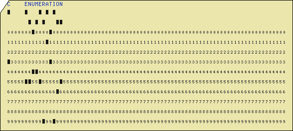
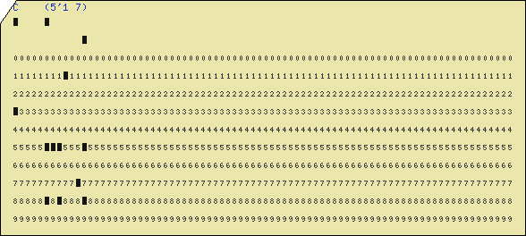
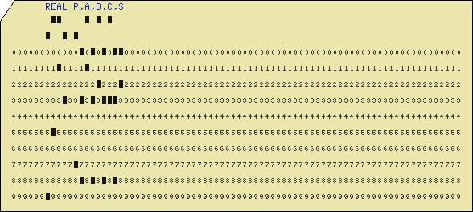
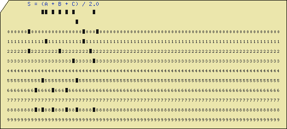
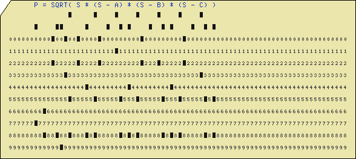
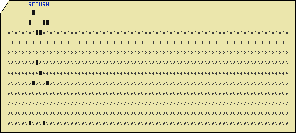
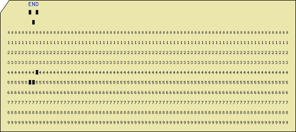
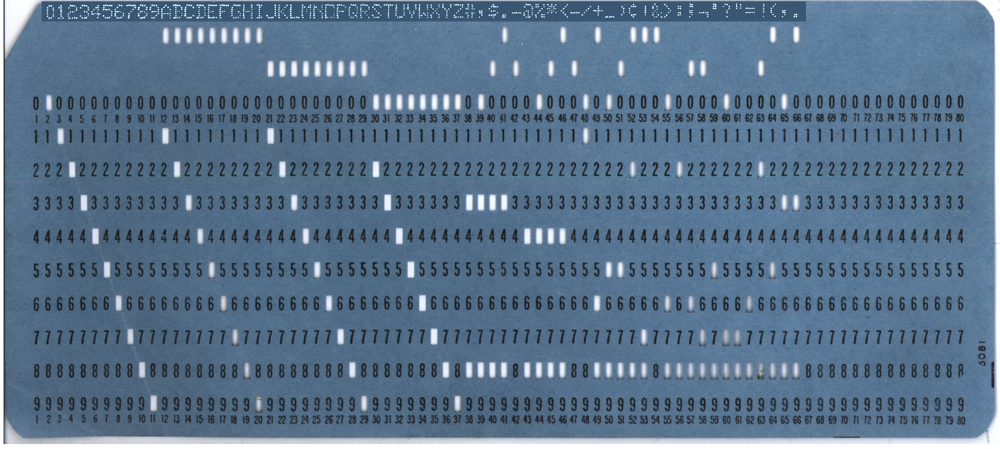

# 打卡

## 题面

<div class="info-block custom-block show-on-mobile">
    <span class="custom-block-title">📱提示</span>
    <span>本题无移动端适配，推荐在桌面浏览器中查看。</span>
</div>
<style>
.show-on-mobile {
    display: none;
}
@media (max-width: 600px) {
    .show-on-mobile {
        display: block;
    }
}
</style>

我再说一遍，这些卡片是打孔用的，不是打字用的！

## 交互源码

### html

```html
<style>
.cuecards {
    padding: 20px;
}
.cuecards table {
    background: lightblue;
    padding: 40px 30px 10px 30px;
    clip-path: polygon(35px 0, 100% 0, 100% 100%, 0 100%, 0 70px);
}
.cuecards table td {
    font-family: "Roboto Mono", monospace;
    width: 9px;
}
.cuecards table tr:nth-child(4) {
    max-height: 3px;
    overflow: visible;
}
.cuecards table tr:nth-child(4) td {
    font-size: 7px;
    max-height: 3px;
    overflow: visible;
}
.cuecards table tr:not(:nth-child(4)) td {
    font-size: 12px;
}
.cuecards table tr:nth-child(n+5) td, .cuecards table tr:nth-child(1) td, .cuecards table tr:nth-child(2) td {
    padding-bottom: 10px;
}
</style>

<p><a href="https://docs.qq.com/sheet/DV3RXbXNiTHZLc0ZV?tab=BB08J2">表格（腾讯文档）</a> <a href="https://docs.google.com/spreadsheets/d/1-Uzcmbxk9UjCl06Q5UdfzYDPFxUSs138Akw2DKOmcmU/edit?usp=sharing">表格（Google Sheet）</a></p>

#1
<div class="cuecards">
<table>
<tr><td>&nbsp;</td></tr>
<tr><td>&nbsp;</td></tr>
<tr><td>C</td><td>O</td><td>M</td><td>M</td><td>E</td><td>N</td><td>T</td><td> </td><td>(</td><td>6</td><td> </td><td>4</td><td>)</td></tr>
<tr><td>1</td><td>2</td><td>3</td><td>4</td><td>5</td><td>6</td><td>7</td><td>8</td><td>9</td><td>10</td><td>11</td><td>12</td><td>13</td><td>14</td><td>15</td><td>16</td><td>17</td><td>18</td><td>19</td><td>20</td><td>21</td><td>22</td><td>23</td><td>24</td><td>25</td><td>26</td><td>27</td><td>28</td><td>29</td><td>30</td><td>31</td><td>32</td><td>33</td><td>34</td><td>35</td><td>36</td><td>37</td><td>38</td><td>39</td><td>40</td><td>41</td><td>42</td><td>43</td><td>44</td><td>45</td><td>46</td><td>47</td><td>48</td><td>49</td><td>50</td><td>51</td><td>52</td><td>53</td><td>54</td><td>55</td><td>56</td><td>57</td><td>58</td><td>59</td><td>60</td><td>61</td><td>62</td><td>63</td><td>64</td><td>65</td><td>66</td><td>67</td><td>68</td><td>69</td><td>70</td><td>71</td><td>72</td><td>73</td><td>74</td><td>75</td><td>76</td><td>77</td><td>78</td><td>79</td><td>80</td></tr>
<tr><td>B</td><td>E</td><td>G</td><td>I</td><td>N</td></tr>
<tr><td> </td><td> </td><td>I</td><td>N</td><td>T</td><td>E</td><td>G</td><td>E</td><td>R</td><td> </td><td>A</td><td>R</td><td>R</td><td>A</td><td>Y</td><td> </td><td> </td><td>A</td><td>[</td><td>1</td><td>:</td><td>N</td><td>]</td><td>;</td></tr>
<tr><td> </td><td> </td><td>I</td><td>N</td><td>T</td><td>E</td><td>G</td><td>E</td><td>R</td><td> </td><td>I</td><td>,</td><td>J</td><td>,</td><td>T</td><td>M</td><td>P</td><td>;</td></tr>
<tr><td> </td><td> </td><td>F</td><td>O</td><td>R</td><td> </td><td>J</td><td> </td><td>:</td><td>=</td><td> </td><td>N</td><td> </td><td>S</td><td>T</td><td>E</td><td>P</td><td> </td><td>-</td><td>1</td><td> </td><td>U</td><td>N</td><td>T</td><td>I</td><td>L</td><td> </td><td>2</td><td> </td><td>D</td><td>O</td></tr>
<tr><td> </td><td> </td><td> </td><td> </td><td>F</td><td>O</td><td>R</td><td> </td><td>I</td><td> </td><td>:</td><td>=</td><td> </td><td> </td><td>1</td><td> </td><td> </td><td>S</td><td>T</td><td>E</td><td>P</td><td> </td><td>1</td><td> </td><td> </td><td>U</td><td>N</td><td>T</td><td>I</td><td>L</td><td> </td><td>J</td><td>-</td><td>1</td><td> </td><td>D</td><td>O</td></tr>
<tr><td> </td><td> </td><td> </td><td> </td><td> </td><td> </td><td>I</td><td>F</td><td> </td><td>(</td><td>A</td><td>[</td><td>I</td><td>]</td><td> </td><td>></td><td> </td><td>A</td><td>[</td><td>I</td><td>+</td><td>1</td><td>]</td><td>)</td><td> </td><td>T</td><td>H</td><td>E</td><td>N</td><td> </td><td>B</td><td>E</td><td>G</td><td>I</td><td>N</td></tr>
<tr><td> </td><td> </td><td> </td><td> </td><td> </td><td> </td><td>T</td><td>M</td><td>P</td><td> </td><td>:</td><td>=</td><td> </td><td>A</td><td>[</td><td>I</td><td>]</td><td>;</td><td> </td><td>A</td><td>[</td><td>I</td><td>]</td><td> </td><td>:</td><td>=</td><td> </td><td>A</td><td>[</td><td>I</td><td>+</td><td>1</td><td>]</td><td>;</td><td> </td><td>A</td><td>[</td><td>I</td><td>+</td><td>1</td><td>]</td><td> </td><td>:</td><td>=</td><td> </td><td>T</td><td>M</td><td>P</td><td>;</td></tr>
<tr><td> </td><td> </td><td>E</td><td>N</td><td>D</td><td>;</td></tr>
<tr><td>E</td><td>N</td><td>D</td><td>;</td></tr>
</table>
</div>

#2
<div class="cuecards">
    <table>
<tr><td>&nbsp;</td></tr>
<tr><td>&nbsp;</td></tr>
<tr><td>/</td><td>*</td><td> </td><td>E</td><td>N</td><td>U</td><td>M</td><td> </td><td>(</td><td>9</td><td> </td><td>9</td><td>)</td><td> </td><td>*</td><td>/</td></tr>
<tr><td>1</td><td>2</td><td>3</td><td>4</td><td>5</td><td>6</td><td>7</td><td>8</td><td>9</td><td>10</td><td>11</td><td>12</td><td>13</td><td>14</td><td>15</td><td>16</td><td>17</td><td>18</td><td>19</td><td>20</td><td>21</td><td>22</td><td>23</td><td>24</td><td>25</td><td>26</td><td>27</td><td>28</td><td>29</td><td>30</td><td>31</td><td>32</td><td>33</td><td>34</td><td>35</td><td>36</td><td>37</td><td>38</td><td>39</td><td>40</td><td>41</td><td>42</td><td>43</td><td>44</td><td>45</td><td>46</td><td>47</td><td>48</td><td>49</td><td>50</td><td>51</td><td>52</td><td>53</td><td>54</td><td>55</td><td>56</td><td>57</td><td>58</td><td>59</td><td>60</td><td>61</td><td>62</td><td>63</td><td>64</td><td>65</td><td>66</td><td>67</td><td>68</td><td>69</td><td>70</td><td>71</td><td>72</td><td>73</td><td>74</td><td>75</td><td>76</td><td>77</td><td>78</td><td>79</td><td>80</td></tr>
<tr><td>G</td><td>C</td><td>F</td><td>:</td><td> </td><td> </td><td>P</td><td>R</td><td>O</td><td>C</td><td>E</td><td>D</td><td>U</td><td>R</td><td>E</td><td>(</td><td>C</td><td>,</td><td> </td><td>D</td><td>)</td><td> </td><td>R</td><td>E</td><td>T</td><td>U</td><td>R</td><td>N</td><td>S</td><td>(</td><td>F</td><td>I</td><td>X</td><td>E</td><td>D</td><td> </td><td>B</td><td>I</td><td>N</td><td>A</td><td>R</td><td>Y</td><td>(</td><td>3</td><td>1</td><td>)</td><td>)</td><td> </td><td>R</td><td>E</td><td>C</td><td>U</td><td>R</td><td>S</td><td>I</td><td>V</td><td>E</td><td>;</td></tr>
<tr><td> </td><td> </td><td> </td><td> </td><td>D</td><td>E</td><td>C</td><td>L</td><td>A</td><td>R</td><td>E</td><td> </td><td>(</td><td>C</td><td>,</td><td> </td><td>D</td><td>,</td><td> </td><td>A</td><td>D</td><td>H</td><td>O</td><td>C</td><td>)</td><td> </td><td>F</td><td>I</td><td>X</td><td>E</td><td>D</td><td> </td><td>B</td><td>I</td><td>N</td><td>A</td><td>R</td><td>Y</td><td>(</td><td>3</td><td>1</td><td>)</td><td>;</td></tr>
<tr><td> </td><td> </td><td> </td><td> </td><td>D</td><td>O</td><td> </td><td>W</td><td>H</td><td>I</td><td>L</td><td>E</td><td> </td><td>(</td><td>D</td><td> </td><td>^</td><td>=</td><td> </td><td>0</td><td>)</td><td>;</td></tr>
<tr><td> </td><td> </td><td> </td><td> </td><td> </td><td> </td><td> </td><td> </td><td> </td><td>A</td><td>D</td><td>H</td><td>O</td><td>C</td><td> </td><td>=</td><td> </td><td>D</td><td>;</td></tr>
<tr><td> </td><td> </td><td> </td><td> </td><td> </td><td> </td><td> </td><td> </td><td> </td><td>D</td><td> </td><td>=</td><td> </td><td>M</td><td>O</td><td>D</td><td>(</td><td>C</td><td>,</td><td> </td><td>D</td><td>)</td><td>;</td></tr>
<tr><td> </td><td> </td><td> </td><td> </td><td> </td><td> </td><td> </td><td> </td><td> </td><td>C</td><td> </td><td>=</td><td> </td><td>A</td><td>D</td><td>H</td><td>O</td><td>C</td><td>;</td></tr>
<tr><td> </td><td> </td><td> </td><td> </td><td>E</td><td>N</td><td>D</td><td>;</td></tr>
<tr><td> </td><td> </td><td> </td><td> </td><td>R</td><td>E</td><td>T</td><td>U</td><td>R</td><td>N</td><td> </td><td>C</td><td>;</td></tr>
<tr><td>E</td><td>N</td><td>D</td><td> </td><td>G</td><td>C</td><td>F</td><td>;</td></tr>
</table>
</div>

#3
<div class="cuecards">
    <table>
<tr><td> </td><td> </td><td>2</td><td>0</td><td>0</td><td> </td><td>R</td><td>E</td><td>M</td><td> </td><td>(</td><td>9</td><td>)</td></tr>
<tr><td> </td><td> </td><td>2</td><td>1</td><td>0</td><td> </td><td>D</td><td> </td><td>=</td><td> </td><td>0</td></tr>
<tr><td> </td><td> </td><td>2</td><td>2</td><td>0</td><td> </td><td>E</td><td> </td><td>=</td><td> </td><td>1</td></tr>
<tr><td>1</td><td>2</td><td>3</td><td>4</td><td>5</td><td>6</td><td>7</td><td>8</td><td>9</td><td>10</td><td>11</td><td>12</td><td>13</td><td>14</td><td>15</td><td>16</td><td>17</td><td>18</td><td>19</td><td>20</td><td>21</td><td>22</td><td>23</td><td>24</td><td>25</td><td>26</td><td>27</td><td>28</td><td>29</td><td>30</td><td>31</td><td>32</td><td>33</td><td>34</td><td>35</td><td>36</td><td>37</td><td>38</td><td>39</td><td>40</td><td>41</td><td>42</td><td>43</td><td>44</td><td>45</td><td>46</td><td>47</td><td>48</td><td>49</td><td>50</td><td>51</td><td>52</td><td>53</td><td>54</td><td>55</td><td>56</td><td>57</td><td>58</td><td>59</td><td>60</td><td>61</td><td>62</td><td>63</td><td>64</td><td>65</td><td>66</td><td>67</td><td>68</td><td>69</td><td>70</td><td>71</td><td>72</td><td>73</td><td>74</td><td>75</td><td>76</td><td>77</td><td>78</td><td>79</td><td>80</td></tr>
<tr><td>&nbsp;</td></tr>
<tr><td> </td><td> </td><td>2</td><td>3</td><td>0</td><td> </td><td>F</td><td>O</td><td>R</td><td> </td><td>I</td><td> </td><td>=</td><td> </td><td>1</td><td> </td><td>T</td><td>O</td><td> </td><td>N</td></tr>
<tr><td> </td><td> </td><td>2</td><td>4</td><td>0</td><td> </td><td>T</td><td> </td><td>=</td><td> </td><td>D</td></tr>
<tr><td> </td><td> </td><td>2</td><td>5</td><td>0</td><td> </td><td>D</td><td> </td><td>=</td><td> </td><td>E</td></tr>
<tr><td> </td><td> </td><td>2</td><td>6</td><td>0</td><td> </td><td>E</td><td> </td><td>=</td><td> </td><td>T</td><td> </td><td>+</td><td> </td><td>E</td></tr>
<tr><td> </td><td> </td><td>2</td><td>7</td><td>0</td><td> </td><td>N</td><td>E</td><td>X</td><td>T</td><td> </td><td>I</td></tr>
<tr><td>&nbsp;</td></tr>
<tr><td>&nbsp;</td></tr>
<tr><td> </td><td> </td><td>2</td><td>8</td><td>0</td><td> </td><td>R</td><td>E</td><td>T</td><td>U</td><td>R</td><td>N</td></tr>
</table>
</div>

#4
<div class="cuecards"><table>
<tr><td>&nbsp;</td></tr>
<tr><td>&nbsp;</td></tr>
<tr><td>&nbsp;</td></tr>
<tr><td>1</td><td>2</td><td>3</td><td>4</td><td>5</td><td>6</td><td>7</td><td>8</td><td>9</td><td>10</td><td>11</td><td>12</td><td>13</td><td>14</td><td>15</td><td>16</td><td>17</td><td>18</td><td>19</td><td>20</td><td>21</td><td>22</td><td>23</td><td>24</td><td>25</td><td>26</td><td>27</td><td>28</td><td>29</td><td>30</td><td>31</td><td>32</td><td>33</td><td>34</td><td>35</td><td>36</td><td>37</td><td>38</td><td>39</td><td>40</td><td>41</td><td>42</td><td>43</td><td>44</td><td>45</td><td>46</td><td>47</td><td>48</td><td>49</td><td>50</td><td>51</td><td>52</td><td>53</td><td>54</td><td>55</td><td>56</td><td>57</td><td>58</td><td>59</td><td>60</td><td>61</td><td>62</td><td>63</td><td>64</td><td>65</td><td>66</td><td>67</td><td>68</td><td>69</td><td>70</td><td>71</td><td>72</td><td>73</td><td>74</td><td>75</td><td>76</td><td>77</td><td>78</td><td>79</td><td>80</td></tr>
<tr><td> </td><td> </td><td> </td><td> </td><td> </td><td> </td><td>F</td><td>U</td><td>N</td><td>C</td><td>T</td><td>I</td><td>O</td><td>N</td><td> </td><td>P</td><td>(</td><td>A</td><td>,</td><td> </td><td>B</td><td>,</td><td> </td><td>C</td><td>)</td></tr>
<tr><td>C</td><td> </td><td> </td><td> </td><td> </td><td>E</td><td>N</td><td>U</td><td>M</td><td>E</td><td>R</td><td>A</td><td>T</td><td>I</td><td>O</td><td>N</td></tr>
<tr><td>C</td><td> </td><td> </td><td> </td><td> </td><td>(</td><td>5</td><td>'</td><td>1</td><td> </td><td>7</td><td>)</td></tr>
<tr><td> </td><td> </td><td> </td><td> </td><td> </td><td> </td><td>R</td><td>E</td><td>A</td><td>L</td><td> </td><td>P</td><td>,</td><td>A</td><td>,</td><td>B</td><td>,</td><td>C</td><td>,</td><td>S</td></tr>
<tr><td> </td><td> </td><td> </td><td> </td><td> </td><td> </td><td>S</td><td> </td><td>=</td><td> </td><td>(</td><td>A</td><td> </td><td>+</td><td> </td><td>B</td><td> </td><td>+</td><td> </td><td>C</td><td>)</td><td> </td><td>/</td><td> </td><td>2</td><td>.</td><td>0</td></tr>
<tr><td> </td><td> </td><td> </td><td> </td><td> </td><td> </td><td>P</td><td> </td><td>=</td><td> </td><td>S</td><td>Q</td><td>R</td><td>T</td><td>(</td><td> </td><td>S</td><td> </td><td>*</td><td> </td><td>(</td><td>S</td><td> </td><td>-</td><td> </td><td>A</td><td>)</td><td> </td><td>*</td><td> </td><td>(</td><td>S</td><td> </td><td>-</td><td> </td><td>B</td><td>)</td><td> </td><td>*</td><td> </td><td>(</td><td>S</td><td> </td><td>-</td><td> </td><td>C</td><td>)</td><td> </td><td>)</td></tr>
<tr><td> </td><td> </td><td> </td><td> </td><td> </td><td> </td><td>R</td><td>E</td><td>T</td><td>U</td><td>R</td><td>N</td></tr>
<tr><td> </td><td> </td><td> </td><td> </td><td> </td><td> </td><td>E</td><td>N</td><td>D</td></tr>
<tr><td>&nbsp;</td></tr>
</table></div>

#5
<div class="cuecards"><table>
<tr><td> </td><td> </td><td>2</td><td>0</td><td>0</td><td> </td><td>R</td><td>E</td><td>M</td><td> </td><td> </td><td> </td><td>(</td><td>1</td><td>0</td><td> </td><td>3</td><td>)</td></tr>
<tr><td> </td><td> </td><td>2</td><td>1</td><td>0</td><td> </td><td>T</td><td>X</td><td> </td><td>=</td><td> </td><td>0</td></tr>
<tr><td> </td><td> </td><td>2</td><td>2</td><td>0</td><td> </td><td>T</td><td>Y</td><td> </td><td>=</td><td> </td><td>0</td></tr>
<tr><td>1</td><td>2</td><td>3</td><td>4</td><td>5</td><td>6</td><td>7</td><td>8</td><td>9</td><td>10</td><td>11</td><td>12</td><td>13</td><td>14</td><td>15</td><td>16</td><td>17</td><td>18</td><td>19</td><td>20</td><td>21</td><td>22</td><td>23</td><td>24</td><td>25</td><td>26</td><td>27</td><td>28</td><td>29</td><td>30</td><td>31</td><td>32</td><td>33</td><td>34</td><td>35</td><td>36</td><td>37</td><td>38</td><td>39</td><td>40</td><td>41</td><td>42</td><td>43</td><td>44</td><td>45</td><td>46</td><td>47</td><td>48</td><td>49</td><td>50</td><td>51</td><td>52</td><td>53</td><td>54</td><td>55</td><td>56</td><td>57</td><td>58</td><td>59</td><td>60</td><td>61</td><td>62</td><td>63</td><td>64</td><td>65</td><td>66</td><td>67</td><td>68</td><td>69</td><td>70</td><td>71</td><td>72</td><td>73</td><td>74</td><td>75</td><td>76</td><td>77</td><td>78</td><td>79</td><td>80</td></tr>
<tr><td> </td><td> </td><td>2</td><td>3</td><td>0</td><td> </td><td>F</td><td>O</td><td>R</td><td> </td><td>I</td><td>T</td><td>E</td><td>R</td><td>C</td><td>N</td><td>T</td><td> </td><td>=</td><td> </td><td>1</td><td> </td><td>T</td><td>O</td><td> </td><td>2</td><td>0</td><td>0</td></tr>
<tr><td> </td><td> </td><td>2</td><td>4</td><td>0</td><td> </td><td>T</td><td>M</td><td>P</td><td> </td><td>=</td><td> </td><td>T</td><td>X</td></tr>
<tr><td> </td><td> </td><td>2</td><td>5</td><td>0</td><td> </td><td>T</td><td>X</td><td> </td><td>=</td><td> </td><td>T</td><td>X</td><td> </td><td>*</td><td> </td><td>T</td><td>X</td><td> </td><td>-</td><td> </td><td>T</td><td>Y</td><td> </td><td>*</td><td> </td><td>T</td><td>Y</td><td> </td><td>+</td><td> </td><td>C</td><td>X</td></tr>
<tr><td> </td><td> </td><td>2</td><td>6</td><td>0</td><td> </td><td>T</td><td>Y</td><td> </td><td>=</td><td> </td><td>2</td><td> </td><td>*</td><td> </td><td>T</td><td>M</td><td>P</td><td> </td><td>*</td><td> </td><td>T</td><td>Y</td><td> </td><td>+</td><td> </td><td>C</td><td>Y</td></tr>
<tr><td> </td><td> </td><td>2</td><td>7</td><td>0</td><td> </td><td>I</td><td>F</td><td> </td><td>(</td><td>T</td><td>X</td><td> </td><td>*</td><td> </td><td>T</td><td>X</td><td> </td><td>+</td><td> </td><td>T</td><td>Y</td><td> </td><td>*</td><td> </td><td>T</td><td>Y</td><td>)</td><td> </td><td>></td><td> </td><td>4</td><td>.</td><td>0</td><td> </td><td>T</td><td>H</td><td>E</td><td>N</td><td> </td><td>3</td><td>0</td><td>0</td></tr>
<tr><td>&nbsp;</td></tr>
<tr><td> </td><td> </td><td>2</td><td>8</td><td>0</td><td> </td><td>N</td><td>E</td><td>X</td><td>T</td><td> </td><td>I</td><td>T</td><td>E</td><td>R</td><td>C</td><td>N</td><td>T</td></tr>
<tr><td>&nbsp;</td></tr>
<tr><td> </td><td> </td><td>3</td><td>0</td><td>0</td><td> </td><td>R</td><td>E</td><td>T</td><td>U</td><td>R</td><td>N</td></tr>
</table></div>

#6
<div class="cuecards"><table>
<tr><td>R</td><td>E</td><td>A</td><td>L</td><td> </td><td>P</td><td>R</td><td>O</td><td>C</td><td>E</td><td>D</td><td>U</td><td>R</td><td>E</td><td> </td><td>O</td><td>U</td><td>T</td><td>(</td><td>F</td><td>I</td><td>,</td><td> </td><td>D</td><td>F</td><td>I</td><td>,</td><td> </td><td>X</td><td>0</td><td>,</td><td> </td><td>M</td><td>)</td><td>;</td></tr>
<tr><td>/</td><td>/</td><td> </td><td>E</td><td>S</td><td>T</td><td>I</td><td>M</td><td>A</td><td>T</td><td>E</td><td> </td><td> </td><td>R</td><td>O</td><td>O</td><td>T</td></tr>
<tr><td>/</td><td>/</td><td> </td><td>(</td><td>6</td><td>'</td><td>1</td><td> </td><td>6</td><td>)</td></tr>
<tr><td>1</td><td>2</td><td>3</td><td>4</td><td>5</td><td>6</td><td>7</td><td>8</td><td>9</td><td>10</td><td>11</td><td>12</td><td>13</td><td>14</td><td>15</td><td>16</td><td>17</td><td>18</td><td>19</td><td>20</td><td>21</td><td>22</td><td>23</td><td>24</td><td>25</td><td>26</td><td>27</td><td>28</td><td>29</td><td>30</td><td>31</td><td>32</td><td>33</td><td>34</td><td>35</td><td>36</td><td>37</td><td>38</td><td>39</td><td>40</td><td>41</td><td>42</td><td>43</td><td>44</td><td>45</td><td>46</td><td>47</td><td>48</td><td>49</td><td>50</td><td>51</td><td>52</td><td>53</td><td>54</td><td>55</td><td>56</td><td>57</td><td>58</td><td>59</td><td>60</td><td>61</td><td>62</td><td>63</td><td>64</td><td>65</td><td>66</td><td>67</td><td>68</td><td>69</td><td>70</td><td>71</td><td>72</td><td>73</td><td>74</td><td>75</td><td>76</td><td>77</td><td>78</td><td>79</td><td>80</td></tr>
<tr><td>R</td><td>E</td><td>A</td><td>L</td><td> </td><td>P</td><td>R</td><td>O</td><td>C</td><td>E</td><td>D</td><td>U</td><td>R</td><td>E</td><td> </td><td>F</td><td>I</td><td>,</td><td> </td><td>D</td><td>F</td><td>I</td><td>;</td><td> </td><td> </td><td>I</td><td>N</td><td>T</td><td>E</td><td>G</td><td>E</td><td>R</td><td> </td><td>M</td><td>;</td><td> </td><td>R</td><td>E</td><td>A</td><td>L</td><td> </td><td>X</td><td>0</td><td>;</td></tr>
<tr><td>B</td><td>E</td><td>G</td><td>I</td><td>N</td></tr>
<tr><td> </td><td> </td><td> </td><td>R</td><td>E</td><td>A</td><td>L</td><td> </td><td>X</td><td>;</td><td> </td><td> </td><td> </td><td>I</td><td>N</td><td>T</td><td>E</td><td>G</td><td>E</td><td>R</td><td> </td><td>I</td><td>;</td></tr>
<tr><td> </td><td> </td><td> </td><td>X</td><td> </td><td>:</td><td>=</td><td> </td><td>X</td><td>0</td><td>;</td></tr>
<tr><td> </td><td> </td><td> </td><td>F</td><td>O</td><td>R</td><td> </td><td>I</td><td> </td><td>:</td><td>=</td><td> </td><td>1</td><td> </td><td> </td><td>S</td><td>T</td><td>E</td><td>P</td><td> </td><td> </td><td>1</td><td> </td><td>U</td><td>N</td><td>T</td><td>I</td><td>L</td><td> </td><td>M</td><td> </td><td>D</td><td>O</td></tr>
<tr><td> </td><td> </td><td> </td><td> </td><td> </td><td> </td><td>X</td><td> </td><td>:</td><td>=</td><td> </td><td>X</td><td> </td><td>-</td><td> </td><td>F</td><td>I</td><td>(</td><td>X</td><td>)</td><td> </td><td>/</td><td> </td><td>D</td><td>F</td><td>I</td><td>(</td><td>X</td><td>)</td><td>;</td><td> </td></tr>
<tr><td> </td><td> </td><td> </td><td>O</td><td>U</td><td>T</td><td> </td><td>:</td><td>=</td><td> </td><td>X</td><td>;</td></tr>
<tr><td>E</td><td>N</td><td>D</td></tr>
<tr><td>&nbsp;</td></tr>
</table></div>

#7
<div class="cuecards"><table>
<tr><td>&nbsp;</td></tr>
<tr><td>C</td><td>O</td><td>M</td><td>M</td><td>E</td><td>N</td><td>T</td><td> </td><td>L</td><td>E</td><td>T</td><td>T</td><td>E</td><td>R</td><td> </td><td>C</td><td>O</td><td>U</td><td>N</td><td>T</td><td> </td><td>(</td><td>6</td><td> </td><td>8</td><td>)</td></tr>
<tr><td>&nbsp;</td></tr>
<tr><td>1</td><td>2</td><td>3</td><td>4</td><td>5</td><td>6</td><td>7</td><td>8</td><td>9</td><td>10</td><td>11</td><td>12</td><td>13</td><td>14</td><td>15</td><td>16</td><td>17</td><td>18</td><td>19</td><td>20</td><td>21</td><td>22</td><td>23</td><td>24</td><td>25</td><td>26</td><td>27</td><td>28</td><td>29</td><td>30</td><td>31</td><td>32</td><td>33</td><td>34</td><td>35</td><td>36</td><td>37</td><td>38</td><td>39</td><td>40</td><td>41</td><td>42</td><td>43</td><td>44</td><td>45</td><td>46</td><td>47</td><td>48</td><td>49</td><td>50</td><td>51</td><td>52</td><td>53</td><td>54</td><td>55</td><td>56</td><td>57</td><td>58</td><td>59</td><td>60</td><td>61</td><td>62</td><td>63</td><td>64</td><td>65</td><td>66</td><td>67</td><td>68</td><td>69</td><td>70</td><td>71</td><td>72</td><td>73</td><td>74</td><td>75</td><td>76</td><td>77</td><td>78</td><td>79</td><td>80</td></tr>
<tr><td></td></tr>
<tr><td>R</td><td>E</td><td>A</td><td>L</td><td> </td><td>P</td><td>R</td><td>O</td><td>C</td><td>E</td><td>D</td><td>U</td><td>R</td><td>E</td><td> </td><td>O</td><td>U</td><td>T</td><td>(</td><td>A</td><td>,</td><td> </td><td>N</td><td>)</td></tr>
<tr><td> </td><td> </td><td>R</td><td>E</td><td>A</td><td>L</td><td> </td><td>A</td><td>R</td><td>R</td><td>A</td><td>Y</td><td> </td><td>A</td><td>;</td><td> </td><td>I</td><td>N</td><td>T</td><td>E</td><td>G</td><td>E</td><td>R</td><td> </td><td>N</td><td>;</td></tr>
<tr><td>B</td><td>E</td><td>G</td><td>I</td><td>N</td><td> </td><td>I</td><td>N</td><td>T</td><td>E</td><td>G</td><td>E</td><td>R</td><td> </td><td>I</td><td>;</td><td> </td><td>R</td><td>E</td><td>A</td><td>L</td><td> </td><td>T</td><td>O</td><td>T</td><td>,</td><td> </td><td>V</td><td>A</td><td>R</td><td>;</td></tr>
<tr><td> </td><td> </td><td>V</td><td>A</td><td>R</td><td> </td><td>=</td><td> </td><td>0</td><td>;</td><td> </td><td>T</td><td>O</td><td>T</td><td> </td><td>=</td><td> </td><td>0</td><td>;</td></tr>
<tr><td> </td><td> </td><td>F</td><td>O</td><td>R</td><td> </td><td>I</td><td> </td><td>:</td><td>=</td><td> </td><td> </td><td>1</td><td> </td><td>S</td><td>T</td><td>E</td><td>P</td><td> </td><td>1</td><td> </td><td>U</td><td>N</td><td>T</td><td>I</td><td>L</td><td> </td><td>N</td><td> </td><td>D</td><td>O</td><td> </td><td>T</td><td>O</td><td>T</td><td> </td><td>=</td><td> </td><td>T</td><td>O</td><td>T</td><td> </td><td>+</td><td> </td><td>A</td><td>[</td><td>I</td><td>]</td><td>;</td></tr>
<tr><td> </td><td> </td><td>F</td><td>O</td><td>R</td><td> </td><td>I</td><td> </td><td>:</td><td>=</td><td> </td><td> </td><td>1</td><td> </td><td>S</td><td>T</td><td>E</td><td>P</td><td> </td><td>1</td><td> </td><td>U</td><td>N</td><td>T</td><td>I</td><td>L</td><td> </td><td>N</td><td> </td><td>D</td><td>O</td></tr>
<tr><td> </td><td> </td><td> </td><td> </td><td>V</td><td>A</td><td>R</td><td> </td><td>=</td><td> </td><td>V</td><td>A</td><td>R</td><td> </td><td>+</td><td> </td><td>(</td><td> </td><td>A</td><td>[</td><td>I</td><td>]</td><td> </td><td>-</td><td> </td><td>T</td><td>O</td><td>T</td><td> </td><td>/</td><td> </td><td>N</td><td> </td><td>)</td><td> </td><td>↑</td><td> </td><td>2</td><td>;</td></tr>
<tr><td> </td><td> </td><td>O</td><td>U</td><td>T</td><td> </td><td>=</td><td> </td><td>V</td><td>A</td><td>R</td><td> </td><td>/</td><td> </td><td>(</td><td> </td><td>N</td><td> </td><td>-</td><td> </td><td>1</td><td> </td><td>)</td><td>;</td></tr>
<tr><td>E</td><td>N</td><td>D</td><td>;</td></tr>
</table></div>

#8
<div class="cuecards"><table>
<tr><td>M</td><td>O</td><td>V</td><td>E</td><td>_</td><td>B</td><td>Y</td><td>:</td><td> </td><td>P</td><td>R</td><td>O</td><td>C</td><td>E</td><td>D</td><td>U</td><td>R</td><td>E</td><td>(</td><td>N</td><td>,</td><td> </td><td>F</td><td>R</td><td>O</td><td>M</td><td>,</td><td> </td><td>T</td><td>O</td><td>,</td><td> </td><td>V</td><td>I</td><td>A</td><td>)</td><td> </td><td>R</td><td>E</td><td>C</td><td>U</td><td>R</td><td>S</td><td>I</td><td>V</td><td>E</td><td>;</td></tr>
<tr><td>/</td><td>*</td><td> </td><td>(</td><td>5</td><td> </td><td>2</td><td> </td><td>5</td><td>)</td><td> </td><td>*</td><td>/</td></tr>
<tr><td> </td><td> </td><td> </td><td> </td><td>D</td><td>E</td><td>C</td><td>L</td><td>A</td><td>R</td><td>E</td><td> </td><td>(</td><td>F</td><td>R</td><td>O</td><td>M</td><td>,</td><td> </td><td>T</td><td>O</td><td>,</td><td> </td><td>V</td><td>I</td><td>A</td><td>)</td><td> </td><td>C</td><td>H</td><td>A</td><td>R</td><td>;</td></tr>
<tr><td>1</td><td>2</td><td>3</td><td>4</td><td>5</td><td>6</td><td>7</td><td>8</td><td>9</td><td>10</td><td>11</td><td>12</td><td>13</td><td>14</td><td>15</td><td>16</td><td>17</td><td>18</td><td>19</td><td>20</td><td>21</td><td>22</td><td>23</td><td>24</td><td>25</td><td>26</td><td>27</td><td>28</td><td>29</td><td>30</td><td>31</td><td>32</td><td>33</td><td>34</td><td>35</td><td>36</td><td>37</td><td>38</td><td>39</td><td>40</td><td>41</td><td>42</td><td>43</td><td>44</td><td>45</td><td>46</td><td>47</td><td>48</td><td>49</td><td>50</td><td>51</td><td>52</td><td>53</td><td>54</td><td>55</td><td>56</td><td>57</td><td>58</td><td>59</td><td>60</td><td>61</td><td>62</td><td>63</td><td>64</td><td>65</td><td>66</td><td>67</td><td>68</td><td>69</td><td>70</td><td>71</td><td>72</td><td>73</td><td>74</td><td>75</td><td>76</td><td>77</td><td>78</td><td>79</td><td>80</td></tr>
<tr><td> </td><td> </td><td> </td><td> </td><td>D</td><td>E</td><td>C</td><td>L</td><td>A</td><td>R</td><td>E</td><td> </td><td>N</td><td> </td><td>F</td><td>I</td><td>X</td><td>E</td><td>D</td><td> </td><td>B</td><td>I</td><td>N</td><td>A</td><td>R</td><td>Y</td><td>(</td><td>8</td><td>)</td><td>;</td></tr>
<tr><td> </td><td> </td><td> </td><td> </td><td>I</td><td>F</td><td> </td><td>N</td><td> </td><td>=</td><td> </td><td>1</td><td> </td><td>T</td><td>H</td><td>E</td><td>N</td></tr>
<tr><td> </td><td> </td><td> </td><td> </td><td> </td><td> </td><td> </td><td> </td><td>P</td><td>U</td><td>T</td><td> </td><td>S</td><td>K</td><td>I</td><td>P</td><td> </td><td>L</td><td>I</td><td>S</td><td>T</td><td>(</td><td>'</td><td>F</td><td>R</td><td>O</td><td>M</td><td> </td><td>'</td><td>,</td><td> </td><td>F</td><td>R</td><td>O</td><td>M</td><td>,</td><td> </td><td>'</td><td> </td><td>T</td><td>O</td><td> </td><td>'</td><td>,</td><td> </td><td>T</td><td>O</td><td>)</td><td>;</td></tr>
<tr><td> </td><td> </td><td> </td><td> </td><td>E</td><td>L</td><td>S</td><td>E</td><td> </td><td>D</td><td>O</td><td>;</td></tr>
<tr><td> </td><td> </td><td> </td><td> </td><td> </td><td> </td><td> </td><td> </td><td>C</td><td>A</td><td>L</td><td>L</td><td> </td><td>M</td><td>O</td><td>V</td><td>E</td><td>_</td><td>B</td><td>Y</td><td>(</td><td>N</td><td> </td><td>-</td><td> </td><td>1</td><td>,</td><td> </td><td>F</td><td>R</td><td>O</td><td>M</td><td>,</td><td> </td><td>V</td><td>I</td><td>A</td><td>,</td><td> </td><td>T</td><td>O</td><td>)</td><td>;</td></tr>
<tr><td> </td><td> </td><td> </td><td> </td><td> </td><td> </td><td> </td><td> </td><td>C</td><td>A</td><td>L</td><td>L</td><td> </td><td>M</td><td>O</td><td>V</td><td>E</td><td>_</td><td>B</td><td>Y</td><td>(</td><td>1</td><td>,</td><td> </td><td>F</td><td>R</td><td>O</td><td>M</td><td>,</td><td> </td><td>T</td><td>O</td><td>,</td><td> </td><td>V</td><td>I</td><td>A</td><td>)</td><td>;</td></tr>
<tr><td> </td><td> </td><td> </td><td> </td><td> </td><td> </td><td> </td><td> </td><td>C</td><td>A</td><td>L</td><td>L</td><td> </td><td>M</td><td>O</td><td>V</td><td>E</td><td>_</td><td>B</td><td>Y</td><td>(</td><td>N</td><td> </td><td>-</td><td> </td><td>1</td><td>,</td><td> </td><td>V</td><td>I</td><td>A</td><td>,</td><td> </td><td>T</td><td>O</td><td>,</td><td> </td><td>F</td><td>R</td><td>O</td><td>M</td><td>)</td><td>;</td></tr>
<tr><td> </td><td> </td><td> </td><td> </td><td>E</td><td>N</td><td>D</td><td>;</td></tr>
<tr><td>E</td><td>N</td><td>D</td><td> </td><td>M</td><td>O</td><td>V</td><td>E</td><td>_</td><td>B</td><td>Y</td><td>;</td></tr>
</table></div>

#M
<div class="cuecards"><pre>
   _ 2 _ _ _ _   _ _ _ _
   3 _ _ _ _ _'_   _ _ _ 5 _ _
   _ _ _ 1 _ _   _ _ _ _ _ _ 4 _

   _ _ _ 2 _ _ _ 1 _   _ _ 3 _ _ _ _ _ 9
   7 4 _ _ 5   _ _   8 _ _ _ 6

   _ _ _ _ _'_   1 2 4 _ 3 _ _

   _ _ _ 1 2 6 _ 5 _
   _ _ _ 8 _ _ _ 7 4 _   9 _ 3

</pre></div>

<div class="info-block custom-block">
  <span class="custom-block-title">注:</span>
  <span>如编码方式有疑问，以EBCDIC为准。</span>
</div>
```


## 解题后内容

成功解开谜题后，量子星云影响的设备恢复正常，同时从中浮现出一张碎纸片。


## 答案

`IDENTITY`

## 解析

首先8段程序所计算的东西分别是：
| 程序 | 语言 | 内容 |  |
| :-: | :-: | :-: | :-- |
|  1  | ALGOL | 冒泡排序 | `BUBBLE SORT` |
|  2  | PL/I | 辗转相除 | `EUCLIDEAN ALGORITHM` |
|  3  | BASIC | 斐波那契数 | `FIBONACCI` |
|  4  | FORTRAN | 海伦公式 | `HERON'S FORMULA` |
|  5  | BASIC | Mandelbrot集 | `MANDELBROT SET` |
|  6  | ALGOL | 牛顿迭代 | `NEWTON'S METHOD` |
|  7  | ALGOL | 样本方差 | `SAMPLE VARIANCE` |
|  8  | PL/I | 汉诺塔 | `TOWER OF HANOI` |

将解出的内容按照使用的语言分组后填入卡片#M的空格，可以按数字提取出中间指示： `PUNCH ALGORITHM FOUR ONTO CARDS`, 即将4号卡片上的程序（共8行）分别在8张卡片上打成孔。

打孔使用的编码是题目中说明的EBCDIC（也叫IBM 029，1960-1970年代的打孔卡事实标准）（<a href="https://homepage.cs.uiowa.edu/~dwjones/cards/codes.html" target="_blank">参考资料</a>）：
```
    /&-0123456789ABCDEFGHIJKLMNOPQR/STUVWXYZ:#@'="¢.<(+|!$*);¬ ,%_>?
12 / O           OOOOOOOOO                        OOOOOO
11|   O                   OOOOOOOOO                     OOOOOO
 0|    O                           OOOOOOOOO                  OOOOOO
 1|     O        O        O        O
 2|      O        O        O        O       O     O     O     O
 3|       O        O        O        O       O     O     O     O
 4|        O        O        O        O       O     O     O     O
 5|         O        O        O        O       O     O     O     O
 6|          O        O        O        O       O     O     O     O
 7|           O        O        O        O       O     O     O     O
 8|            O        O        O        O OOOOOOOOOOOOOOOOOOOOOOOO
 9|             O        O        O        O
  |__________________________________________________________________
```

然后会发现每张卡片上都有若干个有字母的位置被打孔，同一张卡片上被打掉的字母都是同一个，按顺序取8张卡片上的字母得到最终答案`IDENTITY`.

以下是8张卡片上打孔位置的图片：（由 http://www.kloth.net/services/cardpunch.php 生成）










## 提示

### 1. 我毫无头绪

先试着找出这些卡片上程序的名字。

### 2. 我真的一点都不懂编程，每一段到底是什么？

分别是：冒泡排序、辗转相除、斐波那契数、海伦公式、Mandelbrot集、牛顿迭代、样本方差、汉诺塔

### 3. 我得到了一句话，这是什么意思？

将这句话指出的那段程序在这些卡片上打成孔。

### 4. 我得到了一句话并理解了这是什么意思，但具体怎么执行呢？

一共八行代码，按顺序打在题目给出的八张卡片上，一张卡片打一行。

字符和孔位置对应关系以此为准：



### 5. 该如何提取

提取每张卡里被打掉的字母。


## 中间答案

| 提交 | 回复 | 附加信息 |
| --- | --- | --- |
| PUNCH ALGORITHM FOUR ONTO CARDS | Keep Going! |  |

## 本地附件

- [04168691dd0e4c639be6a38720d25cfb.svg](../../../assets/static.cipherpuzzles.com/static/images/04168691dd0e4c639be6a38720d25cfb.svg)
- [35c8fba4a8be43368b9fcc931bbafbe1.webp](../../../assets/static.cipherpuzzles.com/static/images/35c8fba4a8be43368b9fcc931bbafbe1.webp)
- [5eae4113cd354da995f3bcbde260c903.webp](../../../assets/static.cipherpuzzles.com/static/images/5eae4113cd354da995f3bcbde260c903.webp)
- [6e578e68c40c4fbc954701a51068b626.webp](../../../assets/static.cipherpuzzles.com/static/images/6e578e68c40c4fbc954701a51068b626.webp)
- [8af6bc4ec91b43c492ff83c00f6bf75e.webp](../../../assets/static.cipherpuzzles.com/static/images/8af6bc4ec91b43c492ff83c00f6bf75e.webp)
- [a95cddbd656d4ed583b08300ca3cd6bd.webp](../../../assets/static.cipherpuzzles.com/static/images/a95cddbd656d4ed583b08300ca3cd6bd.webp)
- [ad7c12db4bea4ca585f91b7014b25f5b.webp](../../../assets/static.cipherpuzzles.com/static/images/ad7c12db4bea4ca585f91b7014b25f5b.webp)
- [cf886694db784f05920fecf99ea0fb34.webp](../../../assets/static.cipherpuzzles.com/static/images/cf886694db784f05920fecf99ea0fb34.webp)
- [d3cd60da835d475abc4dc224a84c2ea9.webp](../../../assets/static.cipherpuzzles.com/static/images/d3cd60da835d475abc4dc224a84c2ea9.webp)
- [ddec453e39f84df5b33cb240156e34c9.webp](../../../assets/static.cipherpuzzles.com/static/images/ddec453e39f84df5b33cb240156e34c9.webp)
- [fa95f6566cf34454a91f2407ccd61d19.webp](../../../assets/static.cipherpuzzles.com/static/images/fa95f6566cf34454a91f2407ccd61d19.webp)

来源：[https://ccbc16.cipherpuzzles.com/data/puzzles/22.json](https://ccbc16.cipherpuzzles.com/data/puzzles/22.json)
