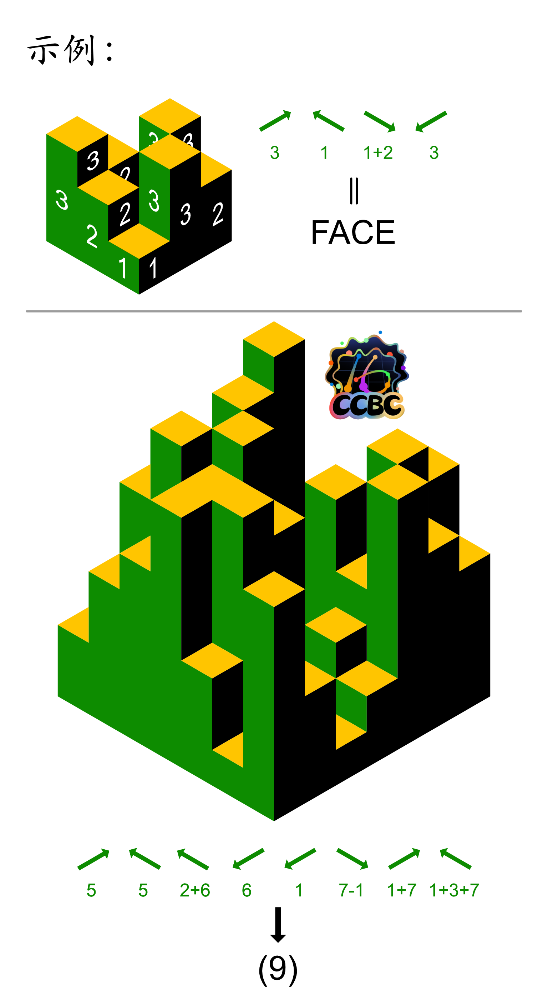
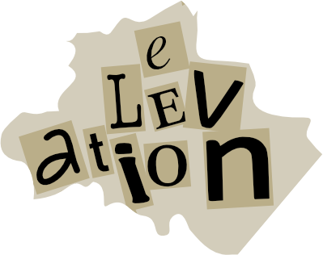
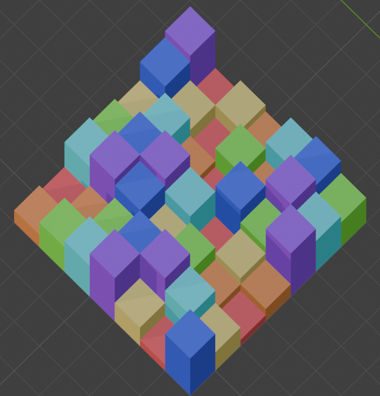
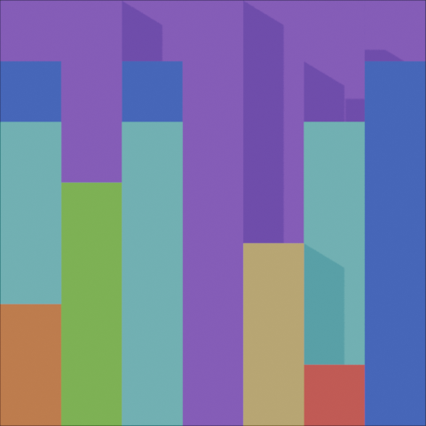
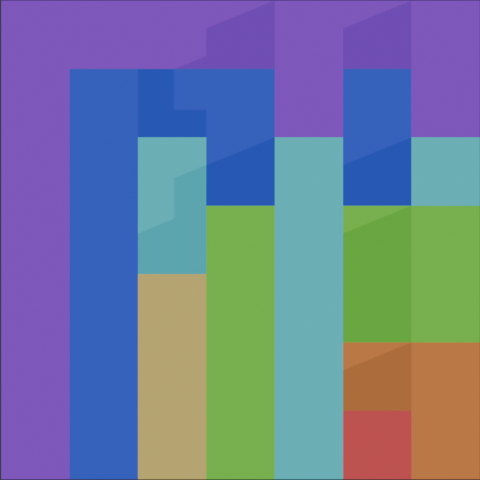
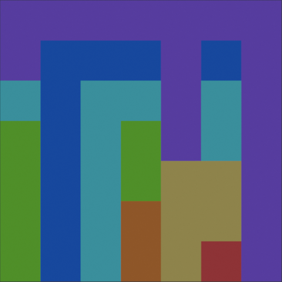
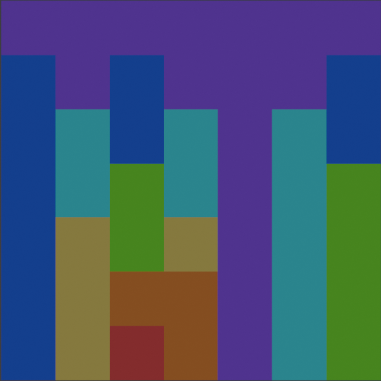

# 高楼大厦

## 题面


## 交互源码

### html

```html

<style>
.pimg {
    width: 500px;
}
@media (max-width: 640px) {
    .pimg {
        width: 100%;
    }
}
</style>
```


## 解题后内容

成功解开谜题后，量子星云影响的设备恢复正常，同时从中浮现出一张碎纸片。



## 答案

`ELEVATION`

## 解析

首先这是一个用了拉丁方规则的纸笔题，需要每行每列都放入1-7高度的楼，并在等轴测投影下符合给出的图样。需要注意的是，由于使用等轴的原因，一个高度为 n 的楼楼顶跟它身后高度为 n-1 的楼楼顶在投影图里是完全重合的，所以在解拉丁方的时候需要加入你所看到的楼顶究竟属于哪个方块的判断。

用红橙黄绿青蓝紫来代表1-7，我们最终得出的纸笔解为：



以下是四个方向能看到的景象：

|从左下方|从左上方|从右上方|从右下方|
|---|---|---|---|
|||||

通过观察示例，我们可以理解最终答案的提取方式。例如在示例中，第一个标有3的箭头，指的是从该方向（左下角）看过去，最左侧的高度3的楼的3层能全部被看见，中间高度3的楼由于被前面高度2的楼挡住，所以只能看到最高的那1层，右边高度3的楼由于被前面高度1的楼挡住，所以只能第二层和第三层共2层楼，三个楼合起来共能看见 6 层，A1Z26 得到例子里的答案第一个字母 F。标有 1+2 的箭头则是说从该角度总共能看到多少层高度1和高度2的楼。

因此我们用同样的方式可以提取：
1. 左下方5（青色）方块数量 = 12
2. 右下方5（青色）方块数量 = 9
3. 右下方2+6（橙色+蓝色）方块数量 = 3+10 = 13
4. 右上方6（蓝色）方块数量 = 9
5. 右上方1（红色）方块数量 = 1
6. 左上方7-1（紫色-红色）方块数量 = 15-1 = 14
7. 左下方1+7（红色+紫色）方块数量 = 1+19 = 20
8. 右下方1+3+7（红色+黄色+紫色）方块数量 = 1+4+16 = 21

A1Z26 可得 LIMIANTU，也就是立面图，翻译成英文 `ELEVATION` 就是最终答案。

## 提示

### 1. 下面建筑物有些被挡住了，如何得知它们的高度

这是一个用了拉丁方规则的纸笔题，需要每行每列都放入1-7高度的楼，并在等轴测投影下符合给出的图样。

### 2. 我不理解例子里为什么箭头代表 FACE

以第一个标有3的箭头为例，从该方向（左下角）看过去，最左侧的高度3的楼的3层能全部被看见，中间高度3的楼由于被前面高度2的楼挡住，所以只能看到最高的那1层，右边高度3的楼由于被前面高度1的楼挡住，所以只能第二层和第三层共2层楼，三个楼合起来共能看见 6 层，A1Z26 得到例子里的答案第一个字母 F。


## 中间答案

| 提交 | 回复 | 附加信息 |
| --- | --- | --- |
| LIMIANTU | 正确，请提交“立面图”的 9 字母英文翻译。 |  |

## 本地附件

- [03a37d35c08f41aa94548cec4573a863.webp](../../../assets/static.cipherpuzzles.com/static/images/03a37d35c08f41aa94548cec4573a863.webp)
- [084eb60fd6fa4645819dc5ba85d326a8.webp](../../../assets/static.cipherpuzzles.com/static/images/084eb60fd6fa4645819dc5ba85d326a8.webp)
- [3b385ef226c54113baa11e011949b148.webp](../../../assets/static.cipherpuzzles.com/static/images/3b385ef226c54113baa11e011949b148.webp)
- [3bc08585c7494724b2359736aaf0577a.PNG](../../../assets/static.cipherpuzzles.com/static/images/3bc08585c7494724b2359736aaf0577a.PNG)
- [6e04097f092e4216a85d84c90f89c85e.webp](../../../assets/static.cipherpuzzles.com/static/images/6e04097f092e4216a85d84c90f89c85e.webp)
- [a5df6a121eb84c8299daf636f6d6a24d.webp](../../../assets/static.cipherpuzzles.com/static/images/a5df6a121eb84c8299daf636f6d6a24d.webp)
- [b5263c37c8294d7faa2ea10e97615ae2.svg](../../../assets/static.cipherpuzzles.com/static/images/b5263c37c8294d7faa2ea10e97615ae2.svg)
- [c1fe6d59c8424466bbaf73d04442f2b2.webp](../../../assets/static.cipherpuzzles.com/static/images/c1fe6d59c8424466bbaf73d04442f2b2.webp)
- [e9ba327f29874ee186e7999f3e9e4b3b.png](../../../assets/static.cipherpuzzles.com/static/images/e9ba327f29874ee186e7999f3e9e4b3b.png)

来源：[https://ccbc16.cipherpuzzles.com/data/puzzles/23.json](https://ccbc16.cipherpuzzles.com/data/puzzles/23.json)
