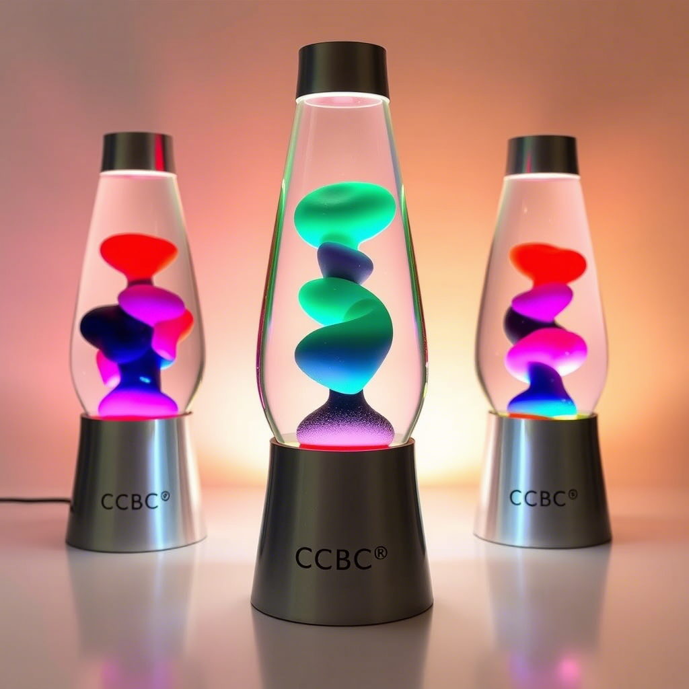
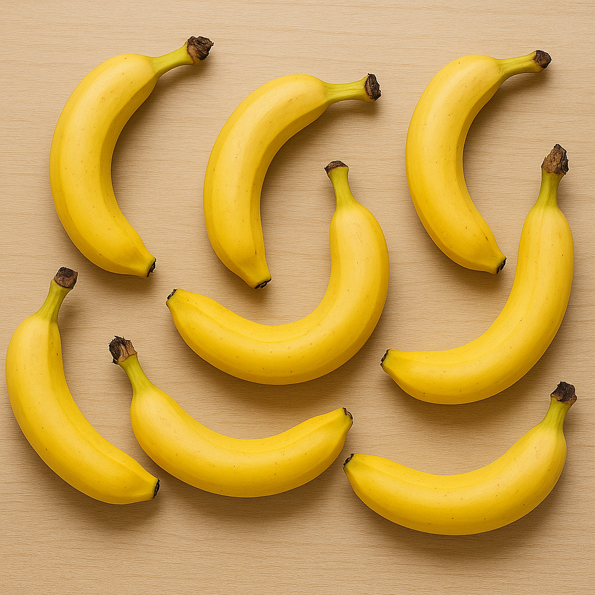
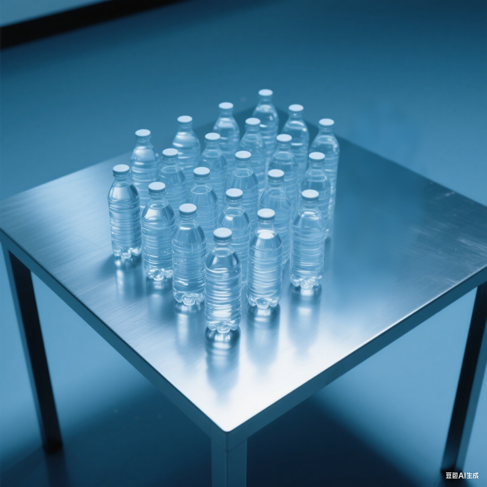
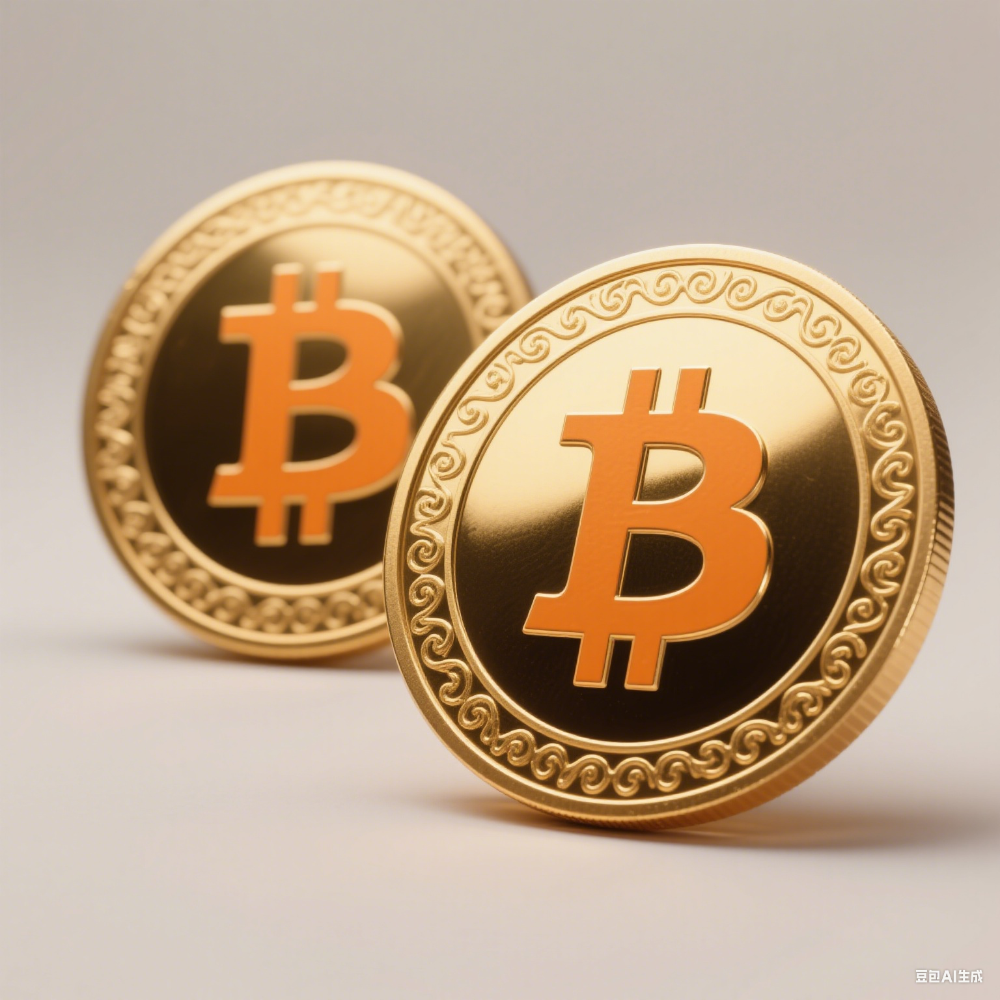
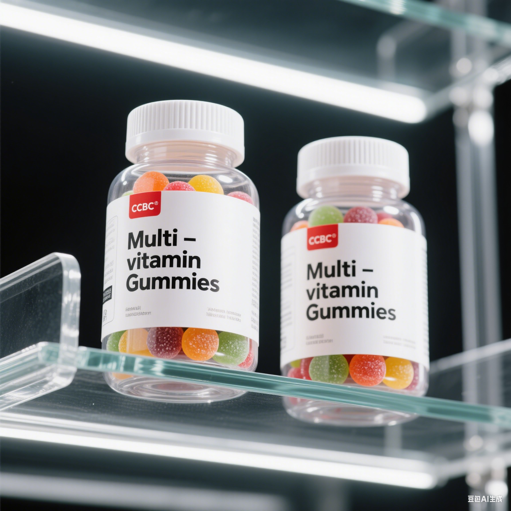
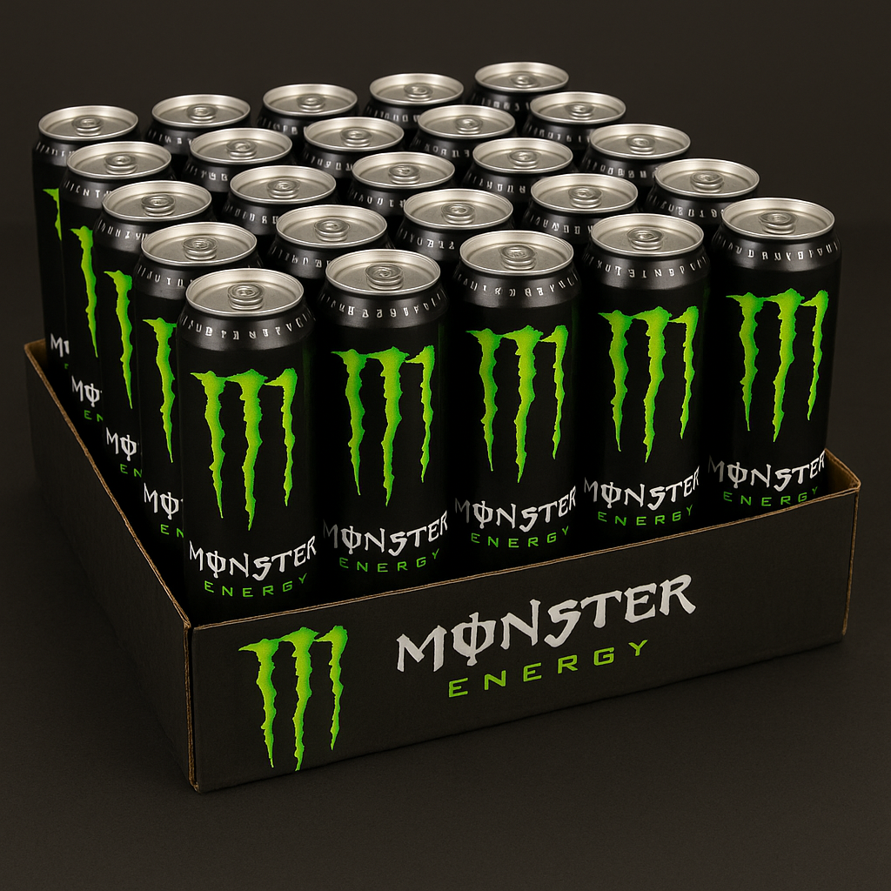
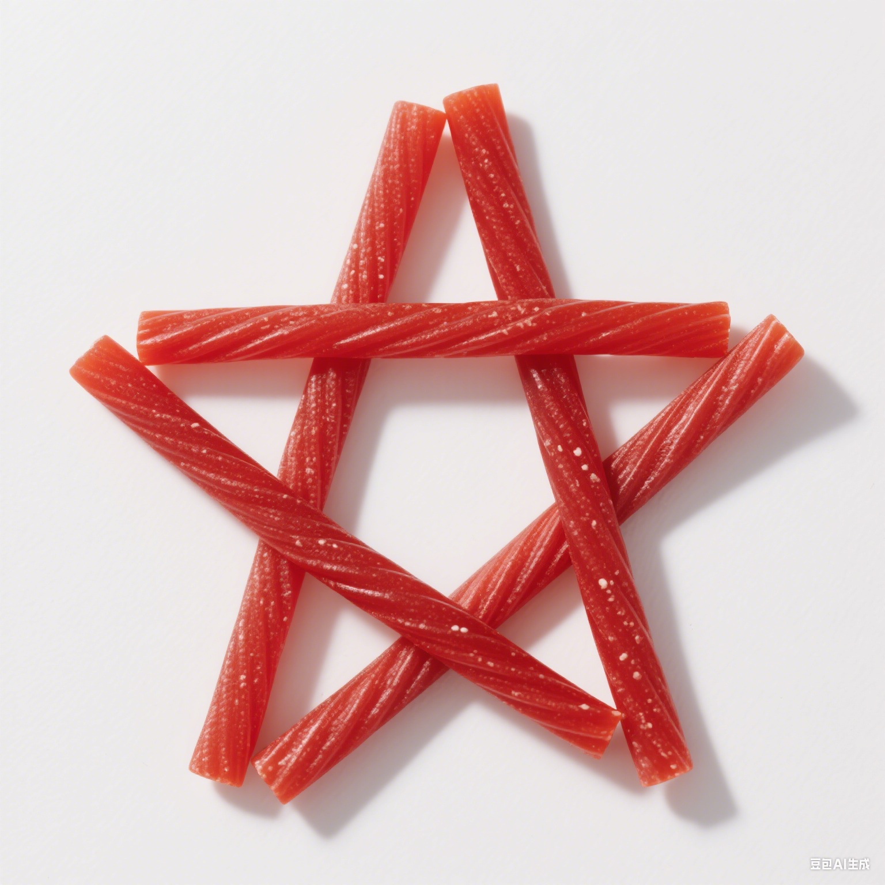
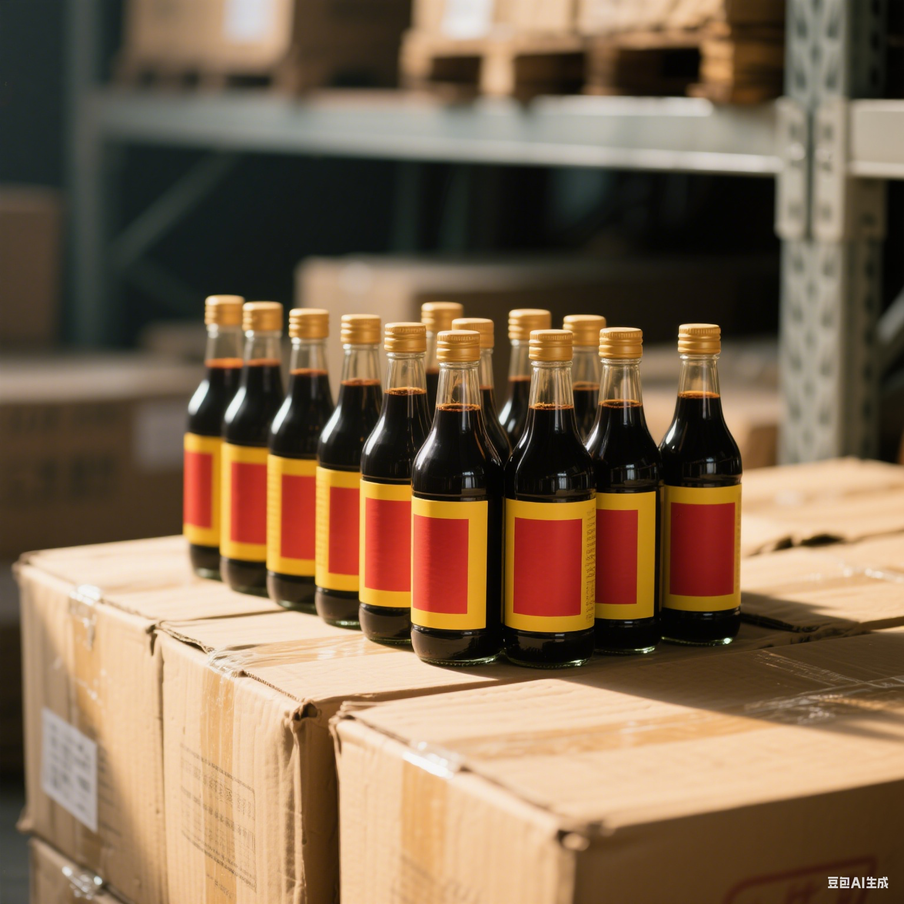
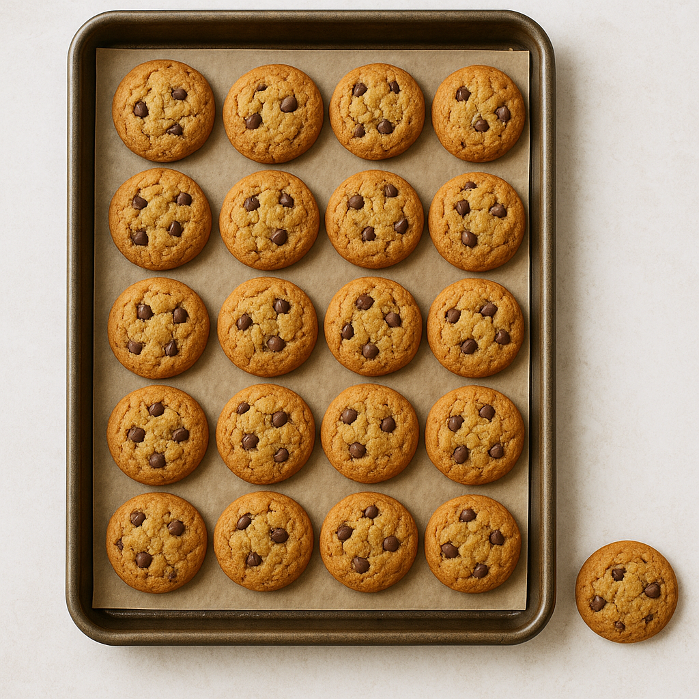
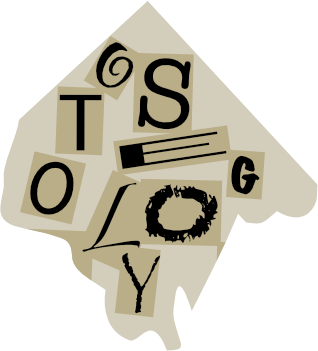

# 一位参赛者……

## 题面

……参加了CCBC16，TA的大脑是这样变化的：

————变化指的是学会了单词吗？

## 交互源码

### html

```html
<style>
#participant .comp td {
    height: 30px;
    width: 30px;
    border: 1px solid;
    text-align: center;
}
#participant .comp_gray {
    background-color: gray;
}
#participant .comp_empty {
    border: 0;
}
#participant .comp {
    border-collapse: collapse;
}
#participant img {
  padding: 5px; /* Some padding */
  width: 150px; /* Set a small width */
}
</style>
<div id="participant">
</img>
</img>
</img><br>
</img>
</img>
</img><br>
</img>
</img>
</img>

<table class="comp">
    <tr>
        <td>🩸</td>
        <td colspan="2">⬆️</td>
        <td colspan="2">⬇️</td>
    </tr>
    <tr>
        <td>1️⃣1️⃣</td>
        <td>4</td>
        <td></td>
        <td></td>
        <td>5</td>
    </tr>
    <tr>
        <td>1️⃣9️⃣</td>
        <td class="comp_gray" colspan="2"></td>
        <td>1</td>
        <td>9</td>
    </tr>
    <tr>
        <td>2️⃣0️⃣</td>
        <td>2</td>
        <td></td>
        <td></td>
        <td>3</td>
    </tr>
    <tr>
        <td>🍬</td>
        <td></td>
        <td>10</td>
        <td>6</td>
        <td>11</td>
    </tr>
    <tr style="height: 30px;" class="comp_empty">
    </tr>
    <tr>
        <td></td>
        <td colspan="2">🐇</td>
        <td colspan="2">🐢</td>
    </tr>
    <tr>
        <td>♥️</td>
        <td>7</td>
        <td>8</td>
        <td>12</td>
        <td></td>
    </tr>
</table>

<p>
-3 0 -2 +1 -4 +4 +3 +5 -1 -5 +2 +6
(9)
</div>
```


## 解题后内容

成功解开谜题后，量子星云影响的设备恢复正常，同时从中浮现出一张碎纸片。



## 答案

`OSTEOLOGY`

## 解析

将9张图的物品数量转字母得到`CHUBBYEMU`，然后注意到物品都可以对应到ChubbyEmu的视频。列举出每个视频中介绍的医学单词和患者名字，可以将名字填入下方表格，提取相应位置的字母并移位后得到`STUDY OF BONES`，即答案`OSTEOLOGY`。

<style>
table, th, td {
  border: 1px solid black; 
  border-collapse: collapse;
  text-align: center;
}
</style>


|数量 |转字母| 物品   | （B站）视频         | 患者名字 | 视频中(第一个)详细介绍的词 |
|:----:|:-:|:------------:|:--------------:|:-------:|--------------------------------|
|3|C| 熔岩灯     | <a href="https://www.bilibili.com/video/BV1vr4y1k7QY" target="_blank">链接</a> | AW     | Hypocalcemia                   |
|8|H| 香蕉       | <a href="https://www.bilibili.com/video/BV1R54y1E7vj" target="_blank">链接</a>| KC     | Hypoglycemia                   |
|21|U| 水         | <a href="https://www.bilibili.com/video/BV16q4y1K7Un" target="_blank">链接</a>| KC     | Hyponatremia             |
|2|B| 比特币     | <a href="https://www.bilibili.com/video/BV1w54y1V78y" target="_blank">链接</a>| CW     | Tachycardia                    |
|2|B| 维生素软糖 | <a href="https://www.bilibili.com/video/BV1e3411279e" target="_blank">链接</a>| TJ     | Hypercalcemia                  |
|25|Y| 能量饮料   | <a href="https://www.bilibili.com/video/BV1zq4y1f7Yo" target="_blank">链接</a>| JS     | Hyperglycemia                  |
|5|E| 甘草糖     | <a href="https://www.bilibili.com/video/BV1864y1D7Bo" target="_blank">链接</a>| VP     | Hypokalemia                    |
|13|M| 酱油       | <a href="https://www.bilibili.com/video/BV17P4y1G7YY" target="_blank">链接</a>| CG     | Hypernatremia            |
|21|U| 饼干       | <a href="https://www.bilibili.com/video/BV1a64y1B7VX" target="_blank">链接</a>| MJ     | Bradycardia                    |


<p><table>
    <tr>
        <td>血 -emia</td><td colspan="2">高  Hyper- </td><td colspan="2">低  Hypo-</td>
    </tr>
    <tr>
        <td>钠 -natr-</td><td>4C</td><td>G</td><td>K</td><td>5C</td>
    </tr>
    <tr>
        <td>钾 -kal-</td><td  colspan="2"></td><td>1V</td><td>9P</td>
    </tr>
    <tr>
        <td>钙 -calc-</td><td>2T</td><td>J</td><td>A</td><td>3W</td>
    </tr>
    <tr>
        <td>糖 -glyc-</td><td>J</td><td>10S</td><td>6K</td><td>11C</td>
    </tr>
</table>


<p><table>
    <tr>
        <td></td><td colspan="2">快 Tachy- </td><td colspan="2">慢 Brady-</td>
    </tr>
    <tr>
        <td>心 -cardia</td><td>7C</td><td>8W</td><td>12M</td><td>J</td>
    </tr>
</table>

`V-3 T+0 W-2 C+1 C-4 K+4 C+3 W+5 P-1 S-5 C+2 M+6 = STUDY OF BONES = OSTEOLOGY`

## 提示

### 1. 我毫无头绪

数一下每张图的东西个数，它们会引导你到某个视频博主。在B站就能找到他

### 2. 已经找到了9张图片代表的东西，下一步是？

查看每个视频里用词根拆分的形式教的第一个医学术语，并且对应到下面的表格里。

### 3. 我知道要用什么，但是不知道1-12的格子里要填什么

主人公的2字母代号。


## 中间答案

| 提交 | 回复 | 附加信息 |
| --- | --- | --- |
| CHUBBYEMU | 加油！ |  |

## 本地附件

- [195f9aa460864eeaa874a02a2cf6f642.webp](../../../assets/static.cipherpuzzles.com/static/images/195f9aa460864eeaa874a02a2cf6f642.webp)
- [30646c6d50de4746ad48d94295e7d5cb.webp](../../../assets/static.cipherpuzzles.com/static/images/30646c6d50de4746ad48d94295e7d5cb.webp)
- [47a57c0e664d4aec884b7a83677c1902.webp](../../../assets/static.cipherpuzzles.com/static/images/47a57c0e664d4aec884b7a83677c1902.webp)
- [4acd19d0d2524becbec885b373af2b06.webp](../../../assets/static.cipherpuzzles.com/static/images/4acd19d0d2524becbec885b373af2b06.webp)
- [4c4d46847a624a67aa7e6b04777a8a9f.webp](../../../assets/static.cipherpuzzles.com/static/images/4c4d46847a624a67aa7e6b04777a8a9f.webp)
- [6d45777dd0a44efdab914050f7b25991.webp](../../../assets/static.cipherpuzzles.com/static/images/6d45777dd0a44efdab914050f7b25991.webp)
- [853f495cc78e43ada41524162c9375be.webp](../../../assets/static.cipherpuzzles.com/static/images/853f495cc78e43ada41524162c9375be.webp)
- [a12ce9aaf35d4211af8750ac0cab44d7.svg](../../../assets/static.cipherpuzzles.com/static/images/a12ce9aaf35d4211af8750ac0cab44d7.svg)
- [b46fc4fd77c04837a2a8695b015c8f01.webp](../../../assets/static.cipherpuzzles.com/static/images/b46fc4fd77c04837a2a8695b015c8f01.webp)
- [cb8c6bbbbb9c490e8f0010ac976c3caf.webp](../../../assets/static.cipherpuzzles.com/static/images/cb8c6bbbbb9c490e8f0010ac976c3caf.webp)
- [dfb4605608354ea09759e94536861bfe.webp](../../../assets/static.cipherpuzzles.com/static/images/dfb4605608354ea09759e94536861bfe.webp)

来源：[https://ccbc16.cipherpuzzles.com/data/puzzles/24.json](https://ccbc16.cipherpuzzles.com/data/puzzles/24.json)
