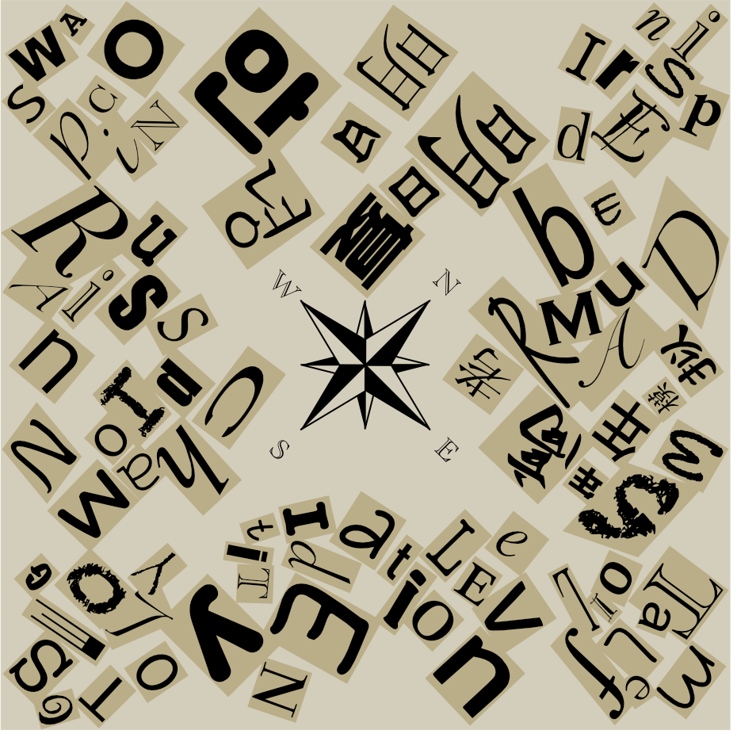
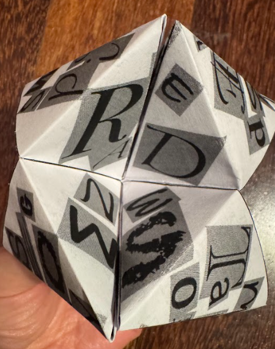
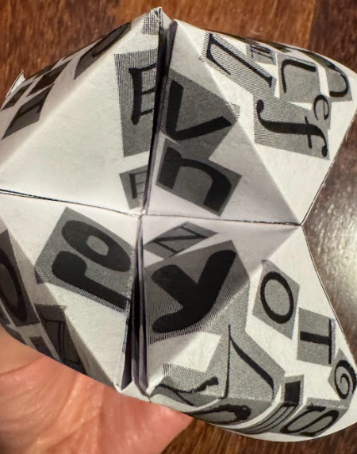

# 指南

## 题面

成功收集了不少碎纸片，你觉得你已经快拼出整个谜团的全貌了。望着手里的一叠纸片，你陷入了沉思。

## 答案

`NEWSPAPER FOLDING`

## 解析

第一步就是把每道题通过后的碎片拼起来，可得：

FT里面有“叠纸”的字样，而根据图片中心的罗盘玫瑰图案，则能想到是需要叠“东南西北”。叠完后按照玩东南西北的方式撑开，在两个方向分别能看见：

即 READ NEWS EVEN ONLY。NEWS 由罗盘玫瑰指向四个角的答案，按照NEWS的顺序读每个答案的偶数字母：

<pre>
N: INSPIRED
E: METALFOIL
W: SWAPCOIN
S: OSTEOLOGY
</pre>

可以得到最终答案 `NEWSPAPER FOLDING`。

## 提示

### 1. 我毫无头绪

需要把纸叠成一个符合本区主题且相信大家小时候都叠过的东西。

### 2. 我已经知道要把拼好的碎纸片做什么用了，但是不会下一步

注意内部能拼出四个单词（每个四字母）的提示。

### 3. 我确信我理解了一切，但是仍然读不出人话

假设你知道要提取第a,b,c,...位的字母，先提取所有单词第a位的字母，随后是第b位，以此类推，而不是提完一个再提下一个。

### 4. 我得到了四个单词，但是不知道如何理解其中的名词（注：此提示是后补的，顺序应在2与3之间）

名词指的是北东西南方向上你还没有用到的答案。注意顺序。

## 本地附件

- [18c170b15ad44fdca9ad25ebad95f242.webp](../../../assets/static.cipherpuzzles.com/static/images/18c170b15ad44fdca9ad25ebad95f242.webp)
- [81b2e917b25349ff85d00b3074019a01.webp](../../../assets/static.cipherpuzzles.com/static/images/81b2e917b25349ff85d00b3074019a01.webp)
- [9a9dd5bdbdfc468d945b6d66d4c3c708.svg](../../../assets/static.cipherpuzzles.com/static/images/9a9dd5bdbdfc468d945b6d66d4c3c708.svg)
- [eba6cf52f92b4e648b31daf1b03c4553.webp](../../../assets/static.cipherpuzzles.com/static/images/eba6cf52f92b4e648b31daf1b03c4553.webp)

来源：[https://ccbc16.cipherpuzzles.com/data/puzzles/25.json](https://ccbc16.cipherpuzzles.com/data/puzzles/25.json)
