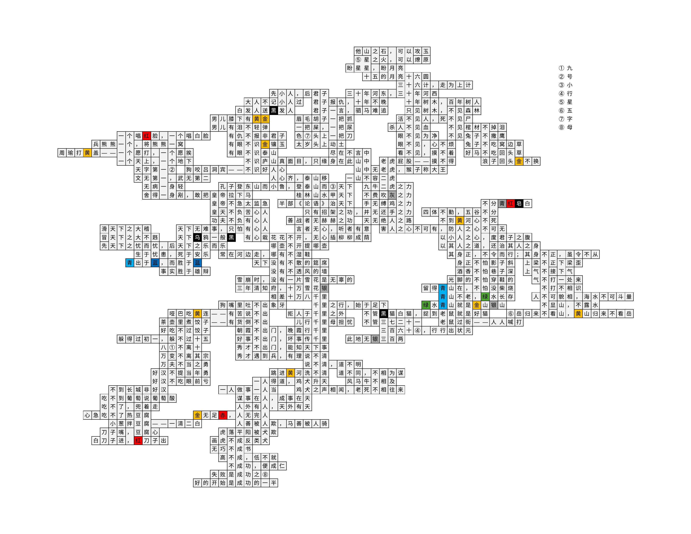

# 五彩斑斓的无字天书

## 题面

<div  class="error-block custom-block">
<span class="custom-block-title">修改于 2025/08/09 16:07:31</span>
<span>删去了第14行第M列和第15行第M列之间的横线</span>
</div>

## 交互源码

### html

```html
<a href="../../../assets/static.cipherpuzzles.com/static/images/6a3dd69fdec64cb0848f86188fc12eb0.pdf" target="_blank">下载 PDF 文档</a><br>
<a href="https://docs.qq.com/sheet/DVVFhT291aFJXY0JP?tab=000001" target="_blank">腾讯文档链接</a><br>
<a href="https://docs.google.com/spreadsheets/d/1F8t2vnFuNqBL-T-SDRgHVmDAUYkkAZ-CNqpS28RelDs/edit?usp=sharing" target="_blank">Google Sheets 链接</a><br>
题目内容请以PDF版为准。
```


## 答案

`METIS`

## 解析

切入点是右侧中间的“不分青红皂白”。每行填入俗语，对应颜色的字已给出颜色，但是由于被灰度打印，因此无法判断颜色，需要一边推进一边推断。相邻的字符之间有分割线当且仅当这两个字符不同。

填完后按顺序读①到⑧得到“九号小行星五字母”，得到最终答案 `METIS`。填完后的情况如下图所示：

<a href="../../../assets/static.cipherpuzzles.com/static/images/2d809f8cd2b542efabc42d8d58875ef0.webp" target="_blank"></a>

## 提示

### 1. 我毫无头绪

题目本应是五彩斑斓的，但是却被黑白打印而灰度化了。
格中填入汉字。一个可能的切入点是右侧中间的连续四个带颜色的格子。

### 2. 我应该填什么？

填俗语。右侧中间是“不分青红皂白”。

### 3. 我填了一些了，但盘面太大还是很难，能不能再给我一个切入口

《》里的两个字是“论语”


## 本地附件

- [2d809f8cd2b542efabc42d8d58875ef0.webp](../../../assets/static.cipherpuzzles.com/static/images/2d809f8cd2b542efabc42d8d58875ef0.webp)
- [4023948e36d84cada06c454dc64e2a90.webp](../../../assets/static.cipherpuzzles.com/static/images/4023948e36d84cada06c454dc64e2a90.webp)
- [6a3dd69fdec64cb0848f86188fc12eb0.pdf](../../../assets/static.cipherpuzzles.com/static/images/6a3dd69fdec64cb0848f86188fc12eb0.pdf)

来源：[https://ccbc16.cipherpuzzles.com/data/puzzles/28.json](https://ccbc16.cipherpuzzles.com/data/puzzles/28.json)
