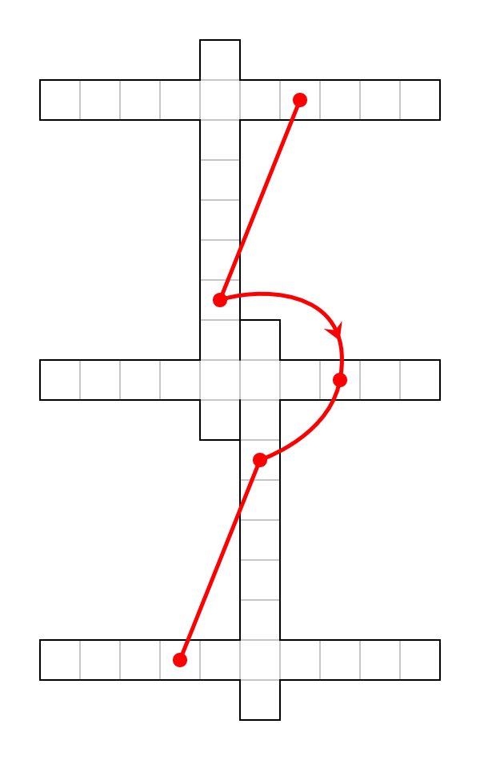
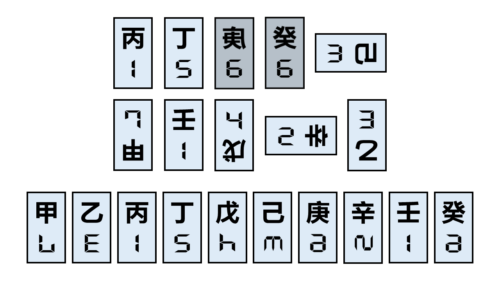

# 只说明书

## 题面

不讲暗话，只说明书。

## 交互源码

### html

```html
<style>
    #explain td {
        padding: 5px 0;
    }
    #treasureMap {
        border-image: url(../../../assets/static.cipherpuzzles.com/static/images/c76ecbb3f8d54e5ab1c945e93e624694.webp) 5 25 10 25 fill / 5px 25px 10px 25px;
        padding: 20px 25px 20px 50px;
        color: #544636;
        width: max-content;
        line-height: 1em;
        white-space: nowrap;
    }
    .treasuremap-container {
        overflow-x: auto;
        scrollbar-width: thin;
    }
</style>

<body>
    <hr>
    <h2>填字游戏</h2>
    <br>
    只要跟着以下步骤做，最终你就能得到本题答案！<br>
    <ol>
    <li>完成五道小题</li>
    <li>将五个小题的答案填入框内，交叉处字母相同</li>
    <li>按箭头顺序提取出五个字母</li>
    <li>提交得到的五字母词</li>
    </ol>
    <hr>
    <h2>藏宝图</h2>
    <div class="treasuremap-container">
    <div id="treasureMap">
    你从标记有叉的位置开始，希望能够在树林中找到传说中的宝藏。毕竟你可是费尽功夫才得到了这一份残缺的藏宝图。<br>
    向南走了两千米，确实如藏宝图所说，你看到地上有一个神秘的放射状标记。你对这个标记有点好奇，但还是宝藏更重要。<br>
    你向正东南走了约八点五千米，遇到了一个在玩高低杠的人。藏宝图在这部分正好空缺了，你一时不知道接下来怎么走。<br>
    随机选了一个方向走了一千米，你遇到了一个十字架。 嗯，确实听人说过寻宝时遇到过十字架，那这应该没错。<br>
    你分析每个方向，决定大概向北探索，在四千米多处发现了墓碑。虽然你读不懂上面那三行蝇头小楷，但确实对上了藏宝图。<br>
    按藏宝图左转约九十度，你继续前行，直到你遇到了一台破电视，随意翻倒在地上。谁会把电视丢到这种地方来？<br>
    你继续大概直行，比之前只多走了一点路程，你又遇到了个裂成两半的……锤子？为什么它的底部不是直的？<br>
    此时的你宁可向北打道回府，也不想再找这些垃圾。但走着走着，你又发现了箭头，似乎恰好走对了方向？<br>
    又走了相同路程，你发现了一栋住了一对夫妻的小平房。已经不相信藏宝图的你询问一番后，得知西南方似乎有着什么。<br>
    你最后找到了一顶靠在树边的帐篷，藏得十分隐蔽。帐篷里只有一条留言：“真正的宝藏是你一路的旅途和结识的同伴”。可我并没有同伴啊……
    </div>
    </div>
    <hr>
    <h2>年份折纸</h2>
    取一张正方形的白纸，画线分隔为45×45个正方形格子。<br>
    按照一般阅读顺序（即从左到右、从上到下），最后一格对应今年年份，其前一格对应去年年份，以此类推，每一格均对应公元后某一年份。<br>
    以画线面为正面，沿第二次“杯酒释兵权”年份和读者创刊年份的中心连线山折。<br>
    以今年所在面为正面，沿此时后汉河中之战开始年份和诗人张先生年中心连线的垂直平分线山折。（两格在不同面）<br>
    沿网格线谷折使得国际稻米年所在格子正好被遮住四分之一。<br>
    以上一步所在面为正面，沿中国最后一个年号元年和五四运动年份中心连线的垂直平分线山折。<br>
    沿十七世纪和十八世纪之间山折、再沿龚自珍逝世年份与及其次年之间山折。<br>
    以今年为右下角，将上侧往后对折，将右侧往后对折，将下侧往后对折，再沿表面现有的分割山折。<br>
    取17的倍数对面的年份，提交数字得到本题答案。<br>
    <hr>
    <h2>周游谜</h2>
    在商场中找到手表的墙面广告，根据广告中手表的时针分针位置，按旗语转换为对应字母。<br>
    前往离起点最近的广场处，记录大屏幕的朝向方位，提取第四位字母。<br>
    在车站任务点处使用魔术道具盒中的卡牌进行挑战，成功抽出目标牌后，提取左上角五字母单词的第二位字母。<br>
    在广场附近寻找写有一个英文字母的蓝色方形标志，提取该字母。<br>
    前往商场中的服务台，提取墙上被圈出的字母。<br>
    车站门口广告牌的底端小字中，提取11位字符的第一位数字，使用A1Z26转为对应字母。<br>
    在地铁站中寻找红色箱子，上面写有英文，提取第二个词的第十个字母。<br>
    在商场中寻找墙上的绿色箭头，旁边写有四个字母，提取第二个字母在字母表中的下一个字母。<br>
    前往车站附近的商店，找到张贴的正方形图案，提取从第6行第7列起往下的4格颜色，使用二进制转换为对应字母（黑为1，白为0）。<br>
    在广场任务点处使用道具盒中的骰子进行挑战，成功投出指定点数后，使用猪圈密码转换为对应字母。<br>
    <hr>
    <h2>解题笔记</h2>
    <table>
        <colgroup>
            <col style="width:5.5em">
            <col>
        </colgroup>
        <tr>
            <td>三阶神方</td>
            <td>标题提示了给出的柱状图内的最大值是什么。分别将最小值、众数、最大值的对应数字A1Z26即可得到答案。</td>
        </tr>
        <tr>
            <td>声音侧耳听</td>
            <td>标题提示了需要看字的拼音，同时提示了只需要看一侧。完成所有线索后，根据最后的指示再做一次即可得到答案。</td>
        </tr>
        <tr>
            <td>递增数字</td>
            <td>标题提示了所有词满足的共同特点，而且也暗示了最终答案是某个数字的英文单词，由此即可得到答案。</td>
        </tr>
        <tr>
            <td>五味杂陈</td>
            <td>标题提示了题目中的文段需要和五味进行配对。配对完成后，通过笔画数A1Z26即可得到答案。</td>
        </tr>
        <tr>
            <td>中英日三语</td>
            <td>标题提示了考虑中文、英文和日语的区别。分别按照三种语言中五个元音的排列，根据是否含有对应元音使用五位二进制进行转换。最后对同一单词按顺序使用三种转换即可得到答案。</td>
        </tr>
        <tr>
            <td>递减数字</td>
            <td>标题提示了所有词满足的共同特点，而且也暗示了最终答案是某个数字的英文单词，由此即可得到答案。</td>
        </tr>
        <tr>
            <td>中日双语</td>
            <td>标题提示了中文和日语中共有的词。最后再次提取时对同一字分别按照中文（该笔画也是汉字）和日语（片假名），将读音连起来谐音即可得到答案。</td>
        </tr>
        <tr>
            <td>四四方方</td>
            <td>标题提示了要将给出的限制条件作用在4×4中。将4×4数独完成后，根据康托展开提取每一行即可得到答案。</td>
        </tr>
        <tr>
            <td>六味杂陈</td>
            <td>标题提示了物理上的六味。将词从短到长填入6层后，从上到下依次提取黄色格即可得到答案。</td>
        </tr>
        <tr>
            <td>无后韵</td>
            <td>标题提示了需要看字的拼音，同时提示了只需要看一侧。完成所有线索后，根据最后的指示再做一次即可得到答案。</td>
        </tr>
        <tr>
            <td>对称排布</td>
            <td>标题提示了每对相似的题目都要分别放在对称的位置（即分别放在正数第N和倒数第N）。根据给定信息确定排序后，使用先前得到的“三三三一一三八一二四”逐一提取即可得到答案。</td>
        </tr>
    </table>
    <hr>
    <h2>中文传译</h2>
    "Hey friend, can you help me with this puzzle using Chinese characters?"<br>
    "There are ten cards scattered on the table. Each of them has a Chinese character and a number around it. I'll
    describe them one by one."<br>
    "The character SKY with I and J on its sides. The number is one."<br>
    "Simply a J. The number is five."<br>
    "A man being stabbed by a trident, with a shelter on its up and right, and a dot above it. The number is six."<br>
    "Again the character SKY but with hair, and the upper right is flat? The number is six again."<br>
    "Looks like a C connected to a square U. The number is three."<br>
    "Ah i recognize this! The character DUE TO. The number is seven."<br>
    "Hmm... This one looks like the character KING, but the middle line is longer. The number is one."<br>
    "A cursive X, with its bottom right crossing a line going right then up. There is also a dot on the bottom left. The
    number is four."<br>
    "This one looks like plus K and a sideways T. The number is two."<br>
    "A number two? And the other number is three."<br>
    "That's all the cards. What do those Chinese characters mean?"<br>
</body>
```


## 答案

`BRUSH`

## 解析

<style>
#answerkey {
    border-collapse: collapse;
    border-spacing: 0
}
#answerkey th {
    text-align: center;
    font-weight: bold;
    vertical-align: middle;
    padding: 3px 10px;
}
#answerkey td {
    border-style: solid none;
    border-width: thin;
    text-align: center;
    vertical-align: middle;
    padding: 3px 9px;
}
</style>

本题小题为各种说明书变体题：<br>
藏宝图是描述自身的说明书；<br>
年份折纸是需要通过模拟避开限制的说明书；<br>
周游谜是看似缺信息但是几乎处处能做的说明书；<br>
解题笔记是缺少部分需要反推的说明书；<br>
中文传译是信息发生扭曲的说明书。<br>
<br>

<h1>藏宝图</h1>

本题每行均描述了某个字，根据这些描述能够确定行走的路径。路径在每行均经过一个字，按照每个字在每行的位置用A1Z26即可得到答案`MEMBERLESS`。同时这也对应本段的最后一句话。<br><br>

<table>
<tr><th>每组答案</th><th>描述的字</th><th>本行的字</th><th>位置</th><th>字母</th></tr>
<tr><td>你从标记有叉的位置开始，<font color = RED>希</font>望能够在树林中找到传说中的宝藏。毕竟你可是费尽功夫才得到了这一份残缺的藏宝图。</td><td>希</td><td>希</td><td>13</td><td>M</td></tr>
<tr><td>向南走了<font color = RED>两</font>千米，确实如藏宝图所说，你看到地上有一个神秘的放射状标记。你对这个标记有点好奇，但还是宝藏更重要。</td><td>米</td><td>两</td><td>5</td><td>E</td></tr>
<tr><td>你向正东南走了约八点五千<font color = RED>米</font>，遇到了一个在玩高低杠的人。藏宝图在这部分正好空缺了，你一时不知道接下来怎么走。</td><td>夫</td><td>米</td><td>13</td><td>M</td></tr>
<tr><td>随<font color = RED>机</font>选了一个方向走了一千米，你遇到了一个十字架。嗯，确实听人说过寻宝时遇到过十字架，那这应该没错。</td><td>十</td><td>机</td><td>2</td><td>B</td></tr>
<tr><td>你分析每<font color = RED>个</font>方向，决定大概向北探索，在四千米多处发现了墓碑。虽然你读不懂上面那三行蝇头小楷，但确实对上了藏宝图。</td><td>直</td><td>个</td><td>5</td><td>E</td></tr>
<tr><td>按藏宝图左转约九十度，你继续前行，<font color = RED>直</font>到你遇到了一台破电视，随意翻倒在地上。谁会把电视丢到这种地方来？</td><td>只</td><td>直</td><td>18</td><td>R</td></tr>
<tr><td>你继续大概直行，比之前<font color = RED>只</font>多走了一点路程，你又遇到了个裂成两半的……锤子？为什么它的底部不是直的？</td><td>宁</td><td>只</td><td>12</td><td>L</td></tr>
<tr><td>此时的你<font color = RED>宁</font>可向北打道回府，也不想再找这些垃圾。但走着走着，你又发现了箭头，似乎恰好走对了方向？</td><td>个</td><td>宁</td><td>5</td><td>E</td></tr>
<tr><td>又走了相同路程，你发现了一栋住了一对<font color = RED>夫</font>妻的小平房。已经不相信藏宝图的你询问一番后，得知西南方似乎有着什么。</td><td>两</td><td>夫</td><td>19</td><td>S</td></tr>
<tr><td>你最后找到了一顶靠在树边的帐篷，藏得<font color = RED>十</font>分隐蔽。帐篷里只有一条留言：“真正的宝藏是你一路的旅途和结识的同伴”。可我并没有同伴啊……</td><td>机</td><td>十</td><td>19</td><td>S</td></tr>
</table>
<br>

<h1>年份折纸</h1>

本题是最像CONUNDRUM题型的，看起来只需要按照步骤折纸就能得到答案。但试图折纸就会发现，本题共折了10次，而一般的纸最多只能折六七次，所以最后几步必须通过模拟折纸后的情况确定如何提取。最后提交数字能够得到答案为`THEREAFTER`。

<table id="answerkey">
<tr><th>年份线索</th><th>年份</th></tr>
<tr><td>第二次“杯酒释兵权”年份</td><td>969</td></tr>
<tr><td>读者创刊年份</td><td>1981</td></tr>
<tr><td>后汉河中之战开始年份</td><td>948</td></tr>
<tr><td>诗人张先生年</td><td>990</td></tr>
<tr><td>国际稻米年</td><td>2004</td></tr>
<tr><td>中国最后一个年号元年</td><td>1909</td></tr>
<tr><td>五四运动年份</td><td>1919</td></tr>
<tr><td>十七世纪和十八世纪之间</td><td>1700~1701</td></tr>
<tr><td>龚自珍逝世年份与及其次年</td><td>1841~1842</td></tr>
<tr><td>17的倍数对面的年份</td><td>839</td></tr>
</table>
<br>

<h1>周游谜</h1>

本题看似是缺少了信息，但根据所说场景思考可能见到的东西，或亲自前往附近对应场所寻找，能够发现每行都是确实可做的。最后可以得到答案为`UTOPIAHYMN`。

<table id="answerkey">
<tr><th>线索</th><th>解释</th><th>字母</th></tr>
<tr><td>在商场中找到手表的墙面广告，根据广告中手表的时针分针位置，按旗语转换为对应字母。</td><td>手表广告大多时间为10:10。</td><td>U</td></tr>
<tr><td>前往离起点最近的广场处，记录大屏幕的朝向方位，提取第四位字母。</td><td>NORTH、SOUTH、EAST、WEST以及东南、西南等的第四位字母均为T。</td><td>T</td></tr>
<tr><td>在车站任务点处使用魔术道具盒中的卡牌进行挑战，成功抽出目标牌后，提取左上角五字母单词的第二位字母。</td><td>指扑克牌中的JOKER。</td><td>O</td></tr>
<tr><td>在广场附近寻找写有一个英文字母的蓝色方形标志，提取该字母。</td><td>停车场标志。</td><td>P</td></tr>
<tr><td>前往商场中的服务台，提取墙上被圈出的字母。</td><td>ⓘ信息处。</td><td>I</td></tr>
<tr><td>车站门口广告牌的底端小字中，提取11位字符的第一位数字，使用A1Z26转为对应字母。</td><td>11位字符为手机电话号码，第一位为1。</td><td>A</td></tr>
<tr><td>在地铁站中寻找红色箱子，上面写有英文，提取第二个词的第十个字母。</td><td>红色箱子为灭火器箱，英文为FIRE EXTINGUISHER BOX。</td><td>H</td></tr>
<tr><td>在商场中寻找墙上的绿色箭头，旁边写有四个字母，提取第二个字母在字母表中的下一个字母。</td><td>绿色箭头是安全出口标识，英文为EXIT。</td><td>Y</td></tr>
<tr><td>前往车站附近的商店，找到张贴的正方形图案，提取从第6行第7列起往下的4格颜色，使用二进制转换为对应字母（黑为1，白为0）。</td><td>正方形图案为二维码，提取部分是二维码不变的部分。</td><td>M</td></tr>
<tr><td>在广场任务点处使用道具盒中的骰子进行挑战，成功投出指定点数后，使用猪圈密码转换为对应字母。</td><td>只有⚀可以按猪圈密码转换。</td><td>N</td></tr>
</table>
<br>

<h1>解题笔记</h1>

本体每小题虽然没有给出具体题目，但根据笔记可以倒推出每小题答案。最后由META提取得到答案为`DRAWSTRING`。注意到原排序为答案字母序可以辅助做题。下表按照META提取顺序排序。

<table id="answerkey">
<tr><th>标题</th><th>笔记</th><th>解释</th><th>答案</th></tr>
<tr><td>六味杂陈</td><td>标题提示了物理上的六味。将词从短到长填入6层后，从上到下依次提取黄色格即可得到答案。</td><td>指夸克六味，按长度递增排列，使用工具网站取字母得到答案。</td><td>UPDATE</td></tr>
<tr><td>递增数字</td><td>标题提示了所有词满足的共同特点，而且也暗示了最终答案是某个数字的英文单词，由此即可得到答案。</td><td>共同特点是字母序严格递增，唯一满足限制的数字是FORTY。</td><td>FORTY</td></tr>
<tr><td>中日双语</td><td>标题提示了中文和日语中共有的词。最后再次提取时对同一字分别按照中文（该笔画也是汉字）和日语（片假名）理解，将读音连起来谐音即可得到答案。</td><td>分别是丿和ノ，读PIE和NO。</td><td>PIANO</td></tr>
<tr><td>无后韵</td><td>标题提示了需要看字的拼音，同时提示了只需要看一侧。完成所有线索后，根据最后的指示再做一次即可得到答案。</td><td>取标题声母。</td><td>WHY</td></tr>
<tr><td>四四方方</td><td>标题提示了要将给出的限制条件作用在4×4中。将4×4数独完成后，根据康托展开提取每一行即可得到答案。</td><td>所有288种4×4数独中只有|4123|3214|2431|1342|的答案为常用词。</td><td>SOLD</td></tr>
<tr><td>三阶神方</td><td>标题提示了给出的柱状图内的最大值是什么。分别将最小值、众数、最大值的对应数字A1Z26即可得到答案。</td><td>柱状图是按需要至少N步复原分组，最小值为1，众数为18，最大值为20。</td><td>ART</td></tr>
<tr><td>声音侧耳听</td><td>标题提示了需要看字的拼音，同时提示了只需要看一侧。完成所有线索后，根据最后的指示再做一次即可得到答案。</td><td>取标题韵母。</td><td>ENGINEERING</td></tr>
<tr><td>中英日三语</td><td>标题提示了考虑中文、英文和日语的区别。分别按照三种语言中五个元音的排列，根据是否含有对应元音使用五位二进制进行转换。最后对同一单词按顺序使用三种转换即可得到答案。</td><td>三种排列分别为AOEIU，AEIOU，AIUEO。考虑所有2^5选择，可以发现选OU可得到答案。</td><td>ICE</td></tr>
<tr><td>递减数字</td><td>标题提示了所有词满足的共同特点，而且也暗示了最终答案是某个数字的英文单词，由此即可得到答案。</td><td>共同特点是字母序严格递减，唯一满足限制的数字是ONE。</td><td>ONE</td></tr>
<tr><td>五味杂陈</td><td>标题提示了题目中的文段需要和五味进行配对。配对完成后，通过笔画数A1Z26即可得到答案。</td><td>五味是苦咸酸辛甘。答案也可能是NEIGH，但不影响后续步骤。</td><td>HINGE</td></tr>
<tr><td>对称排布</td><td>标题提示了每对相似的题目都要分别放在对称的位置（即分别放在正数第N和倒数第N）。根据给定信息确定排序后，使用先前得到的“三三三一一三八一二四”逐一提取即可得到答案。</td><td>八可以唯一确定对应，除此之外通过工具网站查找可以得到答案。</td><td>DRAWSTRING</td></tr>
</table>
<br>

<h1>中文传译</h1>

本题需要通过描述还原对方所见到的字卡。通过还原可以发现，每个描述的字其实是旋转或翻转过的天干。将汉字摆正后，原本的数字其实是数码管字母，按顺序提取即可得到答案是`LEISHMANIA`。

<br>

<h1>填字游戏</h1>

本题需要将五个答案填入框内并按箭头顺序提取。第一次会得到`FLIPS`，提示将图片沿长边翻转；第二次会得到`WHIRL`，提示将图片按箭头方向旋转90度；第三次和第四次实际上是前两次的转置，所以填法相同；而第五次则完全和第一次一样。看起来似乎陷入了死循环之中。
```
        M                       U        
T H E R E A F T E R   D R A W S T R I N G
        M                       O        
        B                       P        
        E                       I        
        R                       A        
        L                       H        
        E U                   T Y        
D R A W S T R I N G   L E I S H M A N I A
        S O                   E N        
          P                   R          
          I                   E          
          A                   A          
          H                   F          
          Y                   T          
L E I S H M A N I A   M E M B E R L E S S
          N                   R          
```
但实际上，正如提交WHIRL时的提示，虽然看起来步骤循环了，但时间是在流逝的。循环中要回到第一步“完成五道小题”也暗示了在小题部分可能会有变化，不然不必要求重做小题。经过观察可以发现，只有年份折纸这题会受到时间影响。在这一题中完全没有直接说明填入1到2025，而是都使用“今年”之类的表述。循环到2026年时，填入的数字会从1到2025变为2到2026。在2026年再做同样步骤时，第一步就会因为数字偏移导致折法完全不同。最后应该提交的年份会变为`1099`，答案也变为了`GLUTENFREE`。将`THEREAFTER`替换后，再填两次纵横字谜可以得到最终答案为`BRUSH`。
```
        M                       D        
G L U T E N F R E E   M E M B E R L E S S
        M                       A        
        B                       W        
        E                       S        
        R                       T        
        L                       R        
        E U                   L I        
D R A W S T R I N G   G L U T E N F R E E
        S O                   I G        
          P                   S          
          I                   H          
          A                   M          
          H                   A          
          Y                   N          
L E I S H M A N I A   U T O P I A H Y M N
          N                   A          
```

## 提示

### 1. 「藏宝图」该怎么做！

其实藏宝图就在你面前。这一段话本身也就是藏宝图。
提取时，需要数在每一行中处于第几个字。

### 2. 「年份折纸」该怎么做！

没有任何特殊操作。只要时间填写没有错误，按照步骤一步步操作，即可得到答案。若折纸时难以继续，可以考虑用图片处理软件模拟。

### 3. 「周游谜」该怎么做！

按照所说场景思考可能见到的东西即可得到每题答案。若确实没有思路，可以搜索相关图片，或亲自前往附近对应场所寻找。

### 4. 「解题笔记」该怎么做！

根据笔记内容反推做题最后步骤，即可得到答案。在此过程中可能有部分无法确定的内容，需要使用工具搜索可能答案。每题提示按顺序如下：

六味杂陈：使用nutrimatic等工具查询[up][top][down][charm][bottom][strange]得到最常用单词。

递增数字：递增是指字母按ABC~Z排列，符合要求的英文数字仅有一个。

中日双语：分别读丿和ノ。

无后韵：最后是根据标题得到答案。

四四方方：完成后的数独第一行为4123。

三阶神方：柱状图表示的是最少需要n步还原的魔方状态数量，暗合标题提示的God's Number。

声音侧耳听：最后是根据标题得到答案。

中英日三语：最后用于提取的单词仅含有O和U两种元音。

递减数字：递减是指字母按ZYX~A排列，符合要求的英文数字仅有一个。

五味杂陈：五味顺序是酸甘咸辛苦。

### 5. 「中文传译」该怎么做！

对方所描述的字是天干，但这些天干都可能翻转或旋转过。旁边的数字并不是数字，是答案的一部分。将每张卡片调整到能够正确读出天干的角度/朝向，按照天干排序后，看那些“数字”像什么字母。

### 6. 按「填字游戏」操作了好几遍却也完全没有进展！

你可能认为你陷入了死循环，但其实这一循环在某一时刻会结束。虽然题面完全没有变化，但时间在流逝……流逝到了2026后，【年份折纸】的做法和答案会变。

### 7. 我折不动了！请直接给我「年份折纸」的结果！

1099


## 中间答案

| 提交 | 回复 | 附加信息 |
| --- | --- | --- |
| MEMBERLESS | 这是小题答案之一。 |  |
| DRAWSTRING | 这是小题答案之一。 |  |
| LEISHMANIA | 这是小题答案之一。 |  |
| UTOPIAHYMN | 这是小题答案之一。 |  |
| THEREAFTER | 这是小题答案之一。 |  |
| 839 | 本小题答案是THEREAFTER |  |
| 1099 | 本小题答案是GLUTENFREE |  |
| GLUTENFREE | 这是小题答案之一。 |  |
| FLIPS | 请将"填字游戏"当前图片沿长边翻转后，回到第1步重新完成题目。 |  |
| WHIRL | 时间在流逝…请将"填字游戏"当前图片按箭头方向旋转90°后，回到第1步重新完成题目。 |  |

## 本地附件

- [1431ebb1bfd747658188aeae15342a2d.webp](../../../assets/static.cipherpuzzles.com/static/images/1431ebb1bfd747658188aeae15342a2d.webp)
- [7c59742f0eb041af81010c7e67585b42.webp](../../../assets/static.cipherpuzzles.com/static/images/7c59742f0eb041af81010c7e67585b42.webp)
- [8ab863d481254c55b9caee5c2717f395.webp](../../../assets/static.cipherpuzzles.com/static/images/8ab863d481254c55b9caee5c2717f395.webp)
- [c76ecbb3f8d54e5ab1c945e93e624694.webp](../../../assets/static.cipherpuzzles.com/static/images/c76ecbb3f8d54e5ab1c945e93e624694.webp)

来源：[https://ccbc16.cipherpuzzles.com/data/puzzles/29.json](https://ccbc16.cipherpuzzles.com/data/puzzles/29.json)
