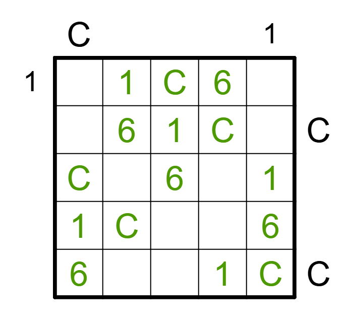
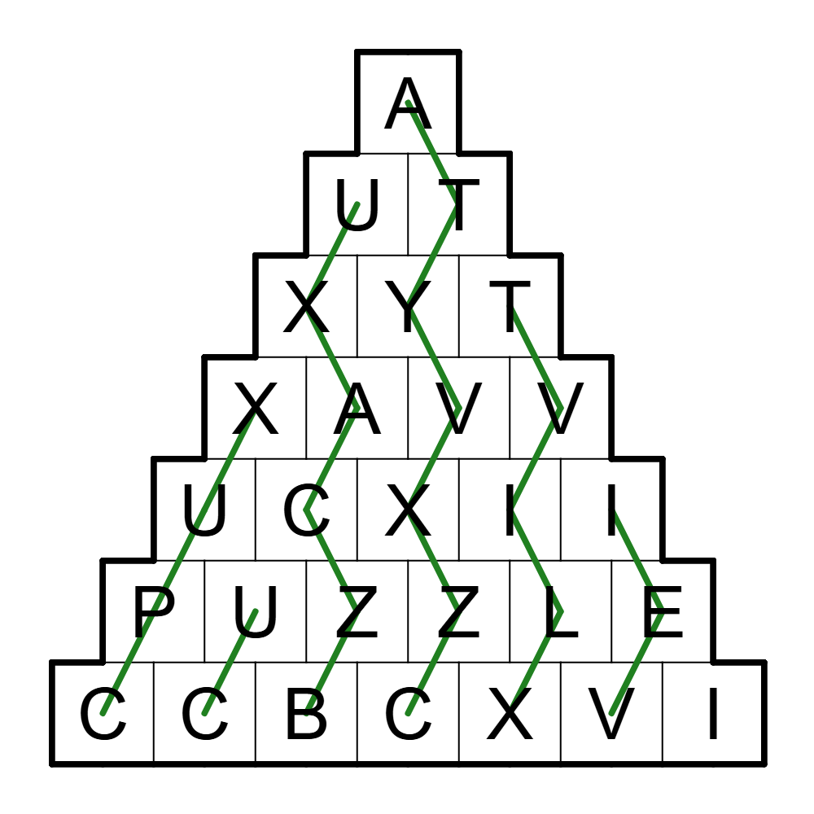
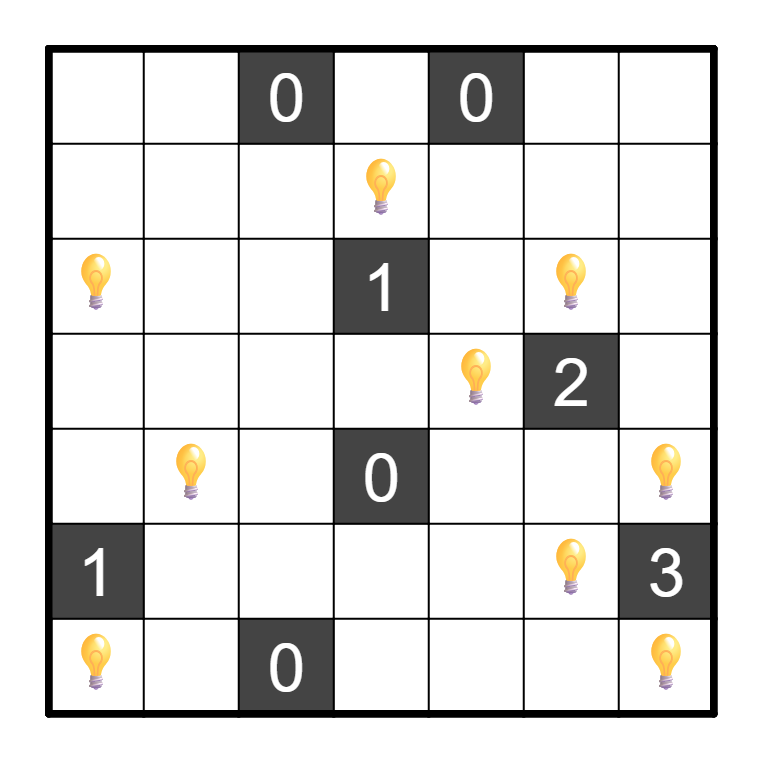
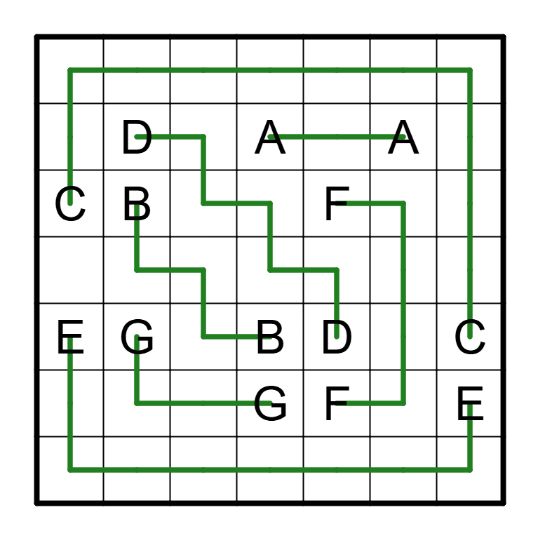
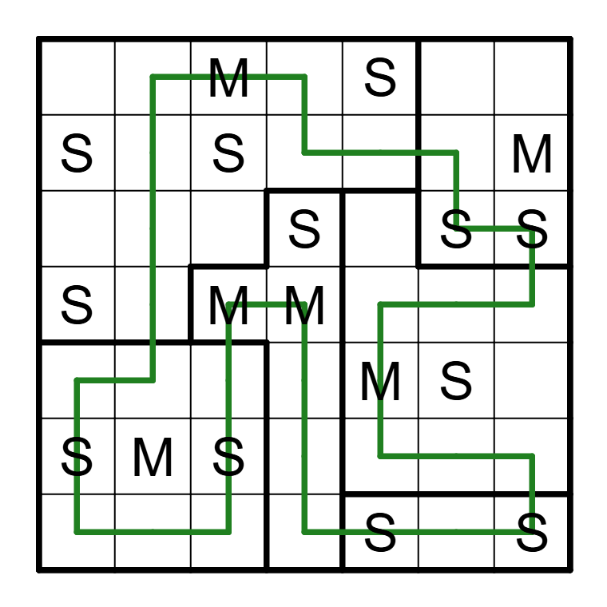
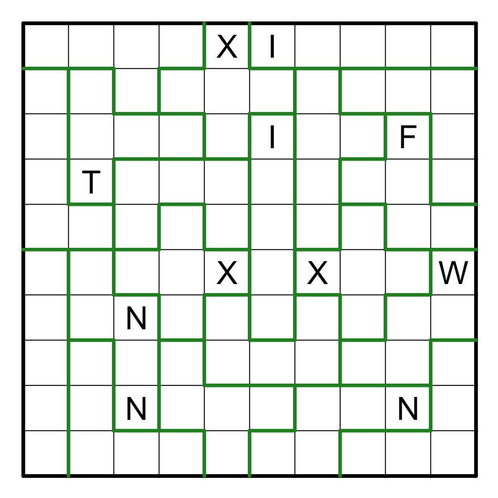
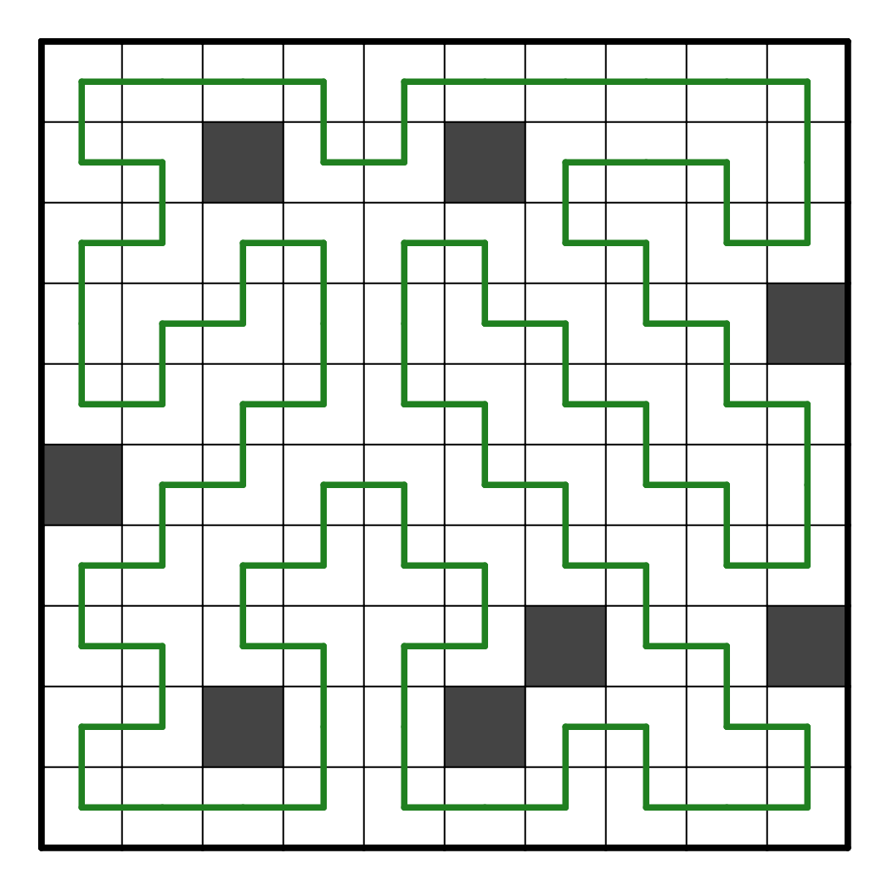
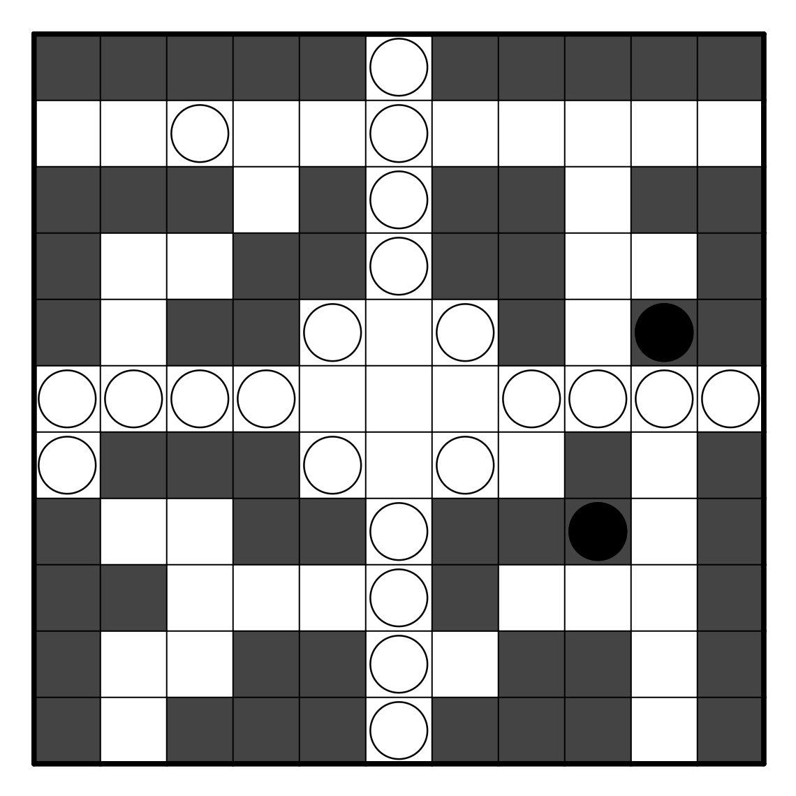
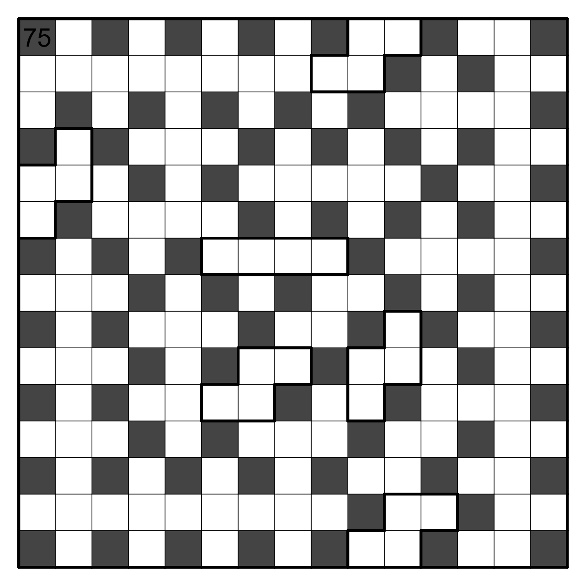
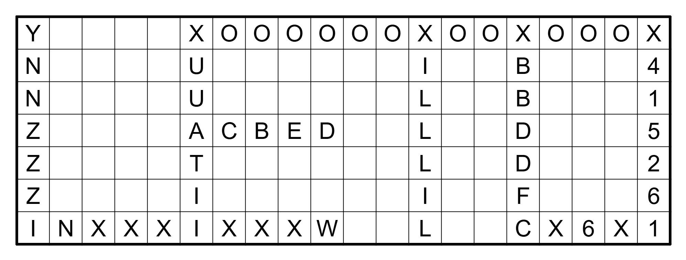

# 氏毛米页

## 题面

_官方存档未提供可提取的文字题面；请查看下方附件或交互源码。_

## 交互源码

### html

```html
<a href="../../../assets/static.cipherpuzzles.com/static/images/5ee0573155ad4b86b277f599a63545ef.pdf" target="_blank">下载 PDF 文档</a>
```


## 答案

`LETO`

## 解析

<style>
#answerkey {
    border-collapse: collapse;
    border-spacing: 0
}
#answerkey th {
    text-align: center;
    font-weight: bold;
    vertical-align: middle;
    padding: 3px 10px;
}
#answerkey td {
    border-style: solid none;
    border-width: thin;
    vertical-align: middle;
    padding: 3px 9px;
}
</style>

本题的机制是：每题都被遮盖住一些信息，但是可以补充这些信息，使得题目存在唯一解。对于大多数小题，存在唯一方式补充信息得到唯一解。对于另一些小题 （Akari 和 Moon or Sun），有多种不同的方式得到唯一解，但是所有这些唯一解都是相同的。利用唯一性可以解出所有小题。

求出前九个小题的提交行后，用这些提交行在 7x20 的网格内做 Scrabble，象形得到最终答案 `LETO`。

<table id="answerkey">
<tr><th>标题</th><th>提交行</th></tr>
<tr><td>Easy as C16 简单字符</td><td>CX6X1</td></tr>
<tr><td>Pyramid Climbers 攀登金字塔</td><td>XUUATII</td></tr>
<tr><td>Akari 美术馆</td><td>X415261</td></tr>
<tr><td>Numberlink 数连</td><td>XBBDDFC</td></tr>
<tr><td>Moon or Sun 日月交替</td><td>XILLLIL</td></tr>
<tr><td>Pentominous 五格拼版</td><td>INXXXIXXXW</td></tr>
<tr><td>Simple Loop 简单回路</td><td>ACBED</td></tr>
<tr><td>Statue Park 雕像公园</td><td>YNNZZZI</td></tr>
<tr><td>Heywake 数间</td><td>XOOOOOOXOOXOOOX</td></tr>
<tr><td>Scrabble 拼词</td><td>LETO</td></tr>
</table>

以下解析每道题的做法。

## Easy as C16 简单字符

被遮住的位置只有三种可能，枚举即可。



## Pyramid Climbers 攀登金字塔

猜测或利用唯一性可以确定第五行左侧的两个字母是 U 和 C。据此可以推出大半盘面。剩余部分继续使用唯一性。



## Akari 美术馆

使用给出的线索可以确定大部分盘面。剩余部分使用唯一性。



## Numberlink 数连

右下的 E 必须从下方向左侧连出，否则局部显然不唯一。之后都比较简单。



## Moon or Sun 日月交替

利用唯一性可以逻辑解。



## Pentominous 五格拼版

根据对于 Pentominous 题型的理解，可以猜测上方被遮盖的线索是 I，因为这样会强制中间的两个 X 分开，使得题目唯一的可能性较大。据此可以确定四分之三的盘面。
此时右侧被遮盖的线索只有两种可能性 （W 和 N），只有 W 能够使得题目唯一。



## Simple Loop 简单回路

左上和左中最多有两个线索。因为所有线索的奇偶性应当平衡，所以线索总数至多为 8。
根据对 Simple Loop 的理解，如果只有6个线索，那么很有可能非唯一解。因此猜测线索总数为8。
据此可以推出中下的两个线索必须都留下来，并且左上和左中的两个线索只有唯一的选取方式。之后都比较简单。



## Statue Park 雕像公园

可以将12个五格拼版分为4组，每组3个。每组有两种（互相对称的）方式可以填入 5x5-1 的角落中。因此给出的线索必须能够区分这两种对称的方式。
据此可以依次确定左下区域的线索必须为白，右上区域的线索必须为黑，右下区域的线索必须为黑。



## Heywake 数间

本题使用 penalty 理论。通过计算可以发现线索等于 75 时 penalty 取满，并且可逻辑推出唯一解。线索不等于75时都显然不唯一。



## Scrabble 拼词

猜测字符串集合是所有的提交行。观察给出的网格角落可以发现比例是 7:20，猜测给出的网格是 7x20。解出 Scrabble 之后，象形得到最终答案 `LETO`。



## 提示

### 1. 我毫无头绪

在被墨迹遮盖之前，所有的纸笔谜题均有唯一解。

### 2. Scrabble 的题面是什么？

Scrabble 的题面是7x20的网格，使用的字符串集合是前九题的提交行。

### 3. heyawake太难了！

这些可能会有帮助：
https://puzz.link/p?heyawake
https://semiexp.net/apps/cspuz-solver2/index.html

### 4. 能否给我所有小题的题面？

Easy as C16 被挡住的是 C

金字塔被挡住的是 UCXII

美术馆墨水没有挡住任何黑块或数字。

numberlink 三个小墨水挡住的从上到下是 A C E，大墨水挡住的是 BDGF


日月的日月分布为：

空空月空日空空

日空日空空空月

空空空日空日日

日空月月空空空

空空空空月日空

日月日空空空空

空空空空日空日


五格拼版被挡住的是I和W

简单回路里的黑格在：第二行第3，6格；第四行最后一格；第六行第1格；第八行第7，10格；第九行第3、6格。


雕像公园左下区域的线索为白，右上区域的线索为黑，右下区域的线索为黑。


数间左上角数字是75.


## 中间答案

| 提交 | 回复 | 附加信息 |
| --- | --- | --- |
| XOOOOOOXOOXOOOX | 正确的中间答案。 |  |
| YNNZZZI | 正确的中间答案。 |  |
| XILLLIL | 正确的中间答案。 |  |
| X415261 | 正确的中间答案。 |  |
| CX6X1 | 正确的中间答案。 |  |
| INXXXIXXXW | 正确的中间答案。 |  |
| XBBDDFC | 正确的中间答案。 |  |
| XUUATII | 正确的中间答案。 |  |
| ACBED | 正确的中间答案。 |  |

## 本地附件

- [08cb2fdf8a3041659982fe510b62c77e.webp](../../../assets/static.cipherpuzzles.com/static/images/08cb2fdf8a3041659982fe510b62c77e.webp)
- [0d017087aebc47a1b06d3a3d96771f15.webp](../../../assets/static.cipherpuzzles.com/static/images/0d017087aebc47a1b06d3a3d96771f15.webp)
- [3c3ec38372db4029bb64cbd59fcae636.webp](../../../assets/static.cipherpuzzles.com/static/images/3c3ec38372db4029bb64cbd59fcae636.webp)
- [5282405869124082b4ed306cf7181f54.webp](../../../assets/static.cipherpuzzles.com/static/images/5282405869124082b4ed306cf7181f54.webp)
- [5aec4bc6f7114915918ac654b5c593cc.webp](../../../assets/static.cipherpuzzles.com/static/images/5aec4bc6f7114915918ac654b5c593cc.webp)
- [5ee0573155ad4b86b277f599a63545ef.pdf](../../../assets/static.cipherpuzzles.com/static/images/5ee0573155ad4b86b277f599a63545ef.pdf)
- [a2420272376a40d793888c8fe0b24483.webp](../../../assets/static.cipherpuzzles.com/static/images/a2420272376a40d793888c8fe0b24483.webp)
- [b12e6a2f1bfb4e00a0f5463eadf463fd.webp](../../../assets/static.cipherpuzzles.com/static/images/b12e6a2f1bfb4e00a0f5463eadf463fd.webp)
- [b338df138e3d45b890bb1cf54d632baa.webp](../../../assets/static.cipherpuzzles.com/static/images/b338df138e3d45b890bb1cf54d632baa.webp)
- [cd03a72454d34726b0bc519723e2e533.webp](../../../assets/static.cipherpuzzles.com/static/images/cd03a72454d34726b0bc519723e2e533.webp)
- [e9517de80fd34da18c917509f902ed4a.webp](../../../assets/static.cipherpuzzles.com/static/images/e9517de80fd34da18c917509f902ed4a.webp)
- [fb4e6cb674f142e5acd57a08c3098654.webp](../../../assets/static.cipherpuzzles.com/static/images/fb4e6cb674f142e5acd57a08c3098654.webp)

来源：[https://ccbc16.cipherpuzzles.com/data/puzzles/30.json](https://ccbc16.cipherpuzzles.com/data/puzzles/30.json)
