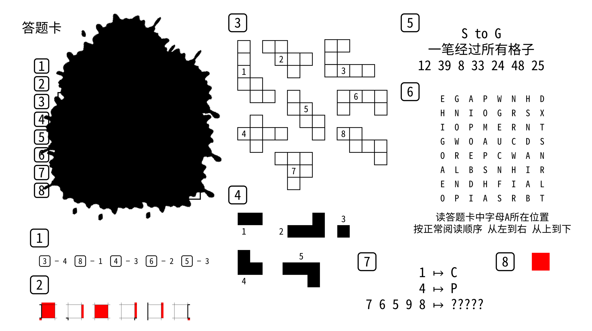
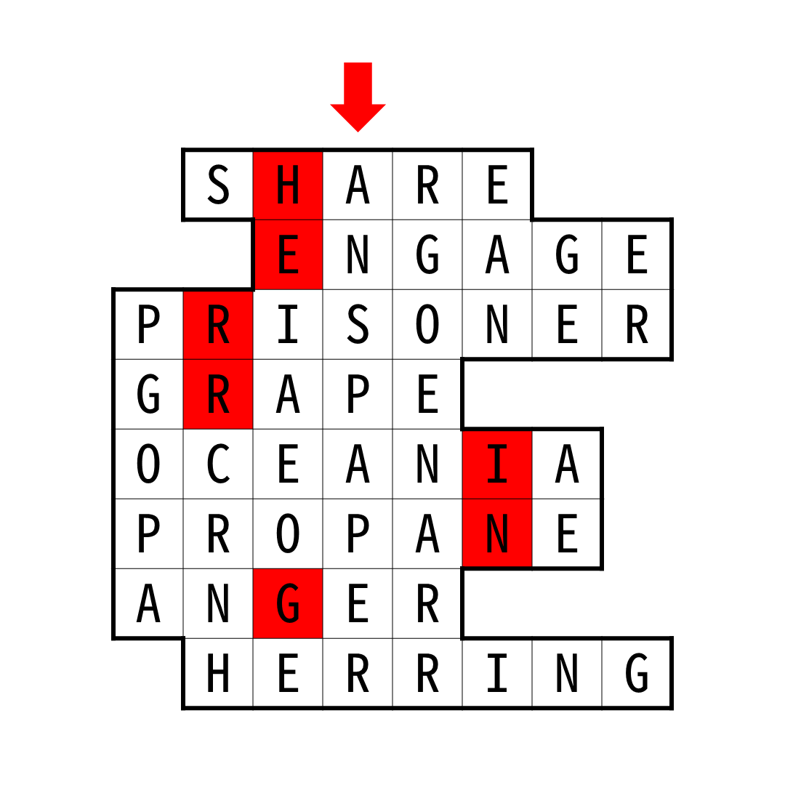

# 先有鸡还是先有蛋？

## 题面

## 答案

`PAPER`

## 解析

本题的机制是：每道小题使用答题卡中的网格，但是同时网格的内容就是小题答案。玩家需要在理解机制的基础上推出网格的形状和内容。

<table id="answerkey">
<tr><th>编号</th><th>答案</th><th>机制</th></tr>
<tr><td>1</td><td>SHARE</td><td>读小题答案的给定位置</td></tr>
<tr><td>2</td><td>ENGAGE</td><td>读截图所在格字母</td></tr>
<tr><td>3</td><td>PRISONER</td><td>用给出的形状拼出答题卡中网格，按数字顺序读字母</td></tr>
<tr><td>4</td><td>GRAPE</td><td>用给出的形状拼出答题卡中网格（在8x8网格中）的补，按数字顺序读字母</td></tr>
<tr><td>5</td><td>OCEANIA</td><td>从字母 S 出发，到字母 G，一笔画经过所有格子，按给出的数字读字母</td></tr>
<tr><td>6</td><td>PROPANE</td><td>按指示操作，读字母</td></tr>
<tr><td>7</td><td>ANGER</td><td>变换规则为：将数字变为出现该数字次的字母</td></tr>
<tr><td>8</td><td>HERRING</td><td>读所有红色格字母</td></tr>
</table>

做题时，可以先用3和4两个小题推出网格形状（据此得到每个小题答案长度）。然后用小题2得到所有红格位置。根据小题6答案长度可以确定小题7答案的第一个字母是A。使用剩余的线索可以得到大量网格字母间的相等关系。通过一些猜测或工具可以填满网格。

最终提取时，观察网格可以发现竖着的 `ANS PAPER`。答案即为 `PAPER`。

## 提示

### 1. 我毫无头绪

本题的机制是：每道小题使用答题卡中的网格，但是同时网格的内容就是小题答案。

### 2. 小题3的规则

用给出的形状拼出答题卡中网格。

### 3. 小题4的规则

用给出的形状拼出答题卡中网格（在8x8网格中）的补。

### 4. 小题7的规则

变换规则为：将数字变为出现该数字次的字母。

### 5. 该如何提取

提取所使用的箭头也被墨迹覆盖了。题目未遮住时有一个在盘面上方往下指某一列的箭头。仔细观察你所得到的盘面。

### 6. 鸡和蛋死锁了，推理太难啦！能不能给我个切入点

第八小题的答案是herring

## 本地附件

- [6f641a3c6a9046b0bc376de1fbd085fd.webp](../../../assets/static.cipherpuzzles.com/static/images/6f641a3c6a9046b0bc376de1fbd085fd.webp)
- [cc42934cfe444cc7b35a4ddf07a9c62a.webp](../../../assets/static.cipherpuzzles.com/static/images/cc42934cfe444cc7b35a4ddf07a9c62a.webp)
- [d2bfa741809241e096c761c0a1c07be2.webp](../../../assets/static.cipherpuzzles.com/static/images/d2bfa741809241e096c761c0a1c07be2.webp)

来源：[https://ccbc16.cipherpuzzles.com/data/puzzles/31.json](https://ccbc16.cipherpuzzles.com/data/puzzles/31.json)
