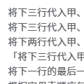
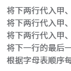

# 代入演算

## 题面

## 碎片 1-1

修改于 2025/08/09 20:24
补上了第二部分中句尾缺少的一个分号

修改于 2025/08/09 22:45
修改每段演算中的倒数第二句

修改于 2025/08/11 01:50
第二段中语句顺序有问题，已修改！！！

将下四行代入甲、乙、丙、丁：「甲；丙；「乙；丙；丁」」； 
「将下两行代入甲、乙：「甲；「甲；「甲；「甲；「甲；「甲；乙」」」」」」；将下两行代入甲、乙：「甲；「甲；乙」」」； 
「将下两行代入甲、乙：「甲；「甲；乙」」；将下两行代入甲、乙：「甲；「甲；「甲；乙」」」」； 
将下三行代入甲、乙、丙：「乙；「甲；乙；丙」」； 
「将下两行代入甲、乙：「甲；「甲；「甲；乙」」」；将下两行代入甲、乙：「甲；「甲；「甲；「甲；「甲；乙」」」」」」； 
将本段演算中用于提取的数字加一； 
根据字母表顺序每两位提取：5 

「将下两行代入甲、乙：「甲；「甲；「甲；「甲；「甲；「甲；乙」」」」」」；将下两行代入甲、乙：「甲；「甲；「甲；乙」」」」； 
将下三行代入甲、乙、丙：「甲；将下两行代入丁、戊：「戊；「丁；乙」」；将下一行代入丁：「丙」；将下一行代入丁：「丁」」； 
「将下两行代入甲、乙：「甲；「甲；「甲；「甲；「甲；「甲；「甲；「甲；「甲；「甲；「甲；乙」」」」」」」」」」」；将下两行代入甲、乙：「甲；「甲；乙」」」； 
将本段演算中用于提取的数字加一； 
根据字母表顺序每两位提取：2 

## 碎片 3-4

修改于 2025/08/09 22:45
修改每段演算中的倒数第二句

将下三行代入甲、乙、丙：「甲；「乙；丙」」； 
将下三行代入甲、乙、丙：「甲；将下四行代入丁、戊、己、庚：「戊；「丁；己；庚；戊」」；将下三行代入丁、戊、己：「丙」；乙；将下一行代入丁：「丁」；将下一行代入丁：「丁」」； 
将下两行代入甲、乙：「甲；「甲；「甲；乙」」」； 
「将下三行代入甲、乙、丙：「甲；「乙；丙」」；将下两行代入甲、乙：「甲；「甲；乙」」；将下两行代入甲、乙：「甲；「甲；「甲；「甲；「甲；「甲；「甲；乙」」」」」」」」； 
将本段演算中用于提取的数字加一； 
根据字母表顺序每两位提取：4 

将下三行代入甲、乙、丙：「甲；「乙；丙」」； 
将下三行代入甲、乙、丙：「甲；「乙；丙」」； 
将下一行代入甲：「甲；「将下两行代入乙、丙：「将下三行代入丁、戊、己：「丁；「戊；己」」；丙；「乙；「将下三行代入丁、戊、己：「戊；「丁；戊；己」」；丙」」」」；将下两行代入乙、丙：「丙」；将下一行代入乙：「乙」」； 
将下两行代入甲、乙：「甲；「甲；「甲；「甲；「甲；「甲；乙」」」」」」； 
将下两行代入甲、乙：「甲；「甲；「甲；乙」」」； 
将本段演算中用于提取的数字加一； 
根据字母表顺序每两位提取：-155 

## 碎片 8-4

修改于 2025/08/09 22:45
修改每段演算中的倒数第二句

修改于 2025/08/14 00:00
删除例子中的重复部分

<button id="button_73" onclick="document.getElementById('example_73').classList.toggle('collapsed')">例</button>

将下两行代入甲、乙：「甲；「甲；乙」」； 
将下两行代入甲、乙：「甲；「甲；乙」」； 
将本段演算中用于提取的数字加一； 
得到数字：0 
↓ 
「将下两行代入甲、乙：「甲；「甲；乙」」；「将下两行代入甲、乙：「甲；「甲；乙」」；将本段演算中用于提取的数字加一」」； 
得到数字：0 
↓ 
将下两行代入甲、乙：「甲；「甲；乙」」； 
「将下两行代入甲、乙：「甲；「甲；乙」」；将本段演算中用于提取的数字加一」； 
得到数字：0 
↓ 
「「将下两行代入甲、乙：「甲；「甲；乙」」；将本段演算中用于提取的数字加一」；「「将下两行代入甲、乙：「甲；「甲；乙」」；将本段演算中用于提取的数字加一」；得到数字：0」」 
↓ 
「将下两行代入甲、乙：「甲；「甲；乙」」；将本段演算中用于提取的数字加一」； 
「「将下两行代入甲、乙：「甲；「甲；乙」」；将本段演算中用于提取的数字加一」；得到数字：0」 
↓ 
将下两行代入甲、乙：「甲；「甲；乙」」； 
将本段演算中用于提取的数字加一； 
「「将下两行代入甲、乙：「甲；「甲；乙」」；将本段演算中用于提取的数字加一」；得到数字：0」 
↓ 
「将本段演算中用于提取的数字加一；「将本段演算中用于提取的数字加一；「「将下两行代入甲、乙：「甲；「甲；乙」」；将本段演算中用于提取的数字加一」；得到数字：0」」」 
↓ 
将本段演算中用于提取的数字加一； 
「将本段演算中用于提取的数字加一；「「将下两行代入甲、乙：「甲；「甲；乙」」；将本段演算中用于提取的数字加一」；得到数字：0」」 
↓ 
「将本段演算中用于提取的数字加一；「「将下两行代入甲、乙：「甲；「甲；乙」」；将本段演算中用于提取的数字加一」；得到数字：1」」 
↓ 
将本段演算中用于提取的数字加一； 
「「将下两行代入甲、乙：「甲；「甲；乙」」；将本段演算中用于提取的数字加一」；得到数字：1」 
↓ 
「「将下两行代入甲、乙：「甲；「甲；乙」」；将本段演算中用于提取的数字加一」；得到数字：2」 
↓ 
「将下两行代入甲、乙：「甲；「甲；乙」」；将本段演算中用于提取的数字加一」； 
得到数字：2 
↓ 
将下两行代入甲、乙：「甲；「甲；乙」」； 
将本段演算中用于提取的数字加一； 
得到数字：2 
↓ 
「将本段演算中用于提取的数字加一；「将本段演算中用于提取的数字加一；得到数字：2」」； 
↓ 
将本段演算中用于提取的数字加一； 
「将本段演算中用于提取的数字加一；得到数字：2」 
↓ 
「将本段演算中用于提取的数字加一；得到数字：3」 
↓ 
将本段演算中用于提取的数字加一； 
得到数字：3 
↓ 
得到数字：4 

将下两行代入甲、乙：「甲；「甲；「甲；乙」」」； 
将下两行代入甲、乙：「甲；「甲；乙」」； 
将下两行代入甲、乙：「甲；「甲；「甲；乙」」」； 
将本段演算中用于提取的数字加一； 
根据字母表顺序每两位提取：-4656 

将下一行代入甲：「甲；甲；甲；「甲；甲；甲；甲」；甲；甲」； 
将下三行代入甲、乙、丙：「甲；「乙；丙」」； 
将下两行代入甲、乙：「甲；「甲；「甲；「甲；「甲；「甲；乙」」」」」」； 
将下两行代入甲、乙：「甲；「甲；乙」」； 
将下两行代入甲、乙：「甲；「甲；「甲；乙」」」； 
将下两行代入甲、乙：「甲；「甲；「甲；「甲；「甲；「甲；「甲；「甲；「甲；「甲；「甲；乙」」」」」」」」」」」； 
将本段演算中用于提取的数字加一； 
根据字母表顺序每两位提取：12 

## 交互源码

- fragment_source: [../../../assets/ccbc16.cipherpuzzles.com/data/articles/fragments.json](../../../assets/ccbc16.cipherpuzzles.com/data/articles/fragments.json)

## 答案

`EXCUSE`

## 解析

本题由以下几个碎片组成：

本题标题提示了本题主题是λ演算。通过仿照例子手动演算理解、寻找运行工具、或是与已有表达式进行对比，可以确定每行的作用。对每部分进行计算可以得到`SUBMIT EXCUSE`，最终答案为`EXCUSE`。

<table id="answerkey">
<tr><th>编号</th><th>λ演算表达式（不含最后两行）</th><th>数学算式（含最后偏移）</th><th>计算结果</th><th>答案</th><th>解释</th></tr>
<tr><td>①</td><td>3 2 3</td><td>3^2^3 -4656</td><td>1905</td><td>SE</td><td>式子(a b)就是计算b^a</td></tr>
<tr><td>②</td><td>(λx.xxx(xxxx)xx) B 6 2 3 11</td><td>2^6*3*11 +12</td><td>2124</td><td>UX</td><td>(λxyz.x(yz))即B，原式化简可得到(B(B(6 2)3)11)；同时B也表示乘法，即(B a b)是计算a*b</td></tr>
<tr><td>③</td><td>ADD (6 2) (2 3) SUC (3 5)</td><td>2^6+3^2+5^3 +5</td><td>203</td><td>BC</td><td>第一行是加法，第四行是后继；(ADD a b)和(a SUC b)都是计算a+b</td></tr>
<tr><td>④</td><td>SUB (11 2) (6 3)</td><td>2^11-3^6 +2</td><td>1321</td><td>MU</td><td>第一行是减法，(SUB a b)是计算a-b</td></tr>
<tr><td>⑤</td><td>B DIV3 3 (B 2 7)</td><td>CEIL((2*7)^3/3) +4</td><td>919</td><td>IS</td><td>第二行是除以三向上取整，(DIV3 a)即CEIL(a/3)</td></tr>
<tr><td>⑥</td><td>B B FAC 6 3</td><td>6!*3 -155</td><td>2005</td><td>TE</td><td>第三行是阶乘，(FAC a)即a!</td></tr>
</table>

## 提示

### 1. 这道题需要哪些碎片！

### 2. 这是什么！看不懂！

这是使用λ演算计算邱奇数。可以使用下方网站进行尝试。
https://dallaylaen.github.io/ski-interpreter/

### 3. 还是做不明白……有没有每组提示！

每组新介绍了一种运算。1到6组分别为幂、乘、加、减、除、阶乘。

## 本地附件

- [fragments.json](../../../assets/ccbc16.cipherpuzzles.com/data/articles/fragments.json)
- [027d0cad05b04e6aade9f57ad94f037c.webp](../../../assets/static.cipherpuzzles.com/static/images/027d0cad05b04e6aade9f57ad94f037c.webp)
- [02c845bcdc9e4e14bb5f3a6b3e6169d4.webp](../../../assets/static.cipherpuzzles.com/static/images/02c845bcdc9e4e14bb5f3a6b3e6169d4.webp)
- [04caa57b60284718b98741fa322f279f.webp](../../../assets/static.cipherpuzzles.com/static/images/04caa57b60284718b98741fa322f279f.webp)
- [058df0126b2746138b7c4a6873d6d413.webp](../../../assets/static.cipherpuzzles.com/static/images/058df0126b2746138b7c4a6873d6d413.webp)
- [066c531d05974507b077aa06c0653625.webp](../../../assets/static.cipherpuzzles.com/static/images/066c531d05974507b077aa06c0653625.webp)
- [06f134bef60b4e7e8452f7f1d76d8d11.webp](../../../assets/static.cipherpuzzles.com/static/images/06f134bef60b4e7e8452f7f1d76d8d11.webp)
- [078b2ada207c40f0b95640164a24de1e.webp](../../../assets/static.cipherpuzzles.com/static/images/078b2ada207c40f0b95640164a24de1e.webp)
- [0b4a9daa93734fb3aec74fd2fab50745.webp](../../../assets/static.cipherpuzzles.com/static/images/0b4a9daa93734fb3aec74fd2fab50745.webp)
- [0bc72467edf4429c95538a4f7d6598a0.webp](../../../assets/static.cipherpuzzles.com/static/images/0bc72467edf4429c95538a4f7d6598a0.webp)
- [0e98ffc9a1d344b2aac9c6350e83ea78.webp](../../../assets/static.cipherpuzzles.com/static/images/0e98ffc9a1d344b2aac9c6350e83ea78.webp)
- [12c3546071594a2c9a449288a056bdf2.webp](../../../assets/static.cipherpuzzles.com/static/images/12c3546071594a2c9a449288a056bdf2.webp)
- [1424e3712cfc420a84f96e82a0faa70d.webp](../../../assets/static.cipherpuzzles.com/static/images/1424e3712cfc420a84f96e82a0faa70d.webp)
- [146b53c8be79476596456f59be2c7d95.png](../../../assets/static.cipherpuzzles.com/static/images/146b53c8be79476596456f59be2c7d95.png)
- [1627402c9e5c47218c9762c0c31e600b.webp](../../../assets/static.cipherpuzzles.com/static/images/1627402c9e5c47218c9762c0c31e600b.webp)
- [1c24c81b21224784b42808d87822c340.webp](../../../assets/static.cipherpuzzles.com/static/images/1c24c81b21224784b42808d87822c340.webp)
- [1e1bd968a003458a8c85c293cdad46b8.webp](../../../assets/static.cipherpuzzles.com/static/images/1e1bd968a003458a8c85c293cdad46b8.webp)
- [2202ffeb001c450399b9e6ab036e1b51.webp](../../../assets/static.cipherpuzzles.com/static/images/2202ffeb001c450399b9e6ab036e1b51.webp)
- [239a2d627b1845458b4571020a7c336e.webp](../../../assets/static.cipherpuzzles.com/static/images/239a2d627b1845458b4571020a7c336e.webp)
- [277b90dc8f674d2eae96f306c8d29062.webp](../../../assets/static.cipherpuzzles.com/static/images/277b90dc8f674d2eae96f306c8d29062.webp)
- [29b6eedddced46a8a164ed503147377d.webp](../../../assets/static.cipherpuzzles.com/static/images/29b6eedddced46a8a164ed503147377d.webp)
- [2a4b2216bd6f4194b4fabf026325faf4.webp](../../../assets/static.cipherpuzzles.com/static/images/2a4b2216bd6f4194b4fabf026325faf4.webp)
- [2a698ad8033845998b22bf73a282114a.webp](../../../assets/static.cipherpuzzles.com/static/images/2a698ad8033845998b22bf73a282114a.webp)
- [2aef72b5c42f456c8f1305368b041f89.webp](../../../assets/static.cipherpuzzles.com/static/images/2aef72b5c42f456c8f1305368b041f89.webp)
- [2c3f75f4c92f4f07a6d2a18db537aa1e.webp](../../../assets/static.cipherpuzzles.com/static/images/2c3f75f4c92f4f07a6d2a18db537aa1e.webp)
- [2d3b6c4f97d6457ba859687cad85539d.webp](../../../assets/static.cipherpuzzles.com/static/images/2d3b6c4f97d6457ba859687cad85539d.webp)
- [304cdc456cba436c8f475e080e774ac8.webp](../../../assets/static.cipherpuzzles.com/static/images/304cdc456cba436c8f475e080e774ac8.webp)
- [3286c03bd53a4dcb8107fe44b5993c2c.webp](../../../assets/static.cipherpuzzles.com/static/images/3286c03bd53a4dcb8107fe44b5993c2c.webp)
- [34159a94d08f4df2834362395396db2f.webp](../../../assets/static.cipherpuzzles.com/static/images/34159a94d08f4df2834362395396db2f.webp)
- [3949831264c24365bb4617e32aa7c9d3.webp](../../../assets/static.cipherpuzzles.com/static/images/3949831264c24365bb4617e32aa7c9d3.webp)
- [3a7f0158b909494b8e4072ef2454fce9.webp](../../../assets/static.cipherpuzzles.com/static/images/3a7f0158b909494b8e4072ef2454fce9.webp)
- [3a8f756d3db8433badf0b45b19d0b5f6.vue](../../../assets/static.cipherpuzzles.com/static/images/3a8f756d3db8433badf0b45b19d0b5f6.vue)
- [3bbcf7eb367045baa97e03a7a9fcd1ed.webp](../../../assets/static.cipherpuzzles.com/static/images/3bbcf7eb367045baa97e03a7a9fcd1ed.webp)
- [3c712e208e67468999c7e64e2004fc14.webp](../../../assets/static.cipherpuzzles.com/static/images/3c712e208e67468999c7e64e2004fc14.webp)
- [407f949ece0f4732939cb37e6cfe3c2f.webp](../../../assets/static.cipherpuzzles.com/static/images/407f949ece0f4732939cb37e6cfe3c2f.webp)
- [40a194bacd6347c8b39ee6b7c998d1f3.webp](../../../assets/static.cipherpuzzles.com/static/images/40a194bacd6347c8b39ee6b7c998d1f3.webp)
- [40bbc53c38754ae48bc29a5706c2964d.vue](../../../assets/static.cipherpuzzles.com/static/images/40bbc53c38754ae48bc29a5706c2964d.vue)
- [41fa976073ef4af4854a53d1e52d0ec6.webp](../../../assets/static.cipherpuzzles.com/static/images/41fa976073ef4af4854a53d1e52d0ec6.webp)
- [450c075bf141497cb639ba7adfa6ed9c.webp](../../../assets/static.cipherpuzzles.com/static/images/450c075bf141497cb639ba7adfa6ed9c.webp)
- [4737d2b1c71749789a8bb2eb43418b86.webp](../../../assets/static.cipherpuzzles.com/static/images/4737d2b1c71749789a8bb2eb43418b86.webp)
- [4b0d75fcfbc449f88fd60daace8ff90b.webp](../../../assets/static.cipherpuzzles.com/static/images/4b0d75fcfbc449f88fd60daace8ff90b.webp)
- [4c655d36976848cbb443dcc62b682c50.webp](../../../assets/static.cipherpuzzles.com/static/images/4c655d36976848cbb443dcc62b682c50.webp)
- [4d681eb50b9e4302b922ac0a2858ca50.webp](../../../assets/static.cipherpuzzles.com/static/images/4d681eb50b9e4302b922ac0a2858ca50.webp)
- [4e2ac86e0e35498f8051089dbad0ba06.m4a](../../../assets/static.cipherpuzzles.com/static/images/4e2ac86e0e35498f8051089dbad0ba06.m4a)
- [4e2b2c9c21334732ab04293abebfbef2.webp](../../../assets/static.cipherpuzzles.com/static/images/4e2b2c9c21334732ab04293abebfbef2.webp)
- [587c389311644c768b95a99da0c6a055.webp](../../../assets/static.cipherpuzzles.com/static/images/587c389311644c768b95a99da0c6a055.webp)
- [58ec28fd9a364a878999ccdcdb8f88e2.webp](../../../assets/static.cipherpuzzles.com/static/images/58ec28fd9a364a878999ccdcdb8f88e2.webp)
- [5f9954e657aa432c81996efca734835d.webp](../../../assets/static.cipherpuzzles.com/static/images/5f9954e657aa432c81996efca734835d.webp)
- [645453f1631e4f3298ea74f90461089a.webp](../../../assets/static.cipherpuzzles.com/static/images/645453f1631e4f3298ea74f90461089a.webp)
- [6496a66a70be44dbafcb22007a5d16c5.webp](../../../assets/static.cipherpuzzles.com/static/images/6496a66a70be44dbafcb22007a5d16c5.webp)
- [65b0a1f818084c3da4e6ea997df8e58f.webp](../../../assets/static.cipherpuzzles.com/static/images/65b0a1f818084c3da4e6ea997df8e58f.webp)
- [67880ddb5077464ca88d0be134c62503.svg](../../../assets/static.cipherpuzzles.com/static/images/67880ddb5077464ca88d0be134c62503.svg)
- [6ec7573b35284eca8c4b80ee93934c19.webp](../../../assets/static.cipherpuzzles.com/static/images/6ec7573b35284eca8c4b80ee93934c19.webp)
- [71faa5f9c94e4beb8427ba2e8ba84160.webp](../../../assets/static.cipherpuzzles.com/static/images/71faa5f9c94e4beb8427ba2e8ba84160.webp)
- [72300d3434f543599255775b9d792551.webp](../../../assets/static.cipherpuzzles.com/static/images/72300d3434f543599255775b9d792551.webp)
- [74c14fcab1f940a6ab0037b6621ad351.webp](../../../assets/static.cipherpuzzles.com/static/images/74c14fcab1f940a6ab0037b6621ad351.webp)
- [7594e058cc0c4786aadf4a09a570bd5b.webp](../../../assets/static.cipherpuzzles.com/static/images/7594e058cc0c4786aadf4a09a570bd5b.webp)
- [75a74da80ac243b997cbca9e18b4b9c3.webp](../../../assets/static.cipherpuzzles.com/static/images/75a74da80ac243b997cbca9e18b4b9c3.webp)
- [76c62ab95d0740d69bcf18439e441ba5.webp](../../../assets/static.cipherpuzzles.com/static/images/76c62ab95d0740d69bcf18439e441ba5.webp)
- [76d08fa26edf4bedaab03e335aa89445.webp](../../../assets/static.cipherpuzzles.com/static/images/76d08fa26edf4bedaab03e335aa89445.webp)
- [783f1bc7f6354b76adcb26f2e42fdd3e.webp](../../../assets/static.cipherpuzzles.com/static/images/783f1bc7f6354b76adcb26f2e42fdd3e.webp)
- [7dfdfa5743044615b898dad119738f59.webp](../../../assets/static.cipherpuzzles.com/static/images/7dfdfa5743044615b898dad119738f59.webp)
- [80405b809f3b44aaaf9e99de7b0e9383.webp](../../../assets/static.cipherpuzzles.com/static/images/80405b809f3b44aaaf9e99de7b0e9383.webp)
- [80f9552234ad413bbe1139c3346700ce.webp](../../../assets/static.cipherpuzzles.com/static/images/80f9552234ad413bbe1139c3346700ce.webp)
- [83ace155aab8437488658c572d6cd619.webp](../../../assets/static.cipherpuzzles.com/static/images/83ace155aab8437488658c572d6cd619.webp)
- [83bb25000e0948129e41e54ed0a4da8c.webp](../../../assets/static.cipherpuzzles.com/static/images/83bb25000e0948129e41e54ed0a4da8c.webp)
- [865422f90c7e41278fd6cea5b4e66bf5.webp](../../../assets/static.cipherpuzzles.com/static/images/865422f90c7e41278fd6cea5b4e66bf5.webp)
- [8778fa28ca2140b086ad465cf4d2b75c.webp](../../../assets/static.cipherpuzzles.com/static/images/8778fa28ca2140b086ad465cf4d2b75c.webp)
- [887f9fad57a44eb7b0b1821c02f599a6.webp](../../../assets/static.cipherpuzzles.com/static/images/887f9fad57a44eb7b0b1821c02f599a6.webp)
- [89dc0276826a40fcb1e7714b59e1834f.m4a](../../../assets/static.cipherpuzzles.com/static/images/89dc0276826a40fcb1e7714b59e1834f.m4a)
- [8abd097a5fb44452bf4f2e9116928b9a.webp](../../../assets/static.cipherpuzzles.com/static/images/8abd097a5fb44452bf4f2e9116928b9a.webp)
- [8cb37f0a5d304539bed5b690ce46433a.webp](../../../assets/static.cipherpuzzles.com/static/images/8cb37f0a5d304539bed5b690ce46433a.webp)
- [8d28cd61083a4db08b9a1044debc0f79.webp](../../../assets/static.cipherpuzzles.com/static/images/8d28cd61083a4db08b9a1044debc0f79.webp)
- [919bb519b97249e5b85485301451e1eb.webp](../../../assets/static.cipherpuzzles.com/static/images/919bb519b97249e5b85485301451e1eb.webp)
- [92d60a9e6e3f4c6ca1b378d490c10770.webp](../../../assets/static.cipherpuzzles.com/static/images/92d60a9e6e3f4c6ca1b378d490c10770.webp)
- [93e63cee04574291a6d5dd12b9580f1a.webp](../../../assets/static.cipherpuzzles.com/static/images/93e63cee04574291a6d5dd12b9580f1a.webp)
- [93ea16de1497448f8a09346906737221.webp](../../../assets/static.cipherpuzzles.com/static/images/93ea16de1497448f8a09346906737221.webp)
- [94d138b995984f44b4c23c7338619832.webp](../../../assets/static.cipherpuzzles.com/static/images/94d138b995984f44b4c23c7338619832.webp)
- [96e0bdd820224f5788b9f7193d1cde92.webp](../../../assets/static.cipherpuzzles.com/static/images/96e0bdd820224f5788b9f7193d1cde92.webp)
- [96eab2c7ffaa4d0ca8626e470a0fc6b4.m4a](../../../assets/static.cipherpuzzles.com/static/images/96eab2c7ffaa4d0ca8626e470a0fc6b4.m4a)
- [97848f54050f450ca8e8574dfaa22f52.webp](../../../assets/static.cipherpuzzles.com/static/images/97848f54050f450ca8e8574dfaa22f52.webp)
- [9a991d6fe984435e83a133b352a27c6e.webp](../../../assets/static.cipherpuzzles.com/static/images/9a991d6fe984435e83a133b352a27c6e.webp)
- [9e607840dac14a239dba28e923d9d900.webp](../../../assets/static.cipherpuzzles.com/static/images/9e607840dac14a239dba28e923d9d900.webp)
- [9ea2a17f63dd4b0db8db956faf8fbce2.webp](../../../assets/static.cipherpuzzles.com/static/images/9ea2a17f63dd4b0db8db956faf8fbce2.webp)
- [9f54c50135de455dbbd0fe501df82359.webp](../../../assets/static.cipherpuzzles.com/static/images/9f54c50135de455dbbd0fe501df82359.webp)
- [9f9bfe8b507848a7b6339533296a1574.webp](../../../assets/static.cipherpuzzles.com/static/images/9f9bfe8b507848a7b6339533296a1574.webp)
- [a1643c2338104308bac0119b39a15bea.webp](../../../assets/static.cipherpuzzles.com/static/images/a1643c2338104308bac0119b39a15bea.webp)
- [a2878c4c675f451791ad148de6d1b96e.webp](../../../assets/static.cipherpuzzles.com/static/images/a2878c4c675f451791ad148de6d1b96e.webp)
- [a2c35b677ddf4ac3be9664456d784123.webp](../../../assets/static.cipherpuzzles.com/static/images/a2c35b677ddf4ac3be9664456d784123.webp)
- [a6599abb63d0425b95a9e77ba6f4f9c4.webp](../../../assets/static.cipherpuzzles.com/static/images/a6599abb63d0425b95a9e77ba6f4f9c4.webp)
- [a712de9831f64b2d8586ca4d2426db08.webp](../../../assets/static.cipherpuzzles.com/static/images/a712de9831f64b2d8586ca4d2426db08.webp)
- [a8ad296061c8414e8d656b542c226ca7.webp](../../../assets/static.cipherpuzzles.com/static/images/a8ad296061c8414e8d656b542c226ca7.webp)
- [ab0fda5fc28c427487c1d70b87555f5a.webp](../../../assets/static.cipherpuzzles.com/static/images/ab0fda5fc28c427487c1d70b87555f5a.webp)
- [ae859d190f1046aead0a6136b977567f.webp](../../../assets/static.cipherpuzzles.com/static/images/ae859d190f1046aead0a6136b977567f.webp)
- [b44486dbd02444fcb7023fb1ff216893.webp](../../../assets/static.cipherpuzzles.com/static/images/b44486dbd02444fcb7023fb1ff216893.webp)
- [b49025b32d70483f891f78b5dff32d05.webp](../../../assets/static.cipherpuzzles.com/static/images/b49025b32d70483f891f78b5dff32d05.webp)
- [b4c1d4fedb034fbda96a72e8fbdc2bb2.webp](../../../assets/static.cipherpuzzles.com/static/images/b4c1d4fedb034fbda96a72e8fbdc2bb2.webp)
- [b668aafefdf9435cb4d68bc8128cb6ce.webp](../../../assets/static.cipherpuzzles.com/static/images/b668aafefdf9435cb4d68bc8128cb6ce.webp)
- [bb1693e78eba43f4aeb760d579a1c501.webp](../../../assets/static.cipherpuzzles.com/static/images/bb1693e78eba43f4aeb760d579a1c501.webp)
- [be31f929bd2e4cf6a962ee6f7764da15.webp](../../../assets/static.cipherpuzzles.com/static/images/be31f929bd2e4cf6a962ee6f7764da15.webp)
- [c1192c01ad0c421388300a8d691430ae.webp](../../../assets/static.cipherpuzzles.com/static/images/c1192c01ad0c421388300a8d691430ae.webp)
- [c362cede3e1d4476a92621e56d4869e7.webp](../../../assets/static.cipherpuzzles.com/static/images/c362cede3e1d4476a92621e56d4869e7.webp)
- [c53be3b2dda7434fab8f12d20e1ecc3c.webp](../../../assets/static.cipherpuzzles.com/static/images/c53be3b2dda7434fab8f12d20e1ecc3c.webp)
- [c7de5d26b231470bb7a5d1bf67be47d1.webp](../../../assets/static.cipherpuzzles.com/static/images/c7de5d26b231470bb7a5d1bf67be47d1.webp)
- [cb76ffbdd5f143c5a5a430873db4db78.webp](../../../assets/static.cipherpuzzles.com/static/images/cb76ffbdd5f143c5a5a430873db4db78.webp)
- [cd32feacbaf44cb4b15d5392f4fcda22.webp](../../../assets/static.cipherpuzzles.com/static/images/cd32feacbaf44cb4b15d5392f4fcda22.webp)
- [cdd6d85fc71b40ae8bdff5ce2dd5c52c.webp](../../../assets/static.cipherpuzzles.com/static/images/cdd6d85fc71b40ae8bdff5ce2dd5c52c.webp)
- [ce31cc88d45b4b1fa9326911494e924b.webp](../../../assets/static.cipherpuzzles.com/static/images/ce31cc88d45b4b1fa9326911494e924b.webp)
- [cf93d5a441184cdf883f143e284d66f7.webp](../../../assets/static.cipherpuzzles.com/static/images/cf93d5a441184cdf883f143e284d66f7.webp)
- [d333587baee342b6984dd9d5b4ac392a.webp](../../../assets/static.cipherpuzzles.com/static/images/d333587baee342b6984dd9d5b4ac392a.webp)
- [d3675d3de6cf4f4e9645d0efda27d330.webp](../../../assets/static.cipherpuzzles.com/static/images/d3675d3de6cf4f4e9645d0efda27d330.webp)
- [d46def994ca04fc490327cb2e78426bb.webp](../../../assets/static.cipherpuzzles.com/static/images/d46def994ca04fc490327cb2e78426bb.webp)
- [d810ea7f656248ff8e50ba9c6facfcfd.webp](../../../assets/static.cipherpuzzles.com/static/images/d810ea7f656248ff8e50ba9c6facfcfd.webp)
- [d83caf3e0b9345e3b1c2f6350d146402.webp](../../../assets/static.cipherpuzzles.com/static/images/d83caf3e0b9345e3b1c2f6350d146402.webp)
- [d9a17db7a3724fc58f08dce861509491.webp](../../../assets/static.cipherpuzzles.com/static/images/d9a17db7a3724fc58f08dce861509491.webp)
- [da97268fb1ad4cac843246089b598691.webp](../../../assets/static.cipherpuzzles.com/static/images/da97268fb1ad4cac843246089b598691.webp)
- [dd5ccde053a5489a9a0d60dcf414b092.webp](../../../assets/static.cipherpuzzles.com/static/images/dd5ccde053a5489a9a0d60dcf414b092.webp)
- [ddf693b7e8644686baec8f52b4d40459.webp](../../../assets/static.cipherpuzzles.com/static/images/ddf693b7e8644686baec8f52b4d40459.webp)
- [de1ae2fed1854839acc3bffaca4f0de3.webp](../../../assets/static.cipherpuzzles.com/static/images/de1ae2fed1854839acc3bffaca4f0de3.webp)
- [df18a7c84bf44df08f07f35a66e2793e.webp](../../../assets/static.cipherpuzzles.com/static/images/df18a7c84bf44df08f07f35a66e2793e.webp)
- [e10c80e264ec434abbc368563d974232.webp](../../../assets/static.cipherpuzzles.com/static/images/e10c80e264ec434abbc368563d974232.webp)
- [e3e53bdff851410596266a9d0e544fb1.webp](../../../assets/static.cipherpuzzles.com/static/images/e3e53bdff851410596266a9d0e544fb1.webp)
- [e406a4b82d3e4dcfbadccfa26d9d4d5b.webp](../../../assets/static.cipherpuzzles.com/static/images/e406a4b82d3e4dcfbadccfa26d9d4d5b.webp)
- [e55bce11d27540e4938ffda8581ae947.webp](../../../assets/static.cipherpuzzles.com/static/images/e55bce11d27540e4938ffda8581ae947.webp)
- [e56afafa4c1b4b96a26817d6460e8b4b.webp](../../../assets/static.cipherpuzzles.com/static/images/e56afafa4c1b4b96a26817d6460e8b4b.webp)
- [e807b61981b048f5b6032085e58ec76e.webp](../../../assets/static.cipherpuzzles.com/static/images/e807b61981b048f5b6032085e58ec76e.webp)
- [e942f9666b4d452dac5f079b0540fd98.webp](../../../assets/static.cipherpuzzles.com/static/images/e942f9666b4d452dac5f079b0540fd98.webp)
- [e9884a3d897c417a825a38ea8c4c0127.webp](../../../assets/static.cipherpuzzles.com/static/images/e9884a3d897c417a825a38ea8c4c0127.webp)
- [ea1bd36ac2a04294a29372e7d9f24f8c.webp](../../../assets/static.cipherpuzzles.com/static/images/ea1bd36ac2a04294a29372e7d9f24f8c.webp)
- [eb220c4948a841d2915d288fff4c4cf7.webp](../../../assets/static.cipherpuzzles.com/static/images/eb220c4948a841d2915d288fff4c4cf7.webp)
- [ef7a89b7b2964820923199e2f096b2aa.webp](../../../assets/static.cipherpuzzles.com/static/images/ef7a89b7b2964820923199e2f096b2aa.webp)
- [f4bb915badee4f5c811dc644a1019682.png](../../../assets/static.cipherpuzzles.com/static/images/f4bb915badee4f5c811dc644a1019682.png)

来源：[https://ccbc16.cipherpuzzles.com/data/puzzles/35.json](https://ccbc16.cipherpuzzles.com/data/puzzles/35.json)
