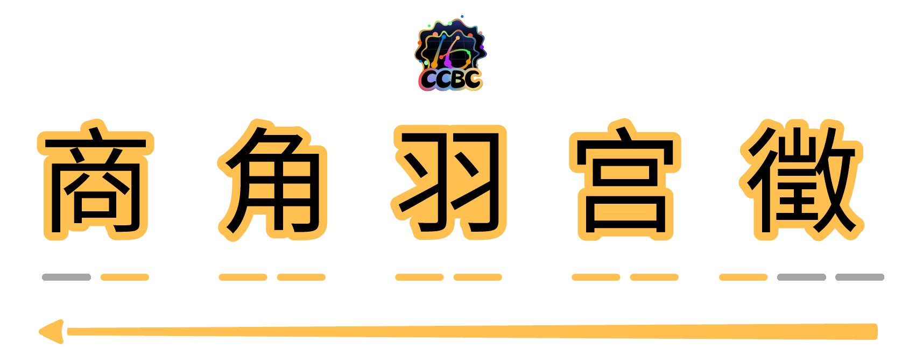

# 五音俱全

## 题面

## 答案

`SODA LIME`

## 解析

宫商角徵羽大致对应西洋音乐的 do re mi sol la, 所以在五音之下的横线上填入对应的唱名：re mi la do sol，再按照箭头的顺序逆着读中间的部分得到答案 `SODA LIME`。

## 提示

### 1. 我毫无头绪

将五音转换成对应的西洋音乐音符唱名。

## 本地附件

- [4798a7304858471b8edb07bfa7bd5e10.png](../../../assets/static.cipherpuzzles.com/static/images/4798a7304858471b8edb07bfa7bd5e10.png)
- [7acc341eabde4421a7af7911a14cb7d7.webp](../../../assets/static.cipherpuzzles.com/static/images/7acc341eabde4421a7af7911a14cb7d7.webp)

来源：[https://ccbc16.cipherpuzzles.com/data/puzzles/4.json](https://ccbc16.cipherpuzzles.com/data/puzzles/4.json)
