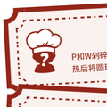
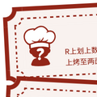
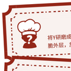

# 原来你也是厨神

## 题面

## 碎片 1-4

    

        

        

        
★★★

        
P和W剁碎后加入T和F，一起搅拌均匀后分成球状。油锅加热后将圆球炸成金黄色后，再加水和酱油等佐料烧至入味。

        

    

    

        

        

            
★★★

            
将P剁碎后炒熟。将M，E，少量泡打粉和水一起混合成团，分成两部分各自擀平后将炒好的P裹在两层之中，将T打散后在上面涂上一层，最后送入烤箱烤至金黄。

        

    

    

        

        

            
★★★

            
M和水混合后擀成薄薄的一片，用刀切成细条后下水煮好备用。油锅烧热后加入切好的P，炒至变色后加入酱油等佐料，再加C一起翻炒，最后连汁一起浇在之前煮好的M细条上。

        

    

    

        

        

            
★★★★

            
将V煮熟。拿一个干净的碗，碗底铺上B去了芯的种子，切碎的D，以及Z，再将煮好的V填入碗里。上锅蒸好后倒扣在盘子上。

        

    

## 碎片 3-3

    

        

        

        
★★★★

        
R上划上数刀，均匀涂抹一层F后放置一段时间，然后在炭炉上烤至两面焦黄即可。

        

    

    

        

        

            
★★

            
V加水浸泡后打成浆状，倒入平底容器里形成薄薄一层，放入蒸锅蒸一两分钟取出，放凉后切成长条状放在碗里，再在上面整齐地码上煮好的P、R、L。

        

    

    

        

        

            
★★★★

            
M加水混合后揉拉成细条状切好备用。将T煮六分钟备用。将P放入锅里加水煮几个小时至汤变成乳白色。加入M细条以及腌制好的W煮熟后，再将之前煮好的T切开放在上面。

        

    

    

        

        

            
★★★

            
B的种子去芯后浸泡，然后煮至变软。T和A一起搅拌后倒入碗里，上锅蒸好后加上B种子点缀。

        

    

    

        

        

            
★★

            
将Q的果实部分剥下煮熟，跟切好的K、X、N一起搅拌均匀。

        

    

## 碎片 4-1

    

        

        

        
★★★★★

        
将Y研磨成粉末，均匀涂抹在P两面，再将P放在锅里煎出酥脆外层，放入烤箱烤熟。装盘后佐以G点缀。

        

    

    

        

        

            
★★

            
将R和O煮熟后碾成泥状再按成圆形。X横切成环形，U剁碎也捏成环形。最后将一切放在油锅里炸至金黄。

        

    

    

        

        

            
★★

            
T打散，加M和水和少量泡打粉搅匀，煎至成型后翻面再煎一两分钟后盛出，在上面放一个Z作为点缀。

        

    

    

        

        

            
★★★★★★★★

            
取一长方形锅，锅底刷油加热。将T打散后倒一部分进锅铺成浅浅一层，稍微成型后将它卷到一边，再倒一层T。如此反复直至用完所有的T。将煎好的T卷取出切成长方形，放在煮好的V上。

        

    

    

        

        

            
★★★★★★

            
将T分为中心和外围两个部分。将H研磨成粉，跟M和T中心一起搅匀。将T外围打发，拌入之前的糊糊，再一起放入烤箱烤好取出切成三份为①。再取一些T打散，将S研磨成粉后溶于水里，煮开后跟打好的T混合成膏状为②。把②涂抹在①上后三份①叠在一起。

        

    

## 碎片 8-1

    

        

        

        
★

        
将V煮熟，小火翻炒后盛出。将T打散，倒入热锅摊平后盖在炒好的V上。将K煮熟后打碎加入少许A搅匀成酱汁，挤在最上面。

        

    

    

        

        

            
★

            
将P和X一起剁碎混合，放在盘子里用模具塑形后，在上面放上T的中心部分，加G点缀调味。

        

    

    

        

        

            
★★★★

            
将M和少量泡打粉在一起搅匀。将T和A一起打发，拌入M，再加入融化的E后倒入有纹样装饰的模具，放入烤箱里烤好。

        

    

    

        

        

            
★★★

            
首先煮好R并切碎。煮熟V后先取一半，在上面挖一个坑后放入R，再用另一半盖上。塑形后用干I包裹四周。

        

    

    

        

        

            
★★

            
将Q的果实研磨成粉末，加水后搅匀，摊成圆饼状后在锅里煮熟后切成三角状，再将这些小三角炸脆。将U炒熟后撕碎，和J一起铺在炸好的小三角上，再放入烤箱烤至J融化。

        

    

## 交互源码

- fragment_source: [../../../assets/ccbc16.cipherpuzzles.com/data/articles/fragments.json](../../../assets/ccbc16.cipherpuzzles.com/data/articles/fragments.json)

## 答案

`CULINARY`

## 解析

本题由以下几个碎片组成：

通过标题“原……神”我们可以想到这些都是原神食谱。题目里描述了真实世界的烹饪步骤，有些比较简单可以直接看出是什么并且将其原料对应到字母，有些可能需要知道原料后再搜索食谱。虽然原神食谱很多，但是在看出几个食谱后就能注意到，这些都是能通过某一角色获得特殊版本的普通料理，以此可以大大缩小搜索范围。

食物与字母的对应如下：

<table>
<tr><td>A</td><td>糖</td></tr>
<tr><td>B</td><td>莲蓬</td></tr>
<tr><td>C</td><td>蘑菇</td></tr>
<tr><td>D</td><td>胡萝卜</td></tr>
<tr><td>E</td><td>黄油</td></tr>
<tr><td>F</td><td>盐</td></tr>
<tr><td>G</td><td>茉洁草</td></tr>
<tr><td>H</td><td>杏仁</td></tr>
<tr><td>I</td><td>海草</td></tr>
<tr><td>J</td><td>奶酪</td></tr>
<tr><td>K</td><td>番茄</td></tr>
<tr><td>L</td><td>豆腐</td></tr>
<tr><td>M</td><td>面粉</td></tr>
<tr><td>N</td><td>薄荷</td></tr>
<tr><td>O</td><td>土豆</td></tr>
<tr><td>P</td><td>兽肉</td></tr>
<tr><td>Q</td><td>颗粒果</td></tr>
<tr><td>R</td><td>鱼肉</td></tr>
<tr><td>S</td><td>咖啡豆</td></tr>
<tr><td>T</td><td>鸟蛋</td></tr>
<tr><td>U</td><td>禽肉</td></tr>
<tr><td>V</td><td>稻米</td></tr>
<tr><td>W</td><td>竹笋</td></tr>
<tr><td>X</td><td>洋葱</td></tr>
<tr><td>Y</td><td>胡椒</td></tr>
<tr><td>Z</td><td>树莓</td></tr>
</table>

四个碎片的菜谱依次为：
<table>
<tr class="cook_theader"><td>菜谱</td><td>菜名</td><td>特殊料理角色</td><td>英文名</td><td>星数</td><td>提取字母</td></tr>
<tr><td>将稻米煮熟，小火翻炒后盛出。将鸟蛋打散，倒入热锅摊平后盖在炒好的稻米上。将番茄煮熟后打碎加入少许糖搅匀成酱汁，挤在最上面。</td><td>蛋包饭</td><td>久岐忍</td><td>Kuki Shinobu</td><td>1</td><td>K</td></tr>
<tr><td>将兽肉和洋葱一起剁碎混合，放在盘子里用模具塑形后，在上面放上鸟蛋的中心部分，加茉洁草点缀调味。</td><td>生肉塔塔</td><td>阿蕾奇诺</td><td>Arlecchino</td><td>1</td><td>A</td></tr>
<tr><td>将面粉和少量泡打粉在一起搅匀。将鸟蛋和糖一起打发，拌入面粉，再加入融化的黄油后倒入有纹样装饰的模具，放入烤箱里烤好。</td><td>晶螺糕</td><td>琳妮特</td><td>Lynette</td><td>4</td><td>E</td></tr>
<tr><td>首先煮好鱼肉并切碎。煮熟稻米后先取一半，在上面挖一个坑后放入鱼肉，再用另一半盖上。塑形后用干海草包裹四周。</td><td>饭团</td><td>早柚</td><td>Sayu</td><td>3</td><td>Y</td></tr>
<tr><td>将颗粒果的果实研磨成粉末，加水后搅匀，摊成圆饼状后在锅里煮熟后切成三角状，再将这些小三角炸脆。将禽肉炒熟后撕碎，和奶酪一起铺在炸好的小三角上，再放入烤箱烤至奶酪融化。</td><td>粒果片片</td><td>卡齐娜</td><td>Kachina</td><td>2</td><td>A</td></tr>
</table>
<table>
<tr class="cook_theader"><td>菜谱</td><td>菜名</td><td>特殊料理角色</td><td>英文名</td><td>星数</td><td>提取字母</td></tr>
<tr><td>将胡椒研磨成粉末，均匀涂抹在兽肉两面，再将兽肉放在锅里煎出酥脆外层，放入烤箱烤熟。装盘后佐以茉洁草点缀。</td><td>香烤肋排</td><td>莱欧斯利</td><td>Wriothesley</td><td>5</td><td>T</td></tr>
<tr><td>将鱼肉和土豆煮熟后碾成泥状再按成圆形。洋葱横切成环形，禽肉剁碎也捏成环形。最后将一切放在油锅里炸至金黄。</td><td>圈圈圆圆</td><td>夏沃蕾</td><td>Chevreuse</td><td>2</td><td>H</td></tr>
<tr><td>鸟蛋打散，加面粉和水和少量泡打粉搅匀，煎至成型后翻面再煎一两分钟后盛出，在上面放一个树莓作为点缀。</td><td>庄园烤松饼</td><td>诺艾尔</td><td>Noelle</td><td>2</td><td>O</td></tr>
<tr><td>取一长方形锅，锅底刷油加热。将鸟蛋打散后倒一部分进锅铺成浅浅一层，稍微成型后将它卷到一边，再倒一层鸟蛋。如此反复直至用完所有的鸟蛋。将煎好的鸟蛋卷取出切成长方形，放在煮好的稻米上。</td><td>鸟蛋寿司</td><td>珊瑚宫心海</td><td>Sangonomiya Kokomi</td><td>8</td><td>M</td></tr>
<tr><td>将鸟蛋分为中心和外围两个部分。将杏仁研磨成粉，跟面粉和鸟蛋中心一起搅匀。将鸟蛋外围打发，拌入之前的糊糊，再一起放入烤箱烤好取出切成三份为①。再取一些鸟蛋打散，将咖啡豆研磨成粉后溶于水里，煮开后跟打好的鸟蛋混合成膏状为②。把②涂抹在①上后三份①叠在一起。</td><td>致水神</td><td>芙宁娜</td><td>Furina</td><td>6</td><td>A</td></tr>
</table>
<table>
<tr class="cook_theader"><td>菜谱</td><td>菜名</td><td>特殊料理角色</td><td>英文名</td><td>星数</td><td>提取字母</td></tr>
<tr><td>兽肉和竹笋剁碎后加入鸟蛋和盐，一起搅拌均匀后分成球状。油锅加热后将圆球炸成金黄色后，再加水和酱油等佐料烧至入味。</td><td>红烧肉圆</td><td>闲云</td><td>Xianyun</td><td>3</td><td>A</td></tr>
<tr><td>将兽肉剁碎后炒熟。将面粉，黄油，少量泡打粉和水一起混合成团，分成两部分各自擀平后将炒好的兽肉裹在两层之中，将鸟蛋打散后在上面涂上一层，最后送入烤箱烤至金黄。</td><td>月亮派</td><td>优菈</td><td>Eula</td><td>3</td><td>L</td></tr>
<tr><td>面粉和水混合后擀成薄薄的一片，用刀切成细条后下水煮好备用。油锅烧热后加入切好的兽肉，炒至变色后加入酱油等佐料，再加蘑菇一起翻炒，最后连汁一起浇在之前煮好的面粉细条上。</td><td>山珍热卤面</td><td>重云</td><td>Chongyun</td><td>3</td><td>O</td></tr>
<tr><td>将稻米煮熟。拿一个干净的碗，碗底铺上莲蓬去了芯的种子，切碎的胡萝卜，以及树莓，再将煮好的稻米填入碗里。上锅蒸好后倒扣在盘子上。</td><td>四方和平</td><td>甘雨</td><td>Ganyu</td><td>4</td><td>Y</td></tr>
</table>
<table>
<tr class="cook_theader"><td>菜谱</td><td>菜名</td><td>特殊料理角色</td><td>英文名</td><td>星数</td><td>提取字母</td></tr>
<tr><td>鱼肉上划上数刀，均匀涂抹一层盐后放置一段时间，然后在炭炉上烤至两面焦黄即可。</td><td>干烧香鱼</td><td>枫原万叶</td><td>Kaedehara Kazuha</td><td>4</td><td>D</td></tr>
<tr><td>稻米加水浸泡后打成浆状，倒入平底容器里形成薄薄一层，放入蒸锅蒸一两分钟取出，放凉后切成长条状放在碗里，再在上面整齐地码上煮好的兽肉、鱼肉、豆腐。</td><td>来来菜</td><td>七七</td><td>Qiqi</td><td>2</td><td>I</td></tr>
<tr><td>面粉加水混合后揉拉成细条状切好备用。将鸟蛋煮六分钟备用。将兽肉放入锅里加水煮几个小时至汤变成乳白色。加入面粉细条以及腌制好的竹笋煮熟后，再将之前煮好的鸟蛋切开放在上面。</td><td>兽骨拉面</td><td>五郎</td><td>Gorou</td><td>4</td><td>O</td></tr>
<tr><td>莲蓬的种子去芯后浸泡，然后煮至变软。鸟蛋和糖一起搅拌后倒入碗里，上锅蒸好后加上莲蓬种子点缀。</td><td>莲子禽蛋羹</td><td>云堇</td><td>Yun Jin</td><td>3</td><td>N</td></tr>
<tr><td>将颗粒果的果实部分剥下煮熟，跟切好的番茄、洋葱、薄荷一起搅拌均匀。</td><td>多彩之森</td><td>伊安珊</td><td>Iansan</td><td>2</td><td>A</td></tr>
</table>

每个碎片里以星号个数在特殊料理角色的英文名里提取字母可以得到 Kaeya（凯亚），Thoma（托马）， Aloy（埃洛伊），和 Diona（迪奥娜），他们各自的特殊料理和需要的食材是：
<table>
<tr class="cook_theader2"><td>人物</td><td>普通料理</td><td>特殊料理</td><td>需要的食材</td></tr>
<tr><td>Kaeya</td><td>野菇鸡肉串</td><td>果香串烤</td><td>蘑菇（C）、禽肉（U）</td></tr>
<tr><td>Thoma</td><td>味噌汤</td><td>「暖意」</td><td>豆腐（L）、海草（I）</td></tr>
<tr><td>Aloy</td><td>薄荷果冻</td><td>饱腹感凝胶</td><td>薄荷（N）、糖（A）</td></tr>
<tr><td>Diona</td><td>蒙德烤鱼</td><td>绝对不是下酒菜</td><td>鱼肉（R）、胡椒（Y）</td></tr>
</table>

将每个人需要的食材换回之前对应的字母，连起来得到本题答案`CULINARY`。

## 提示

### 1. 这道题需要哪些碎片？

### 2. 我毫无头绪

这些都是原神食谱现实版本的制作方式。

### 3. 我找到了正确的资料，但是数据库太大了，能稍微缩小搜索范围吗？

这些都是有特殊版本的普通版本。

### 4. 该如何提取

每个碎片的内容对应一个人物，查看该人物需要的食材。

### 5. 我不会做饭！能帮我认一些食材吗？

D	胡萝卜，J	奶酪，X	洋葱，Y	胡椒

### 6. 星星有什么用？

每个菜谱找到正确的角色后，用星号的个数在英文名字里提取字母。

## 本地附件

- [fragments.json](../../../assets/ccbc16.cipherpuzzles.com/data/articles/fragments.json)
- [027d0cad05b04e6aade9f57ad94f037c.webp](../../../assets/static.cipherpuzzles.com/static/images/027d0cad05b04e6aade9f57ad94f037c.webp)
- [02c845bcdc9e4e14bb5f3a6b3e6169d4.webp](../../../assets/static.cipherpuzzles.com/static/images/02c845bcdc9e4e14bb5f3a6b3e6169d4.webp)
- [04caa57b60284718b98741fa322f279f.webp](../../../assets/static.cipherpuzzles.com/static/images/04caa57b60284718b98741fa322f279f.webp)
- [058df0126b2746138b7c4a6873d6d413.webp](../../../assets/static.cipherpuzzles.com/static/images/058df0126b2746138b7c4a6873d6d413.webp)
- [066c531d05974507b077aa06c0653625.webp](../../../assets/static.cipherpuzzles.com/static/images/066c531d05974507b077aa06c0653625.webp)
- [06f134bef60b4e7e8452f7f1d76d8d11.webp](../../../assets/static.cipherpuzzles.com/static/images/06f134bef60b4e7e8452f7f1d76d8d11.webp)
- [078b2ada207c40f0b95640164a24de1e.webp](../../../assets/static.cipherpuzzles.com/static/images/078b2ada207c40f0b95640164a24de1e.webp)
- [0b4a9daa93734fb3aec74fd2fab50745.webp](../../../assets/static.cipherpuzzles.com/static/images/0b4a9daa93734fb3aec74fd2fab50745.webp)
- [0bc72467edf4429c95538a4f7d6598a0.webp](../../../assets/static.cipherpuzzles.com/static/images/0bc72467edf4429c95538a4f7d6598a0.webp)
- [0e98ffc9a1d344b2aac9c6350e83ea78.webp](../../../assets/static.cipherpuzzles.com/static/images/0e98ffc9a1d344b2aac9c6350e83ea78.webp)
- [12c3546071594a2c9a449288a056bdf2.webp](../../../assets/static.cipherpuzzles.com/static/images/12c3546071594a2c9a449288a056bdf2.webp)
- [1424e3712cfc420a84f96e82a0faa70d.webp](../../../assets/static.cipherpuzzles.com/static/images/1424e3712cfc420a84f96e82a0faa70d.webp)
- [146b53c8be79476596456f59be2c7d95.png](../../../assets/static.cipherpuzzles.com/static/images/146b53c8be79476596456f59be2c7d95.png)
- [1627402c9e5c47218c9762c0c31e600b.webp](../../../assets/static.cipherpuzzles.com/static/images/1627402c9e5c47218c9762c0c31e600b.webp)
- [1c24c81b21224784b42808d87822c340.webp](../../../assets/static.cipherpuzzles.com/static/images/1c24c81b21224784b42808d87822c340.webp)
- [1e1bd968a003458a8c85c293cdad46b8.webp](../../../assets/static.cipherpuzzles.com/static/images/1e1bd968a003458a8c85c293cdad46b8.webp)
- [2202ffeb001c450399b9e6ab036e1b51.webp](../../../assets/static.cipherpuzzles.com/static/images/2202ffeb001c450399b9e6ab036e1b51.webp)
- [239a2d627b1845458b4571020a7c336e.webp](../../../assets/static.cipherpuzzles.com/static/images/239a2d627b1845458b4571020a7c336e.webp)
- [277b90dc8f674d2eae96f306c8d29062.webp](../../../assets/static.cipherpuzzles.com/static/images/277b90dc8f674d2eae96f306c8d29062.webp)
- [29b6eedddced46a8a164ed503147377d.webp](../../../assets/static.cipherpuzzles.com/static/images/29b6eedddced46a8a164ed503147377d.webp)
- [2a4b2216bd6f4194b4fabf026325faf4.webp](../../../assets/static.cipherpuzzles.com/static/images/2a4b2216bd6f4194b4fabf026325faf4.webp)
- [2a698ad8033845998b22bf73a282114a.webp](../../../assets/static.cipherpuzzles.com/static/images/2a698ad8033845998b22bf73a282114a.webp)
- [2aef72b5c42f456c8f1305368b041f89.webp](../../../assets/static.cipherpuzzles.com/static/images/2aef72b5c42f456c8f1305368b041f89.webp)
- [2c3f75f4c92f4f07a6d2a18db537aa1e.webp](../../../assets/static.cipherpuzzles.com/static/images/2c3f75f4c92f4f07a6d2a18db537aa1e.webp)
- [2d3b6c4f97d6457ba859687cad85539d.webp](../../../assets/static.cipherpuzzles.com/static/images/2d3b6c4f97d6457ba859687cad85539d.webp)
- [304cdc456cba436c8f475e080e774ac8.webp](../../../assets/static.cipherpuzzles.com/static/images/304cdc456cba436c8f475e080e774ac8.webp)
- [3286c03bd53a4dcb8107fe44b5993c2c.webp](../../../assets/static.cipherpuzzles.com/static/images/3286c03bd53a4dcb8107fe44b5993c2c.webp)
- [34159a94d08f4df2834362395396db2f.webp](../../../assets/static.cipherpuzzles.com/static/images/34159a94d08f4df2834362395396db2f.webp)
- [3949831264c24365bb4617e32aa7c9d3.webp](../../../assets/static.cipherpuzzles.com/static/images/3949831264c24365bb4617e32aa7c9d3.webp)
- [3a7f0158b909494b8e4072ef2454fce9.webp](../../../assets/static.cipherpuzzles.com/static/images/3a7f0158b909494b8e4072ef2454fce9.webp)
- [3a8f756d3db8433badf0b45b19d0b5f6.vue](../../../assets/static.cipherpuzzles.com/static/images/3a8f756d3db8433badf0b45b19d0b5f6.vue)
- [3bbcf7eb367045baa97e03a7a9fcd1ed.webp](../../../assets/static.cipherpuzzles.com/static/images/3bbcf7eb367045baa97e03a7a9fcd1ed.webp)
- [3c712e208e67468999c7e64e2004fc14.webp](../../../assets/static.cipherpuzzles.com/static/images/3c712e208e67468999c7e64e2004fc14.webp)
- [407f949ece0f4732939cb37e6cfe3c2f.webp](../../../assets/static.cipherpuzzles.com/static/images/407f949ece0f4732939cb37e6cfe3c2f.webp)
- [40a194bacd6347c8b39ee6b7c998d1f3.webp](../../../assets/static.cipherpuzzles.com/static/images/40a194bacd6347c8b39ee6b7c998d1f3.webp)
- [40bbc53c38754ae48bc29a5706c2964d.vue](../../../assets/static.cipherpuzzles.com/static/images/40bbc53c38754ae48bc29a5706c2964d.vue)
- [41fa976073ef4af4854a53d1e52d0ec6.webp](../../../assets/static.cipherpuzzles.com/static/images/41fa976073ef4af4854a53d1e52d0ec6.webp)
- [450c075bf141497cb639ba7adfa6ed9c.webp](../../../assets/static.cipherpuzzles.com/static/images/450c075bf141497cb639ba7adfa6ed9c.webp)
- [4737d2b1c71749789a8bb2eb43418b86.webp](../../../assets/static.cipherpuzzles.com/static/images/4737d2b1c71749789a8bb2eb43418b86.webp)
- [4b0d75fcfbc449f88fd60daace8ff90b.webp](../../../assets/static.cipherpuzzles.com/static/images/4b0d75fcfbc449f88fd60daace8ff90b.webp)
- [4c655d36976848cbb443dcc62b682c50.webp](../../../assets/static.cipherpuzzles.com/static/images/4c655d36976848cbb443dcc62b682c50.webp)
- [4d681eb50b9e4302b922ac0a2858ca50.webp](../../../assets/static.cipherpuzzles.com/static/images/4d681eb50b9e4302b922ac0a2858ca50.webp)
- [4e2ac86e0e35498f8051089dbad0ba06.m4a](../../../assets/static.cipherpuzzles.com/static/images/4e2ac86e0e35498f8051089dbad0ba06.m4a)
- [4e2b2c9c21334732ab04293abebfbef2.webp](../../../assets/static.cipherpuzzles.com/static/images/4e2b2c9c21334732ab04293abebfbef2.webp)
- [5281729386934dd2b80004f67c003b30.svg](../../../assets/static.cipherpuzzles.com/static/images/5281729386934dd2b80004f67c003b30.svg)
- [587c389311644c768b95a99da0c6a055.webp](../../../assets/static.cipherpuzzles.com/static/images/587c389311644c768b95a99da0c6a055.webp)
- [58ec28fd9a364a878999ccdcdb8f88e2.webp](../../../assets/static.cipherpuzzles.com/static/images/58ec28fd9a364a878999ccdcdb8f88e2.webp)
- [5f9954e657aa432c81996efca734835d.webp](../../../assets/static.cipherpuzzles.com/static/images/5f9954e657aa432c81996efca734835d.webp)
- [645453f1631e4f3298ea74f90461089a.webp](../../../assets/static.cipherpuzzles.com/static/images/645453f1631e4f3298ea74f90461089a.webp)
- [6496a66a70be44dbafcb22007a5d16c5.webp](../../../assets/static.cipherpuzzles.com/static/images/6496a66a70be44dbafcb22007a5d16c5.webp)
- [65b0a1f818084c3da4e6ea997df8e58f.webp](../../../assets/static.cipherpuzzles.com/static/images/65b0a1f818084c3da4e6ea997df8e58f.webp)
- [6ec7573b35284eca8c4b80ee93934c19.webp](../../../assets/static.cipherpuzzles.com/static/images/6ec7573b35284eca8c4b80ee93934c19.webp)
- [71faa5f9c94e4beb8427ba2e8ba84160.webp](../../../assets/static.cipherpuzzles.com/static/images/71faa5f9c94e4beb8427ba2e8ba84160.webp)
- [72300d3434f543599255775b9d792551.webp](../../../assets/static.cipherpuzzles.com/static/images/72300d3434f543599255775b9d792551.webp)
- [74c14fcab1f940a6ab0037b6621ad351.webp](../../../assets/static.cipherpuzzles.com/static/images/74c14fcab1f940a6ab0037b6621ad351.webp)
- [7594e058cc0c4786aadf4a09a570bd5b.webp](../../../assets/static.cipherpuzzles.com/static/images/7594e058cc0c4786aadf4a09a570bd5b.webp)
- [75a74da80ac243b997cbca9e18b4b9c3.webp](../../../assets/static.cipherpuzzles.com/static/images/75a74da80ac243b997cbca9e18b4b9c3.webp)
- [76c62ab95d0740d69bcf18439e441ba5.webp](../../../assets/static.cipherpuzzles.com/static/images/76c62ab95d0740d69bcf18439e441ba5.webp)
- [76d08fa26edf4bedaab03e335aa89445.webp](../../../assets/static.cipherpuzzles.com/static/images/76d08fa26edf4bedaab03e335aa89445.webp)
- [783f1bc7f6354b76adcb26f2e42fdd3e.webp](../../../assets/static.cipherpuzzles.com/static/images/783f1bc7f6354b76adcb26f2e42fdd3e.webp)
- [7dfdfa5743044615b898dad119738f59.webp](../../../assets/static.cipherpuzzles.com/static/images/7dfdfa5743044615b898dad119738f59.webp)
- [80405b809f3b44aaaf9e99de7b0e9383.webp](../../../assets/static.cipherpuzzles.com/static/images/80405b809f3b44aaaf9e99de7b0e9383.webp)
- [80f9552234ad413bbe1139c3346700ce.webp](../../../assets/static.cipherpuzzles.com/static/images/80f9552234ad413bbe1139c3346700ce.webp)
- [83ace155aab8437488658c572d6cd619.webp](../../../assets/static.cipherpuzzles.com/static/images/83ace155aab8437488658c572d6cd619.webp)
- [83bb25000e0948129e41e54ed0a4da8c.webp](../../../assets/static.cipherpuzzles.com/static/images/83bb25000e0948129e41e54ed0a4da8c.webp)
- [865422f90c7e41278fd6cea5b4e66bf5.webp](../../../assets/static.cipherpuzzles.com/static/images/865422f90c7e41278fd6cea5b4e66bf5.webp)
- [8778fa28ca2140b086ad465cf4d2b75c.webp](../../../assets/static.cipherpuzzles.com/static/images/8778fa28ca2140b086ad465cf4d2b75c.webp)
- [887f9fad57a44eb7b0b1821c02f599a6.webp](../../../assets/static.cipherpuzzles.com/static/images/887f9fad57a44eb7b0b1821c02f599a6.webp)
- [89dc0276826a40fcb1e7714b59e1834f.m4a](../../../assets/static.cipherpuzzles.com/static/images/89dc0276826a40fcb1e7714b59e1834f.m4a)
- [8abd097a5fb44452bf4f2e9116928b9a.webp](../../../assets/static.cipherpuzzles.com/static/images/8abd097a5fb44452bf4f2e9116928b9a.webp)
- [8cb37f0a5d304539bed5b690ce46433a.webp](../../../assets/static.cipherpuzzles.com/static/images/8cb37f0a5d304539bed5b690ce46433a.webp)
- [8d28cd61083a4db08b9a1044debc0f79.webp](../../../assets/static.cipherpuzzles.com/static/images/8d28cd61083a4db08b9a1044debc0f79.webp)
- [919bb519b97249e5b85485301451e1eb.webp](../../../assets/static.cipherpuzzles.com/static/images/919bb519b97249e5b85485301451e1eb.webp)
- [92d60a9e6e3f4c6ca1b378d490c10770.webp](../../../assets/static.cipherpuzzles.com/static/images/92d60a9e6e3f4c6ca1b378d490c10770.webp)
- [93e63cee04574291a6d5dd12b9580f1a.webp](../../../assets/static.cipherpuzzles.com/static/images/93e63cee04574291a6d5dd12b9580f1a.webp)
- [93ea16de1497448f8a09346906737221.webp](../../../assets/static.cipherpuzzles.com/static/images/93ea16de1497448f8a09346906737221.webp)
- [94d138b995984f44b4c23c7338619832.webp](../../../assets/static.cipherpuzzles.com/static/images/94d138b995984f44b4c23c7338619832.webp)
- [96e0bdd820224f5788b9f7193d1cde92.webp](../../../assets/static.cipherpuzzles.com/static/images/96e0bdd820224f5788b9f7193d1cde92.webp)
- [96eab2c7ffaa4d0ca8626e470a0fc6b4.m4a](../../../assets/static.cipherpuzzles.com/static/images/96eab2c7ffaa4d0ca8626e470a0fc6b4.m4a)
- [97848f54050f450ca8e8574dfaa22f52.webp](../../../assets/static.cipherpuzzles.com/static/images/97848f54050f450ca8e8574dfaa22f52.webp)
- [9a991d6fe984435e83a133b352a27c6e.webp](../../../assets/static.cipherpuzzles.com/static/images/9a991d6fe984435e83a133b352a27c6e.webp)
- [9e607840dac14a239dba28e923d9d900.webp](../../../assets/static.cipherpuzzles.com/static/images/9e607840dac14a239dba28e923d9d900.webp)
- [9ea2a17f63dd4b0db8db956faf8fbce2.webp](../../../assets/static.cipherpuzzles.com/static/images/9ea2a17f63dd4b0db8db956faf8fbce2.webp)
- [9f54c50135de455dbbd0fe501df82359.webp](../../../assets/static.cipherpuzzles.com/static/images/9f54c50135de455dbbd0fe501df82359.webp)
- [9f9bfe8b507848a7b6339533296a1574.webp](../../../assets/static.cipherpuzzles.com/static/images/9f9bfe8b507848a7b6339533296a1574.webp)
- [a1643c2338104308bac0119b39a15bea.webp](../../../assets/static.cipherpuzzles.com/static/images/a1643c2338104308bac0119b39a15bea.webp)
- [a2878c4c675f451791ad148de6d1b96e.webp](../../../assets/static.cipherpuzzles.com/static/images/a2878c4c675f451791ad148de6d1b96e.webp)
- [a2c35b677ddf4ac3be9664456d784123.webp](../../../assets/static.cipherpuzzles.com/static/images/a2c35b677ddf4ac3be9664456d784123.webp)
- [a6599abb63d0425b95a9e77ba6f4f9c4.webp](../../../assets/static.cipherpuzzles.com/static/images/a6599abb63d0425b95a9e77ba6f4f9c4.webp)
- [a712de9831f64b2d8586ca4d2426db08.webp](../../../assets/static.cipherpuzzles.com/static/images/a712de9831f64b2d8586ca4d2426db08.webp)
- [a8ad296061c8414e8d656b542c226ca7.webp](../../../assets/static.cipherpuzzles.com/static/images/a8ad296061c8414e8d656b542c226ca7.webp)
- [ab0fda5fc28c427487c1d70b87555f5a.webp](../../../assets/static.cipherpuzzles.com/static/images/ab0fda5fc28c427487c1d70b87555f5a.webp)
- [ae859d190f1046aead0a6136b977567f.webp](../../../assets/static.cipherpuzzles.com/static/images/ae859d190f1046aead0a6136b977567f.webp)
- [b44486dbd02444fcb7023fb1ff216893.webp](../../../assets/static.cipherpuzzles.com/static/images/b44486dbd02444fcb7023fb1ff216893.webp)
- [b49025b32d70483f891f78b5dff32d05.webp](../../../assets/static.cipherpuzzles.com/static/images/b49025b32d70483f891f78b5dff32d05.webp)
- [b4c1d4fedb034fbda96a72e8fbdc2bb2.webp](../../../assets/static.cipherpuzzles.com/static/images/b4c1d4fedb034fbda96a72e8fbdc2bb2.webp)
- [b668aafefdf9435cb4d68bc8128cb6ce.webp](../../../assets/static.cipherpuzzles.com/static/images/b668aafefdf9435cb4d68bc8128cb6ce.webp)
- [bb1693e78eba43f4aeb760d579a1c501.webp](../../../assets/static.cipherpuzzles.com/static/images/bb1693e78eba43f4aeb760d579a1c501.webp)
- [be31f929bd2e4cf6a962ee6f7764da15.webp](../../../assets/static.cipherpuzzles.com/static/images/be31f929bd2e4cf6a962ee6f7764da15.webp)
- [c1192c01ad0c421388300a8d691430ae.webp](../../../assets/static.cipherpuzzles.com/static/images/c1192c01ad0c421388300a8d691430ae.webp)
- [c362cede3e1d4476a92621e56d4869e7.webp](../../../assets/static.cipherpuzzles.com/static/images/c362cede3e1d4476a92621e56d4869e7.webp)
- [c53be3b2dda7434fab8f12d20e1ecc3c.webp](../../../assets/static.cipherpuzzles.com/static/images/c53be3b2dda7434fab8f12d20e1ecc3c.webp)
- [c7de5d26b231470bb7a5d1bf67be47d1.webp](../../../assets/static.cipherpuzzles.com/static/images/c7de5d26b231470bb7a5d1bf67be47d1.webp)
- [cb76ffbdd5f143c5a5a430873db4db78.webp](../../../assets/static.cipherpuzzles.com/static/images/cb76ffbdd5f143c5a5a430873db4db78.webp)
- [cd32feacbaf44cb4b15d5392f4fcda22.webp](../../../assets/static.cipherpuzzles.com/static/images/cd32feacbaf44cb4b15d5392f4fcda22.webp)
- [cdd6d85fc71b40ae8bdff5ce2dd5c52c.webp](../../../assets/static.cipherpuzzles.com/static/images/cdd6d85fc71b40ae8bdff5ce2dd5c52c.webp)
- [ce31cc88d45b4b1fa9326911494e924b.webp](../../../assets/static.cipherpuzzles.com/static/images/ce31cc88d45b4b1fa9326911494e924b.webp)
- [cf93d5a441184cdf883f143e284d66f7.webp](../../../assets/static.cipherpuzzles.com/static/images/cf93d5a441184cdf883f143e284d66f7.webp)
- [d333587baee342b6984dd9d5b4ac392a.webp](../../../assets/static.cipherpuzzles.com/static/images/d333587baee342b6984dd9d5b4ac392a.webp)
- [d3675d3de6cf4f4e9645d0efda27d330.webp](../../../assets/static.cipherpuzzles.com/static/images/d3675d3de6cf4f4e9645d0efda27d330.webp)
- [d46def994ca04fc490327cb2e78426bb.webp](../../../assets/static.cipherpuzzles.com/static/images/d46def994ca04fc490327cb2e78426bb.webp)
- [d810ea7f656248ff8e50ba9c6facfcfd.webp](../../../assets/static.cipherpuzzles.com/static/images/d810ea7f656248ff8e50ba9c6facfcfd.webp)
- [d83caf3e0b9345e3b1c2f6350d146402.webp](../../../assets/static.cipherpuzzles.com/static/images/d83caf3e0b9345e3b1c2f6350d146402.webp)
- [d9a17db7a3724fc58f08dce861509491.webp](../../../assets/static.cipherpuzzles.com/static/images/d9a17db7a3724fc58f08dce861509491.webp)
- [da97268fb1ad4cac843246089b598691.webp](../../../assets/static.cipherpuzzles.com/static/images/da97268fb1ad4cac843246089b598691.webp)
- [dd5ccde053a5489a9a0d60dcf414b092.webp](../../../assets/static.cipherpuzzles.com/static/images/dd5ccde053a5489a9a0d60dcf414b092.webp)
- [ddf693b7e8644686baec8f52b4d40459.webp](../../../assets/static.cipherpuzzles.com/static/images/ddf693b7e8644686baec8f52b4d40459.webp)
- [de1ae2fed1854839acc3bffaca4f0de3.webp](../../../assets/static.cipherpuzzles.com/static/images/de1ae2fed1854839acc3bffaca4f0de3.webp)
- [df18a7c84bf44df08f07f35a66e2793e.webp](../../../assets/static.cipherpuzzles.com/static/images/df18a7c84bf44df08f07f35a66e2793e.webp)
- [e10c80e264ec434abbc368563d974232.webp](../../../assets/static.cipherpuzzles.com/static/images/e10c80e264ec434abbc368563d974232.webp)
- [e3e53bdff851410596266a9d0e544fb1.webp](../../../assets/static.cipherpuzzles.com/static/images/e3e53bdff851410596266a9d0e544fb1.webp)
- [e406a4b82d3e4dcfbadccfa26d9d4d5b.webp](../../../assets/static.cipherpuzzles.com/static/images/e406a4b82d3e4dcfbadccfa26d9d4d5b.webp)
- [e55bce11d27540e4938ffda8581ae947.webp](../../../assets/static.cipherpuzzles.com/static/images/e55bce11d27540e4938ffda8581ae947.webp)
- [e56afafa4c1b4b96a26817d6460e8b4b.webp](../../../assets/static.cipherpuzzles.com/static/images/e56afafa4c1b4b96a26817d6460e8b4b.webp)
- [e807b61981b048f5b6032085e58ec76e.webp](../../../assets/static.cipherpuzzles.com/static/images/e807b61981b048f5b6032085e58ec76e.webp)
- [e942f9666b4d452dac5f079b0540fd98.webp](../../../assets/static.cipherpuzzles.com/static/images/e942f9666b4d452dac5f079b0540fd98.webp)
- [e9884a3d897c417a825a38ea8c4c0127.webp](../../../assets/static.cipherpuzzles.com/static/images/e9884a3d897c417a825a38ea8c4c0127.webp)
- [ea1bd36ac2a04294a29372e7d9f24f8c.webp](../../../assets/static.cipherpuzzles.com/static/images/ea1bd36ac2a04294a29372e7d9f24f8c.webp)
- [eb220c4948a841d2915d288fff4c4cf7.webp](../../../assets/static.cipherpuzzles.com/static/images/eb220c4948a841d2915d288fff4c4cf7.webp)
- [ef7a89b7b2964820923199e2f096b2aa.webp](../../../assets/static.cipherpuzzles.com/static/images/ef7a89b7b2964820923199e2f096b2aa.webp)
- [f4bb915badee4f5c811dc644a1019682.png](../../../assets/static.cipherpuzzles.com/static/images/f4bb915badee4f5c811dc644a1019682.png)

来源：[https://ccbc16.cipherpuzzles.com/data/puzzles/40.json](https://ccbc16.cipherpuzzles.com/data/puzzles/40.json)
