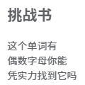
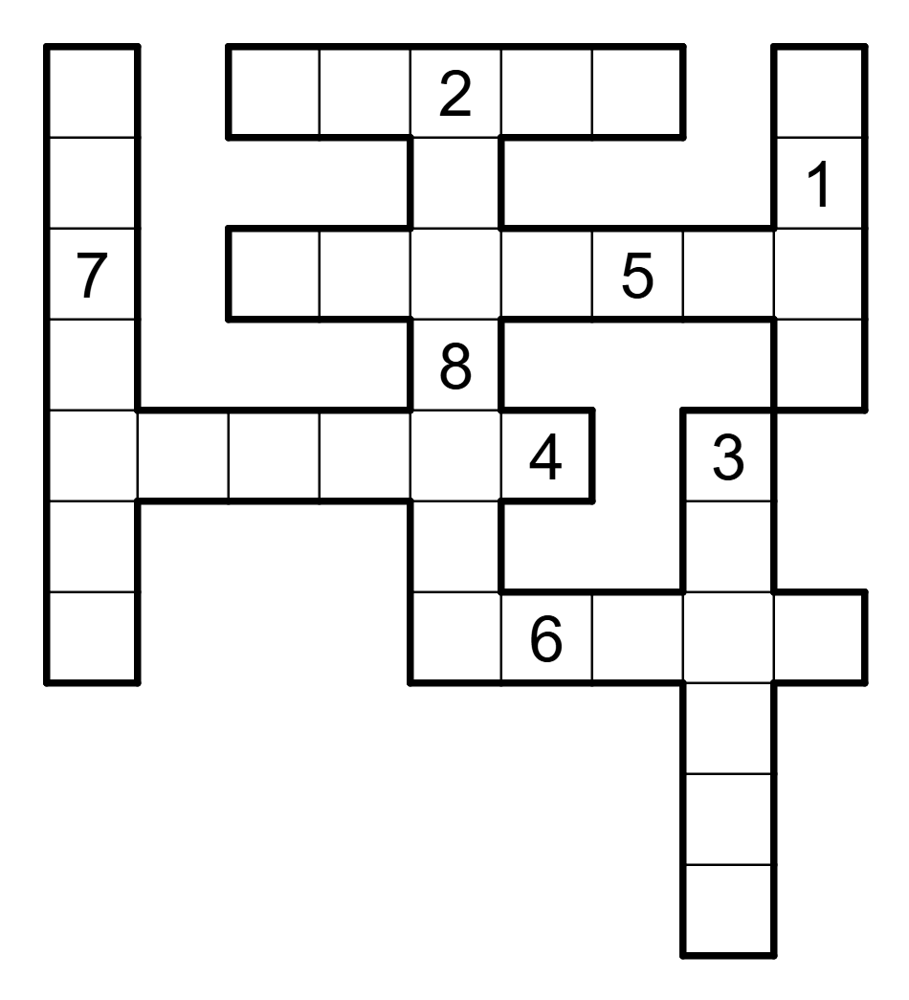
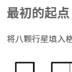
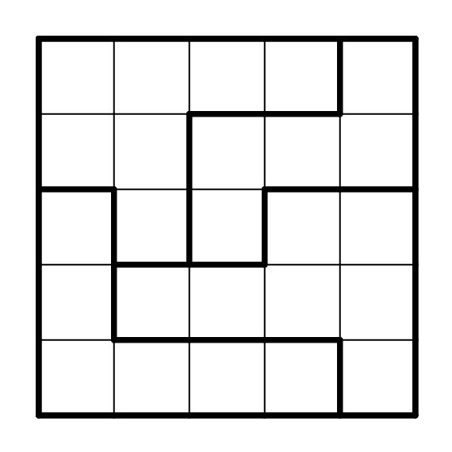
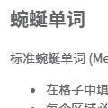
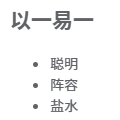
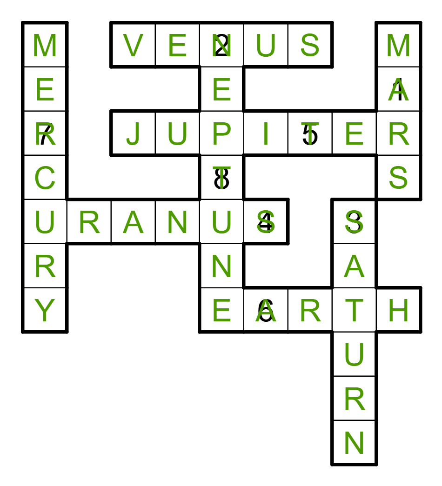
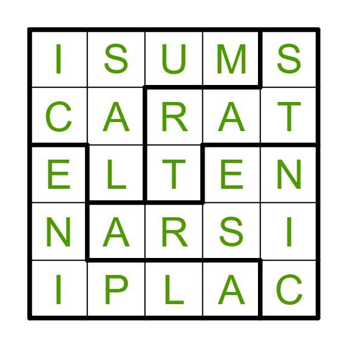
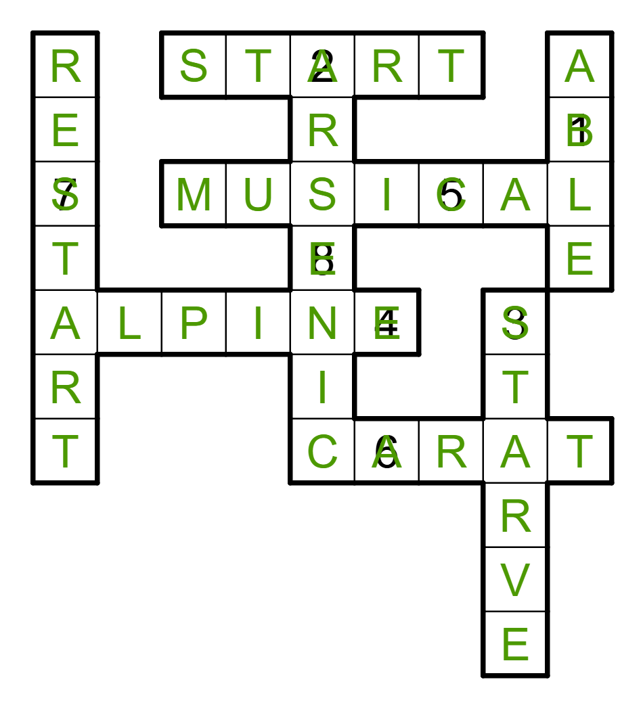

# 元元元……元谜题

## 题面

## 碎片 2-2

## 挑战书

这个单词有 
偶数字母你能 
凭实力找到它吗

## 置换群

1234 ... 4321 = HJUBIFWGQSOETLAMRCNXKDPV

例：AB = L

## 碎片 5-3

## 最初的起点

将八颗行星填入格中。

## 元谜题

   当 ←₃ ↓₄ →₂ →₁ ←₄ = 答案 时 
   →₂ ←₁ ↑₂ →₂ ↑₁ ←₂ = ?

## 碎片 6-3

## 蜿蜒单词

标准蜿蜒单词 (Meandering Words) 规则：
* 在格子中填入字母。相同字母不能相邻或对角相邻。
* 每个区域必须存在一条四联通的路径，经过该区域每个格子恰好一次，并拼出一个单词。每个单词只能用于一个区域。

提取：五行五列中唯一的常用英文单词。

## 寻旗
变体找词 (Word Search) 规则：
* 画出一些不相交的四联通的路径，每条路径拼出一个单词。

<table class="metametameta"><tr><td>↗</td><td>↙</td><td>←</td><td>↑</td><td>←</td><td>↘</td><td>←</td><td>↙</td><td>↓</td></tr><tr><td>↙</td><td>↑</td><td>↙</td><td>↖</td><td>↓</td><td>←</td><td>→</td><td>←</td><td>↘</td></tr><tr><td>↓</td><td>↖</td><td>↘</td><td>↙</td><td>↗</td><td>↘</td><td>↖</td><td>↙</td><td>↓</td></tr><tr><td>↙</td><td>↗</td><td>↙</td><td>↓</td><td>↖</td><td>↓</td><td>↑</td><td>↓</td><td>↗</td></tr><tr><td>→</td><td>←</td><td>↓</td><td>←</td><td>↙</td><td>↖</td><td>↓</td><td>↙</td><td>↘</td></tr><tr><td>↓</td><td>↙</td><td>↖</td><td>↘</td><td>↖</td><td>↑</td><td>←</td><td>→</td><td>↙</td></tr><tr><td>↖</td><td>←</td><td>↙</td><td>↖</td><td>↑</td><td>↘</td><td>↓</td><td>↙</td><td>↖</td></tr><tr><td>↑</td><td>→</td><td>↓</td><td>↗</td><td>→</td><td>↙</td><td>↖</td><td>↗</td><td>↓</td></tr></table>

## 碎片 8-2

## 以一易一
* 聪明
* 阵容
* 盐水
* 特征
* 铅笔
* 鞑靼语
* 吸管（法语）

## 加法练习

* 1.623...
* 0.8
* 0.628...
* 1
* 0.833...
* 1.238...
* 0.714...

## 交互源码

- fragment_source: [../../../assets/ccbc16.cipherpuzzles.com/data/articles/fragments.json](../../../assets/ccbc16.cipherpuzzles.com/data/articles/fragments.json)

## 答案

`BASE CASE`

## 解析

本题由以下几个碎片组成：

本题的机制是：每道题都是用到之前所有答案的元ⁿ谜题。例如，「最初的起点」是元⁰谜题(=谜题)，而「元谜题」则是用到元⁰谜题答案的元¹谜题(=元谜题)。每题答案如下表所示：

<table id="answerkey">
<tr><th>元ⁿ谜题</th><th>标题</th><th>答案</th></tr>
<tr><td>0</td><td>最初的起点</td><td>START</td></tr>
<tr><td>1</td><td>元谜题</td><td>ALPINE</td></tr>
<tr><td>2</td><td>以一易一</td><td>MUSICAL</td></tr>
<tr><td>3</td><td>加法练习</td><td>ARSENIC</td></tr>
<tr><td>4</td><td>蜿蜒单词</td><td>CARAT</td></tr>
<tr><td>5</td><td>寻旗</td><td>STARVE</td></tr>
<tr><td>6</td><td>挑战书</td><td>ABLE</td></tr>
<tr><td>7</td><td>置换群</td><td>RESTART</td></tr>
<tr><td>8</td><td>元元元……元谜题</td><td>BASE CASE</td></tr>
</table>

以下解析每道题的做法。

## 元0谜题：最初的起点

按照题目要求填入八大行星名称。按数字顺序读字母得到 `ANS START`。本题答案即为 `START`。

## 元1谜题：元谜题

本题用到的答案：
<table id="answerkey">
<tr><th>元ⁿ谜题</th><th>标题</th><th>答案</th></tr>
<tr><td>0</td><td>最初的起点</td><td>START</td></tr>
</table>

根据例子得到蓝色箭头表示东南西北，红色箭头表示上下左右，数字表示提取该方向的英文单词里第n个字母。
本题答案为 `ALPINE`。

## 元2谜题：以一易一

本题用到的答案：
<table id="answerkey">
<tr><th>元ⁿ谜题</th><th>标题</th><th>答案</th></tr>
<tr><td>0</td><td>最初的起点</td><td>START</td></tr>
<tr><td>1</td><td>元谜题</td><td>ALPINE</td></tr>
</table>

每个线索对应一个单词。除吸管（法语）外，别的都是英文单词。观察发现，每个单词都是某个答案修改一个字母后重排得到的。读添加的字母得到答案 `MUSICAL`。
<table id="answerkey">
<tr><th>线索</th><th>单词</th><th>用到的答案</th><th>减去的字母</th><th>添加的字母</th></tr>
<tr><td>聪明</td><td>SMART</td><td>START</td><td>T</td><td>M</td></tr>
<tr><td>阵容</td><td>LINEUP</td><td>ALPLINE</td><td>A</td><td>U</td></tr>
<tr><td>盐水</td><td>SALINE</td><td>ALPLINE</td><td>P</td><td>S</td></tr>
<tr><td>特征</td><td>TRAIT</td><td>START</td><td>S</td><td>I</td></tr>
<tr><td>铅笔</td><td>PENCIL</td><td>ALPLINE</td><td>A</td><td>C</td></tr>
<tr><td>鞑靼语</td><td>TATAR</td><td>START</td><td>S</td><td>A</td></tr>
<tr><td>吸管（法语）</td><td>PAILLE</td><td>ALPLINE</td><td>N</td><td>L</td></tr>
</table>

## 元3谜题：加法练习

本题用到的答案：
<table id="answerkey">
<tr><th>元ⁿ谜题</th><th>标题</th><th>答案</th></tr>
<tr><td>0</td><td>最初的起点</td><td>START</td></tr>
<tr><td>1</td><td>元谜题</td><td>ALPINE</td></tr>
<tr><td>2</td><td>以一易一</td><td>MUSICAL</td></tr>
</table>

每个给出的数字可以写成一些分数x/y的和，其中 5 ≤ y ≤ 7, 1 ≤ x ≤ y。这些分数对应某个字母在答案中的所有出现，x/y表示长度为y的答案的第x个字母。答案为 `ARSENIC`。
<table id="answerkey">
<tr><th>数字</th><th>分数表示</th><th>对应字母</th></tr>
<tr><td>1.623...</td><td>3/5+1/6+6/7</td><td>A</td></tr>
<tr><td>0.8</td><td>4/5</td><td>R</td></tr>
<tr><td>0.628...</td><td>1/5+3/7</td><td>S</td></tr>
<tr><td>1</td><td>6/6</td><td>E</td></tr>
<tr><td>0.833...</td><td>5/6</td><td>N</td></tr>
<tr><td>1.238...</td><td>4/6+4/7</td><td>I</td></tr>
<tr><td>0.714...</td><td>5/7</td><td>C</td></tr>
</table>

## 元4谜题：蜿蜒单词

本题用到的答案：
<table id="answerkey">
<tr><th>元ⁿ谜题</th><th>标题</th><th>答案</th></tr>
<tr><td>0</td><td>最初的起点</td><td>START</td></tr>
<tr><td>1</td><td>元谜题</td><td>ALPINE</td></tr>
<tr><td>2</td><td>以一易一</td><td>MUSICAL</td></tr>
<tr><td>3</td><td>加法练习</td><td>ARSENIC</td></tr>
</table>

按规则完成纸笔谜题，得到答案 `CARAT`。

## 元5谜题：寻旗

本题用到的答案：
<table id="answerkey">
<tr><th>元ⁿ谜题</th><th>标题</th><th>答案</th></tr>
<tr><td>0</td><td>最初的起点</td><td>START</td></tr>
<tr><td>1</td><td>元谜题</td><td>ALPINE</td></tr>
<tr><td>2</td><td>以一易一</td><td>MUSICAL</td></tr>
<tr><td>3</td><td>加法练习</td><td>ARSENIC</td></tr>
<tr><td>4</td><td>蜿蜒单词</td><td>CARAT</td></tr>
</table>

将每个答案转为旗语，按照规则在网格中找到。没有用到的方向成对，按照旗语读出得到答案 `STARVE`。
<table class="metametameta">
  <tr>
    <td style="background-color:#EAD1DC">↗</td>
    <td style="background-color:#EAD1DC">↙</td>
    <td style="background-color:#EAD1DC">←</td>
    <td style="background-color:#EAD1DC">↑</td>
    <td style="background-color:#FF0">←</td>
    <td style="background-color:#FF0">↘</td>
    <td style="background-color:#F4CCCC">←</td>
    <td style="background-color:#F4CCCC">↙</td>
    <td style="background-color:#F4CCCC">↓</td>
  </tr>
<tbody>
  <tr>
    <td style="background-color:#EAD1DC">↙</td>
    <td style="background-color:#FF0">↑</td>
    <td style="background-color:#EAD1DC">↙</td>
    <td style="background-color:#EAD1DC">↖</td>
    <td style="background-color:#EAD1DC">↓</td>
    <td style="background-color:#D9EAD3">←</td>
    <td style="background-color:#F4CCCC">→</td>
    <td style="background-color:#F4CCCC">←</td>
    <td style="background-color:#F4CCCC">↘</td>
  </tr>
  <tr>
    <td style="background-color:#EAD1DC">↓</td>
    <td style="background-color:#FF0">↖</td>
    <td style="background-color:#EAD1DC">↘</td>
    <td style="background-color:#EAD1DC">↙</td>
    <td style="background-color:#EAD1DC">↗</td>
    <td style="background-color:#D9EAD3">↘</td>
    <td style="background-color:#D9EAD3">↖</td>
    <td style="background-color:#FF0">↙</td>
    <td style="background-color:#F4CCCC">↓</td>
  </tr>
  <tr>
    <td style="background-color:#CFE2F3">↙</td>
    <td style="background-color:#CFE2F3">↗</td>
    <td style="background-color:#CFE2F3">↙</td>
    <td style="background-color:#CFE2F3">↓</td>
    <td style="background-color:#CFE2F3">↖</td>
    <td style="background-color:#CFE2F3">↓</td>
    <td style="background-color:#D9EAD3">↑</td>
    <td style="background-color:#FF0">↓</td>
    <td style="background-color:#F4CCCC">↗</td>
  </tr>
  <tr>
    <td style="background-color:#FF0">→</td>
    <td style="background-color:#FF0">←</td>
    <td style="background-color:#FFF2CC">↓</td>
    <td style="background-color:#CFE2F3">←</td>
    <td style="background-color:#CFE2F3">↙</td>
    <td style="background-color:#CFE2F3">↖</td>
    <td style="background-color:#D9EAD3">↓</td>
    <td style="background-color:#D9EAD3">↙</td>
    <td style="background-color:#F4CCCC">↘</td>
  </tr>
  <tr>
    <td style="background-color:#FFF2CC">↓</td>
    <td style="background-color:#FFF2CC">↙</td>
    <td style="background-color:#FFF2CC">↖</td>
    <td style="background-color:#CFE2F3">↘</td>
    <td style="background-color:#D9EAD3">↖</td>
    <td style="background-color:#D9EAD3">↑</td>
    <td style="background-color:#D9EAD3">←</td>
    <td style="background-color:#D9EAD3">→</td>
    <td style="background-color:#F4CCCC">↙</td>
  </tr>
  <tr>
    <td style="background-color:#FFF2CC">↖</td>
    <td style="background-color:#FFF2CC">←</td>
    <td style="background-color:#FFF2CC">↙</td>
    <td style="background-color:#CFE2F3">↖</td>
    <td style="background-color:#FF0">↑</td>
    <td style="background-color:#FF0">↘</td>
    <td style="background-color:#F4CCCC">↓</td>
    <td style="background-color:#F4CCCC">↙</td>
    <td style="background-color:#F4CCCC">↖</td>
  </tr>
  <tr>
    <td style="background-color:#FFF2CC">↑</td>
    <td style="background-color:#FFF2CC">→</td>
    <td style="background-color:#FFF2CC">↓</td>
    <td style="background-color:#CFE2F3">↗</td>
    <td style="background-color:#CFE2F3">→</td>
    <td style="background-color:#CFE2F3">↙</td>
    <td style="background-color:#F4CCCC">↖</td>
    <td style="background-color:#FF0">↗</td>
    <td style="background-color:#FF0">↓</td>
  </tr>
</tbody></table>

## 元6谜题：挑战书

本题用到的答案：
<table id="answerkey">
<tr><th>元ⁿ谜题</th><th>标题</th><th>答案</th></tr>
<tr><td>0</td><td>最初的起点</td><td>START</td></tr>
<tr><td>1</td><td>元谜题</td><td>ALPINE</td></tr>
<tr><td>2</td><td>以一易一</td><td>MUSICAL</td></tr>
<tr><td>3</td><td>加法练习</td><td>ARSENIC</td></tr>
<tr><td>4</td><td>蜿蜒单词</td><td>CARAT</td></tr>
<tr><td>5</td><td>寻旗</td><td>STARVE</td></tr>
</table>

注意到六个答案可以分成三对，每对长度分别是5、6、7。挑战书也有三行，长度分别是5、6、7。
每对答案有一个在相同位置的相同字母。读对应的挑战书中的汉字，得到 `有能力`。
根据挑战书，这个答案有偶数字母，即为 `ABLE`。

<table id="answerkey">
<tr><th>组</th><th>答案</th><th>挑战书</th></tr>
<tr><td rowspan="2">5</td><td>STAR<b style="color:red">T</b></td><td rowspan="2">这个单词<b style="color:red">有</b></td></tr>
<tr><td>CARA<b style="color:red">T</b></td></tr>
<tr><td rowspan="2">6</td><td>ALPIN<b style="color:red">E</b></td><td rowspan="2">偶数字母你<b style="color:red">能</b></td></tr>
<tr><td>STARV<b style="color:red">E</b></td></tr>
<tr><td rowspan="2">7</td><td>MU<b style="color:red">S</b>ICAL</td><td rowspan="2">凭实<b style="color:red">力</b>找到它吗</td></tr>
<tr><td>AR<b style="color:red">S</b>ENIC</td></tr>
</table>

## 元7谜题：置换群

本题用到的答案：
<table id="answerkey">
<tr><th>元ⁿ谜题</th><th>标题</th><th>答案</th></tr>
<tr><td>0</td><td>最初的起点</td><td>START</td></tr>
<tr><td>1</td><td>元谜题</td><td>ALPINE</td></tr>
<tr><td>2</td><td>以一易一</td><td>MUSICAL</td></tr>
<tr><td>3</td><td>加法练习</td><td>ARSENIC</td></tr>
<tr><td>4</td><td>蜿蜒单词</td><td>CARAT</td></tr>
<tr><td>5</td><td>寻旗</td><td>STARVE</td></tr>
<tr><td>6</td><td>挑战书</td><td>ABLE</td></tr>
</table>

给出的24个字母分别对应置换群S4的元素。给出的例子表示了乘法的规则。计算每个答案的乘积即可得到答案 `RESTART`。

## 元8谜题：元元元……元谜题

本题用到的答案：
<table id="answerkey">
<tr><th>元ⁿ谜题</th><th>标题</th><th>答案</th></tr>
<tr><td>0</td><td>最初的起点</td><td>START</td></tr>
<tr><td>1</td><td>元谜题</td><td>ALPINE</td></tr>
<tr><td>2</td><td>以一易一</td><td>MUSICAL</td></tr>
<tr><td>3</td><td>加法练习</td><td>ARSENIC</td></tr>
<tr><td>4</td><td>蜿蜒单词</td><td>CARAT</td></tr>
<tr><td>5</td><td>寻旗</td><td>STARVE</td></tr>
<tr><td>6</td><td>挑战书</td><td>ABLE</td></tr>
<tr><td>7</td><td>置换群</td><td>RESTART</td></tr>
</table>

注意到「置换群」的答案是 `RESTART`。将八个答案填入「最初的起点」中的网格，提取得到最终答案 `BASE CASE`。

## 提示

### 1. 这道题需要哪些碎片？

### 2. 我毫无头绪

本题的机制是：每道题都是用到之前所有答案的元ⁿ谜题。例如，「最初的起点」是元⁰谜题(=谜题)，而「元谜题」则是用到元⁰谜题答案的元¹谜题(=元谜题)。

### 3. 第二个小题的做法

蓝色箭头表示东南西北，红色箭头表示上下左右。

### 4. 第三个小题的做法

每个线索对应一个英文单词。每个单词都是某个答案修改一个字母后重排得到的。

### 5. 第四个小题的做法

每个给出的数字可以写成一些分数x/y的和，x/y表示长度为y的答案的第x个字母。

### 6. 第七个小题的做法

六个答案可以分成三对，每对长度分别是5、6、7。挑战书也有三行，长度分别是5、6、7。
每对答案有一个在相同位置的相同字母。读对应的挑战书中的汉字。

### 7. 第八个小题的做法

给出的24个字母分别对应置换群S4的元素。给出的例子表示了乘法的规则。分别计算每个答案的乘积。

### 8. 该如何提取

第八个小题的答案暗示了最后一步，回到最初的起点，将前面八个meta答案填入格子进行最后的提取。

## 中间答案

| 提交 | 回复 | 附加信息 |
| --- | --- | --- |
| START | 正确的中间答案。 |  |
| ALPINE | 正确的中间答案。 |  |
| MUSICAL | 正确的中间答案。 |  |
| ARSENIC | 正确的中间答案。 |  |
| CARAT | 正确的中间答案。 |  |
| STARVE | 正确的中间答案。 |  |
| ABLE | 正确的中间答案。 |  |
| RESTART | 正确的中间答案。 |  |

## 本地附件

- [fragments.json](../../../assets/ccbc16.cipherpuzzles.com/data/articles/fragments.json)
- [027d0cad05b04e6aade9f57ad94f037c.webp](../../../assets/static.cipherpuzzles.com/static/images/027d0cad05b04e6aade9f57ad94f037c.webp)
- [02c845bcdc9e4e14bb5f3a6b3e6169d4.webp](../../../assets/static.cipherpuzzles.com/static/images/02c845bcdc9e4e14bb5f3a6b3e6169d4.webp)
- [04caa57b60284718b98741fa322f279f.webp](../../../assets/static.cipherpuzzles.com/static/images/04caa57b60284718b98741fa322f279f.webp)
- [058df0126b2746138b7c4a6873d6d413.webp](../../../assets/static.cipherpuzzles.com/static/images/058df0126b2746138b7c4a6873d6d413.webp)
- [066c531d05974507b077aa06c0653625.webp](../../../assets/static.cipherpuzzles.com/static/images/066c531d05974507b077aa06c0653625.webp)
- [06f134bef60b4e7e8452f7f1d76d8d11.webp](../../../assets/static.cipherpuzzles.com/static/images/06f134bef60b4e7e8452f7f1d76d8d11.webp)
- [078b2ada207c40f0b95640164a24de1e.webp](../../../assets/static.cipherpuzzles.com/static/images/078b2ada207c40f0b95640164a24de1e.webp)
- [0b4a9daa93734fb3aec74fd2fab50745.webp](../../../assets/static.cipherpuzzles.com/static/images/0b4a9daa93734fb3aec74fd2fab50745.webp)
- [0bc72467edf4429c95538a4f7d6598a0.webp](../../../assets/static.cipherpuzzles.com/static/images/0bc72467edf4429c95538a4f7d6598a0.webp)
- [0e98ffc9a1d344b2aac9c6350e83ea78.webp](../../../assets/static.cipherpuzzles.com/static/images/0e98ffc9a1d344b2aac9c6350e83ea78.webp)
- [12c3546071594a2c9a449288a056bdf2.webp](../../../assets/static.cipherpuzzles.com/static/images/12c3546071594a2c9a449288a056bdf2.webp)
- [1424e3712cfc420a84f96e82a0faa70d.webp](../../../assets/static.cipherpuzzles.com/static/images/1424e3712cfc420a84f96e82a0faa70d.webp)
- [146b53c8be79476596456f59be2c7d95.png](../../../assets/static.cipherpuzzles.com/static/images/146b53c8be79476596456f59be2c7d95.png)
- [1627402c9e5c47218c9762c0c31e600b.webp](../../../assets/static.cipherpuzzles.com/static/images/1627402c9e5c47218c9762c0c31e600b.webp)
- [1c24c81b21224784b42808d87822c340.webp](../../../assets/static.cipherpuzzles.com/static/images/1c24c81b21224784b42808d87822c340.webp)
- [1e1bd968a003458a8c85c293cdad46b8.webp](../../../assets/static.cipherpuzzles.com/static/images/1e1bd968a003458a8c85c293cdad46b8.webp)
- [2202ffeb001c450399b9e6ab036e1b51.webp](../../../assets/static.cipherpuzzles.com/static/images/2202ffeb001c450399b9e6ab036e1b51.webp)
- [239a2d627b1845458b4571020a7c336e.webp](../../../assets/static.cipherpuzzles.com/static/images/239a2d627b1845458b4571020a7c336e.webp)
- [271f943dad714307978356ded989cf5d.webp](../../../assets/static.cipherpuzzles.com/static/images/271f943dad714307978356ded989cf5d.webp)
- [277b90dc8f674d2eae96f306c8d29062.webp](../../../assets/static.cipherpuzzles.com/static/images/277b90dc8f674d2eae96f306c8d29062.webp)
- [284a2c1e4e684fb883a87ba2dc64f952.svg](../../../assets/static.cipherpuzzles.com/static/images/284a2c1e4e684fb883a87ba2dc64f952.svg)
- [29b6eedddced46a8a164ed503147377d.webp](../../../assets/static.cipherpuzzles.com/static/images/29b6eedddced46a8a164ed503147377d.webp)
- [2a4b2216bd6f4194b4fabf026325faf4.webp](../../../assets/static.cipherpuzzles.com/static/images/2a4b2216bd6f4194b4fabf026325faf4.webp)
- [2a698ad8033845998b22bf73a282114a.webp](../../../assets/static.cipherpuzzles.com/static/images/2a698ad8033845998b22bf73a282114a.webp)
- [2aef72b5c42f456c8f1305368b041f89.webp](../../../assets/static.cipherpuzzles.com/static/images/2aef72b5c42f456c8f1305368b041f89.webp)
- [2c3f75f4c92f4f07a6d2a18db537aa1e.webp](../../../assets/static.cipherpuzzles.com/static/images/2c3f75f4c92f4f07a6d2a18db537aa1e.webp)
- [2d3b6c4f97d6457ba859687cad85539d.webp](../../../assets/static.cipherpuzzles.com/static/images/2d3b6c4f97d6457ba859687cad85539d.webp)
- [304cdc456cba436c8f475e080e774ac8.webp](../../../assets/static.cipherpuzzles.com/static/images/304cdc456cba436c8f475e080e774ac8.webp)
- [3286c03bd53a4dcb8107fe44b5993c2c.webp](../../../assets/static.cipherpuzzles.com/static/images/3286c03bd53a4dcb8107fe44b5993c2c.webp)
- [34159a94d08f4df2834362395396db2f.webp](../../../assets/static.cipherpuzzles.com/static/images/34159a94d08f4df2834362395396db2f.webp)
- [3949831264c24365bb4617e32aa7c9d3.webp](../../../assets/static.cipherpuzzles.com/static/images/3949831264c24365bb4617e32aa7c9d3.webp)
- [3a7f0158b909494b8e4072ef2454fce9.webp](../../../assets/static.cipherpuzzles.com/static/images/3a7f0158b909494b8e4072ef2454fce9.webp)
- [3a8f756d3db8433badf0b45b19d0b5f6.vue](../../../assets/static.cipherpuzzles.com/static/images/3a8f756d3db8433badf0b45b19d0b5f6.vue)
- [3bbcf7eb367045baa97e03a7a9fcd1ed.webp](../../../assets/static.cipherpuzzles.com/static/images/3bbcf7eb367045baa97e03a7a9fcd1ed.webp)
- [3c712e208e67468999c7e64e2004fc14.webp](../../../assets/static.cipherpuzzles.com/static/images/3c712e208e67468999c7e64e2004fc14.webp)
- [407f949ece0f4732939cb37e6cfe3c2f.webp](../../../assets/static.cipherpuzzles.com/static/images/407f949ece0f4732939cb37e6cfe3c2f.webp)
- [40a194bacd6347c8b39ee6b7c998d1f3.webp](../../../assets/static.cipherpuzzles.com/static/images/40a194bacd6347c8b39ee6b7c998d1f3.webp)
- [40bbc53c38754ae48bc29a5706c2964d.vue](../../../assets/static.cipherpuzzles.com/static/images/40bbc53c38754ae48bc29a5706c2964d.vue)
- [41fa976073ef4af4854a53d1e52d0ec6.webp](../../../assets/static.cipherpuzzles.com/static/images/41fa976073ef4af4854a53d1e52d0ec6.webp)
- [450c075bf141497cb639ba7adfa6ed9c.webp](../../../assets/static.cipherpuzzles.com/static/images/450c075bf141497cb639ba7adfa6ed9c.webp)
- [4737d2b1c71749789a8bb2eb43418b86.webp](../../../assets/static.cipherpuzzles.com/static/images/4737d2b1c71749789a8bb2eb43418b86.webp)
- [4b0d75fcfbc449f88fd60daace8ff90b.webp](../../../assets/static.cipherpuzzles.com/static/images/4b0d75fcfbc449f88fd60daace8ff90b.webp)
- [4c655d36976848cbb443dcc62b682c50.webp](../../../assets/static.cipherpuzzles.com/static/images/4c655d36976848cbb443dcc62b682c50.webp)
- [4d681eb50b9e4302b922ac0a2858ca50.webp](../../../assets/static.cipherpuzzles.com/static/images/4d681eb50b9e4302b922ac0a2858ca50.webp)
- [4e2ac86e0e35498f8051089dbad0ba06.m4a](../../../assets/static.cipherpuzzles.com/static/images/4e2ac86e0e35498f8051089dbad0ba06.m4a)
- [4e2b2c9c21334732ab04293abebfbef2.webp](../../../assets/static.cipherpuzzles.com/static/images/4e2b2c9c21334732ab04293abebfbef2.webp)
- [5441aaa0ed854c8a973a9bda46b09124.webp](../../../assets/static.cipherpuzzles.com/static/images/5441aaa0ed854c8a973a9bda46b09124.webp)
- [587c389311644c768b95a99da0c6a055.webp](../../../assets/static.cipherpuzzles.com/static/images/587c389311644c768b95a99da0c6a055.webp)
- [58ec28fd9a364a878999ccdcdb8f88e2.webp](../../../assets/static.cipherpuzzles.com/static/images/58ec28fd9a364a878999ccdcdb8f88e2.webp)
- [591088ce0b884f7ea0642d8df32fb166.webp](../../../assets/static.cipherpuzzles.com/static/images/591088ce0b884f7ea0642d8df32fb166.webp)
- [5f9954e657aa432c81996efca734835d.webp](../../../assets/static.cipherpuzzles.com/static/images/5f9954e657aa432c81996efca734835d.webp)
- [645453f1631e4f3298ea74f90461089a.webp](../../../assets/static.cipherpuzzles.com/static/images/645453f1631e4f3298ea74f90461089a.webp)
- [6496a66a70be44dbafcb22007a5d16c5.webp](../../../assets/static.cipherpuzzles.com/static/images/6496a66a70be44dbafcb22007a5d16c5.webp)
- [65b0a1f818084c3da4e6ea997df8e58f.webp](../../../assets/static.cipherpuzzles.com/static/images/65b0a1f818084c3da4e6ea997df8e58f.webp)
- [6ec7573b35284eca8c4b80ee93934c19.webp](../../../assets/static.cipherpuzzles.com/static/images/6ec7573b35284eca8c4b80ee93934c19.webp)
- [71faa5f9c94e4beb8427ba2e8ba84160.webp](../../../assets/static.cipherpuzzles.com/static/images/71faa5f9c94e4beb8427ba2e8ba84160.webp)
- [72300d3434f543599255775b9d792551.webp](../../../assets/static.cipherpuzzles.com/static/images/72300d3434f543599255775b9d792551.webp)
- [74c14fcab1f940a6ab0037b6621ad351.webp](../../../assets/static.cipherpuzzles.com/static/images/74c14fcab1f940a6ab0037b6621ad351.webp)
- [7594e058cc0c4786aadf4a09a570bd5b.webp](../../../assets/static.cipherpuzzles.com/static/images/7594e058cc0c4786aadf4a09a570bd5b.webp)
- [75a74da80ac243b997cbca9e18b4b9c3.webp](../../../assets/static.cipherpuzzles.com/static/images/75a74da80ac243b997cbca9e18b4b9c3.webp)
- [76c62ab95d0740d69bcf18439e441ba5.webp](../../../assets/static.cipherpuzzles.com/static/images/76c62ab95d0740d69bcf18439e441ba5.webp)
- [76d08fa26edf4bedaab03e335aa89445.webp](../../../assets/static.cipherpuzzles.com/static/images/76d08fa26edf4bedaab03e335aa89445.webp)
- [783f1bc7f6354b76adcb26f2e42fdd3e.webp](../../../assets/static.cipherpuzzles.com/static/images/783f1bc7f6354b76adcb26f2e42fdd3e.webp)
- [7dfdfa5743044615b898dad119738f59.webp](../../../assets/static.cipherpuzzles.com/static/images/7dfdfa5743044615b898dad119738f59.webp)
- [80405b809f3b44aaaf9e99de7b0e9383.webp](../../../assets/static.cipherpuzzles.com/static/images/80405b809f3b44aaaf9e99de7b0e9383.webp)
- [80f9552234ad413bbe1139c3346700ce.webp](../../../assets/static.cipherpuzzles.com/static/images/80f9552234ad413bbe1139c3346700ce.webp)
- [83ace155aab8437488658c572d6cd619.webp](../../../assets/static.cipherpuzzles.com/static/images/83ace155aab8437488658c572d6cd619.webp)
- [83bb25000e0948129e41e54ed0a4da8c.webp](../../../assets/static.cipherpuzzles.com/static/images/83bb25000e0948129e41e54ed0a4da8c.webp)
- [865422f90c7e41278fd6cea5b4e66bf5.webp](../../../assets/static.cipherpuzzles.com/static/images/865422f90c7e41278fd6cea5b4e66bf5.webp)
- [8778fa28ca2140b086ad465cf4d2b75c.webp](../../../assets/static.cipherpuzzles.com/static/images/8778fa28ca2140b086ad465cf4d2b75c.webp)
- [887f9fad57a44eb7b0b1821c02f599a6.webp](../../../assets/static.cipherpuzzles.com/static/images/887f9fad57a44eb7b0b1821c02f599a6.webp)
- [89dc0276826a40fcb1e7714b59e1834f.m4a](../../../assets/static.cipherpuzzles.com/static/images/89dc0276826a40fcb1e7714b59e1834f.m4a)
- [8abd097a5fb44452bf4f2e9116928b9a.webp](../../../assets/static.cipherpuzzles.com/static/images/8abd097a5fb44452bf4f2e9116928b9a.webp)
- [8cb37f0a5d304539bed5b690ce46433a.webp](../../../assets/static.cipherpuzzles.com/static/images/8cb37f0a5d304539bed5b690ce46433a.webp)
- [8d28cd61083a4db08b9a1044debc0f79.webp](../../../assets/static.cipherpuzzles.com/static/images/8d28cd61083a4db08b9a1044debc0f79.webp)
- [919bb519b97249e5b85485301451e1eb.webp](../../../assets/static.cipherpuzzles.com/static/images/919bb519b97249e5b85485301451e1eb.webp)
- [92d60a9e6e3f4c6ca1b378d490c10770.webp](../../../assets/static.cipherpuzzles.com/static/images/92d60a9e6e3f4c6ca1b378d490c10770.webp)
- [93e63cee04574291a6d5dd12b9580f1a.webp](../../../assets/static.cipherpuzzles.com/static/images/93e63cee04574291a6d5dd12b9580f1a.webp)
- [93ea16de1497448f8a09346906737221.webp](../../../assets/static.cipherpuzzles.com/static/images/93ea16de1497448f8a09346906737221.webp)
- [94d138b995984f44b4c23c7338619832.webp](../../../assets/static.cipherpuzzles.com/static/images/94d138b995984f44b4c23c7338619832.webp)
- [96e0bdd820224f5788b9f7193d1cde92.webp](../../../assets/static.cipherpuzzles.com/static/images/96e0bdd820224f5788b9f7193d1cde92.webp)
- [96eab2c7ffaa4d0ca8626e470a0fc6b4.m4a](../../../assets/static.cipherpuzzles.com/static/images/96eab2c7ffaa4d0ca8626e470a0fc6b4.m4a)
- [97848f54050f450ca8e8574dfaa22f52.webp](../../../assets/static.cipherpuzzles.com/static/images/97848f54050f450ca8e8574dfaa22f52.webp)
- [9a991d6fe984435e83a133b352a27c6e.webp](../../../assets/static.cipherpuzzles.com/static/images/9a991d6fe984435e83a133b352a27c6e.webp)
- [9e607840dac14a239dba28e923d9d900.webp](../../../assets/static.cipherpuzzles.com/static/images/9e607840dac14a239dba28e923d9d900.webp)
- [9ea2a17f63dd4b0db8db956faf8fbce2.webp](../../../assets/static.cipherpuzzles.com/static/images/9ea2a17f63dd4b0db8db956faf8fbce2.webp)
- [9f54c50135de455dbbd0fe501df82359.webp](../../../assets/static.cipherpuzzles.com/static/images/9f54c50135de455dbbd0fe501df82359.webp)
- [9f9bfe8b507848a7b6339533296a1574.webp](../../../assets/static.cipherpuzzles.com/static/images/9f9bfe8b507848a7b6339533296a1574.webp)
- [a1643c2338104308bac0119b39a15bea.webp](../../../assets/static.cipherpuzzles.com/static/images/a1643c2338104308bac0119b39a15bea.webp)
- [a2878c4c675f451791ad148de6d1b96e.webp](../../../assets/static.cipherpuzzles.com/static/images/a2878c4c675f451791ad148de6d1b96e.webp)
- [a2c35b677ddf4ac3be9664456d784123.webp](../../../assets/static.cipherpuzzles.com/static/images/a2c35b677ddf4ac3be9664456d784123.webp)
- [a6599abb63d0425b95a9e77ba6f4f9c4.webp](../../../assets/static.cipherpuzzles.com/static/images/a6599abb63d0425b95a9e77ba6f4f9c4.webp)
- [a712de9831f64b2d8586ca4d2426db08.webp](../../../assets/static.cipherpuzzles.com/static/images/a712de9831f64b2d8586ca4d2426db08.webp)
- [a8ad296061c8414e8d656b542c226ca7.webp](../../../assets/static.cipherpuzzles.com/static/images/a8ad296061c8414e8d656b542c226ca7.webp)
- [ab0fda5fc28c427487c1d70b87555f5a.webp](../../../assets/static.cipherpuzzles.com/static/images/ab0fda5fc28c427487c1d70b87555f5a.webp)
- [ae859d190f1046aead0a6136b977567f.webp](../../../assets/static.cipherpuzzles.com/static/images/ae859d190f1046aead0a6136b977567f.webp)
- [b44486dbd02444fcb7023fb1ff216893.webp](../../../assets/static.cipherpuzzles.com/static/images/b44486dbd02444fcb7023fb1ff216893.webp)
- [b49025b32d70483f891f78b5dff32d05.webp](../../../assets/static.cipherpuzzles.com/static/images/b49025b32d70483f891f78b5dff32d05.webp)
- [b4c1d4fedb034fbda96a72e8fbdc2bb2.webp](../../../assets/static.cipherpuzzles.com/static/images/b4c1d4fedb034fbda96a72e8fbdc2bb2.webp)
- [b668aafefdf9435cb4d68bc8128cb6ce.webp](../../../assets/static.cipherpuzzles.com/static/images/b668aafefdf9435cb4d68bc8128cb6ce.webp)
- [bb1693e78eba43f4aeb760d579a1c501.webp](../../../assets/static.cipherpuzzles.com/static/images/bb1693e78eba43f4aeb760d579a1c501.webp)
- [be31f929bd2e4cf6a962ee6f7764da15.webp](../../../assets/static.cipherpuzzles.com/static/images/be31f929bd2e4cf6a962ee6f7764da15.webp)
- [c1192c01ad0c421388300a8d691430ae.webp](../../../assets/static.cipherpuzzles.com/static/images/c1192c01ad0c421388300a8d691430ae.webp)
- [c362cede3e1d4476a92621e56d4869e7.webp](../../../assets/static.cipherpuzzles.com/static/images/c362cede3e1d4476a92621e56d4869e7.webp)
- [c53be3b2dda7434fab8f12d20e1ecc3c.webp](../../../assets/static.cipherpuzzles.com/static/images/c53be3b2dda7434fab8f12d20e1ecc3c.webp)
- [c7de5d26b231470bb7a5d1bf67be47d1.webp](../../../assets/static.cipherpuzzles.com/static/images/c7de5d26b231470bb7a5d1bf67be47d1.webp)
- [cb76ffbdd5f143c5a5a430873db4db78.webp](../../../assets/static.cipherpuzzles.com/static/images/cb76ffbdd5f143c5a5a430873db4db78.webp)
- [cd32feacbaf44cb4b15d5392f4fcda22.webp](../../../assets/static.cipherpuzzles.com/static/images/cd32feacbaf44cb4b15d5392f4fcda22.webp)
- [cdd6d85fc71b40ae8bdff5ce2dd5c52c.webp](../../../assets/static.cipherpuzzles.com/static/images/cdd6d85fc71b40ae8bdff5ce2dd5c52c.webp)
- [ce31cc88d45b4b1fa9326911494e924b.webp](../../../assets/static.cipherpuzzles.com/static/images/ce31cc88d45b4b1fa9326911494e924b.webp)
- [cf93d5a441184cdf883f143e284d66f7.webp](../../../assets/static.cipherpuzzles.com/static/images/cf93d5a441184cdf883f143e284d66f7.webp)
- [d333587baee342b6984dd9d5b4ac392a.webp](../../../assets/static.cipherpuzzles.com/static/images/d333587baee342b6984dd9d5b4ac392a.webp)
- [d3675d3de6cf4f4e9645d0efda27d330.webp](../../../assets/static.cipherpuzzles.com/static/images/d3675d3de6cf4f4e9645d0efda27d330.webp)
- [d46def994ca04fc490327cb2e78426bb.webp](../../../assets/static.cipherpuzzles.com/static/images/d46def994ca04fc490327cb2e78426bb.webp)
- [d810ea7f656248ff8e50ba9c6facfcfd.webp](../../../assets/static.cipherpuzzles.com/static/images/d810ea7f656248ff8e50ba9c6facfcfd.webp)
- [d83caf3e0b9345e3b1c2f6350d146402.webp](../../../assets/static.cipherpuzzles.com/static/images/d83caf3e0b9345e3b1c2f6350d146402.webp)
- [d9a17db7a3724fc58f08dce861509491.webp](../../../assets/static.cipherpuzzles.com/static/images/d9a17db7a3724fc58f08dce861509491.webp)
- [da97268fb1ad4cac843246089b598691.webp](../../../assets/static.cipherpuzzles.com/static/images/da97268fb1ad4cac843246089b598691.webp)
- [dd5ccde053a5489a9a0d60dcf414b092.webp](../../../assets/static.cipherpuzzles.com/static/images/dd5ccde053a5489a9a0d60dcf414b092.webp)
- [ddf693b7e8644686baec8f52b4d40459.webp](../../../assets/static.cipherpuzzles.com/static/images/ddf693b7e8644686baec8f52b4d40459.webp)
- [de1ae2fed1854839acc3bffaca4f0de3.webp](../../../assets/static.cipherpuzzles.com/static/images/de1ae2fed1854839acc3bffaca4f0de3.webp)
- [df18a7c84bf44df08f07f35a66e2793e.webp](../../../assets/static.cipherpuzzles.com/static/images/df18a7c84bf44df08f07f35a66e2793e.webp)
- [e10c80e264ec434abbc368563d974232.webp](../../../assets/static.cipherpuzzles.com/static/images/e10c80e264ec434abbc368563d974232.webp)
- [e3e53bdff851410596266a9d0e544fb1.webp](../../../assets/static.cipherpuzzles.com/static/images/e3e53bdff851410596266a9d0e544fb1.webp)
- [e406a4b82d3e4dcfbadccfa26d9d4d5b.webp](../../../assets/static.cipherpuzzles.com/static/images/e406a4b82d3e4dcfbadccfa26d9d4d5b.webp)
- [e55bce11d27540e4938ffda8581ae947.webp](../../../assets/static.cipherpuzzles.com/static/images/e55bce11d27540e4938ffda8581ae947.webp)
- [e56afafa4c1b4b96a26817d6460e8b4b.webp](../../../assets/static.cipherpuzzles.com/static/images/e56afafa4c1b4b96a26817d6460e8b4b.webp)
- [e807b61981b048f5b6032085e58ec76e.webp](../../../assets/static.cipherpuzzles.com/static/images/e807b61981b048f5b6032085e58ec76e.webp)
- [e942f9666b4d452dac5f079b0540fd98.webp](../../../assets/static.cipherpuzzles.com/static/images/e942f9666b4d452dac5f079b0540fd98.webp)
- [e9884a3d897c417a825a38ea8c4c0127.webp](../../../assets/static.cipherpuzzles.com/static/images/e9884a3d897c417a825a38ea8c4c0127.webp)
- [ea1bd36ac2a04294a29372e7d9f24f8c.webp](../../../assets/static.cipherpuzzles.com/static/images/ea1bd36ac2a04294a29372e7d9f24f8c.webp)
- [eb220c4948a841d2915d288fff4c4cf7.webp](../../../assets/static.cipherpuzzles.com/static/images/eb220c4948a841d2915d288fff4c4cf7.webp)
- [ef7a89b7b2964820923199e2f096b2aa.webp](../../../assets/static.cipherpuzzles.com/static/images/ef7a89b7b2964820923199e2f096b2aa.webp)
- [f4bb915badee4f5c811dc644a1019682.png](../../../assets/static.cipherpuzzles.com/static/images/f4bb915badee4f5c811dc644a1019682.png)

来源：[https://ccbc16.cipherpuzzles.com/data/puzzles/42.json](https://ccbc16.cipherpuzzles.com/data/puzzles/42.json)
