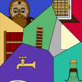
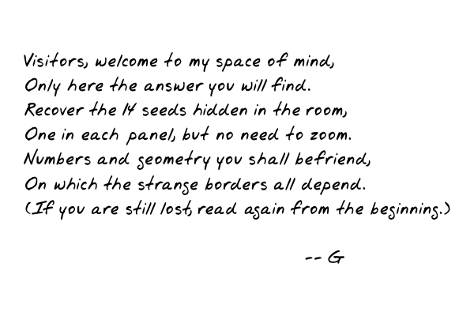
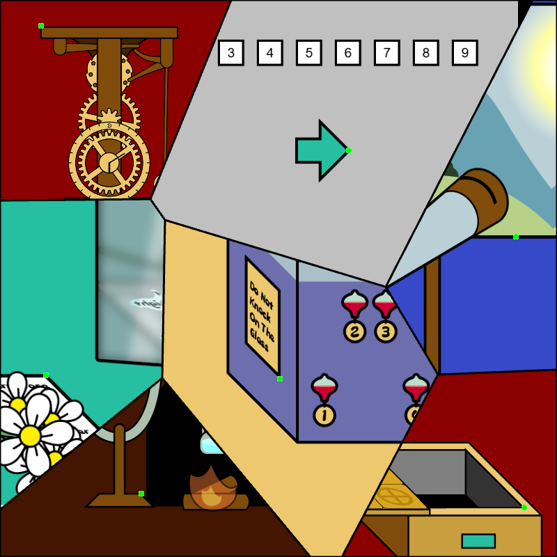
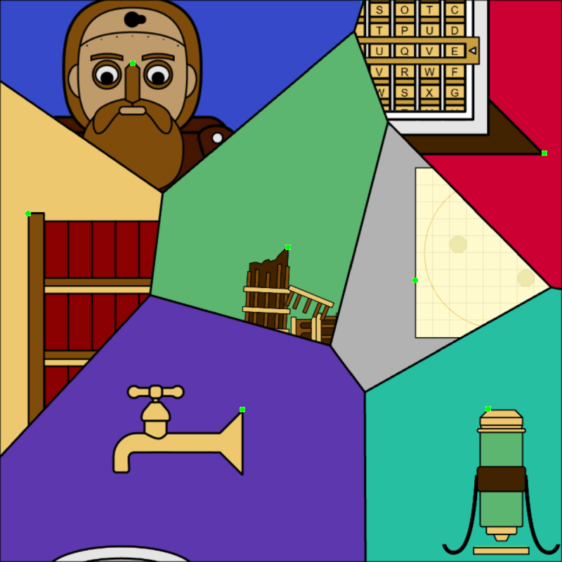

# Galileo's Escapement Room

## 题面

## 碎片 5-4

## 这是第五行第四个碎片


## 碎片 7-2

## 这是第七行第二个碎片


## 交互源码

- fragment_source: [../../../assets/ccbc16.cipherpuzzles.com/data/articles/fragments.json](../../../assets/ccbc16.cipherpuzzles.com/data/articles/fragments.json)

### backend_c16-escapeRoom

```text
// 密室逃脱脚本

// @ts-check


//在后端脚本中，可以使用全局变量 ctx

//全局变量 ctx 的内容如下：

// request: string; // 从前端调用时，前端传来的请求对象，内容为JSON字符串。请调用JSON.parse转换后使用。

// uid: number; // 当前调用此后端脚本的用户 uid

// username: string; //当前调用此后端脚本的用户名

// gid: number; // 当前调用此后端脚本的组队 gid

// getStatus(key: string) : string // 读取：当前用户的状态存储（注意状态信息是加密存储在每个浏览器上的，不同用户的不同进程都有不同的状态）

// setStatus(key: string, value: string) // 写入：当前用户的状态存储

// getProgress(pid: number, key: string) : string // 读取：当前组队的题目进度（组队题目进度是存在后端数据库中的，组队内部共享，每个题目有不同的状态）

// setProgress(pid: number, key: string, value: string) // 写入：当前组队的题目进度

// getStorage(key: string) : string // 读取：全局状态存储。存储在服务器后端。

// setStorage(key: string, value: string) // 写入：全局状态存储。存储在服务器后端。

// getPuzzleData(pid: number) : string // 获取题目的data片段（题目详情中<data></data>中的内容）

// costCredit(gid: number, cost: number) : boolean // 扣减组队的能量点数。返回是否扣减成功。

// response(body: string) // 返回给前端的数据对象。内容为JSON字符串。必须调用JSON.stringify后传入。**必须**在此脚本中至少调用这个函数一次，即使你没什么需要返回的，也请调用一次 ctx.response("{}");

// ===================

// 下面的是一些特殊功能用的函数。尽量少用

// getGroupName(gid: number) : string // 返回给定的GID的队伍名

// getRankAndWinner(gid: number) : { rank: number; champion: string } // 返回给定的GID的队伍的完赛排名以及冠军队伍名称 

// httpPostForm(url: string, form: object, headers: object) : string // 由后端发出HTTP POST请求，调用指定的URL。form为请求参数。


const PID = 43;


// the rotation of mirror that starts fire

const MIRROR_ROTATION_FIRE = -1


const WATER_THERMO_PASSWORD = 309

const BOOKMARK_BOOK = 5

const BOOKMARK_PAGE = 253

const CRYPTEX_ANSWER = "MUOVE"

const CRATER_IMG = "../../../assets/static.cipherpuzzles.com/static/images/924963feaf6b4fe8b4b228f537ffbae0.webp"

const CRATER_ANSWER = "0000000000000000000000000001000002000000000000000001000003000010000000000002000000000000000000000000"

const BOOKMARK_DOT = "../../../assets/static.cipherpuzzles.com/static/images/57387c5fd47247d99c3ed3fa8b0ef852.webp"

const ALT_MIRRORS = [

    { alias: "mirror1b", src: "../../../assets/static.cipherpuzzles.com/static/images/f630a0691db64ef69dd64481768e815b.webp" },

    { alias: "mirror2b", src: "../../../assets/static.cipherpuzzles.com/static/images/ce0a685637964631a1c7dfb16b6d3bca.webp" },

    { alias: "mirror3b", src: "../../../assets/static.cipherpuzzles.com/static/images/c3bc929de8604ccc828e7ba16ce1f0b7.webp" },

]

const FINAL_MESSAGE = "../../../assets/static.cipherpuzzles.com/static/images/7b15961f1a3847d0bcf0e1b71622d879.webp"


const LENS_ID = 1

const BOOKMARK_ID = 2

const POT_ID = 3

const WATER_POT_ID = 4

const PENDULUM_ID = 5

const AUTOMATON_KEY_ID = 6

const GEAR_ID = 7

const MATH_NOTE_ID = 8

const itemData = {

    [LENS_ID]: { name: "LENS", image: "../../../assets/static.cipherpuzzles.com/static/images/919bb519b97249e5b85485301451e1eb.webp" },

    [BOOKMARK_ID]: { name: "BOOKMARK", image: "../../../assets/static.cipherpuzzles.com/static/images/eff0eea30675466c806c4a5ce086cc3c.webp" },

    [POT_ID]: { name: "POT", image: "../../../assets/static.cipherpuzzles.com/static/images/d294b86524ab432cbc88ec0e24543ed0.webp" },

    [WATER_POT_ID]: { name: "POT WITH WATER", image: "../../../assets/static.cipherpuzzles.com/static/images/c8029976520a408b805bde64057e6b6b.webp" },

    [PENDULUM_ID]: { name: "PENDULUM", image: "../../../assets/static.cipherpuzzles.com/static/images/0521b7d7aa214933925930b4157eb845.webp" },

    [AUTOMATON_KEY_ID]: { name: "SMALL KEY", image: "../../../assets/static.cipherpuzzles.com/static/images/72e5623919d641148d9cd84af69fea1b.webp" },

    [GEAR_ID]: { name: "TOWER SECTION", image: "../../../assets/static.cipherpuzzles.com/static/images/237803a885484403bf7d6418fffdeab5.webp" },

    [MATH_NOTE_ID]: { name: "NOTE", image: "../../../assets/static.cipherpuzzles.com/static/images/e2cad9e9156a4440a7b474f536e4a07b.webp" },

}


// for game of 8

function areAdjacent(a, b) {

    const dx = Math.abs((a % 3) - (b % 3)); // column difference

    const dy = Math.abs(Math.floor(a / 3) - Math.floor(b / 3)); // row difference


    return (dx + dy === 1); // Manhattan distance of 1

}

//在这个函数中实现你的功能，ctx定义如顶部注释，request为已解析好的传入对象。

/**

 * @param {Ctx} ctx 全局上下文对象

 * @param {object} request 用户请求

 * @returns {object} response 返回给用户的数据

 */

function getCtxStatusJSON(ctx, key, defaultValue) {

    let val = ctx.getStatus(key);

    if (val === null || val === undefined) {

        val = defaultValue

    } else {

        val = JSON.parse(val)

    }

    return val

}


function findItemInInventory(currentItems, id) {

    for (let i = 0; i < currentItems.length; i++) {

        if (currentItems[i] == id) {

            return i

        }

    }

    return -1

}


function main(ctx, request) {

    //你可以直接使用传入对象

    if (!request.a) {

        request.a = 0;

    }


    var reset = ctx.uid == 3

    reset = false

    if (reset) {

        // hack

        ctx.setStatus("currentItems", JSON.stringify([1, 4]));

        ctx.setStatus("gotLensFromBox", JSON.stringify(true));

        ctx.setStatus("eightPieces", JSON.stringify([0,1,2,3,4,5,6,7,8]));

        ctx.setStatus("eightPieces", JSON.stringify([4,1,2,3,8,5,6,7,0]));

        ctx.setStatus("eightBoxOpen", JSON.stringify(true));

        ctx.setStatus("lensOnStand", JSON.stringify(false));

        ctx.setStatus("fireStarted", JSON.stringify(true));

        ctx.setStatus("openDoorSuccess", JSON.stringify(true));

        ctx.setStatus("mirrorRotation", JSON.stringify(0));

        ctx.setStatus("mirrorRotateLeft", JSON.stringify(true));

        ctx.setStatus("lensInTelescope", JSON.stringify(false));

        ctx.setStatus("gotNoteFromShelf", JSON.stringify(false))

        ctx.setStatus("onRightPage", JSON.stringify(false));

        ctx.setStatus("gotBookmark", JSON.stringify(false));

        ctx.setStatus("bookmarkInMicroscope", JSON.stringify(true));

        ctx.setStatus("potInFireplace", JSON.stringify(false));

        ctx.setStatus("waterPotInFireplace", JSON.stringify(true));

        ctx.setStatus("safeOpen", JSON.stringify(false));

        ctx.setStatus("faucetOn", JSON.stringify(false));

        ctx.setStatus("cryptex", JSON.stringify("MUOVE"));

        ctx.setStatus("gotPendulumFromSafe", JSON.stringify(false));

        ctx.setStatus("clockHasPendulum", JSON.stringify(true));

        ctx.setStatus("clockHasGear", JSON.stringify(true));

        ctx.setStatus("moonBoxOpen", JSON.stringify(false));

        ctx.setStatus("gotKeyFromMoonBox", JSON.stringify(false));

        ctx.setStatus("towerState", JSON.stringify(2));

        ctx.setStatus("automatonRunning", JSON.stringify(false));

    }


    var currentItems = getCtxStatusJSON(ctx, "currentItems", []);


    var eightPieces = getCtxStatusJSON(ctx, "eightPieces", [0,1,2,3,4,5,6,7,8]);

    var eightBoxOpen = getCtxStatusJSON(ctx, "eightBoxOpen", false);


    var gotLensFromBox = getCtxStatusJSON(ctx, "gotLensFromBox", false);

    var lensOnStand = getCtxStatusJSON(ctx, "lensOnStand", false);

    var fireStarted = getCtxStatusJSON(ctx, "fireStarted", false);

    var potInFireplace = getCtxStatusJSON(ctx, "potInFireplace", true);

    var waterPotInFireplace = getCtxStatusJSON(ctx, "waterPotInFireplace", false);


    var mirrorRotation = getCtxStatusJSON(ctx, "mirrorRotation", 0);

    var mirrorRotateLeft = getCtxStatusJSON(ctx, "mirrorRotateLeft", true);


    var openDoorSuccess = getCtxStatusJSON(ctx, "openDoorSuccess", false);


    var lensInTelescope = getCtxStatusJSON(ctx, "lensInTelescope", false);


    var gotNoteFromShelf = getCtxStatusJSON(ctx, "gotNoteFromShelf", false);

    var onRightPage = getCtxStatusJSON(ctx, "onRightPage", false);

    var gotBookmark = getCtxStatusJSON(ctx, "gotBookmark", false);


    var bookmarkInMicroscope = getCtxStatusJSON(ctx, "bookmarkInMicroscope", false);


    var faucetOn = getCtxStatusJSON(ctx, "faucetOn", false);


    var cryptex = getCtxStatusJSON(ctx, "cryptex", "AAAAA");

    var safeOpen = getCtxStatusJSON(ctx, "safeOpen", false);

    var gotPendulumFromSafe = getCtxStatusJSON(ctx, "gotPendulumFromSafe", false);

    var clockHasPendulum = getCtxStatusJSON(ctx, "clockHasPendulum", false);

    var towerState = getCtxStatusJSON(ctx, "towerState", 1);

    var clockHasGear = getCtxStatusJSON(ctx, "clockHasGear", false);


    var moonBoxOpen = getCtxStatusJSON(ctx, "moonBoxOpen", false);

    var gotKeyFromMoonBox = getCtxStatusJSON(ctx, "gotKeyFromMoonBox", false);


    var automatonRunning = getCtxStatusJSON(ctx, "automatonRunning", false);


    // init

    var isRoom1 = false

    if (request.type === 57) {

        let room2thumbnail = "../../../assets/static.cipherpuzzles.com/static/images/ab0fda5fc28c427487c1d70b87555f5a.webp"

        if (openDoorSuccess) {

            room2thumbnail = "../../../assets/static.cipherpuzzles.com/static/images/d53bccc8ef564a98a61ab0edbd620af1.webp"

        }

        return {

            tn: room2thumbnail

        }

    } else if (request.type === 0) {

        // init for room1, do nothing

        isRoom1 = true

    } else if (request.type === 1) {

        isRoom1 = true

        // move eight puzzle

        var piece_loc = eightPieces[request.piece_idx];

        var blank_loc = eightPieces[8];

        if (areAdjacent(piece_loc, blank_loc)) {

          // Swap the clicked piece with the blank piece

          eightPieces[request.piece_idx] = blank_loc;

          eightPieces[8] = piece_loc;

          ctx.setStatus("eightPieces", JSON.stringify(eightPieces));

        }

    } else if (request.type === 2) {

        // try open eight box

        isRoom1 = true

        var correctAnswer = [4,1,2,3,8,5,6,7,0]

        var checkSolved = true

        for (let i = 0; i < 9; i++) {

            if (correctAnswer[i] != eightPieces[i]) {

                checkSolved = false;

                break;

            }

        }

        if (checkSolved) {

          eightBoxOpen = true;

          ctx.setStatus("eightBoxOpen", JSON.stringify(eightBoxOpen));

        }

    } else if (request.type === 3) {

        isRoom1 = true

        // get lens from box

        if (!gotLensFromBox && eightBoxOpen) {

            gotLensFromBox = true

            ctx.setStatus("gotLensFromBox", JSON.stringify(gotLensFromBox));

            currentItems.push(LENS_ID)

        }

    } else if (request.type === 4) {

        isRoom1 = true

        // put lens on stand

        // first check that we indeed have the lens

        let lensIndex = findItemInInventory(currentItems, LENS_ID);

        if (lensIndex > -1) {

            currentItems.splice(lensIndex, 1);

            lensOnStand = true;

            ctx.setStatus("lensOnStand", JSON.stringify(lensOnStand))

            if (mirrorRotation == MIRROR_ROTATION_FIRE && !fireStarted) {

                fireStarted = true

                ctx.setStatus("fireStarted", JSON.stringify(fireStarted))

            }

        }

    } else if (request.type === 5) {

        isRoom1 = true

        // remove lens from stand

        if (lensOnStand) {

            currentItems.push(LENS_ID);

            lensOnStand = false;

            ctx.setStatus("lensOnStand", JSON.stringify(lensOnStand))

        }

    } else if (request.type === 6) {

        isRoom1 = true

        // rotate mirror

        if (mirrorRotation == 0) {

            mirrorRotateLeft = !mirrorRotateLeft;

        }

        if (mirrorRotation == 0) {

            if (mirrorRotateLeft) {

                mirrorRotation = 1

            } else {

                mirrorRotation = -1

            }

        } else {

            mirrorRotation = 0

        }

        ctx.setStatus("mirrorRotation", JSON.stringify(mirrorRotation));

        ctx.setStatus("mirrorRotateLeft", JSON.stringify(mirrorRotateLeft));

        if (mirrorRotation == MIRROR_ROTATION_FIRE && lensOnStand && !fireStarted) {

            fireStarted = true

            ctx.setStatus("fireStarted", JSON.stringify(fireStarted))

        }

    } else if (request.type === 7) {

        isRoom1 = true

        // try open door

        let password = ('0000000' + WATER_THERMO_PASSWORD.toString(2)).slice(-9)

        let trySuccess = true

        for (let i = 0; i < 9; i++) {

            if (request.pressedDoorButtons[i] != (password.charAt(i) == '1')) {

                trySuccess = false

                break

            }

        }

        if (trySuccess) {

            if (!openDoorSuccess) {

                ctx.addAnswerLog(ctx.uid, ctx.gid, PID, "", 8, "成功推开了密室的门");

            }

            openDoorSuccess = true

            ctx.setStatus("openDoorSuccess", JSON.stringify(openDoorSuccess))

        }

    } else if (request.type === 8) {

        isRoom1 = true

        // put lens in telescope

        // first check that we indeed have the lens

        let lensIndex = findItemInInventory(currentItems, LENS_ID);

        if (lensIndex > -1) {

            currentItems.splice(lensIndex, 1);

            lensInTelescope = true;

            ctx.setStatus("lensInTelescope", JSON.stringify(lensInTelescope))

        }

    } else if (request.type === 9) {

        isRoom1 = true

        // remove lens from telescope

        if (lensInTelescope) {

            currentItems.push(LENS_ID);

            lensInTelescope = false;

            ctx.setStatus("lensInTelescope", JSON.stringify(lensInTelescope))

        }

    } else if (request.type == 10) {

        isRoom1 = false

        // go to a page

        onRightPage = (request.selectedBook == BOOKMARK_BOOK && request.selectedPage == BOOKMARK_PAGE)

        ctx.setStatus("onRightPage", JSON.stringify(onRightPage))

    } else if (request.type === 11) {

        isRoom1 = false

        // get bookmark

        if (!gotBookmark) {

            // check that box is open

            if (onRightPage) {

                gotBookmark = true

                ctx.setStatus("gotBookmark", JSON.stringify(gotBookmark));

                currentItems.push(BOOKMARK_ID)

            }

        }

    } else if (request.type == 12) {

        isRoom1 = false

        // put bookmark on microscope

        // first check that we indeed have the bookmark

        let bmIndex = findItemInInventory(currentItems, BOOKMARK_ID);

        if (bmIndex > -1) {

            currentItems.splice(bmIndex, 1);

            bookmarkInMicroscope = true;

            ctx.setStatus("bookmarkInMicroscope", JSON.stringify(bookmarkInMicroscope))

        }

    } else if (request.type === 13) {

        isRoom1 = false

        // remove bookmark from microscope

        if (bookmarkInMicroscope) {

            currentItems.push(BOOKMARK_ID);

            bookmarkInMicroscope = false;

            ctx.setStatus("bookmarkInMicroscope", JSON.stringify(bookmarkInMicroscope))

        }

    } else if (request.type == 14) {

        isRoom1 = true

        // get pot from fireplace

        if (potInFireplace) {

            potInFireplace = false

            ctx.setStatus("potInFireplace", JSON.stringify(potInFireplace));

            currentItems.push(POT_ID)

        }

    } else if (request.type == 15) {

        isRoom1 = true

        // put pot back in fireplace

        // first check that we indeed have the pot

        let index = findItemInInventory(currentItems, POT_ID)

        if (index > -1) {

            currentItems.splice(index, 1);

            potInFireplace = true;

            ctx.setStatus("potInFireplace", JSON.stringify(potInFireplace))

        }

    } else if (request.type == 16) {

        isRoom1 = false

        // toggle faucet

        faucetOn = !faucetOn

        ctx.setStatus("faucetOn", JSON.stringify(faucetOn))

    } else if (request.type == 17) {

        isRoom1 = false

        // fill bucket faucet

        // faucet is on

        if (faucetOn) {

            // check that we have pot

            let index = findItemInInventory(currentItems, POT_ID)

            if (index > -1) {

                currentItems.splice(index, 1, WATER_POT_ID);

            }

        }

    } else if (request.type == 18) {

        isRoom1 = true

        // put water pot back in fireplace

        // first check that we indeed have the water pot

        let index = findItemInInventory(currentItems, WATER_POT_ID)

        if (index > -1) {

            currentItems.splice(index, 1);

            waterPotInFireplace = true;

            ctx.setStatus("waterPotInFireplace", JSON.stringify(waterPotInFireplace))

        }

    } else if (request.type == 19) {

        isRoom1 = false

        // move cryptex

        let col = request.cryptexColumn

        let newLet = String.fromCharCode(((cryptex.charCodeAt(col) - 65) + request.shift + 26) % 26 + 65)

        cryptex = cryptex.slice(0, col) + newLet + cryptex.slice(col + 1)

        ctx.setStatus("cryptex", JSON.stringify(cryptex))

    } else if (request.type == 20) {

        isRoom1 = false

        if (cryptex == CRYPTEX_ANSWER) {

            safeOpen = true

            ctx.setStatus("safeOpen", JSON.stringify(safeOpen))

        }

    } else if (request.type == 21) {

        isRoom1 = false

        // init for room 2, do nothing

    } else if (request.type == 22) {

        isRoom1 = false

        // try get weight from room

        if (!gotPendulumFromSafe) {

            // check that safe is open

            if (safeOpen) {

                gotPendulumFromSafe = true

                ctx.setStatus("gotPendulumFromSafe", JSON.stringify(gotPendulumFromSafe));

                currentItems.push(PENDULUM_ID)

            }

        }

    } else if (request.type == 23) {

        isRoom1 = true

        // put pendulum on clock

        // first check that we indeed have the pendulum

        let wIndex = findItemInInventory(currentItems, PENDULUM_ID)

        if (wIndex > -1) {

            currentItems.splice(wIndex, 1);

            clockHasPendulum = true;

            ctx.setStatus("clockHasPendulum", JSON.stringify(clockHasPendulum))

        }

    } else if (request.type == 24) {

        // start automaton

        isRoom1 = false

        let keyIndex = findItemInInventory(currentItems, AUTOMATON_KEY_ID)

        if (keyIndex > -1) {

            // try to do something

            currentItems.splice(keyIndex, 1);

            automatonRunning = true;

            ctx.setStatus("automatonRunning", JSON.stringify(automatonRunning))

        }


    } else if (request.type == 25) {

        isRoom1 = true

        // put gear on clock

        // first check that we indeed have the pendulum

        let wIndex = findItemInInventory(currentItems, GEAR_ID)

        if (wIndex > -1) {

            currentItems.splice(wIndex, 1);

            clockHasGear = true;

            ctx.setStatus("clockHasGear", JSON.stringify(clockHasGear))

        }

    } else if (request.type == 26) {

        // check craters answer

        isRoom1 = false

        if (request.craters == CRATER_ANSWER) {

            moonBoxOpen = true;

            ctx.setStatus("moonBoxOpen", JSON.stringify(moonBoxOpen))

        }

    } else if (request.type == 27) {

        // get key from moon box

        isRoom1 = false

        if (moonBoxOpen && !gotKeyFromMoonBox) {

            currentItems.push(AUTOMATON_KEY_ID)

            gotKeyFromMoonBox = true

            ctx.setStatus("gotKeyFromMoonBox", JSON.stringify(gotKeyFromMoonBox))

        }

    } else if (request.type == 28) {

        // break tower

        isRoom1 = false

        if (waterPotInFireplace) {

            towerState = 2;

            ctx.setStatus("towerState", JSON.stringify(towerState))

        }

    } else if (request.type == 29) {

        // break tower

        isRoom1 = false

        if (towerState == 2) {

            towerState = 3;

            ctx.setStatus("towerState", JSON.stringify(towerState))

            currentItems.push(GEAR_ID)

        }

    } else if (request.type == 30 && ctx.gid == 1) {

        isRoom1 = true

        // reset

        ctx.setStatus("currentItems", JSON.stringify([]));

        ctx.setStatus("gotLensFromBox", JSON.stringify(false));

        ctx.setStatus("eightPieces", JSON.stringify([0,1,2,3,4,5,6,7,8]));

        ctx.setStatus("eightBoxOpen", JSON.stringify(false));

        ctx.setStatus("lensOnStand", JSON.stringify(false));

        ctx.setStatus("fireStarted", JSON.stringify(false));

        ctx.setStatus("openDoorSuccess", JSON.stringify(false));

        ctx.setStatus("mirrorRotation", JSON.stringify(0));

        ctx.setStatus("mirrorRotateLeft", JSON.stringify(true));

        ctx.setStatus("lensInTelescope", JSON.stringify(false));

        ctx.setStatus("gotNoteFromShelf", JSON.stringify(false))

        ctx.setStatus("onRightPage", JSON.stringify(false));

        ctx.setStatus("gotBookmark", JSON.stringify(false));

        ctx.setStatus("bookmarkInMicroscope", JSON.stringify(false));

        ctx.setStatus("potInFireplace", JSON.stringify(true));

        ctx.setStatus("waterPotInFireplace", JSON.stringify(false));

        ctx.setStatus("safeOpen", JSON.stringify(false));

        ctx.setStatus("faucetOn", JSON.stringify(false));

        ctx.setStatus("cryptex", JSON.stringify("AAAAA"));

        ctx.setStatus("gotPendulumFromSafe", JSON.stringify(false));

        ctx.setStatus("clockHasPendulum", JSON.stringify(false));

        ctx.setStatus("clockHasGear", JSON.stringify(false));

        ctx.setStatus("moonBoxOpen", JSON.stringify(false));

        ctx.setStatus("gotKeyFromMoonBox", JSON.stringify(false));

        ctx.setStatus("towerState", JSON.stringify(1));

        ctx.setStatus("automatonRunning", JSON.stringify(false));

    } else if (request.type == 31) {

        isRoom1 = false

        if (!gotNoteFromShelf) {

            currentItems.push(MATH_NOTE_ID)

            gotNoteFromShelf = true

            ctx.setStatus("gotNoteFromShelf", JSON.stringify(gotNoteFromShelf))

        }

    }


    let moonImg = ""

    var waterNumber = 0;

    if (request.type != 30) {

        if (clockHasGear && clockHasPendulum && lensInTelescope) {

            // we can now return the image of the moon

            moonImg = CRATER_IMG

        }


        if (fireStarted) {

            waterNumber = WATER_THERMO_PASSWORD;

        }


        ctx.setStatus("currentItems", JSON.stringify(currentItems));

    }


    var currentItemsExpanded = []

    for (let i = 0; i < currentItems.length; i++) {

        let id = currentItems[i]

        currentItemsExpanded.push({id: id, name: itemData[id].name, image: itemData[id].image})

    }


    //将你需要返回给前端的对象return出去

    if (isRoom1) {

        return {

            gid: ctx.gid,

            ep: eightPieces,

            ebo: eightBoxOpen,

            glfb: gotLensFromBox,

            ci: currentItemsExpanded,

            los: lensOnStand,

            pif: potInFireplace,

            wif: waterPotInFireplace,

            am : waterPotInFireplace && fireStarted ? ALT_MIRRORS : null,

            mr: mirrorRotation,

            fs: fireStarted,

            wn: waterNumber,

            ods: openDoorSuccess,

            lit: lensInTelescope,

            chp: clockHasPendulum,

            chg: clockHasGear,

            mi: moonImg,

            bi: gotBookmark ? BOOKMARK_DOT : "",

        }

    } else {

        // room 2

        return {

            ci: currentItemsExpanded,

            ods: openDoorSuccess,

            gnfs: gotNoteFromShelf,

            orp: onRightPage,

            gb: gotBookmark,

            bim: bookmarkInMicroscope,

            bi: (gotBookmark || onRightPage) ? BOOKMARK_DOT : "",

            fo: faucetOn,

            cpt: cryptex,

            so: safeOpen,

            gpfs: gotPendulumFromSafe,

            ar: automatonRunning,

            fm: automatonRunning ? FINAL_MESSAGE : "",

            mbo: moonBoxOpen,

            gkfmb: gotKeyFromMoonBox,

            ts: towerState,

        }

    }

}


//=======以下是JSON解析与调用脚本，一般不需要修改========

/**

 * @param {Ctx} ctx 全局上下文对象

 */

function _jsonProcessHelper(ctx) {

    let request = JSON.parse(ctx.request);

    let resBody = main(ctx, request);

    let resString = JSON.stringify(resBody);

    ctx.response(resString);

}


_jsonProcessHelper(ctx);
```


## 答案

`CAIN`

## 解析

<style>
#escape_solution img.tn {
border: 1px solid black;
border-radius: 10px;
}
</style>
本题由以下几个碎片组成：

<div id="escape_solution">



首先这是一个以伽利略为主题的密室游戏，通关步骤如下：

1. 调整镜子角度向右，使得光照在壁炉上
2. 解开8块推盘拿到棱镜（初始状态显示的是太阳的符号围绕地球，考虑到伽利略是日心说的支持者，需要调整成地球符号围绕太阳）
3. 把棱镜放到壁炉旁边的架子上，使得光线聚焦点燃壁炉
4. 壁炉让房间升温，会让中间的水缸内的1、4、5、7、9逐渐下降（伽利略温度计）
5. 在门上输入 14579 的密码，打开第二个房间
6. 从壁炉里取下水壶，在水池里装上水后放回壁炉
7. 水蒸气会模糊镜子，调整镜子向左后，纸条上的字大部分被水蒸气模糊，某几处露出 right click tower 的字样
8. 点击比萨斜塔的模型，模型会倒塌，获取塔的碎片
9. 点击书架上的小纸条，在空格里填入1-9使等式成立，(x+54)(x-18)=x²+36x-972
10. 根据小纸条的提示，找到第1排第6本书，翻到第254页，拿到书签
11. 书签上的POINT是提示看句号那个点，放到显微镜下可以发现句号原来是个微点，写的是 e pur si ?，这是一句伽利略的名言 E pur si muove （地球仍然在转）
12. 在密码箱上输入 MUOVE 的答案，拿到钟摆
13. 将塔的碎片作为齿轮装在钟上，装上钟摆，钟开始转动，时间也开始流动（顺便说一句，题目里的 escapement 就是擒纵器的意思）
14. 从棱镜架子上取回棱镜，装入望远镜
15. 等到晚上（18点至早上6点）时观察月亮，记下月球表面陨石坑的形状
16. 在可以点击画圆的盒子上输入陨石坑的形状，拿到自动人偶的发条钥匙
17. 用钥匙启动自动人偶，获得最后提示



最后的提示首字母连起来是 VORONOI，也就是提示需要找到 Voronoi 图的核心。原来两个房间的多边形划分正是 Voronoi 图（泰森多边形）：





可以看出每个点都坐落在一个旗语上，翻译可得 FIRST SON OF ADAM 的提示。亚当第一个儿子是该隐，因此 `CAIN` 就是本题答案。
</div>

## 提示

### 1. 这道题需要哪些碎片？

<style>
#frag_hint img {
border: 1px solid black;
border-radius: 10px;
}
</style>
<div id="frag_hint">

和初始时全黑的碎片。
</div>

### 2. 我已经到了最后一步也知道要做什么了，但是我不会做，请给我这一步结果

提交"SALTED SHOW ME" + 最后一步给你的 7 字母单词以获得中间步骤的结果，例如如果最后的单词是 PRODUCT，提交 "SALTED SHOW ME PRODUCT"。

### 3. 我已经完成了最后一步并得到了14个点，该如何提取？

（如果解出的位置正确的话）注意每个点所在的位置的线的方向，旗语。

### 4. 我得到了一个B开头的物品，要如何使用

放在显微镜下仔细找它提示的东西。

### 5. 第一个房间里的华容道的目标状态是什么？

初始状态显示的是太阳的符号围绕地球，考虑到伽利略是日心说的支持者，需要调整成地球符号围绕太阳。注意最终地球应该放在右下角而不是左上角。

### 6. 我找到了一个P开头的五字母单词，但是不知道怎么用？

它提示了显微镜下面需要找什么东西，能帮你找到密码锁的密码。

### 7. 我得到了一个E开头的6字母，不知道怎么用？

将六字母分为 1字母/3字母/2字母，之间加上空格后搜索。是一句伽利略的名言，补上名言里的最后一个词。

### 8. 我得到了一张纸，上面的符号算不出来，请帮帮我

式子的左半部分为：(x+54)(x-18) 。下方三组由箭头表示的部分，对应要在书架上进行的操作。


## 中间答案

| 提交 | 回复 | 附加信息 |
| --- | --- | --- |
| FIRST SON OF ADAM | 这是一个里程碑。 |  |
| SALTED SHOW ME VORONOI |   |  |

## 本地附件

- [fragments.json](../../../assets/ccbc16.cipherpuzzles.com/data/articles/fragments.json)
- [027d0cad05b04e6aade9f57ad94f037c.webp](../../../assets/static.cipherpuzzles.com/static/images/027d0cad05b04e6aade9f57ad94f037c.webp)
- [02c845bcdc9e4e14bb5f3a6b3e6169d4.webp](../../../assets/static.cipherpuzzles.com/static/images/02c845bcdc9e4e14bb5f3a6b3e6169d4.webp)
- [04caa57b60284718b98741fa322f279f.webp](../../../assets/static.cipherpuzzles.com/static/images/04caa57b60284718b98741fa322f279f.webp)
- [0521b7d7aa214933925930b4157eb845.webp](../../../assets/static.cipherpuzzles.com/static/images/0521b7d7aa214933925930b4157eb845.webp)
- [058df0126b2746138b7c4a6873d6d413.webp](../../../assets/static.cipherpuzzles.com/static/images/058df0126b2746138b7c4a6873d6d413.webp)
- [066c531d05974507b077aa06c0653625.webp](../../../assets/static.cipherpuzzles.com/static/images/066c531d05974507b077aa06c0653625.webp)
- [06f134bef60b4e7e8452f7f1d76d8d11.webp](../../../assets/static.cipherpuzzles.com/static/images/06f134bef60b4e7e8452f7f1d76d8d11.webp)
- [078b2ada207c40f0b95640164a24de1e.webp](../../../assets/static.cipherpuzzles.com/static/images/078b2ada207c40f0b95640164a24de1e.webp)
- [0b4a9daa93734fb3aec74fd2fab50745.webp](../../../assets/static.cipherpuzzles.com/static/images/0b4a9daa93734fb3aec74fd2fab50745.webp)
- [0bc72467edf4429c95538a4f7d6598a0.webp](../../../assets/static.cipherpuzzles.com/static/images/0bc72467edf4429c95538a4f7d6598a0.webp)
- [0e98ffc9a1d344b2aac9c6350e83ea78.webp](../../../assets/static.cipherpuzzles.com/static/images/0e98ffc9a1d344b2aac9c6350e83ea78.webp)
- [12c3546071594a2c9a449288a056bdf2.webp](../../../assets/static.cipherpuzzles.com/static/images/12c3546071594a2c9a449288a056bdf2.webp)
- [1424e3712cfc420a84f96e82a0faa70d.webp](../../../assets/static.cipherpuzzles.com/static/images/1424e3712cfc420a84f96e82a0faa70d.webp)
- [146b53c8be79476596456f59be2c7d95.png](../../../assets/static.cipherpuzzles.com/static/images/146b53c8be79476596456f59be2c7d95.png)
- [1627402c9e5c47218c9762c0c31e600b.webp](../../../assets/static.cipherpuzzles.com/static/images/1627402c9e5c47218c9762c0c31e600b.webp)
- [1c24c81b21224784b42808d87822c340.webp](../../../assets/static.cipherpuzzles.com/static/images/1c24c81b21224784b42808d87822c340.webp)
- [1e1bd968a003458a8c85c293cdad46b8.webp](../../../assets/static.cipherpuzzles.com/static/images/1e1bd968a003458a8c85c293cdad46b8.webp)
- [2202ffeb001c450399b9e6ab036e1b51.webp](../../../assets/static.cipherpuzzles.com/static/images/2202ffeb001c450399b9e6ab036e1b51.webp)
- [237803a885484403bf7d6418fffdeab5.webp](../../../assets/static.cipherpuzzles.com/static/images/237803a885484403bf7d6418fffdeab5.webp)
- [239a2d627b1845458b4571020a7c336e.webp](../../../assets/static.cipherpuzzles.com/static/images/239a2d627b1845458b4571020a7c336e.webp)
- [277b90dc8f674d2eae96f306c8d29062.webp](../../../assets/static.cipherpuzzles.com/static/images/277b90dc8f674d2eae96f306c8d29062.webp)
- [29b6eedddced46a8a164ed503147377d.webp](../../../assets/static.cipherpuzzles.com/static/images/29b6eedddced46a8a164ed503147377d.webp)
- [2a4b2216bd6f4194b4fabf026325faf4.webp](../../../assets/static.cipherpuzzles.com/static/images/2a4b2216bd6f4194b4fabf026325faf4.webp)
- [2a698ad8033845998b22bf73a282114a.webp](../../../assets/static.cipherpuzzles.com/static/images/2a698ad8033845998b22bf73a282114a.webp)
- [2aef72b5c42f456c8f1305368b041f89.webp](../../../assets/static.cipherpuzzles.com/static/images/2aef72b5c42f456c8f1305368b041f89.webp)
- [2c3f75f4c92f4f07a6d2a18db537aa1e.webp](../../../assets/static.cipherpuzzles.com/static/images/2c3f75f4c92f4f07a6d2a18db537aa1e.webp)
- [2d3b6c4f97d6457ba859687cad85539d.webp](../../../assets/static.cipherpuzzles.com/static/images/2d3b6c4f97d6457ba859687cad85539d.webp)
- [304cdc456cba436c8f475e080e774ac8.webp](../../../assets/static.cipherpuzzles.com/static/images/304cdc456cba436c8f475e080e774ac8.webp)
- [3286c03bd53a4dcb8107fe44b5993c2c.webp](../../../assets/static.cipherpuzzles.com/static/images/3286c03bd53a4dcb8107fe44b5993c2c.webp)
- [34159a94d08f4df2834362395396db2f.webp](../../../assets/static.cipherpuzzles.com/static/images/34159a94d08f4df2834362395396db2f.webp)
- [3949831264c24365bb4617e32aa7c9d3.webp](../../../assets/static.cipherpuzzles.com/static/images/3949831264c24365bb4617e32aa7c9d3.webp)
- [3a7f0158b909494b8e4072ef2454fce9.webp](../../../assets/static.cipherpuzzles.com/static/images/3a7f0158b909494b8e4072ef2454fce9.webp)
- [3a8f756d3db8433badf0b45b19d0b5f6.vue](../../../assets/static.cipherpuzzles.com/static/images/3a8f756d3db8433badf0b45b19d0b5f6.vue)
- [3bbcf7eb367045baa97e03a7a9fcd1ed.webp](../../../assets/static.cipherpuzzles.com/static/images/3bbcf7eb367045baa97e03a7a9fcd1ed.webp)
- [3c712e208e67468999c7e64e2004fc14.webp](../../../assets/static.cipherpuzzles.com/static/images/3c712e208e67468999c7e64e2004fc14.webp)
- [407f949ece0f4732939cb37e6cfe3c2f.webp](../../../assets/static.cipherpuzzles.com/static/images/407f949ece0f4732939cb37e6cfe3c2f.webp)
- [40a194bacd6347c8b39ee6b7c998d1f3.webp](../../../assets/static.cipherpuzzles.com/static/images/40a194bacd6347c8b39ee6b7c998d1f3.webp)
- [40bbc53c38754ae48bc29a5706c2964d.vue](../../../assets/static.cipherpuzzles.com/static/images/40bbc53c38754ae48bc29a5706c2964d.vue)
- [41fa976073ef4af4854a53d1e52d0ec6.webp](../../../assets/static.cipherpuzzles.com/static/images/41fa976073ef4af4854a53d1e52d0ec6.webp)
- [450c075bf141497cb639ba7adfa6ed9c.webp](../../../assets/static.cipherpuzzles.com/static/images/450c075bf141497cb639ba7adfa6ed9c.webp)
- [4737d2b1c71749789a8bb2eb43418b86.webp](../../../assets/static.cipherpuzzles.com/static/images/4737d2b1c71749789a8bb2eb43418b86.webp)
- [4b0d75fcfbc449f88fd60daace8ff90b.webp](../../../assets/static.cipherpuzzles.com/static/images/4b0d75fcfbc449f88fd60daace8ff90b.webp)
- [4c655d36976848cbb443dcc62b682c50.webp](../../../assets/static.cipherpuzzles.com/static/images/4c655d36976848cbb443dcc62b682c50.webp)
- [4d6409fea61245cb9658754a72930841.webp](../../../assets/static.cipherpuzzles.com/static/images/4d6409fea61245cb9658754a72930841.webp)
- [4d681eb50b9e4302b922ac0a2858ca50.webp](../../../assets/static.cipherpuzzles.com/static/images/4d681eb50b9e4302b922ac0a2858ca50.webp)
- [4e2ac86e0e35498f8051089dbad0ba06.m4a](../../../assets/static.cipherpuzzles.com/static/images/4e2ac86e0e35498f8051089dbad0ba06.m4a)
- [4e2b2c9c21334732ab04293abebfbef2.webp](../../../assets/static.cipherpuzzles.com/static/images/4e2b2c9c21334732ab04293abebfbef2.webp)
- [57387c5fd47247d99c3ed3fa8b0ef852.webp](../../../assets/static.cipherpuzzles.com/static/images/57387c5fd47247d99c3ed3fa8b0ef852.webp)
- [587c389311644c768b95a99da0c6a055.webp](../../../assets/static.cipherpuzzles.com/static/images/587c389311644c768b95a99da0c6a055.webp)
- [58ec28fd9a364a878999ccdcdb8f88e2.webp](../../../assets/static.cipherpuzzles.com/static/images/58ec28fd9a364a878999ccdcdb8f88e2.webp)
- [5f9954e657aa432c81996efca734835d.webp](../../../assets/static.cipherpuzzles.com/static/images/5f9954e657aa432c81996efca734835d.webp)
- [645453f1631e4f3298ea74f90461089a.webp](../../../assets/static.cipherpuzzles.com/static/images/645453f1631e4f3298ea74f90461089a.webp)
- [6496a66a70be44dbafcb22007a5d16c5.webp](../../../assets/static.cipherpuzzles.com/static/images/6496a66a70be44dbafcb22007a5d16c5.webp)
- [65b0a1f818084c3da4e6ea997df8e58f.webp](../../../assets/static.cipherpuzzles.com/static/images/65b0a1f818084c3da4e6ea997df8e58f.webp)
- [6ec7573b35284eca8c4b80ee93934c19.webp](../../../assets/static.cipherpuzzles.com/static/images/6ec7573b35284eca8c4b80ee93934c19.webp)
- [71faa5f9c94e4beb8427ba2e8ba84160.webp](../../../assets/static.cipherpuzzles.com/static/images/71faa5f9c94e4beb8427ba2e8ba84160.webp)
- [72300d3434f543599255775b9d792551.webp](../../../assets/static.cipherpuzzles.com/static/images/72300d3434f543599255775b9d792551.webp)
- [72e5623919d641148d9cd84af69fea1b.webp](../../../assets/static.cipherpuzzles.com/static/images/72e5623919d641148d9cd84af69fea1b.webp)
- [730eb0e250b744eb83e0ce97de3bc338.png](../../../assets/static.cipherpuzzles.com/static/images/730eb0e250b744eb83e0ce97de3bc338.png)
- [7316dec862e84252b7e70e029a0a8066.svg](../../../assets/static.cipherpuzzles.com/static/images/7316dec862e84252b7e70e029a0a8066.svg)
- [74c14fcab1f940a6ab0037b6621ad351.webp](../../../assets/static.cipherpuzzles.com/static/images/74c14fcab1f940a6ab0037b6621ad351.webp)
- [7594e058cc0c4786aadf4a09a570bd5b.webp](../../../assets/static.cipherpuzzles.com/static/images/7594e058cc0c4786aadf4a09a570bd5b.webp)
- [75a74da80ac243b997cbca9e18b4b9c3.webp](../../../assets/static.cipherpuzzles.com/static/images/75a74da80ac243b997cbca9e18b4b9c3.webp)
- [76c62ab95d0740d69bcf18439e441ba5.webp](../../../assets/static.cipherpuzzles.com/static/images/76c62ab95d0740d69bcf18439e441ba5.webp)
- [76d08fa26edf4bedaab03e335aa89445.webp](../../../assets/static.cipherpuzzles.com/static/images/76d08fa26edf4bedaab03e335aa89445.webp)
- [783f1bc7f6354b76adcb26f2e42fdd3e.webp](../../../assets/static.cipherpuzzles.com/static/images/783f1bc7f6354b76adcb26f2e42fdd3e.webp)
- [7b15961f1a3847d0bcf0e1b71622d879.webp](../../../assets/static.cipherpuzzles.com/static/images/7b15961f1a3847d0bcf0e1b71622d879.webp)
- [7dfdfa5743044615b898dad119738f59.webp](../../../assets/static.cipherpuzzles.com/static/images/7dfdfa5743044615b898dad119738f59.webp)
- [80405b809f3b44aaaf9e99de7b0e9383.webp](../../../assets/static.cipherpuzzles.com/static/images/80405b809f3b44aaaf9e99de7b0e9383.webp)
- [80f9552234ad413bbe1139c3346700ce.webp](../../../assets/static.cipherpuzzles.com/static/images/80f9552234ad413bbe1139c3346700ce.webp)
- [83ace155aab8437488658c572d6cd619.webp](../../../assets/static.cipherpuzzles.com/static/images/83ace155aab8437488658c572d6cd619.webp)
- [83bb25000e0948129e41e54ed0a4da8c.webp](../../../assets/static.cipherpuzzles.com/static/images/83bb25000e0948129e41e54ed0a4da8c.webp)
- [865422f90c7e41278fd6cea5b4e66bf5.webp](../../../assets/static.cipherpuzzles.com/static/images/865422f90c7e41278fd6cea5b4e66bf5.webp)
- [8778fa28ca2140b086ad465cf4d2b75c.webp](../../../assets/static.cipherpuzzles.com/static/images/8778fa28ca2140b086ad465cf4d2b75c.webp)
- [887f9fad57a44eb7b0b1821c02f599a6.webp](../../../assets/static.cipherpuzzles.com/static/images/887f9fad57a44eb7b0b1821c02f599a6.webp)
- [89dc0276826a40fcb1e7714b59e1834f.m4a](../../../assets/static.cipherpuzzles.com/static/images/89dc0276826a40fcb1e7714b59e1834f.m4a)
- [8abd097a5fb44452bf4f2e9116928b9a.webp](../../../assets/static.cipherpuzzles.com/static/images/8abd097a5fb44452bf4f2e9116928b9a.webp)
- [8cb37f0a5d304539bed5b690ce46433a.webp](../../../assets/static.cipherpuzzles.com/static/images/8cb37f0a5d304539bed5b690ce46433a.webp)
- [8d28cd61083a4db08b9a1044debc0f79.webp](../../../assets/static.cipherpuzzles.com/static/images/8d28cd61083a4db08b9a1044debc0f79.webp)
- [919bb519b97249e5b85485301451e1eb.webp](../../../assets/static.cipherpuzzles.com/static/images/919bb519b97249e5b85485301451e1eb.webp)
- [924963feaf6b4fe8b4b228f537ffbae0.webp](../../../assets/static.cipherpuzzles.com/static/images/924963feaf6b4fe8b4b228f537ffbae0.webp)
- [92d60a9e6e3f4c6ca1b378d490c10770.webp](../../../assets/static.cipherpuzzles.com/static/images/92d60a9e6e3f4c6ca1b378d490c10770.webp)
- [93e63cee04574291a6d5dd12b9580f1a.webp](../../../assets/static.cipherpuzzles.com/static/images/93e63cee04574291a6d5dd12b9580f1a.webp)
- [93ea16de1497448f8a09346906737221.webp](../../../assets/static.cipherpuzzles.com/static/images/93ea16de1497448f8a09346906737221.webp)
- [94d138b995984f44b4c23c7338619832.webp](../../../assets/static.cipherpuzzles.com/static/images/94d138b995984f44b4c23c7338619832.webp)
- [96e0bdd820224f5788b9f7193d1cde92.webp](../../../assets/static.cipherpuzzles.com/static/images/96e0bdd820224f5788b9f7193d1cde92.webp)
- [96eab2c7ffaa4d0ca8626e470a0fc6b4.m4a](../../../assets/static.cipherpuzzles.com/static/images/96eab2c7ffaa4d0ca8626e470a0fc6b4.m4a)
- [97848f54050f450ca8e8574dfaa22f52.webp](../../../assets/static.cipherpuzzles.com/static/images/97848f54050f450ca8e8574dfaa22f52.webp)
- [9a991d6fe984435e83a133b352a27c6e.webp](../../../assets/static.cipherpuzzles.com/static/images/9a991d6fe984435e83a133b352a27c6e.webp)
- [9e607840dac14a239dba28e923d9d900.webp](../../../assets/static.cipherpuzzles.com/static/images/9e607840dac14a239dba28e923d9d900.webp)
- [9ea2a17f63dd4b0db8db956faf8fbce2.webp](../../../assets/static.cipherpuzzles.com/static/images/9ea2a17f63dd4b0db8db956faf8fbce2.webp)
- [9f54c50135de455dbbd0fe501df82359.webp](../../../assets/static.cipherpuzzles.com/static/images/9f54c50135de455dbbd0fe501df82359.webp)
- [9f9bfe8b507848a7b6339533296a1574.webp](../../../assets/static.cipherpuzzles.com/static/images/9f9bfe8b507848a7b6339533296a1574.webp)
- [a1643c2338104308bac0119b39a15bea.webp](../../../assets/static.cipherpuzzles.com/static/images/a1643c2338104308bac0119b39a15bea.webp)
- [a2878c4c675f451791ad148de6d1b96e.webp](../../../assets/static.cipherpuzzles.com/static/images/a2878c4c675f451791ad148de6d1b96e.webp)
- [a2c35b677ddf4ac3be9664456d784123.webp](../../../assets/static.cipherpuzzles.com/static/images/a2c35b677ddf4ac3be9664456d784123.webp)
- [a6599abb63d0425b95a9e77ba6f4f9c4.webp](../../../assets/static.cipherpuzzles.com/static/images/a6599abb63d0425b95a9e77ba6f4f9c4.webp)
- [a712de9831f64b2d8586ca4d2426db08.webp](../../../assets/static.cipherpuzzles.com/static/images/a712de9831f64b2d8586ca4d2426db08.webp)
- [a8ad296061c8414e8d656b542c226ca7.webp](../../../assets/static.cipherpuzzles.com/static/images/a8ad296061c8414e8d656b542c226ca7.webp)
- [ab0fda5fc28c427487c1d70b87555f5a.webp](../../../assets/static.cipherpuzzles.com/static/images/ab0fda5fc28c427487c1d70b87555f5a.webp)
- [ae859d190f1046aead0a6136b977567f.webp](../../../assets/static.cipherpuzzles.com/static/images/ae859d190f1046aead0a6136b977567f.webp)
- [b44486dbd02444fcb7023fb1ff216893.webp](../../../assets/static.cipherpuzzles.com/static/images/b44486dbd02444fcb7023fb1ff216893.webp)
- [b49025b32d70483f891f78b5dff32d05.webp](../../../assets/static.cipherpuzzles.com/static/images/b49025b32d70483f891f78b5dff32d05.webp)
- [b4c1d4fedb034fbda96a72e8fbdc2bb2.webp](../../../assets/static.cipherpuzzles.com/static/images/b4c1d4fedb034fbda96a72e8fbdc2bb2.webp)
- [b668aafefdf9435cb4d68bc8128cb6ce.webp](../../../assets/static.cipherpuzzles.com/static/images/b668aafefdf9435cb4d68bc8128cb6ce.webp)
- [bb1693e78eba43f4aeb760d579a1c501.webp](../../../assets/static.cipherpuzzles.com/static/images/bb1693e78eba43f4aeb760d579a1c501.webp)
- [be31f929bd2e4cf6a962ee6f7764da15.webp](../../../assets/static.cipherpuzzles.com/static/images/be31f929bd2e4cf6a962ee6f7764da15.webp)
- [c1192c01ad0c421388300a8d691430ae.webp](../../../assets/static.cipherpuzzles.com/static/images/c1192c01ad0c421388300a8d691430ae.webp)
- [c362cede3e1d4476a92621e56d4869e7.webp](../../../assets/static.cipherpuzzles.com/static/images/c362cede3e1d4476a92621e56d4869e7.webp)
- [c3bc929de8604ccc828e7ba16ce1f0b7.webp](../../../assets/static.cipherpuzzles.com/static/images/c3bc929de8604ccc828e7ba16ce1f0b7.webp)
- [c53be3b2dda7434fab8f12d20e1ecc3c.webp](../../../assets/static.cipherpuzzles.com/static/images/c53be3b2dda7434fab8f12d20e1ecc3c.webp)
- [c7de5d26b231470bb7a5d1bf67be47d1.webp](../../../assets/static.cipherpuzzles.com/static/images/c7de5d26b231470bb7a5d1bf67be47d1.webp)
- [c8029976520a408b805bde64057e6b6b.webp](../../../assets/static.cipherpuzzles.com/static/images/c8029976520a408b805bde64057e6b6b.webp)
- [cb76ffbdd5f143c5a5a430873db4db78.webp](../../../assets/static.cipherpuzzles.com/static/images/cb76ffbdd5f143c5a5a430873db4db78.webp)
- [cd32feacbaf44cb4b15d5392f4fcda22.webp](../../../assets/static.cipherpuzzles.com/static/images/cd32feacbaf44cb4b15d5392f4fcda22.webp)
- [cdd6d85fc71b40ae8bdff5ce2dd5c52c.webp](../../../assets/static.cipherpuzzles.com/static/images/cdd6d85fc71b40ae8bdff5ce2dd5c52c.webp)
- [ce0a685637964631a1c7dfb16b6d3bca.webp](../../../assets/static.cipherpuzzles.com/static/images/ce0a685637964631a1c7dfb16b6d3bca.webp)
- [ce31cc88d45b4b1fa9326911494e924b.webp](../../../assets/static.cipherpuzzles.com/static/images/ce31cc88d45b4b1fa9326911494e924b.webp)
- [cf93d5a441184cdf883f143e284d66f7.webp](../../../assets/static.cipherpuzzles.com/static/images/cf93d5a441184cdf883f143e284d66f7.webp)
- [d294b86524ab432cbc88ec0e24543ed0.webp](../../../assets/static.cipherpuzzles.com/static/images/d294b86524ab432cbc88ec0e24543ed0.webp)
- [d333587baee342b6984dd9d5b4ac392a.webp](../../../assets/static.cipherpuzzles.com/static/images/d333587baee342b6984dd9d5b4ac392a.webp)
- [d3675d3de6cf4f4e9645d0efda27d330.webp](../../../assets/static.cipherpuzzles.com/static/images/d3675d3de6cf4f4e9645d0efda27d330.webp)
- [d46def994ca04fc490327cb2e78426bb.webp](../../../assets/static.cipherpuzzles.com/static/images/d46def994ca04fc490327cb2e78426bb.webp)
- [d53bccc8ef564a98a61ab0edbd620af1.webp](../../../assets/static.cipherpuzzles.com/static/images/d53bccc8ef564a98a61ab0edbd620af1.webp)
- [d810ea7f656248ff8e50ba9c6facfcfd.webp](../../../assets/static.cipherpuzzles.com/static/images/d810ea7f656248ff8e50ba9c6facfcfd.webp)
- [d83caf3e0b9345e3b1c2f6350d146402.webp](../../../assets/static.cipherpuzzles.com/static/images/d83caf3e0b9345e3b1c2f6350d146402.webp)
- [d9a17db7a3724fc58f08dce861509491.webp](../../../assets/static.cipherpuzzles.com/static/images/d9a17db7a3724fc58f08dce861509491.webp)
- [da97268fb1ad4cac843246089b598691.webp](../../../assets/static.cipherpuzzles.com/static/images/da97268fb1ad4cac843246089b598691.webp)
- [dd5ccde053a5489a9a0d60dcf414b092.webp](../../../assets/static.cipherpuzzles.com/static/images/dd5ccde053a5489a9a0d60dcf414b092.webp)
- [ddf693b7e8644686baec8f52b4d40459.webp](../../../assets/static.cipherpuzzles.com/static/images/ddf693b7e8644686baec8f52b4d40459.webp)
- [de1ae2fed1854839acc3bffaca4f0de3.webp](../../../assets/static.cipherpuzzles.com/static/images/de1ae2fed1854839acc3bffaca4f0de3.webp)
- [df18a7c84bf44df08f07f35a66e2793e.webp](../../../assets/static.cipherpuzzles.com/static/images/df18a7c84bf44df08f07f35a66e2793e.webp)
- [e10c80e264ec434abbc368563d974232.webp](../../../assets/static.cipherpuzzles.com/static/images/e10c80e264ec434abbc368563d974232.webp)
- [e2cad9e9156a4440a7b474f536e4a07b.webp](../../../assets/static.cipherpuzzles.com/static/images/e2cad9e9156a4440a7b474f536e4a07b.webp)
- [e3e53bdff851410596266a9d0e544fb1.webp](../../../assets/static.cipherpuzzles.com/static/images/e3e53bdff851410596266a9d0e544fb1.webp)
- [e406a4b82d3e4dcfbadccfa26d9d4d5b.webp](../../../assets/static.cipherpuzzles.com/static/images/e406a4b82d3e4dcfbadccfa26d9d4d5b.webp)
- [e55bce11d27540e4938ffda8581ae947.webp](../../../assets/static.cipherpuzzles.com/static/images/e55bce11d27540e4938ffda8581ae947.webp)
- [e56afafa4c1b4b96a26817d6460e8b4b.webp](../../../assets/static.cipherpuzzles.com/static/images/e56afafa4c1b4b96a26817d6460e8b4b.webp)
- [e807b61981b048f5b6032085e58ec76e.webp](../../../assets/static.cipherpuzzles.com/static/images/e807b61981b048f5b6032085e58ec76e.webp)
- [e942f9666b4d452dac5f079b0540fd98.webp](../../../assets/static.cipherpuzzles.com/static/images/e942f9666b4d452dac5f079b0540fd98.webp)
- [e9884a3d897c417a825a38ea8c4c0127.webp](../../../assets/static.cipherpuzzles.com/static/images/e9884a3d897c417a825a38ea8c4c0127.webp)
- [ea1bd36ac2a04294a29372e7d9f24f8c.webp](../../../assets/static.cipherpuzzles.com/static/images/ea1bd36ac2a04294a29372e7d9f24f8c.webp)
- [eb220c4948a841d2915d288fff4c4cf7.webp](../../../assets/static.cipherpuzzles.com/static/images/eb220c4948a841d2915d288fff4c4cf7.webp)
- [ef7a89b7b2964820923199e2f096b2aa.webp](../../../assets/static.cipherpuzzles.com/static/images/ef7a89b7b2964820923199e2f096b2aa.webp)
- [eff0eea30675466c806c4a5ce086cc3c.webp](../../../assets/static.cipherpuzzles.com/static/images/eff0eea30675466c806c4a5ce086cc3c.webp)
- [f4bb915badee4f5c811dc644a1019682.png](../../../assets/static.cipherpuzzles.com/static/images/f4bb915badee4f5c811dc644a1019682.png)
- [f630a0691db64ef69dd64481768e815b.webp](../../../assets/static.cipherpuzzles.com/static/images/f630a0691db64ef69dd64481768e815b.webp)

来源：[https://ccbc16.cipherpuzzles.com/data/puzzles/43.json](https://ccbc16.cipherpuzzles.com/data/puzzles/43.json)
