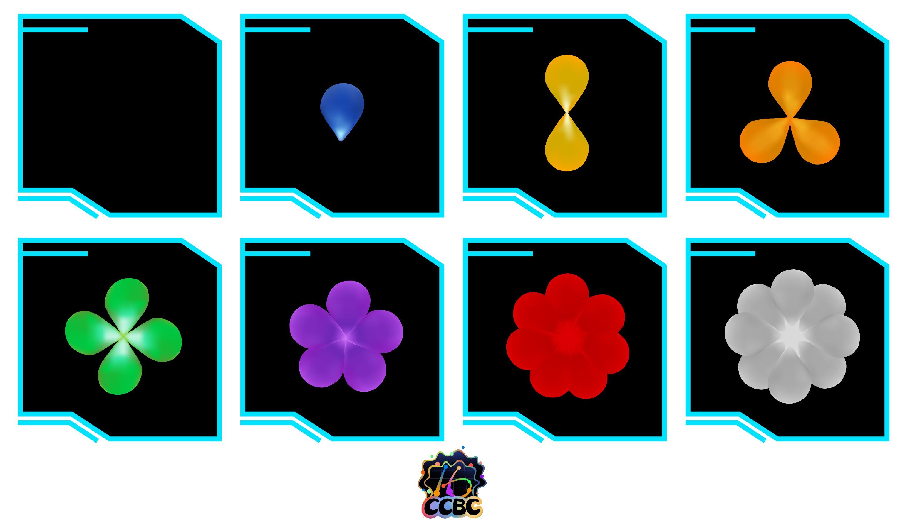
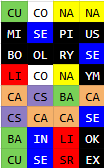
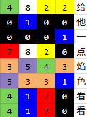
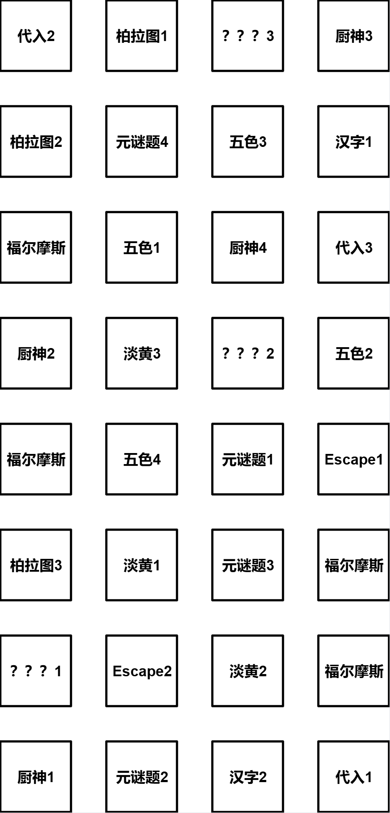

# 火药

## 题面

<div  class="error-block custom-block">
<span class="custom-block-title">修改于 2025-08-09 21:44</span>
<span>对风味文本内容进行了优化</span>
</div>

这片黑色的焦土之上，火烧过后，竟开出了各色的花朵。

你在解谜终端里找到了一封电报，打开后发现这样的花卉图鉴：

## 交互源码

### html

```html
<style>
    #gunpowder_meta {
        background-color: black;
        border-radius: 20px;
        display: inline-block;
        padding: 30px;
        width: 800px;
    }

    .pimg {
        width: 100%;
    }
    @media (max-width: 1060px) {
        #gunpowder_meta {
            width: calc(100% - 50px);
        }
    }
    @media (max-width: 600px) {
        #gunpowder_meta {
            width: calc(100% - 70px);
        }
    }
</style>

<div id="gunpowder_meta">

</div>
```


## 答案

`给他一点焰色看看`

## 解析

本区每个小题都由2-4块碎片组成，并且答案长度都是碎片个数*2，不难想到每个碎片都可以分配两个字母。有些碎片每个就给答案提供两个字母（例如“福尔摩斯探案集”这题里每个碎片有两张图，每个图提供一个字母），那两个字母很自然地就应该被分配给该碎片。有些碎片虽然没有明确提供答案哪些字母，但是题目使用碎片都是有顺序的（例如“淡黄又蓬松”里音频被切成了三段），则按照碎片被使用的顺序分配字母。

将答案两个字母两个字母地切开分配后，可以看出不少双字母都是元素名字，联系主题“火药”，可以想到不同元素有不同焰色。

最后按照页面的4x8排列可得：



根据题目里花朵颜色和花瓣数量的对应，可以将每个颜色对应到一个数字（如果双字母不是元素，理解为黑色空地，数字为0）：



每行四个一组为中文电报码，可以翻译得到最后的答案 `给他一点焰色看看`。

## 提示

### 1. 我毫无头绪

注意每个小题的答案长度以及小题用到的碎片个数。

### 2. 请直接告诉我第一步要做什么

把小题答案填入碎片，每个碎片填入两个字母。例如如果题目有三个碎片而答案是 ANSWER，则在第一个碎片里填入AN，第二个碎片里填入SW，第三个碎片里填入ER。

### 3. 花卉图鉴是什么意思？

花卉图鉴是为了给出焰色到数字的对应。与花色相同的焰色通过花瓣数量对应一个数字，例如，蓝色为1，黄色为2。按行转四位数字，再通过中文电码提取答案。

### 4. 请给我所有碎片和题目的对应关系以及顺序



其中题目【福尔摩斯探案集】用到的碎片顺序未给出，请自行根据题目答案自行对应

### 5. 我已经知道我需要找到【数据删除】，请给我它们和花朵颜色的具体对应

请在答案提交框里提交你需要的东西（两个字）以获得对应列表。


## 中间答案

| 提交 | 回复 | 附加信息 |
| --- | --- | --- |
| 焰色 | Co = 白色；Na = 黄色；Li = 红色；Sr = 红色；Ca = 橙色；In = 蓝色；Se = 蓝色；Ba = 绿色；Cu = 绿色；Cs = 紫色。 |  |

## 本地附件

- [03456ad7b426435ea0d8a4cf02df029c.webp](../../../assets/static.cipherpuzzles.com/static/images/03456ad7b426435ea0d8a4cf02df029c.webp)
- [0c333cbadb414f708109d19d7a5fc9c3.svg](../../../assets/static.cipherpuzzles.com/static/images/0c333cbadb414f708109d19d7a5fc9c3.svg)
- [460c85c5de9949549cd7b404ba900008.webp](../../../assets/static.cipherpuzzles.com/static/images/460c85c5de9949549cd7b404ba900008.webp)
- [9e4aa5da83444cdb99fe4820a2d096ec.webp](../../../assets/static.cipherpuzzles.com/static/images/9e4aa5da83444cdb99fe4820a2d096ec.webp)
- [abbc2e66b01f4f9bb9a4eeb033440ed1.webp](../../../assets/static.cipherpuzzles.com/static/images/abbc2e66b01f4f9bb9a4eeb033440ed1.webp)

来源：[https://ccbc16.cipherpuzzles.com/data/puzzles/44.json](https://ccbc16.cipherpuzzles.com/data/puzzles/44.json)
