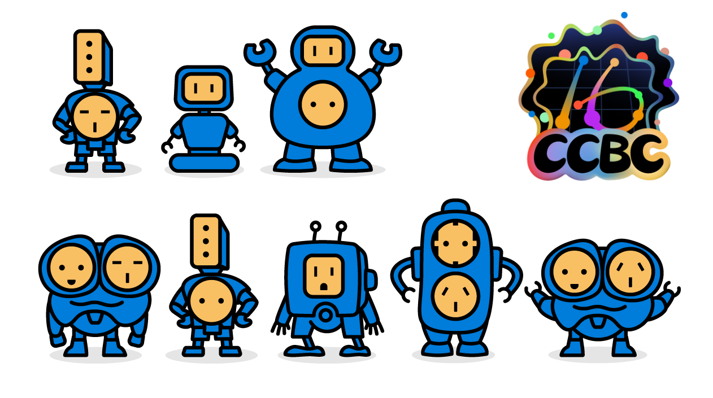
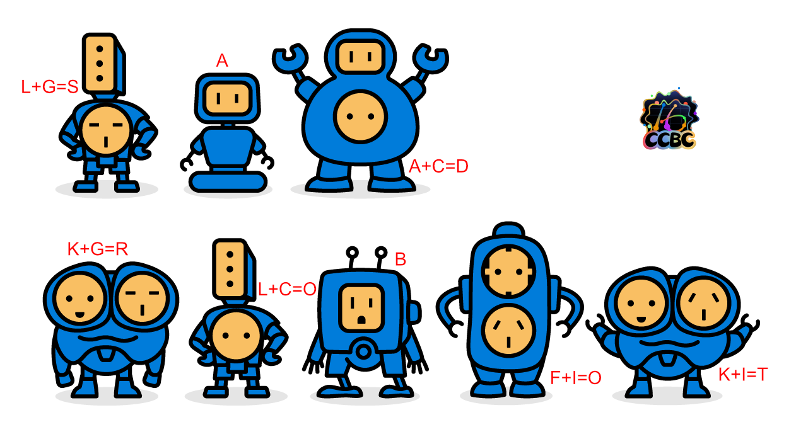
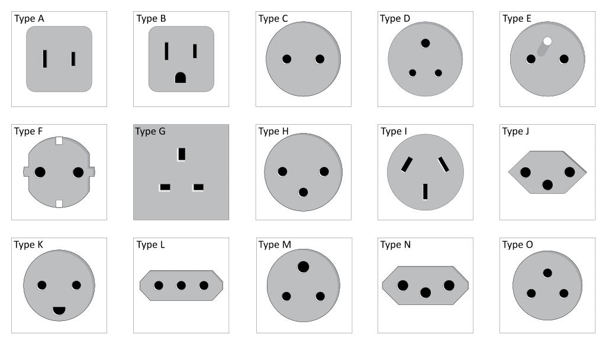

# 通用机器人

## 题面

_官方存档未提供可提取的文字题面；请查看下方附件或交互源码。_

## 交互源码

### html

```html
<p>机器人法则示例：A+D=B+C=E</p>

<style>
.pimg {
    width: 800px;
}
@media (max-width: 940px) {
    .pimg {
        width: 100%;
    }
}
</style>
```


## 答案

`SAD ROBOT`

## 解析

每个机器人头其实是一种电源插座。不同的电源插座有不同的字母编号，先找到每个机器人头对应的字母编号，如果有两个头，则按示例将它们的A1Z26值相加再转回字母，得到答案 `SAD ROBOT`。



## 提示

### 1. 我毫无头绪

每个机器人头都是一种插头；不同插头有不同的字母编号。



### 2. 该如何理解等式的意义

等式的意义是把字母按照 A=1, B=2, ..., Z=26 的规则转换成数字，进行相加后再转回字母。

例如 A + D = 1 + 4 = 5 = E。


## 本地附件

- [4f1c22adcb5a4cbb93131b01676c0579.webp](../../../assets/static.cipherpuzzles.com/static/images/4f1c22adcb5a4cbb93131b01676c0579.webp)
- [50e3514aee46415c9b840ac5e8df0448.webp](../../../assets/static.cipherpuzzles.com/static/images/50e3514aee46415c9b840ac5e8df0448.webp)
- [94c5ccc065354f388b124ce9a83258b4.webp](../../../assets/static.cipherpuzzles.com/static/images/94c5ccc065354f388b124ce9a83258b4.webp)
- [c00c0ebb79ed4abd944ce00984c819f2.webp](../../../assets/static.cipherpuzzles.com/static/images/c00c0ebb79ed4abd944ce00984c819f2.webp)

来源：[https://ccbc16.cipherpuzzles.com/data/puzzles/5.json](https://ccbc16.cipherpuzzles.com/data/puzzles/5.json)
