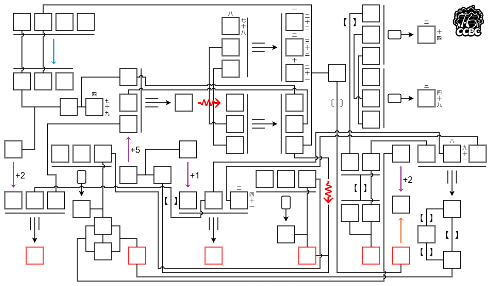
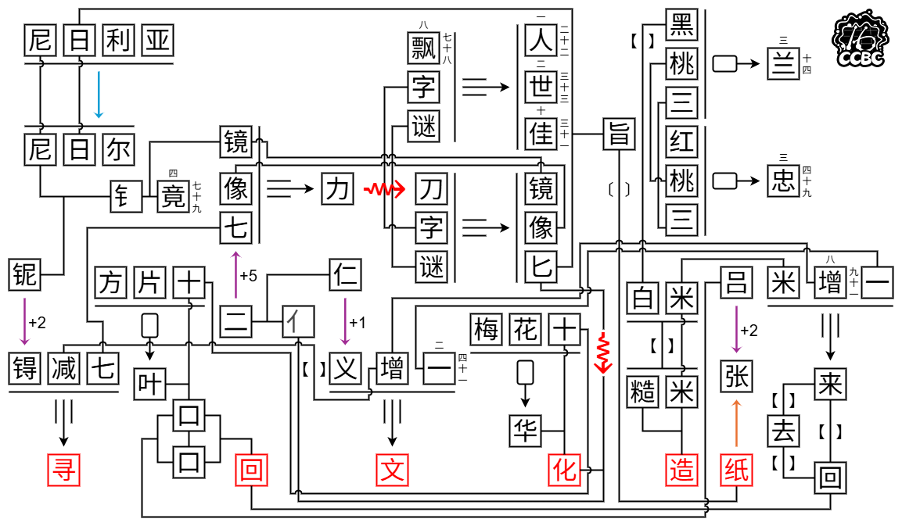

# 造纸

## 题面

_官方存档未提供可提取的文字题面；请查看下方附件或交互源码。_

## 交互源码

### html

```html

<br>
点击下载 <a href="../../../assets/static.cipherpuzzles.com/static/images/82637ff8859b446cbbb886a291695140.drawio" target="_blank">drawio 文件</a>，可以在 <a href="https://diagrams.net/" target="_blank">diagrams.net</a> 导入。<br>
其中的内容和图片完全一致，仅为解题方便，并非必须。

<style>
.pimg {
    width: 1153px;
}
@media (max-width: 1300px) {
    .pimg {
        width: 100%;
    }
}
</style>
```


## 答案

`寻回文化造纸`

## 解析

本区所有小题都没有答案。本题为区域meta，用到小题内部的机制。
* 叶子戏
  - 红色⇝箭头（在方片2出现）：表示重排汉字笔画。
  - 起点为扑克牌形状的箭头：输入为三个字，表示牌（例如「红桃三」），输出为该题的答案。
* 三字谜
  - 起点为三重线的箭头：输入为三个字，表示三字谜，输出为该三字谜的答案。
* 2025年度解谜能力测试
  - 蓝色箭头（在08出现）：输入为一个国家的中文名，输出为另一个国家的中文名，并且第二个国家的英文名是第一个国家英文名的子串。
  - 橙色箭头（在24出现）：输入为一个物品，输出为该物品的量词。
  - 紫色带数字箭头（在43出现）：输入为某有序集合元素，输出为按照数字移动之后的该集合元素。
* 你说话带括号
  - 【】：表示反义。
  - 〔〕：表示同音。
* 千字谜
  - 右侧和上侧有小数字的框：表示千字谜中该位置的汉字。

此外，meta还引入了和无箭头连线有关的机制。
* 无分叉连线：表示两个字相同。
* T型分叉连线：表示T的横线两端的两个字可以拼成T的竖线端的字。

填完后的图片如下。读红字得到答案「寻回文化造纸」。



## 提示

### 1. 我毫无头绪

在格中填入汉字。本题使用了本区域小题内部的机制。

### 2. 红色⇝箭头是什么

在「叶子戏」方片2出现。

### 3. 蓝色箭头是什么

在「2025年度解谜能力测试」08出现。输入和输出都是国家名。

### 4. 橙色箭头是什么

在「2025年度解谜能力测试」24出现。

### 5. 【】是什么

在「你说话带括号」中出现。

### 6. 〔〕是什么

在「你说话带括号」中出现。

### 7. 起点是圆角矩形的箭头是什么

输入为三个字，表示一张扑克牌，输出为这张牌在「叶子戏」中的答案。

### 8. 起点是三条线的箭头是什么

输入为三个字。输出是：假设这三个字是一道「三字谜」中的三字谜，此时它的答案。

### 9. 两个格子用一条线直接相连是什么

相同的汉字

### 10. 三个格子以T字线相连是什么

T的横连接的两个格子里的字，组合成第三个字

### 11. 方框上面和右侧的数字是什么？

方框需要填入千字谜里对应行列的字。


## 本地附件

- [6c24dc194c62497ea96dcfd400ce2cf0.webp](../../../assets/static.cipherpuzzles.com/static/images/6c24dc194c62497ea96dcfd400ce2cf0.webp)
- [82637ff8859b446cbbb886a291695140.drawio](../../../assets/static.cipherpuzzles.com/static/images/82637ff8859b446cbbb886a291695140.drawio)
- [8daff3c4cb3c49c3bec50a1b482208de.webp](../../../assets/static.cipherpuzzles.com/static/images/8daff3c4cb3c49c3bec50a1b482208de.webp)
- [f3e7f94db56949a7a0504c8325990fdd.webp](../../../assets/static.cipherpuzzles.com/static/images/f3e7f94db56949a7a0504c8325990fdd.webp)

来源：[https://ccbc16.cipherpuzzles.com/data/puzzles/50.json](https://ccbc16.cipherpuzzles.com/data/puzzles/50.json)
